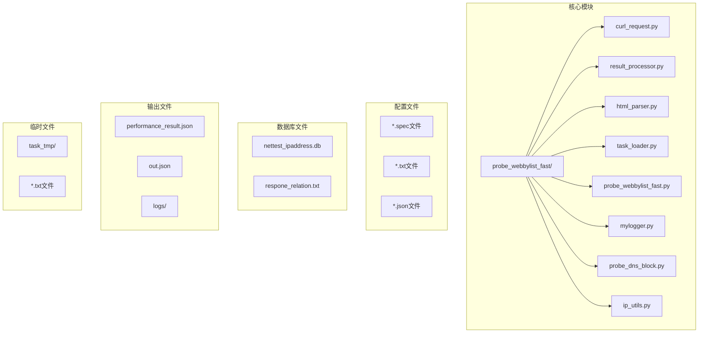
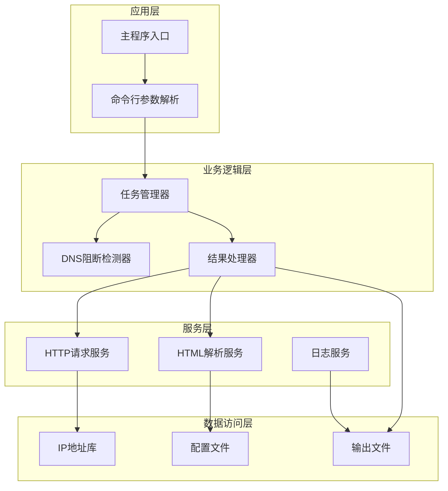
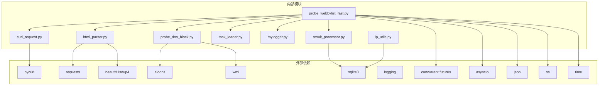

# API参考文档

<cite>
**本文档引用的文件**
- [curl_request.py](file://probe_webbylist_fast/curl_request.py)
- [result_processor.py](file://probe_webbylist_fast/result_processor.py)
- [html_parser.py](file://probe_webbylist_fast/html_parser.py)
- [task_loader.py](file://probe_webbylist_fast/task_loader.py)
- [probe_webbylist_fast.py](file://probe_webbylist_fast/probe_webbylist_fast.py)
- [mylogger.py](file://probe_webbylist_fast/mylogger.py)
- [probe_dns_block.py](file://probe_webbylist_fast/probe_dns_block.py)
- [ip_utils.py](file://probe_webbylist_fast/ip_utils.py)
</cite>

## 目录
1. [简介](#简介)
2. [项目结构](#项目结构)
3. [核心组件](#核心组件)
4. [架构概览](#架构概览)
5. [详细组件分析](#详细组件分析)
6. [依赖关系分析](#依赖关系分析)
7. [性能考虑](#性能考虑)
8. [故障排除指南](#故障排除指南)
9. [结论](#结论)
10. [附录](#附录)

## 简介

网络探测工具集是一个基于Python的高性能网页探测和分析系统，专门用于检测网站的可用性、性能指标和网络阻断情况。该工具集集成了HTTP请求管理、HTML页面解析、结果统计分析和DNS阻断检测等多种功能，为网络质量评估提供了全面的技术支持。

该系统采用模块化设计，通过CurlRequest类管理HTTP请求，ResultProcessor类进行数据分析，HTMLParser类解析网页内容，TaskLoader类管理任务执行，并通过MyLogger类提供统一的日志管理。整个系统支持IPv4/IPv6双栈协议，具备强大的并发处理能力和完善的错误处理机制。

## 项目结构

网络探测工具集采用清晰的模块化架构，主要包含以下核心目录和文件：



**图表来源**
- [probe_webbylist_fast.py:1-222](file://probe_webbylist_fast/probe_webbylist_fast.py#L1-L222)
- [curl_request.py:1-194](file://probe_webbylist_fast/curl_request.py#L1-L194)
- [result_processor.py:1-269](file://probe_webbylist_fast/result_processor.py#L1-L269)

**章节来源**
- [probe_webbylist_fast.py:1-222](file://probe_webbylist_fast/probe_webbylist_fast.py#L1-L222)
- [mylogger.py:1-59](file://probe_webbylist_fast/mylogger.py#L1-L59)

## 核心组件

网络探测工具集的核心由五个主要组件构成，每个组件都有明确的职责分工：

### CurlRequest类
负责HTTP请求的发送和管理，封装了pycurl的所有功能，提供统一的请求接口。

### ResultProcessor类
负责对HTTP请求结果进行统计分析，计算各种性能指标和统计数据。

### HTMLParser类
负责解析HTML页面，提取页面中的子资源链接，构建完整的资源列表。

### TaskLoader类
负责加载和管理任务列表，从文件中读取待探测的URL列表。

### MyLogger类
提供统一的日志管理功能，支持文件和控制台双重输出。

**章节来源**
- [curl_request.py:9-194](file://probe_webbylist_fast/curl_request.py#L9-L194)
- [result_processor.py:1-269](file://probe_webbylist_fast/result_processor.py#L1-L269)
- [html_parser.py:1-78](file://probe_webbylist_fast/html_parser.py#L1-L78)
- [task_loader.py:1-12](file://probe_webbylist_fast/task_loader.py#L1-L12)
- [mylogger.py:7-59](file://probe_webbylist_fast/mylogger.py#L7-L59)

## 架构概览

系统采用分层架构设计，通过清晰的接口定义实现模块间的松耦合：



**图表来源**
- [probe_webbylist_fast.py:102-178](file://probe_webbylist_fast/probe_webbylist_fast.py#L102-L178)
- [probe_dns_block.py:58-207](file://probe_webbylist_fast/probe_dns_block.py#L58-L207)
- [mylogger.py:7-59](file://probe_webbylist_fast/mylogger.py#L7-L59)

## 详细组件分析

### CurlRequest类API参考

CurlRequest类是HTTP请求管理的核心组件，提供了完整的HTTP请求生命周期管理功能。

#### 类构造函数
```python
def __init__(self, ip_type: int = 4, dns_server: str = ""):
```

**参数说明：**
- `ip_type`: IP版本类型，默认为4（IPv4）
- `dns_server`: 自定义DNS服务器地址，默认为空字符串

**返回值：** CurlRequest实例对象

#### 静态方法：Init_Share_Curl
```python
@staticmethod
def Init_Share_Curl():
```

**功能：** 初始化共享的Curl实例，用于多个请求共享DNS缓存和SSL会话信息

**返回值：** 共享的CurlShare实例

#### 实例方法：set_curl_opt
```python
def set_curl_opt(self, request_url, referer_url, G_CURL_SHARE):
```

**功能：** 配置Curl请求选项，设置各种HTTP请求参数

**参数说明：**
- `request_url`: 请求的目标URL
- `referer_url`: 引用页URL
- `G_CURL_SHARE`: 共享的Curl实例

**返回值：** 无

#### 实例方法：send_request
```python
def send_request(self, referer_url, request_url, index, G_CURL_SHARE):
```

**功能：** 发送HTTP请求并获取响应结果

**参数说明：**
- `referer_url`: 引用页URL
- `request_url`: 请求的目标URL
- `index`: 请求索引号
- `G_CURL_SHARE`: 共享的Curl实例

**返回值：** 执行代码（整数）

#### 实例方法：get_result
```python
def get_result(self):
```

**功能：** 获取请求结果信息

**返回值：** 字典格式的结果信息

#### 性能指标字段说明

CurlRequest类维护了丰富的性能指标信息：

| 字段名 | 数据类型 | 描述 | 单位 |
|--------|----------|------|------|
| url | string | 请求的URL | - |
| time_total | float | 总耗时 | 毫秒 |
| time_namelookup | float | DNS解析耗时 | 毫秒 |
| time_connect | float | TCP连接耗时 | 毫秒 |
| time_appconnect | float | SSL握手耗时 | 毫秒 |
| time_pretransfer | float | 预传输耗时 | 毫秒 |
| time_starttransfer | float | 首字节时间 | 毫秒 |
| time_redirect | float | 重定向耗时 | 毫秒 |
| size_download | int | 下载字节数 | 字节 |
| speed_download | float | 下载速度 | 字节/秒 |
| size_upload | int | 上传字节数 | 字节 |
| speed_upload | float | 上传速度 | 字节/秒 |
| index | int | 请求索引 | - |
| primary_ip | string | 主要IP地址 | - |
| effective_url | string | 最终URL | - |
| http_code | int | HTTP状态码 | - |
| execute_code | int | 执行代码 | - |
| error_message | string | 错误消息 | - |
| time_start | float | 开始时间戳 | 秒 |
| time_end | float | 结束时间戳 | 秒 |
| success | int | 成功标志 | - |
| content_type | string | 内容类型 | - |
| min_body | string | 最小响应体 | - |

**章节来源**
- [curl_request.py:18-194](file://probe_webbylist_fast/curl_request.py#L18-L194)

### ResultProcessor类API参考

ResultProcessor类负责对HTTP请求结果进行统计分析和指标计算。

#### 函数：init_result_info
```python
def init_result_info(result_info, task_list):
```

**功能：** 初始化结果信息结构，创建主结果和子结果容器

**参数说明：**
- `result_info`: 结果信息字典
- `task_list`: 任务列表

**返回值：** 布尔值，表示初始化是否成功

#### 函数：process_one_result
```python
def process_one_result(result, result_dict):
```

**功能：** 处理单个请求结果，更新主结果信息

**参数说明：**
- `result`: 单个请求结果
- `result_dict`: 结果字典

**返回值：** 无

#### 函数：update_result_statistics
```python
def update_result_statistics(result_dict):
```

**功能：** 更新统计信息，计算成功率和相关指标

**参数说明：**
- `result_dict`: 结果字典

**返回值：** 无

#### 函数：fill_ip_info_fast
```python
def fill_ip_info_fast(result_info):
```

**功能：** 快速填充IP信息，简化IP归属地查询过程

**参数说明：**
- `result_info`: 结果信息

**返回值：** 无

#### 函数：check_success
```python
def check_success(result_info, ip_type):
```

**功能：** 检查请求是否成功，根据执行代码和HTTP状态码确定结果

**参数说明：**
- `result_info`: 结果信息
- `ip_type`: IP类型

**返回值：** 无

#### 函数：calc_suburl_metrics
```python
def calc_suburl_metrics(result_dict):
```

**功能：** 计算子URL指标，包括首屏时间和满页时间等

**参数说明：**
- `result_dict`: 结果字典

**返回值：** 无

#### 函数：check_body_block
```python
def check_body_block(result_dict):
```

**功能：** 检查响应内容是否包含阻断关键字

**参数说明：**
- `result_dict`: 结果字典

**返回值：** 无

#### 函数：check_jump_block
```python
def check_jump_block(result_dict, ip_type):
```

**功能：** 检查是否存在跳转阻断

**参数说明：**
- `result_dict`: 结果字典
- `ip_type`: IP类型

**返回值：** 无

#### 统计指标字段说明

ResultProcessor类计算的主要统计指标：

| 指标名称 | 字段名 | 描述 | 单位 |
|----------|--------|------|------|
| DNS解析时间 | time_dns | DNS解析耗时 | 毫秒 |
| TCP连接时间 | time_tcp | TCP连接耗时 | 毫秒 |
| SSL握手时间 | time_ssl | SSL握手耗时 | 毫秒 |
| 首字节时间 | time_ttfb | 首字节到达时间 | 毫秒 |
| 总体耗时 | time_total | 整体请求耗时 | 毫秒 |
| 首屏时间 | time_first_screen | 首屏渲染时间 | 毫秒 |
| 满页时间 | time_full_page | 满页渲染时间 | 毫秒 |
| 测试总时长 | time_total_test | 测试总耗时 | 毫秒 |
| 主机IP | host_ip | 目标主机IP | - |
| HTTP状态码 | http_code | HTTP响应状态码 | - |
| 执行代码 | error_code | 执行错误代码 | - |
| 重定向次数 | redirect_count | 重定向次数 | 次 |
| 成功标志 | open_is_success | 是否成功 | - |
| 首页下载速度 | speed_first_page | 首页下载速度 | KB/s |
| 满页下载速度 | speed_full_page | 满页下载速度 | KB/s |
| 总下载大小 | total_size | 总下载字节数 | 字节 |
| 总请求数 | total_request_num | 总请求数 | 个 |
| 已加载请求数 | request_loaded_num | 已加载请求数 | 个 |
| 加载成功率 | request_loaded_rate | 加载成功率 | % |
| 运营商 | ip_operator | IP所属运营商 | - |
| 省份 | ip_province | IP所属省份 | - |
| 城市 | ip_city | IP所属城市 | - |
| 本网本省数量 | ip_bsbw_count | 本网本省IP数量 | 个 |
| 本网外省数量 | ip_bsws_count | 本网外省IP数量 | 个 |
| 异网数量 | ip_yw_count | 异网IP数量 | 个 |
| 其他数量 | ip_qt_count | 其他IP数量 | 个 |
| 空数量 | ip_null_count | 空IP数量 | 个 |
| 总数量 | ip_all_count | 总IP数量 | 个 |

**章节来源**
- [result_processor.py:25-269](file://probe_webbylist_fast/result_processor.py#L25-L269)

### HTMLParser类API参考

HTMLParser类负责解析HTML页面并提取子资源链接。

#### 函数：get_list_from_html
```python
def get_list_from_html(url_main, dnsserver: str = ""):
```

**功能：** 从HTML页面中提取所有子资源链接，生成URL列表文件

**参数说明：**
- `url_main`: 主页面URL
- `dnsserver`: DNS服务器地址

**返回值：** 生成的URL列表文件路径

**处理流程：**
1. 创建task_tmp目录用于存储临时文件
2. 清理600秒前的旧文件
3. 发送HTTP请求获取页面内容
4. 解析HTML页面，提取img、link、script标签
5. 处理相对URL，转换为绝对URL
6. 将所有URL写入临时文件

**URL处理规则：**
- 完整的http/https URL保持不变
- 协议相对URL（//开头）添加默认协议
- 绝对路径URL使用urljoin转换
- data URI和相对路径被忽略

**章节来源**
- [html_parser.py:11-78](file://probe_webbylist_fast/html_parser.py#L11-L78)

### TaskLoader类API参考

TaskLoader类负责从文件中加载任务列表。

#### 函数：load_task
```python
def load_task(tasklistfile: str = "urllist.txt", g_log=None):
```

**功能：** 从指定文件中加载URL任务列表

**参数说明：**
- `tasklistfile`: 任务文件路径，默认为"urllist.txt"
- `g_log`: 日志对象

**返回值：** URL列表

**处理规则：**
- 逐行读取文件内容
- 去除每行的空白字符
- 过滤长度小于等于3的URL
- 返回有效的URL列表

**章节来源**
- [task_loader.py:1-12](file://probe_webbylist_fast/task_loader.py#L1-L12)

### MyLogger类API参考

MyLogger类提供统一的日志管理功能。

#### 类构造函数
```python
def __init__(self, name, level=logging.DEBUG, console=True, file_path=None, file_size=10*1024*1024, backup_count=10):
```

**功能：** 初始化日志记录器

**参数说明：**
- `name`: 日志记录器名称
- `level`: 日志级别，默认DEBUG
- `console`: 是否输出到控制台，默认True
- `file_path`: 日志文件路径
- `file_size`: 文件大小限制，默认10MB
- `backup_count`: 备份数量，默认10个

#### 方法：debug
```python
def debug(self, msg, *args, **kwargs):
```

#### 方法：info
```python
def info(self, msg, *args, **kwargs):
```

#### 方法：warning
```python
def warning(self, msg, *args, **kwargs):
```

#### 方法：error
```python
def error(self, msg, *args, **kwargs):
```

#### 方法：critical
```python
def critical(self, msg, *args, **kwargs):
```

#### 方法：exception
```python
def exception(self, msg, *args, **kwargs):
```

#### 方法：setLogLevel
```python
def setLogLevel(self, level):
```

#### 方法：close
```python
def close(self):
```

**章节来源**
- [mylogger.py:7-59](file://probe_webbylist_fast/mylogger.py#L7-L59)

### 探测流程API参考

主程序提供了完整的探测流程管理。

#### 函数：suburldown
```python
def suburldown(tasklistfilename, outfile, isdnsblock, ip_type, localresult, dnsserver: str = "", g_log=None, total_timeout=10):
```

**功能：** 执行完整的子资源探测流程

**参数说明：**
- `tasklistfilename`: 任务文件名
- `outfile`: 输出文件名
- `isdnsblock`: 是否检测到DNS阻断
- `ip_type`: IP类型（4或6）
- `localresult`: 本地DNS查询结果
- `dnsserver`: DNS服务器地址
- `g_log`: 日志对象
- `total_timeout`: 总超时时间

**处理流程：**
1. 加载任务列表
2. 初始化任务列表和结果字典
3. 创建共享Curl实例
4. 初始化线程池和请求队列
5. 并发执行HTTP请求
6. 处理结果并更新统计信息
7. 执行DNS阻断检查
8. 计算性能指标
9. 填充IP归属信息
10. 保存结果到文件

**章节来源**
- [probe_webbylist_fast.py:102-178](file://probe_webbylist_fast/probe_webbylist_fast.py#L102-L178)

## 依赖关系分析

系统各组件之间的依赖关系如下：



**图表来源**
- [probe_webbylist_fast.py:13-21](file://probe_webbylist_fast/probe_webbylist_fast.py#L13-L21)
- [curl_request.py:3-7](file://probe_webbylist_fast/curl_request.py#L3-L7)
- [html_parser.py:5-7](file://probe_webbylist_fast/html_parser.py#L5-L7)
- [probe_dns_block.py:2-9](file://probe_webbylist_fast/probe_dns_block.py#L2-L9)
- [ip_utils.py:2-5](file://probe_webbylist_fast/ip_utils.py#L2-L5)

**章节来源**
- [probe_webbylist_fast.py:13-21](file://probe_webbylist_fast/probe_webbylist_fast.py#L13-L21)

## 性能考虑

### 并发处理优化
- 使用ThreadPoolExecutor实现线程池管理
- 支持CPU核心数+4的并发连接数
- 通过Queue实现请求队列的高效管理
- 支持总超时控制，防止长时间阻塞

### 内存管理
- 使用BytesIO缓冲区减少内存碎片
- 合理设置请求超时时间（连接超时5秒，总超时7秒）
- 及时清理临时文件和日志文件
- 通过共享Curl实例减少资源消耗

### 网络优化
- 支持IPv4/IPv6双栈协议
- 自动重定向跟随，最大重定向次数20次
- SSL证书验证关闭，提高兼容性
- DNS服务器可配置，支持自定义DNS

## 故障排除指南

### 常见错误类型及处理

| 错误代码 | 错误类型 | 可能原因 | 处理建议 |
|----------|----------|----------|----------|
| 0 | 成功 | 请求正常完成 | 正常处理 |
| 3 | 无法解析主机 | DNS解析失败 | 检查DNS服务器配置 |
| 6 | 连接失败 | 网络连接问题 | 检查网络连通性 |
| 7 | 连接超时 | 服务器无响应 | 检查目标服务器状态 |
| 28 | 操作超时 | 超过设定超时时间 | 调整超时参数 |
| 35 | SSL错误 | SSL握手失败 | 检查SSL证书配置 |
| 47 | 操作被禁止 | 权限不足 | 检查用户权限 |
| 52 | 未知错误 | 服务器返回错误 | 检查服务器状态 |

### 日志分析
- 使用MyLogger类记录详细的操作日志
- 关键操作包括请求发送、结果处理、错误处理
- 支持文件和控制台双重输出
- 日志级别可动态调整

### 调试技巧
- 启用DEBUG级别日志获取详细信息
- 检查网络连接状态和防火墙设置
- 验证URL格式和可达性
- 监控系统资源使用情况

**章节来源**
- [result_processor.py:148-199](file://probe_webbylist_fast/result_processor.py#L148-L199)
- [mylogger.py:30-59](file://probe_webbylist_fast/mylogger.py#L30-L59)

## 结论

网络探测工具集提供了一个完整、高效的网页探测和分析解决方案。通过模块化的架构设计，各个组件职责明确，接口清晰，便于维护和扩展。

该工具集的主要优势包括：
- 支持多种协议和格式的HTTP请求
- 提供丰富的性能指标统计
- 具备完善的错误处理和日志记录
- 支持并发处理，提高执行效率
- 模块化设计，便于集成和定制

对于生产环境使用，建议：
- 根据实际需求调整超时参数
- 配置合适的日志级别
- 监控系统资源使用情况
- 定期更新IP地址数据库

## 附录

### 使用示例

#### 基本使用
```bash
python probe_webbylist_fast.py --url http://example.com --output result.json
```

#### IPv6探测
```bash
python probe_webbylist_fast.py --url https://example.com --iptype 6
```

#### 指定DNS服务器
```bash
python probe_webbylist_fast.py --url http://example.com --dnsserver 8.8.8.8
```

### 参数说明

| 参数 | 类型 | 默认值 | 描述 |
|------|------|--------|------|
| -l, --log | string | debug | 日志级别（debug/info/warning） |
| -o, --output | string | performance_result.json | 输出文件名 |
| -u, --url | string | http://www.baidu.com | 目标URL |
| -p, --iptype | string | 4 | IP版本类型（4/6） |
| --dnsserver | string | 空 | 自定义DNS服务器 |

### 最佳实践

1. **合理设置超时参数**：根据网络环境调整连接和总超时时间
2. **监控资源使用**：注意CPU和内存使用情况，避免过度并发
3. **错误处理**：实现适当的错误处理和重试机制
4. **日志管理**：合理配置日志级别，定期清理日志文件
5. **数据库维护**：定期更新IP地址数据库，确保准确性