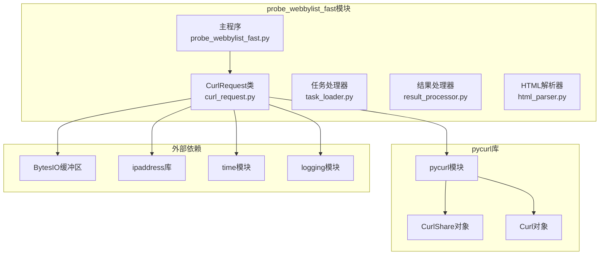
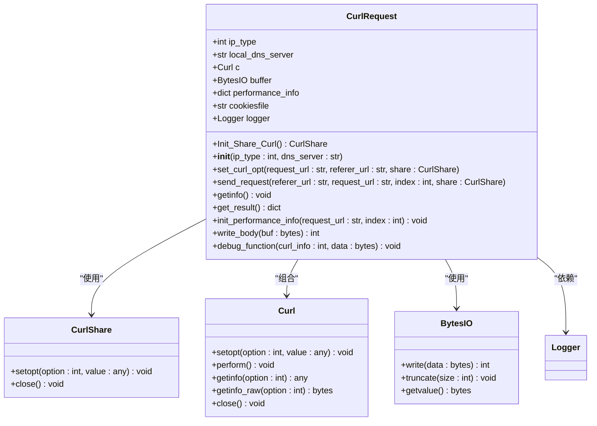
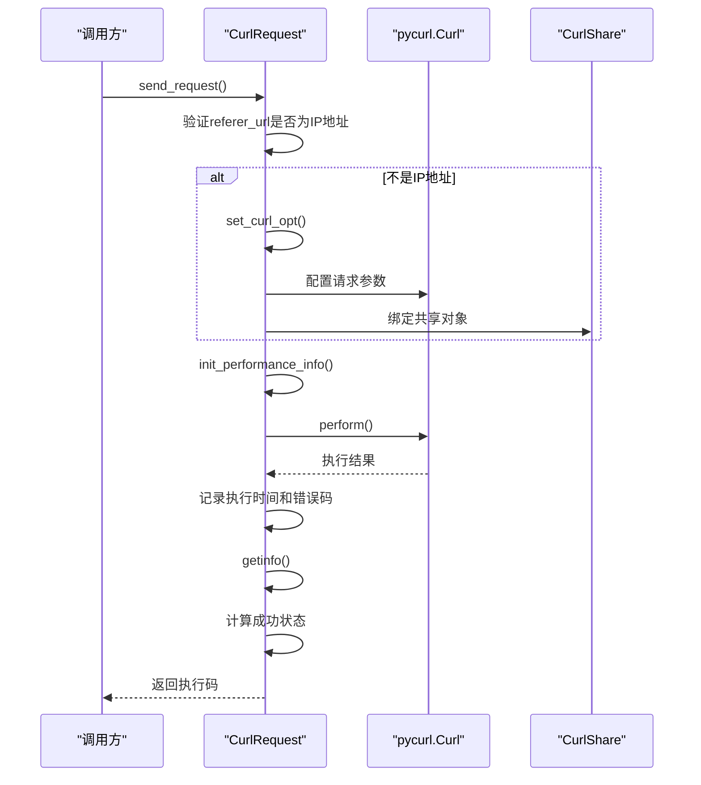
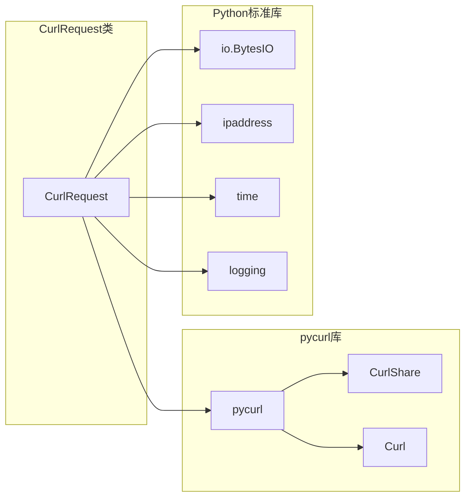

# CurlRequest类API

<cite>
**本文档引用的文件**
- [curl_request.py](file://probe_webbylist_fast/curl_request.py)
- [probe_webbylist_fast.py](file://probe_webbylist_fast/probe_webbylist_fast.py)
- [curl_getinfo.rst](file://pycurl-master/doc/docstrings/curl_getinfo.rst)
- [curl_setopt.rst](file://pycurl-master/doc/docstrings/curl_setopt.rst)
- [share.rst](file://pycurl-master/doc/docstrings/share.rst)
- [getinfo_test.py](file://pycurl-master/tests/getinfo_test.py)
</cite>

## 目录
1. [简介](#简介)
2. [项目结构](#项目结构)
3. [核心组件](#核心组件)
4. [架构概览](#架构概览)
5. [详细组件分析](#详细组件分析)
6. [依赖分析](#依赖分析)
7. [性能考虑](#性能考虑)
8. [故障排除指南](#故障排除指南)
9. [结论](#结论)
10. [附录](#附录)

## 简介
CurlRequest类是一个基于pycurl库的HTTP请求封装类，专门用于网页性能测试和监控场景。该类提供了完整的HTTP请求生命周期管理，包括请求配置、发送执行、性能指标收集等功能。本文档将详细介绍CurlRequest类的所有API接口、配置参数和使用方法。

## 项目结构
CurlRequest类位于probe_webbylist_fast模块中，与相关的工具类和测试文件共同构成了完整的网页性能测试系统。



**图表来源**
- [curl_request.py:1-194](file://probe_webbylist_fast/curl_request.py#L1-L194)
- [probe_webbylist_fast.py:1-222](file://probe_webbylist_fast/probe_webbylist_fast.py#L1-L222)

**章节来源**
- [curl_request.py:1-194](file://probe_webbylist_fast/curl_request.py#L1-L194)
- [probe_webbylist_fast.py:1-222](file://probe_webbylist_fast/probe_webbylist_fast.py#L1-L222)

## 核心组件
CurlRequest类是整个系统的请求处理核心，负责HTTP请求的完整生命周期管理。该类提供了静态共享初始化、请求配置、性能监控等关键功能。

### 主要特性
- **静态共享初始化**: 提供Init_Share_Curl()静态方法，用于创建可复用的CurlShare对象
- **灵活的IP版本支持**: 支持IPv4和IPv6两种DNS解析模式
- **性能指标监控**: 内置完整的HTTP性能时间线统计
- **错误处理机制**: 完善的异常捕获和错误信息记录
- **调试功能**: 详细的调试信息输出和IP地址追踪

**章节来源**
- [curl_request.py:9-194](file://probe_webbylist_fast/curl_request.py#L9-L194)

## 架构概览
CurlRequest类采用面向对象的设计模式，通过组合多个pycurl组件来实现HTTP请求功能。整体架构分为三层：配置层、执行层和监控层。



**图表来源**
- [curl_request.py:9-194](file://probe_webbylist_fast/curl_request.py#L9-L194)

## 详细组件分析

### 初始化方法

#### 构造函数 (__init__)
CurlRequest类的构造函数负责初始化所有必要的组件和配置参数。

**参数说明:**
- `ip_type` (int): 指定DNS解析的IP版本，默认值为4，支持4或6
- `dns_server` (str): 自定义DNS服务器地址，为空字符串时表示使用系统默认DNS

**初始化流程:**
1. 设置错误码初始值为0
2. 创建pycurl.Curl对象实例
3. 初始化响应数据缓冲区
4. 配置Cookie文件路径
5. 初始化性能信息字典
6. 创建日志记录器实例

**章节来源**
- [curl_request.py:18-50](file://probe_webbylist_fast/curl_request.py#L18-L50)

#### 静态方法 Init_Share_Curl()
该静态方法用于创建全局可复用的CurlShare对象，实现多个Curl实例间的资源共享。

**返回值:** pycurl.CurlShare对象
**功能:** 配置共享以下资源：
- Cookie数据
- DNS缓存
- SSL会话缓存

**章节来源**
- [curl_request.py:11-17](file://probe_webbylist_fast/curl_request.py#L11-L17)

### 请求配置方法

#### set_curl_opt() 方法
该方法负责配置所有HTTP请求相关的参数和选项。

**参数说明:**
- `request_url` (str): 目标URL地址
- `referer_url` (str): 引用页面URL
- `G_CURL_SHARE` (CurlShare): 共享对象实例

**核心配置选项:**

**DNS和IP配置:**
- `pycurl.IPRESOLVE`: 根据ip_type选择IPv4或IPv6解析
- `pycurl.DNS_SERVERS`: 当提供本地DNS服务器时启用自定义DNS

**URL和头部配置:**
- `pycurl.URL`: 设置目标请求URL
- `pycurl.REFERER`: 设置HTTP Referer头部
- `pycurl.AUTOREFERER`: 自动设置Referer头部

**SSL安全配置:**
- `pycurl.SSL_VERIFYPEER`: 禁用SSL证书验证
- `pycurl.SSL_VERIFYHOST`: 禁用主机名验证

**性能和超时配置:**
- `pycurl.CONNECTTIMEOUT`: 连接超时时间（秒）
- `pycurl.TIMEOUT`: 整体请求超时时间（秒）
- `pycurl.LOW_SPEED_LIMIT`: 低速阈值
- `pycurl.LOW_SPEED_TIME`: 低速持续时间

**其他重要配置:**
- `pycurl.WRITEDATA`: 设置响应数据写入缓冲区
- `pycurl.WRITEHEADER`: 设置响应头写入缓冲区
- `pycurl.WRITEFUNCTION`: 设置自定义数据写入回调
- `pycurl.FOLLOWLOCATION`: 启用重定向跟随
- `pycurl.MAXREDIRS`: 最大重定向次数
- `pycurl.USERAGENT`: 设置浏览器User-Agent字符串
- `pycurl.VERBOSE`: 启用详细调试输出
- `pycurl.DEBUGFUNCTION`: 设置调试回调函数

**章节来源**
- [curl_request.py:80-117](file://probe_webbylist_fast/curl_request.py#L80-L117)

### 请求发送方法

#### send_request() 方法
该方法实现了完整的HTTP请求发送流程，包含参数验证、性能指标初始化和错误处理。

**参数说明:**
- `referer_url` (str): 引用页面URL
- `request_url` (str): 目标URL地址
- `index` (int): 请求索引标识
- `G_CURL_SHARE` (CurlShare): 共享对象实例

**请求流程:**



**图表来源**
- [curl_request.py:130-155](file://probe_webbylist_fast/curl_request.py#L130-L155)

**执行流程详解:**
1. **参数验证**: 检查referer_url是否为有效的IP地址
2. **配置应用**: 如果不是IP地址，则应用完整的请求配置
3. **性能初始化**: 记录开始时间戳和请求URL
4. **请求执行**: 调用pycurl.perform()执行HTTP请求
5. **结果记录**: 记录执行时间和错误信息
6. **性能收集**: 调用getinfo()收集详细性能数据
7. **状态判断**: 基于HTTP状态码判断请求成功与否

**章节来源**
- [curl_request.py:130-155](file://probe_webbylist_fast/curl_request.py#L130-L155)

### 性能数据获取

#### getinfo() 方法
该方法负责从已完成的HTTP请求中提取详细的性能指标数据。

**性能指标计算:**
- **时间指标**: 
  - `time_total`: 总请求时间（毫秒）
  - `time_namelookup`: DNS解析时间（毫秒）
  - `time_connect`: 连接建立时间（毫秒）
  - `time_appconnect`: 应用层连接时间（毫秒）
  - `time_pretransfer`: 预传输准备时间（毫秒）
  - `time_starttransfer`: 首字节响应时间（毫秒）
  - `time_redirect`: 重定向总时间（毫秒）

- **网络指标**:
  - `size_upload`: 上传字节数
  - `size_download`: 下载字节数
  - `speed_download`: 下载速度（字节/秒）
  - `speed_upload`: 上传速度（字节/秒）

- **HTTP状态**:
  - `http_code`: HTTP状态码
  - `redirect_count`: 重定向次数
  - `effective_url`: 实际访问URL

- **连接信息**:
  - `primary_ip`: 主要连接IP地址
  - `content_type`: 内容类型

**数据格式转换:**
- 时间数据从秒转换为毫秒
- 字符串内容进行UTF-8解码处理
- IP地址信息仅在HTTP 200状态下获取

**章节来源**
- [curl_request.py:157-194](file://probe_webbylist_fast/curl_request.py#L157-L194)

### 辅助方法

#### init_performance_info() 方法
初始化性能监控所需的基础信息。

**功能:** 设置URL、索引和开始时间戳

#### get_result() 方法
返回当前请求的完整性能信息字典

#### write_body() 方法
自定义响应数据写入回调函数

#### debug_function() 方法
调试信息处理和IP地址追踪

**章节来源**
- [curl_request.py:119-128](file://probe_webbylist_fast/curl_request.py#L119-L128)
- [curl_request.py:56-67](file://probe_webbylist_fast/curl_request.py#L56-L67)
- [curl_request.py:69-79](file://probe_webbylist_fast/curl_request.py#L69-L79)

## 依赖分析

### 外部依赖关系



**图表来源**
- [curl_request.py:1-8](file://probe_webbylist_fast/curl_request.py#L1-L8)

### 内部依赖关系
- CurlRequest类依赖pycurl库进行HTTP请求处理
- 使用BytesIO作为内存缓冲区存储响应数据
- 通过ipaddress库验证IP地址格式
- 利用time模块记录时间戳信息
- 采用logging模块进行调试和错误信息输出

**章节来源**
- [curl_request.py:1-8](file://probe_webbylist_fast/curl_request.py#L1-L8)

## 性能考虑

### 性能优化策略
1. **连接复用**: 通过CurlShare对象实现连接池复用
2. **内存管理**: 使用BytesIO减少磁盘I/O操作
3. **超时控制**: 合理设置连接和整体超时时间
4. **SSL优化**: 在测试场景禁用SSL验证提高性能

### 性能指标说明
- **时间单位**: 所有时间指标均以毫秒为单位
- **精度**: 时间计算保留小数点后若干位
- **边界处理**: 负值表示数据不可用或未计算

### 并发处理
系统支持多进程并发请求，通过队列池管理CurlRequest实例，实现高并发性能测试。

## 故障排除指南

### 常见问题及解决方案

**1. DNS解析失败**
- 检查local_dns_server参数配置
- 验证DNS服务器可达性
- 确认防火墙设置允许DNS查询

**2. SSL证书验证错误**
- 在测试环境中可接受证书验证关闭
- 生产环境建议启用SSL验证

**3. 超时问题**
- 调整CONNECTTIMEOUT和TIMEOUT参数
- 检查网络连接质量
- 考虑增加超时时间

**4. 内存使用过高**
- 监控BytesIO缓冲区大小
- 及时清理不再使用的CurlRequest实例
- 考虑限制同时进行的请求数量

**章节来源**
- [curl_request.py:141-148](file://probe_webbylist_fast/curl_request.py#L141-L148)

## 结论
CurlRequest类提供了一个功能完整、性能高效的HTTP请求处理框架。通过合理的配置管理和性能监控，该类能够满足网页性能测试的各种需求。其设计充分考虑了并发处理、错误处理和调试支持，为构建可靠的网络监控系统奠定了坚实基础。

## 附录

### 使用示例

#### 基本使用流程
```python
# 初始化共享对象
G_CURL_SHARE = CurlRequest.Init_Share_Curl()

# 创建CurlRequest实例
curl_req = CurlRequest(ip_type=4, dns_server="8.8.8.8")

# 发送HTTP请求
execute_code = curl_req.send_request(
    referer_url="http://example.com",
    request_url="http://test-server.com/page",
    index=0,
    G_CURL_SHARE=G_CURL_SHARE
)

# 获取性能结果
result = curl_req.get_result()
```

#### 高级配置示例
```python
# IPv6请求示例
curl_req_ipv6 = CurlRequest(ip_type=6)

# 自定义DNS服务器
curl_req_custom_dns = CurlRequest(
    ip_type=4, 
    dns_server="114.114.114.114"
)

# 多线程并发示例
from concurrent.futures import ThreadPoolExecutor
import multiprocessing

pool_size = multiprocessing.cpu_count() + 4
with ThreadPoolExecutor(max_workers=pool_size) as executor:
    futures = []
    for task in tasks:
        future = executor.submit(curl_task, task, curl_pool, result_pool, G_CURL_SHARE)
        futures.append(future)
```

### 最佳实践指南

**1. 配置优化**
- 根据目标服务器位置选择合适的DNS服务器
- 合理设置超时参数以平衡响应速度和成功率
- 在测试环境中适当调整SSL验证设置

**2. 错误处理**
- 始终检查execute_code返回值
- 记录详细的错误信息便于调试
- 实现适当的重试机制

**3. 性能监控**
- 定期监控关键性能指标
- 分析时间分布以识别瓶颈
- 跟踪HTTP状态码变化趋势

**4. 资源管理**
- 及时释放CurlRequest实例
- 监控内存使用情况
- 合理控制并发请求数量

**章节来源**
- [probe_webbylist_fast.py:102-178](file://probe_webbylist_fast/probe_webbylist_fast.py#L102-L178)