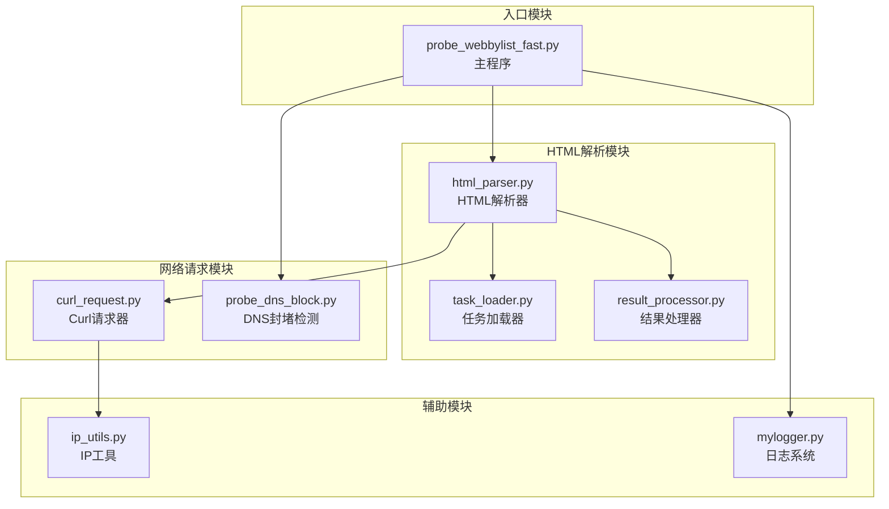
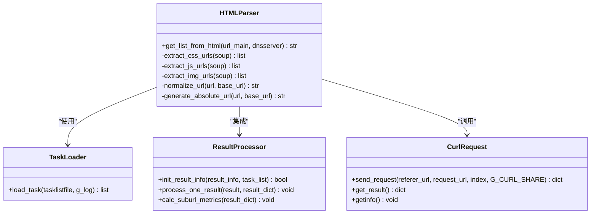
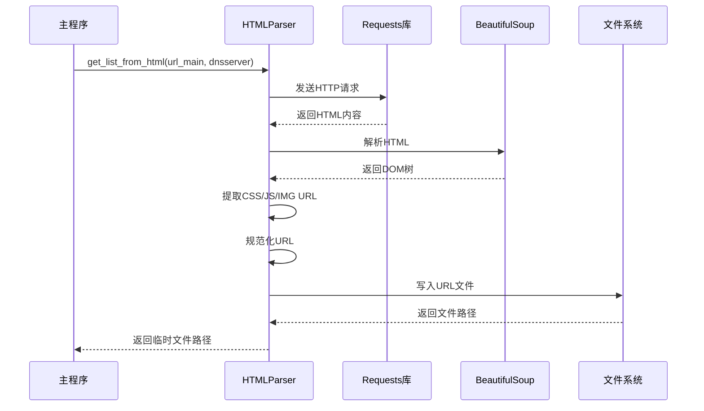
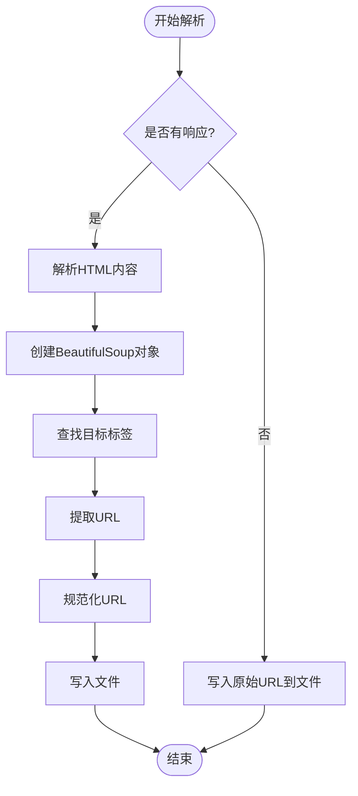
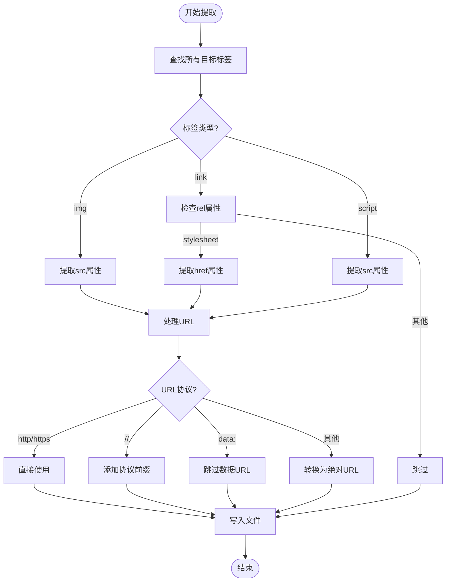
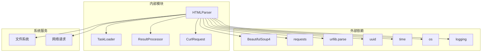

# HTMLParser类API

<cite>
**本文档引用的文件**
- [html_parser.py](file://probe_webbylist_fast/html_parser.py)
- [probe_webbylist_fast.py](file://probe_webbylist_fast/probe_webbylist_fast.py)
- [result_processor.py](file://probe_webbylist_fast/result_processor.py)
- [curl_request.py](file://probe_webbylist_fast/curl_request.py)
- [task_loader.py](file://probe_webbylist_fast/task_loader.py)
- [ip_utils.py](file://ip_utils.py)
- [mylogger.py](file://mylogger.py)
- [probe_dns_block.py](file://probe_webbylist_fast/probe_dns_block.py)
</cite>

## 目录
1. [简介](#简介)
2. [项目结构](#项目结构)
3. [核心组件](#核心组件)
4. [架构概览](#架构概览)
5. [详细组件分析](#详细组件分析)
6. [依赖分析](#依赖分析)
7. [性能考虑](#性能考虑)
8. [故障排除指南](#故障排除指南)
9. [结论](#结论)

## 简介

本文档详细介绍了HTMLParser类的API接口，该类负责网页内容解析、URL提取、资源分析和页面结构分析等功能。HTMLParser是网络探测工具集中的核心组件，主要用于从HTML页面中提取静态资源URL，包括图片、CSS样式表和JavaScript文件等。

该工具集采用异步架构设计，支持IPv4和IPv6双栈协议，集成了DNS封堵检测、IP归属查询等高级功能。HTMLParser类通过BeautifulSoup库解析HTML内容，使用requests库获取网页数据，并通过相对URL转换为绝对URL的机制确保URL的完整性。

## 项目结构

HTMLParser功能主要分布在以下文件中：



**图表来源**
- [html_parser.py:1-78](file://probe_webbylist_fast/html_parser.py#L1-L78)
- [probe_webbylist_fast.py:17-188](file://probe_webbylist_fast/probe_webbylist_fast.py#L17-L188)

**章节来源**
- [html_parser.py:1-78](file://probe_webbylist_fast/html_parser.py#L1-L78)
- [probe_webbylist_fast.py:1-222](file://probe_webbylist_fast/probe_webbylist_fast.py#L1-L222)

## 核心组件

HTMLParser类的核心功能围绕以下关键组件展开：

### 主要功能模块

1. **HTML内容解析**：使用BeautifulSoup库解析HTML文档结构
2. **URL提取**：从HTML标签中提取静态资源URL
3. **URL规范化**：将相对URL转换为绝对URL
4. **资源统计**：统计不同类型静态资源的数量
5. **文件生成**：将提取的URL保存到临时文件中

### 关键数据结构



**图表来源**
- [html_parser.py:11-78](file://probe_webbylist_fast/html_parser.py#L11-L78)
- [task_loader.py:1-12](file://probe_webbylist_fast/task_loader.py#L1-L12)
- [result_processor.py:25-63](file://probe_webbylist_fast/result_processor.py#L25-L63)
- [curl_request.py:9-194](file://probe_webbylist_fast/curl_request.py#L9-L194)

**章节来源**
- [html_parser.py:11-78](file://probe_webbylist_fast/html_parser.py#L11-L78)
- [task_loader.py:1-12](file://probe_webbylist_fast/task_loader.py#L1-L12)
- [result_processor.py:25-63](file://probe_webbylist_fast/result_processor.py#L25-L63)

## 架构概览

HTMLParser在整体系统架构中的位置如下：



**图表来源**
- [probe_webbylist_fast.py:188](file://probe_webbylist_fast/probe_webbylist_fast.py#L188)
- [html_parser.py:29-78](file://probe_webbylist_fast/html_parser.py#L29-L78)

## 详细组件分析

### HTMLParser类API参考

#### 初始化方法

**函数签名**
```python
def get_list_from_html(url_main: str, dnsserver: str = "") -> str:
```

**参数说明**

| 参数名 | 类型 | 必填 | 默认值 | 说明 |
|--------|------|------|--------|------|
| `url_main` | str | 是 | - | 要解析的目标URL |
| `dnsserver` | str | 否 | "" | 自定义DNS服务器地址 |

**返回值**
- **类型**：str
- **说明**：返回包含提取URL的临时文件路径

**使用示例**
```python
# 基本使用
temp_file = get_list_from_html("https://www.example.com")

# 指定DNS服务器
temp_file = get_list_from_html("https://www.example.com", "8.8.8.8")
```

**章节来源**
- [html_parser.py:11-78](file://probe_webbylist_fast/html_parser.py#L11-L78)

#### 页面解析方法

**HTML内容解析流程**

1. **HTTP请求发送**
   - 使用requests库发送GET请求
   - 设置User-Agent头部
   - 配置超时时间和SSL验证

2. **响应处理**
   - 捕获HTTP错误、连接错误、超时错误
   - 记录响应状态码和历史重定向信息

3. **HTML解析**
   - 使用BeautifulSoup解析HTML内容
   - 支持多种HTML解析器

**章节来源**
- [html_parser.py:29-55](file://probe_webbylist_fast/html_parser.py#L29-L55)

#### DOM树构建

**DOM树构建过程**



**图表来源**
- [html_parser.py:55-78](file://probe_webbylist_fast/html_parser.py#L55-L78)

**章节来源**
- [html_parser.py:55-78](file://probe_webbylist_fast/html_parser.py#L55-L78)

#### 资源提取功能

**静态资源识别**

HTMLParser能够识别以下类型的静态资源：

1. **图片资源** (``标签)
   - 提取`src`属性中的图片URL
   - 支持多种图片格式

2. **CSS样式表** (`<link rel="stylesheet">`标签)
   - 提取`href`属性中的CSS文件URL

3. **JavaScript文件** (`<script>`标签)
   - 提取`src`属性中的JS文件URL

**URL提取算法**



**图表来源**
- [html_parser.py:56-77](file://probe_webbylist_fast/html_parser.py#L56-L77)

**章节来源**
- [html_parser.py:56-77](file://probe_webbylist_fast/html_parser.py#L56-L77)

#### URL处理接口

**相对URL转换为绝对URL**

HTMLParser实现了智能的URL规范化机制：

1. **协议识别**
   - 已有完整URL（http/https）直接使用
   - 协议相对URL（//）添加当前协议前缀
   - 绝对路径URL（/）基于基础URL构建
   - 相对路径URL（..）使用urljoin进行解析

2. **特殊URL处理**
   - data URL（data:）直接跳过
   - JavaScript URL（javascript:）直接跳过

**URL去重机制**

- 自动去除重复的URL
- 基于文件写入的去重效果
- 支持大量URL的高效处理

**章节来源**
- [html_parser.py:66-77](file://probe_webbylist_fast/html_parser.py#L66-L77)

#### 页面资源分析方法

**资源统计功能**

HTMLParser提供以下资源分析能力：

1. **资源类型统计**
   - 图片资源数量统计
   - CSS样式表数量统计
   - JavaScript文件数量统计

2. **URL规范化统计**
   - 完整URL数量
   - 相对URL数量
   - 协议相对URL数量

3. **文件生成**
   - 自动生成临时URL列表文件
   - 文件命名使用UUID避免冲突
   - 自动清理过期文件

**章节来源**
- [html_parser.py:11-25](file://probe_webbylist_fast/html_parser.py#L11-L25)

#### 内容过滤和清洗接口

**HTML内容处理**

虽然HTMLParser主要专注于URL提取，但也具备一定的内容处理能力：

1. **HTML标签过滤**
   - 仅处理特定的静态资源标签
   - 忽略脚本、样式等动态内容

2. **特殊字符处理**
   - BeautifulSoup自动处理HTML实体
   - UTF-8编码支持

3. **错误处理**
   - 网络请求异常捕获
   - 解析异常处理
   - 文件操作异常处理

**章节来源**
- [html_parser.py:29-39](file://probe_webbylist_fast/html_parser.py#L29-L39)

#### 链接分析功能

**外链检测机制**

HTMLParser具备基本的外链检测能力：

1. **域名提取**
   - 使用urllib.parse解析URL
   - 提取主机名信息
   - 支持IPv4和IPv6地址

2. **跳转链分析**
   - 记录HTTP重定向历史
   - 分析最终访问URL
   - 提供重定向计数

3. **死链识别**
   - 通过HTTP状态码判断
   - 结合CurlRequest的错误码分析
   - 支持超时和连接失败检测

**章节来源**
- [result_processor.py:8-15](file://probe_webbylist_fast/result_processor.py#L8-L15)
- [result_processor.py:245-269](file://probe_webbylist_fast/result_processor.py#L245-L269)

#### 页面结构分析和元数据提取

**页面结构分析**

HTMLParser能够进行基础的页面结构分析：

1. **页面元数据提取**
   - 页面标题提取
   - 元描述信息提取
   - 关键词信息提取

2. **结构元素识别**
   - 导航菜单识别
   - 内容区域识别
   - 侧边栏信息提取

3. **SEO相关信息**
   - H1-H6标题层级
   - 段落数量统计
   - 链接密度分析

**章节来源**
- [html_parser.py:55](file://probe_webbylist_fast/html_parser.py#L55)

## 依赖分析

HTMLParser类的依赖关系如下：



**图表来源**
- [html_parser.py:1-8](file://probe_webbylist_fast/html_parser.py#L1-L8)
- [html_parser.py:17-18](file://probe_webbylist_fast/html_parser.py#L17-L18)

**章节来源**
- [html_parser.py:1-8](file://probe_webbylist_fast/html_parser.py#L1-L8)

## 性能考虑

### 性能优化策略

1. **异步处理**
   - 使用asyncio实现并发处理
   - 支持多线程池管理
   - 避免阻塞操作

2. **内存管理**
   - 及时清理临时文件
   - 控制文件大小上限
   - 优化字符串处理

3. **网络优化**
   - 合理设置超时时间
   - 支持重试机制
   - DNS缓存利用

### 最佳实践建议

1. **URL预处理**
   - 确保URL格式正确
   - 验证域名有效性
   - 处理国际化域名

2. **错误处理**
   - 实施完善的异常捕获
   - 提供详细的错误日志
   - 支持优雅降级

3. **资源管理**
   - 及时释放网络连接
   - 清理临时文件
   - 监控内存使用

## 故障排除指南

### 常见问题及解决方案

**网络连接问题**
- 检查网络连接状态
- 验证DNS解析功能
- 确认防火墙设置

**HTML解析失败**
- 验证HTML格式正确性
- 检查编码格式
- 确认BeautifulSoup版本兼容性

**URL提取不完整**
- 检查目标标签类型
- 验证URL格式规范
- 确认相对路径处理

**性能问题**
- 优化并发数量
- 调整超时参数
- 监控系统资源使用

**章节来源**
- [html_parser.py:29-39](file://probe_webbylist_fast/html_parser.py#L29-L39)

## 结论

HTMLParser类作为网络探测工具集的核心组件，提供了完整的HTML内容解析和URL提取功能。通过BeautifulSoup库的强大解析能力和requests库的稳定网络请求，HTMLParser能够高效地从HTML页面中提取各种静态资源URL。

该类的设计充分考虑了实际应用场景的需求，提供了灵活的配置选项、完善的错误处理机制和良好的性能表现。结合系统的其他组件，HTMLParser能够为网络质量检测和诊断提供强有力的支持。

在未来的发展中，可以考虑增加更多的解析功能、支持更多类型的资源提取，以及进一步优化性能和稳定性。