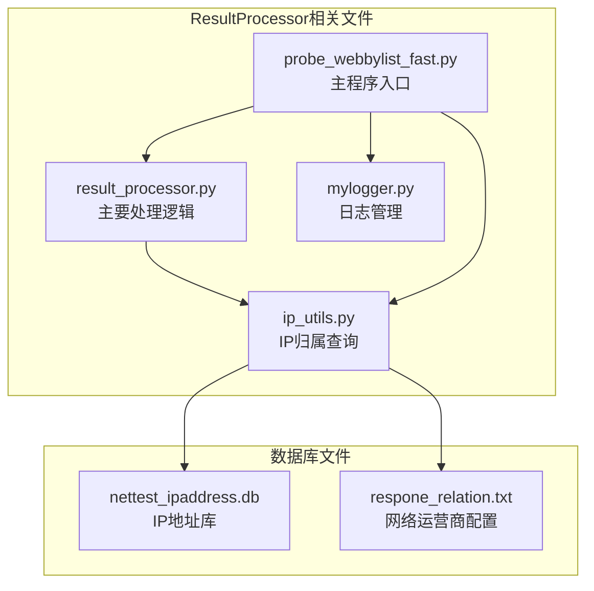
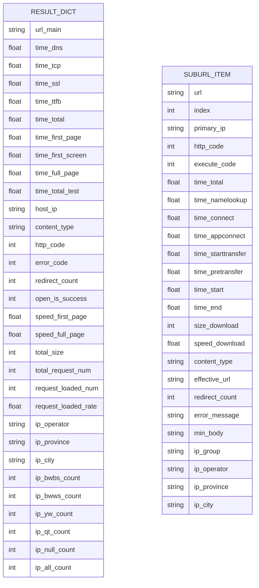
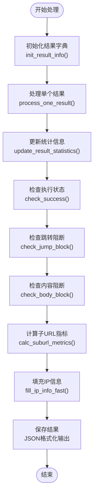
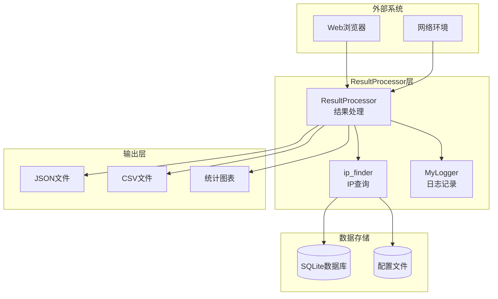
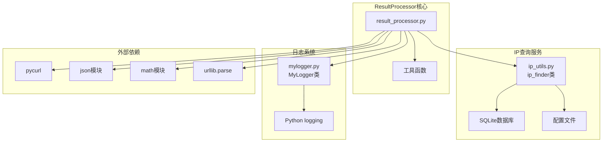

# ResultProcessor类API

<cite>
**本文档引用的文件**
- [result_processor.py](file://probe_webbylist_fast/result_processor.py)
- [ip_utils.py](file://ip_utils.py)
- [probe_webbylist_fast.py](file://probe_webbylist_fast/probe_webbylist_fast.py)
- [mylogger.py](file://mylogger.py)
</cite>

## 目录
1. [简介](#简介)
2. [项目结构](#项目结构)
3. [核心组件](#核心组件)
4. [架构概览](#架构概览)
5. [详细组件分析](#详细组件分析)
6. [依赖关系分析](#依赖关系分析)
7. [性能考虑](#性能考虑)
8. [故障排除指南](#故障排除指南)
9. [结论](#结论)

## 简介

ResultProcessor类（在本项目中以模块形式实现）是一个专门用于处理网页子资源探测结果的工具类。它负责收集和分析HTTP请求的性能指标，包括DNS解析时间、TCP连接时间、SSL握手时间、首字节时间、总传输时间等关键性能指标。该类还提供了IP归属查询、错误代码分类、成功率统计等功能，是整个网络质量检测系统的核心组件之一。

## 项目结构

ResultProcessor相关的核心文件位于以下位置：

**图表来源**
- [result_processor.py:1-269](file://probe_webbylist_fast/result_processor.py#L1-L269)
- [ip_utils.py:1-235](file://ip_utils.py#L1-L235)
- [probe_webbylist_fast.py:1-222](file://probe_webbylist_fast/probe_webbylist_fast.py#L1-L222)

**章节来源**
- [result_processor.py:1-269](file://probe_webbylist_fast/result_processor.py#L1-L269)
- [ip_utils.py:1-235](file://ip_utils.py#L1-L235)
- [probe_webbylist_fast.py:1-222](file://probe_webbylist_fast/probe_webbylist_fast.py#L1-L222)

## 核心组件

ResultProcessor模块提供了以下核心功能：

### 主要数据结构

ResultProcessor使用统一的结果字典结构来存储所有处理后的数据：

**图表来源**
- [result_processor.py:25-63](file://probe_webbylist_fast/result_processor.py#L25-L63)
- [result_processor.py:65-86](file://probe_webbylist_fast/result_processor.py#L65-L86)

### 关键处理流程

**图表来源**
- [result_processor.py:25-63](file://probe_webbylist_fast/result_processor.py#L25-L63)
- [result_processor.py:65-98](file://probe_webbylist_fast/result_processor.py#L65-L98)
- [result_processor.py:148-199](file://probe_webbylist_fast/result_processor.py#L148-L199)
- [result_processor.py:206-236](file://probe_webbylist_fast/result_processor.py#L206-L236)

**章节来源**
- [result_processor.py:25-236](file://probe_webbylist_fast/result_processor.py#L25-L236)

## 架构概览

ResultProcessor在整个系统中的位置和作用：

**图表来源**
- [probe_webbylist_fast.py:15-16](file://probe_webbylist_fast/probe_webbylist_fast.py#L15-L16)
- [ip_utils.py:11-14](file://ip_utils.py#L11-L14)
- [mylogger.py:7-28](file://mylogger.py#L7-L28)

**章节来源**
- [probe_webbylist_fast.py:15-175](file://probe_webbylist_fast/probe_webbylist_fast.py#L15-L175)

## 详细组件分析

### 初始化方法

#### init_result_info(result_info, task_list)
初始化结果字典结构，设置所有必要的字段和默认值。

**参数:**
- `result_info`: dict - 要初始化的结果字典
- `task_list`: list - 任务列表，用于提取主URL信息

**返回值:** bool - 初始化是否成功

**字段说明:**
- 性能指标类：DNS解析时间、TCP连接时间、SSL握手时间、首字节时间、总传输时间等
- 状态信息类：HTTP状态码、错误码、重定向次数、成功标志等
- 统计信息类：总请求数、成功请求数、成功率、总下载大小等
- IP归属信息类：运营商、省份、城市等

**章节来源**
- [result_processor.py:25-63](file://probe_webbylist_fast/result_processor.py#L25-L63)

### 数据处理接口

#### process_one_result(result, result_dict)
处理单个HTTP请求的结果数据。

**参数:**
- `result`: dict - 单个请求的原始结果
- `result_dict`: dict - 结果字典

**处理逻辑:**
1. 将结果添加到子URL列表
2. 累加总下载大小
3. 处理主URL的初始指标（DNS、TCP、SSL、TTFB等）
4. 设置HTTP状态码、错误信息、内容类型等
5. 计算首屏加载速度

**章节来源**
- [result_processor.py:65-86](file://probe_webbylist_fast/result_processor.py#L65-L86)

#### update_result_statistics(result_dict)
更新整体统计信息。

**参数:**
- `result_dict`: dict - 结果字典

**统计内容:**
- 成功请求数计算
- 总请求数统计
- 成功率计算（百分比）
- 测试总时长计算

**章节来源**
- [result_processor.py:88-99](file://probe_webbylist_fast/result_processor.py#L88-L99)

### 性能指标聚合接口

#### calc_suburl_metrics(result_dict)
计算子URL的性能指标，包括延迟时间和吞吐量。

**参数:**
- `result_dict`: dict - 结果字典

**计算逻辑:**
1. 过滤有效请求（HTTP 200且执行成功且时间合理）
2. 按结束时间排序
3. 计算P90分位数对应的首屏时间
4. 计算完整页面加载时间
5. 计算总吞吐量（KB/s）

**性能指标:**
- 首屏时间（First Screen）：P90分位数对应的时间
- 完整页面时间（Full Page）：最后一个成功请求的时间
- 吞吐量：总字节数/总时间

**章节来源**
- [result_processor.py:206-236](file://probe_webbylist_fast/result_processor.py#L206-L236)

### IP归属查询集成接口

#### fill_ip_info_fast(result_info)
快速填充IP归属信息。

**参数:**
- `result_info`: dict - 结果字典

**功能特点:**
- 使用ip_finder类查询IP归属信息
- 支持IPv4和IPv6地址
- 获取运营商、省份、城市信息
- 格式化时间戳（转换为相对时间）

**章节来源**
- [result_processor.py:100-121](file://probe_webbylist_fast/result_processor.py#L100-L121)

#### fill_ip_info(result_info)
详细填充IP归属信息（包含统计分析）。

**参数:**
- `result_info`: dict - 结果字典

**增强功能:**
- 统计不同IP组别的数量
- 分析本网本省、本网外省、异网、其他、空等分类
- 计算各分类的占比

**章节来源**
- [result_processor.py:123-146](file://probe_webbylist_fast/result_processor.py#L123-L146)

### 错误处理和状态检查接口

#### check_success(result_info, ip_type)
检查并设置执行状态和错误码。

**参数:**
- `result_info`: dict - 结果字典
- `ip_type`: int - IP版本类型（4或6）

**错误码映射:**
- 执行成功：0
- DNS解析超时：1001
- 连接超时：1002
- SSL握手错误：1003
- 远程服务器错误：1004
- 操作过慢：1005
- 超时：1006
- 连接拒绝：1007
- 其他错误：1099

**章节来源**
- [result_processor.py:148-199](file://probe_webbylist_fast/result_processor.py#L148-L199)

#### check_jump_block(result_dict, ip_type)
检查跳转阻断情况。

**参数:**
- `result_dict`: dict - 结果字典
- `ip_type`: int - IP版本类型

**检查逻辑:**
- 检查重定向次数
- 验证目标主机是否为本地回环地址
- 特定IP地址的阻断检测
- 设置相应的错误码和状态

**章节来源**
- [result_processor.py:245-269](file://probe_webbylist_fast/result_processor.py#L245-L269)

#### check_body_block(result_dict)
检查内容阻断（基于响应体内容）。

**参数:**
- `result_dict`: dict - 结果字典

**检测内容:**
- 检测特定关键词："警方提示疑似诈骗"
- 自动标记为阻断状态

**章节来源**
- [result_processor.py:237-244](file://probe_webbylist_fast/result_processor.py#L237-L244)

### 工具函数

#### get_host_from_url(input_str)
从URL中提取主机名。

**参数:**
- `input_str`: str - 输入的URL字符串

**返回值:** str - 提取的主机名，无效时返回None

**章节来源**
- [result_processor.py:8-15](file://probe_webbylist_fast/result_processor.py#L8-L15)

#### truncate_url(url, max_length=128)
截断URL字符串，保持两端可见。

**参数:**
- `url`: str - 输入的URL
- `max_length`: int - 最大长度，默认128字符

**返回值:** str - 截断后的URL

**章节来源**
- [result_processor.py:17-23](file://probe_webbylist_fast/result_processor.py#L17-L23)

## 依赖关系分析

ResultProcessor类的依赖关系图：

**图表来源**
- [result_processor.py:1-6](file://probe_webbylist_fast/result_processor.py#L1-L6)
- [ip_utils.py:11-14](file://ip_utils.py#L11-L14)
- [mylogger.py:7-11](file://mylogger.py#L7-L11)

**章节来源**
- [result_processor.py:1-6](file://probe_webbylist_fast/result_processor.py#L1-L6)
- [ip_utils.py:11-14](file://ip_utils.py#L11-L14)
- [mylogger.py:7-11](file://mylogger.py#L7-L11)

## 性能考虑

### 时间复杂度分析

1. **初始化阶段**: O(n)，其中n为任务数量
2. **结果处理**: O(m)，其中m为处理的请求数量
3. **统计计算**: O(m)，需要遍历所有请求
4. **IP查询**: O(k)，其中k为查询的IP数量
5. **排序操作**: O(s log s)，其中s为成功请求数量

### 内存使用优化

- 使用生成器模式避免一次性加载大量数据
- 及时清理临时变量和中间结果
- 合理使用字典和列表的组合

### 并发处理

ResultProcessor支持多线程并发处理，通过以下机制保证数据一致性：
- 线程安全的结果字典操作
- 合理的锁机制防止竞态条件
- 异步处理机制提高吞吐量

## 故障排除指南

### 常见问题及解决方案

#### IP查询失败
**症状**: IP归属信息为空
**原因**: 
- 数据库文件不存在或损坏
- 网络连接问题
- IP地址格式不正确

**解决方案**:
1. 检查nettest_ipaddress.db文件是否存在
2. 验证数据库连接权限
3. 确认IP地址格式正确

#### 性能指标异常
**症状**: 时间值异常大或小
**原因**:
- 网络环境影响
- 代理服务器干扰
- 系统时间不同步

**解决方案**:
1. 检查系统时间同步
2. 验证网络连接稳定性
3. 排除代理服务器影响

#### JSON输出格式错误
**症状**: 生成的JSON文件无法被解析
**原因**:
- 字符编码问题
- 特殊字符未正确转义
- 数据类型不兼容

**解决方案**:
1. 确保使用UTF-8编码
2. 验证数据类型兼容性
3. 检查特殊字符处理

**章节来源**
- [result_processor.py:148-199](file://probe_webbylist_fast/result_processor.py#L148-L199)
- [mylogger.py:30-59](file://mylogger.py#L30-L59)

## 结论

ResultProcessor类为网页子资源探测提供了完整的数据处理和分析能力。其设计具有以下特点：

1. **模块化设计**: 功能清晰分离，便于维护和扩展
2. **性能优化**: 支持并发处理，优化内存使用
3. **错误处理**: 完善的异常处理和状态检查机制
4. **数据完整性**: 提供全面的性能指标和统计信息
5. **可扩展性**: 易于添加新的分析功能和指标

该组件在实际应用中能够准确捕获网络性能数据，为网络质量评估和问题诊断提供重要依据。通过合理的使用和配置，可以满足各种网络测试场景的需求。