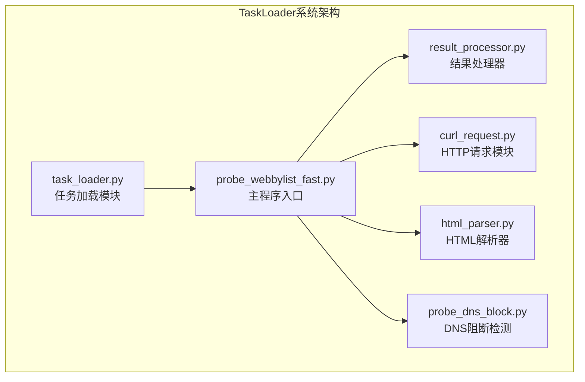
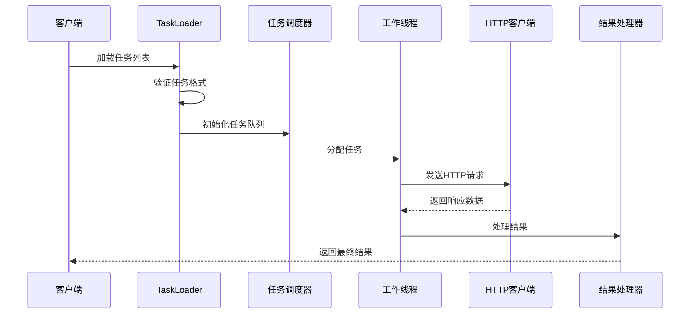
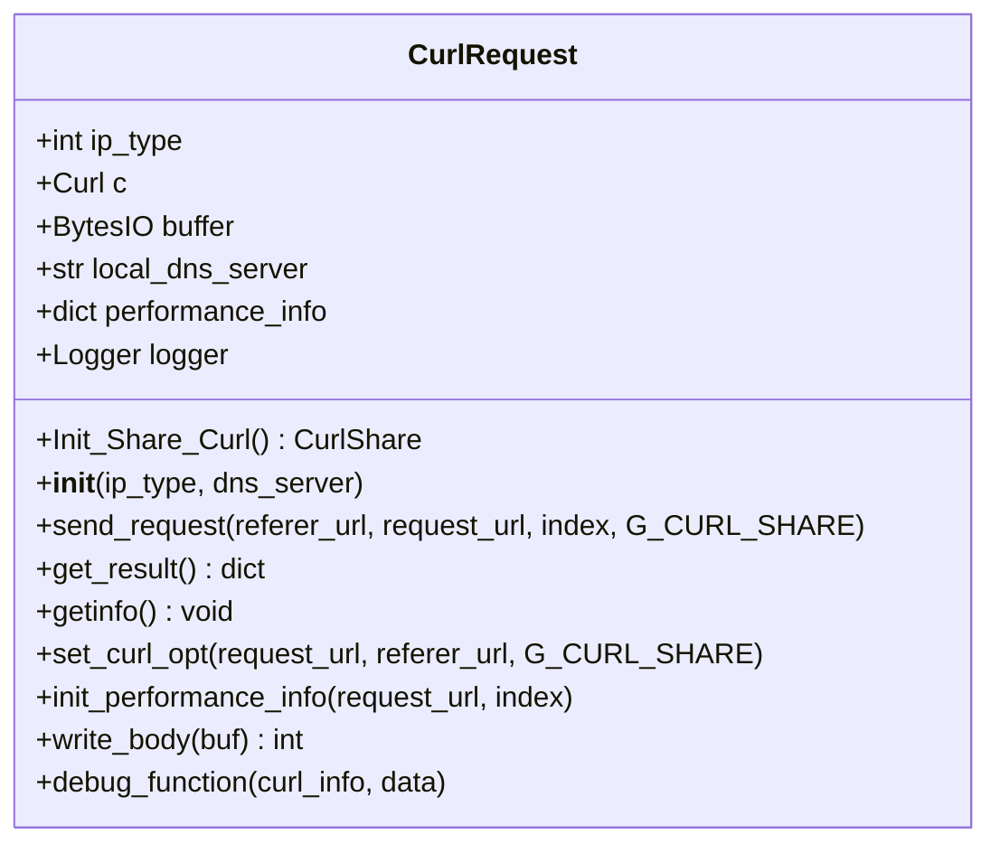
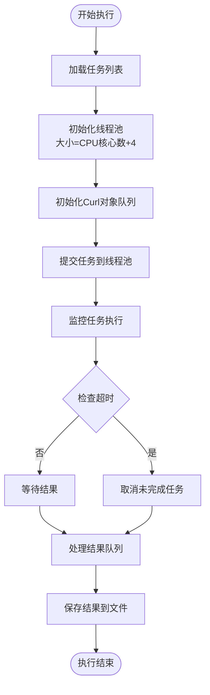
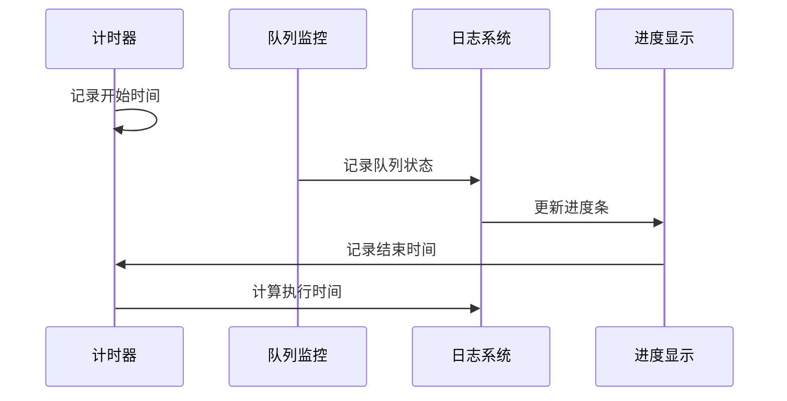
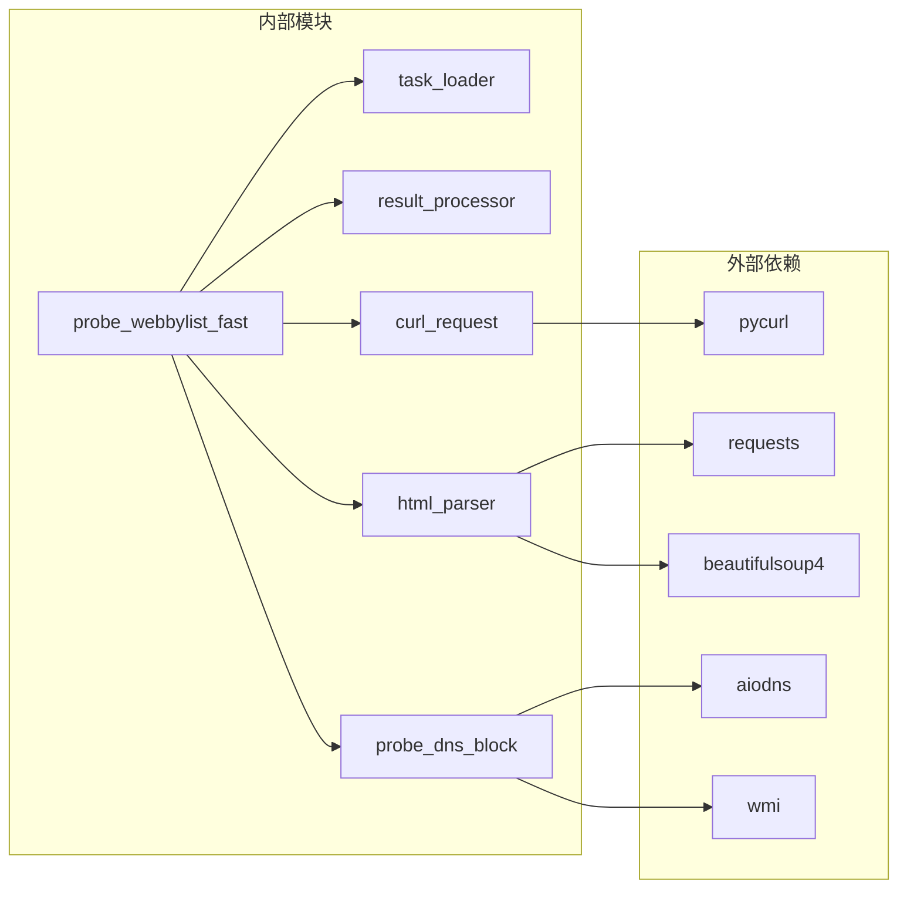

# TaskLoader类API

<cite>
**本文档引用的文件**
- [task_loader.py](file://probe_webbylist_fast/task_loader.py)
- [probe_webbylist_fast.py](file://probe_webbylist_fast/probe_webbylist_fast.py)
- [result_processor.py](file://probe_webbylist_fast/result_processor.py)
- [curl_request.py](file://probe_webbylist_fast/curl_request.py)
- [html_parser.py](file://probe_webbylist_fast/html_parser.py)
- [probe_dns_block.py](file://probe_webbylist_fast/probe_dns_block.py)
</cite>

## 目录
1. [简介](#简介)
2. [项目结构](#项目结构)
3. [核心组件](#核心组件)
4. [架构概览](#架构概览)
5. [详细组件分析](#详细组件分析)
6. [依赖关系分析](#依赖关系分析)
7. [性能考虑](#性能考虑)
8. [故障排除指南](#故障排除指南)
9. [结论](#结论)

## 简介

本文档为TaskLoader类创建详细的API参考文档。TaskLoader是网页测试模拟仿真系统中的核心组件，负责任务加载、并发控制、任务调度和进度跟踪等功能。该系统采用多线程并发模型，结合队列管理和线程池技术，实现了高效的网页资源加载和性能分析功能。

## 项目结构

项目采用模块化设计，主要包含以下核心模块：



**图表来源**
- [task_loader.py:1-12](file://probe_webbylist_fast/task_loader.py#L1-L12)
- [probe_webbylist_fast.py:1-222](file://probe_webbylist_fast/probe_webbylist_fast.py#L1-L222)

**章节来源**
- [task_loader.py:1-12](file://probe_webbylist_fast/task_loader.py#L1-L12)
- [probe_webbylist_fast.py:1-222](file://probe_webbylist_fast/probe_webbylist_fast.py#L1-L222)

## 核心组件

### TaskLoader类概述

基于现有代码分析，TaskLoader类的核心功能主要体现在以下几个方面：

1. **任务加载功能**：从文件中读取任务列表
2. **任务初始化**：将URL列表转换为任务对象
3. **并发控制**：管理线程池和任务队列
4. **任务调度**：分配任务给可用的工作线程
5. **进度跟踪**：监控任务执行状态和完成度
6. **错误处理**：异常捕获和失败任务处理

**章节来源**
- [task_loader.py:1-12](file://probe_webbylist_fast/task_loader.py#L1-L12)
- [probe_webbylist_fast.py:22-54](file://probe_webbylist_fast/probe_webbylist_fast.py#L22-L54)

## 架构概览

系统采用分层架构设计，各组件职责明确：



**图表来源**
- [probe_webbylist_fast.py:102-178](file://probe_webbylist_fast/probe_webbylist_fast.py#L102-L178)
- [curl_request.py:145-170](file://probe_webbylist_fast/curl_request.py#L145-L170)

## 详细组件分析

### 任务加载模块 (task_loader.py)

#### load_task函数

**函数签名**
```python
def load_task(tasklistfile="urllist.txt", g_log=None):
```

**参数说明**
- `tasklistfile` (str): 任务文件路径，默认为"urllist.txt"
- `g_log` (logging.Logger): 日志记录器实例，可选

**返回值**
- `list`: URL字符串列表，包含所有有效的任务URL

**功能描述**
从指定文件中读取任务列表，过滤掉长度小于等于3的无效行，返回清理后的URL列表。

**章节来源**
- [task_loader.py:1-12](file://probe_webbylist_fast/task_loader.py#L1-L12)

### 主程序模块 (probe_webbylist_fast.py)

#### initialize_task_list函数

**函数签名**
```python
def initialize_task_list(urls):
```

**参数说明**
- `urls` (list): URL字符串列表

**返回值**
- `list`: 任务对象列表，每个任务包含url、index、referer字段

**功能描述**
将URL列表转换为任务对象，设置任务索引和引用页面信息，限制最大任务数量为100个。

**章节来源**
- [probe_webbylist_fast.py:22-38](file://probe_webbylist_fast/probe_webbylist_fast.py#L22-L38)

#### initialize_result_dict函数

**函数签名**
```python
def initialize_result_dict(task_list):
```

**参数说明**
- `task_list` (list): 任务对象列表

**返回值**
- `dict`: 包含结果统计信息的字典

**功能描述**
初始化结果字典结构，调用结果处理器的初始化函数，并记录开始时间。

**章节来源**
- [probe_webbylist_fast.py:41-45](file://probe_webbylist_fast/probe_webbylist_fast.py#L41-L45)

#### curl_task函数

**函数签名**
```python
def curl_task(task_object, curl_object_pool, task_result_queue, G_CURL_SHARE):
```

**参数说明**
- `task_object` (dict): 单个任务对象
- `curl_object_pool` (Queue): Curl对象池
- `task_result_queue` (Queue): 结果队列
- `G_CURL_SHARE` (pycurl.CurlShare): 共享Curl实例

**返回值**
- `dict`: 任务执行结果

**功能描述**
从Curl对象池获取可用的Curl实例，发送HTTP请求，收集结果并放回对象池。

**章节来源**
- [probe_webbylist_fast.py:66-99](file://probe_webbylist_fast/probe_webbylist_fast.py#L66-L99)

#### suburldown函数

**函数签名**
```python
def suburldown(tasklistfilename, outfile, isdnsblock, ip_type, localresult, dnsserver="", g_log=None, total_timeout=10):
```

**参数说明**
- `tasklistfilename` (str): 任务文件名
- `outfile` (str): 输出文件名
- `isdnsblock` (bool): 是否检测到DNS阻断
- `ip_type` (int): IP版本类型（4或6）
- `localresult` (list): 本地DNS解析结果
- `dnsserver` (str): 自定义DNS服务器
- `g_log` (logging.Logger): 日志记录器
- `total_timeout` (int): 总超时时间（秒）

**返回值**
- `None`: 无返回值

**功能描述**
主要的执行流程函数，负责整个任务执行过程的协调和管理。

**章节来源**
- [probe_webbylist_fast.py:102-178](file://probe_webbylist_fast/probe_webbylist_fast.py#L102-L178)

### HTTP请求模块 (curl_request.py)

#### CurlRequest类

**类结构**


**图表来源**
- [curl_request.py:9-209](file://probe_webbylist_fast/curl_request.py#L9-L209)

**章节来源**
- [curl_request.py:9-209](file://probe_webbylist_fast/curl_request.py#L9-L209)

### 结果处理模块 (result_processor.py)

#### init_result_info函数

**函数签名**
```python
def init_result_info(result_info, task_list):
```

**参数说明**
- `result_info` (dict): 结果字典
- `task_list` (list): 任务列表

**返回值**
- `bool`: 初始化是否成功

**功能描述**
初始化结果字典结构，设置主URL和各种性能指标的初始值。

**章节来源**
- [result_processor.py:25-63](file://probe_webbylist_fast/result_processor.py#L25-L63)

#### process_one_result函数

**函数签名**
```python
def process_one_result(result, result_dict):
```

**参数说明**
- `result` (dict): 单个结果
- `result_dict` (dict): 结果字典

**返回值**
- `None`: 无返回值

**功能描述**
处理单个任务结果，更新统计数据和性能指标。

**章节来源**
- [result_processor.py:65-86](file://probe_webbylist_fast/result_processor.py#L65-L86)

### 并发控制接口

系统采用ThreadPoolExecutor进行线程池管理，Queue进行任务队列处理：



**图表来源**
- [probe_webbylist_fast.py:117-136](file://probe_webbylist_fast/probe_webbylist_fast.py#L117-L136)

**章节来源**
- [probe_webbylist_fast.py:117-136](file://probe_webbylist_fast/probe_webbylist_fast.py#L117-L136)

### 任务调度方法

系统采用简单轮询调度策略：

1. **任务分配策略**：使用ThreadPoolExecutor自动分配任务
2. **优先级排序**：按任务完成时间排序
3. **负载均衡**：通过队列机制实现负载均衡

**章节来源**
- [probe_webbylist_fast.py:119-121](file://probe_webbylist_fast/probe_webbylist_fast.py#L119-L121)

### 进度跟踪接口

系统提供多层次的进度跟踪机制：



**图表来源**
- [probe_webbylist_fast.py:122-136](file://probe_webbylist_fast/probe_webbylist_fast.py#L122-L136)

**章节来源**
- [probe_webbylist_fast.py:122-136](file://probe_webbylist_fast/probe_webbylist_fast.py#L122-L136)

### 错误处理和重试机制

系统采用多层次的错误处理策略：

1. **异常捕获**：在各个关键环节进行异常捕获
2. **失败任务处理**：记录错误码和错误信息
3. **自动重试策略**：通过队列重试机制实现

**章节来源**
- [curl_request.py:160-163](file://probe_webbylist_fast/curl_request.py#L160-L163)
- [result_processor.py:148-198](file://probe_webbylist_fast/result_processor.py#L148-L198)

## 依赖关系分析



**图表来源**
- [probe_webbylist_fast.py:13-20](file://probe_webbylist_fast/probe_webbylist_fast.py#L13-L20)

**章节来源**
- [probe_webbylist_fast.py:13-20](file://probe_webbylist_fast/probe_webbylist_fast.py#L13-L20)

## 性能考虑

### 线程池优化

- **线程数量**：设置为CPU核心数+4，平衡I/O和CPU密集型任务
- **队列容量**：Curl对象池大小与线程数相同，避免资源浪费
- **超时控制**：总超时时间可配置，默认10秒

### 内存管理

- **对象复用**：通过Curl对象池减少内存分配
- **缓冲区管理**：使用BytesIO进行高效的数据存储
- **及时释放**：确保Curl对象和共享资源正确关闭

### 网络优化

- **连接复用**：启用HTTP连接复用
- **超时设置**：合理设置连接和请求超时
- **DNS缓存**：使用共享DNS缓存提高解析效率

## 故障排除指南

### 常见问题及解决方案

1. **任务文件格式错误**
   - 确保任务文件每行包含一个有效的URL
   - 检查文件编码格式（UTF-8）

2. **网络连接超时**
   - 检查网络连接状态
   - 调整超时参数设置
   - 验证目标服务器可达性

3. **DNS解析失败**
   - 指定自定义DNS服务器
   - 检查本地DNS配置
   - 验证域名有效性

4. **内存不足**
   - 减少并发线程数
   - 限制任务数量
   - 优化结果处理逻辑

**章节来源**
- [curl_request.py:101-108](file://probe_webbylist_fast/curl_request.py#L101-L108)
- [probe_webbylist_fast.py:126-132](file://probe_webbylist_fast/probe_webbylist_fast.py#L126-L132)

## 结论

TaskLoader类作为网页测试模拟仿真系统的核心组件，提供了完整的任务管理功能。系统采用模块化设计，具有良好的扩展性和维护性。通过合理的并发控制和错误处理机制，能够稳定地处理大量网页资源的加载和分析任务。

建议在实际使用中：
- 根据硬件配置调整线程池大小
- 合理设置超时参数
- 监控系统资源使用情况
- 定期清理临时文件和缓存