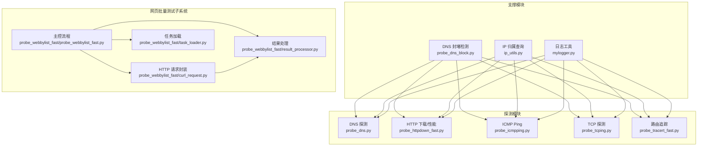
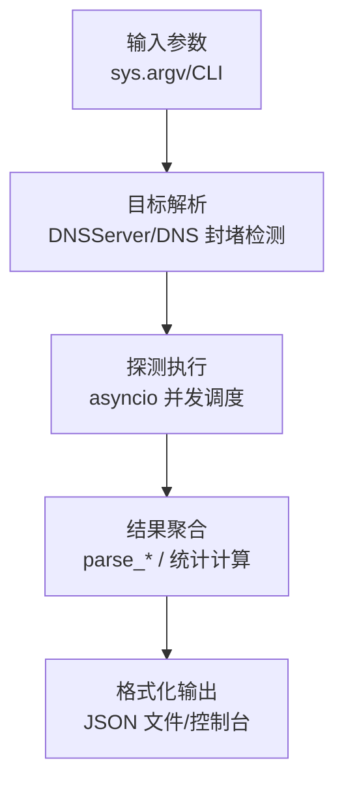
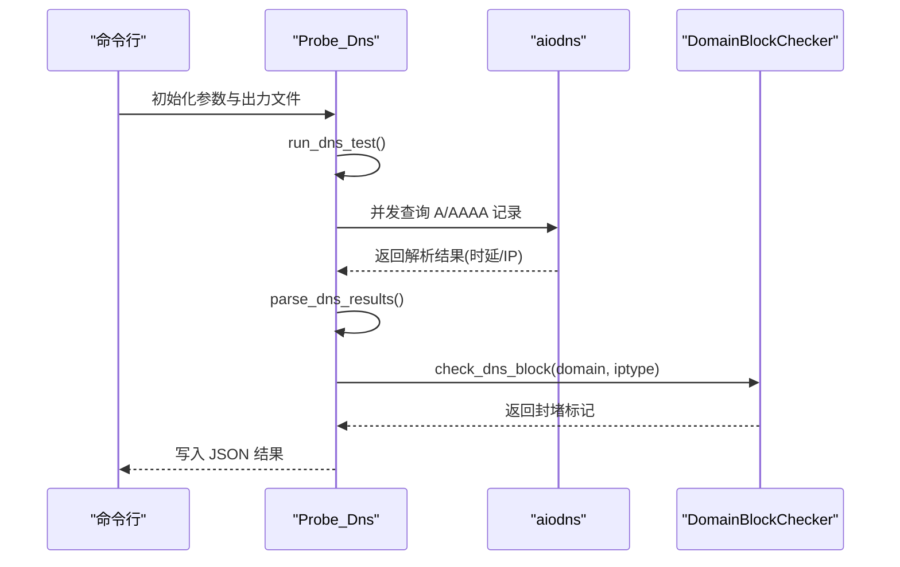
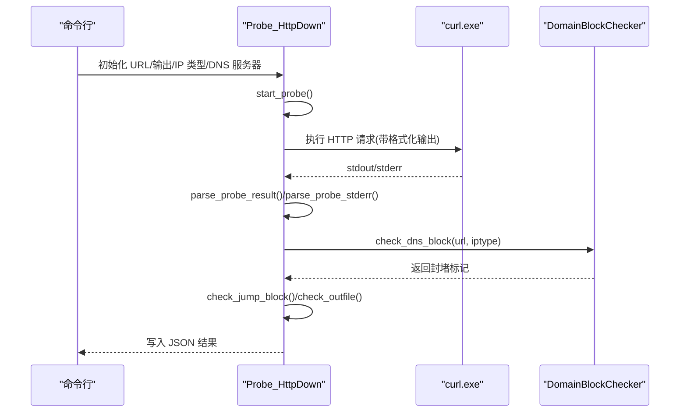
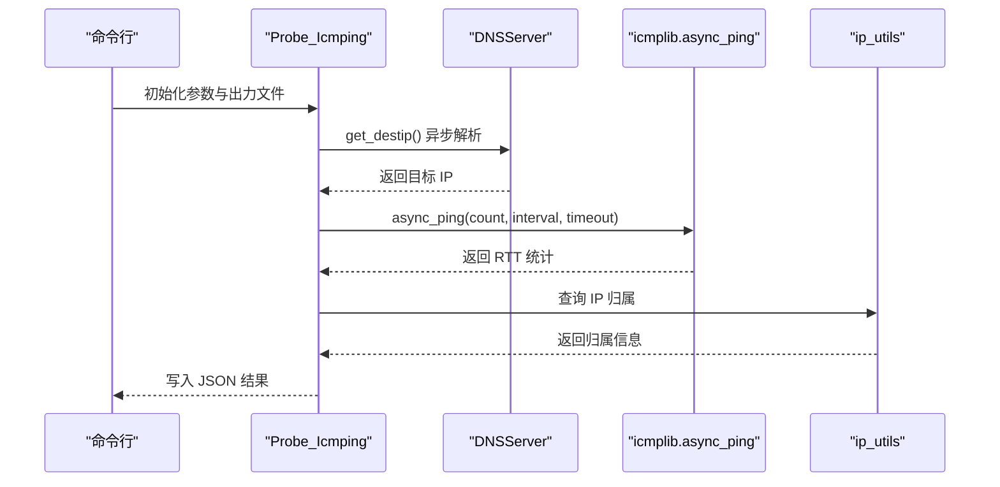
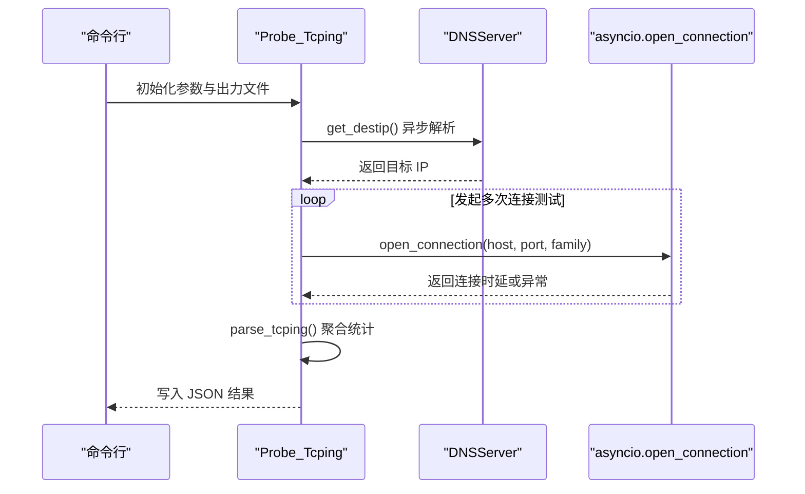
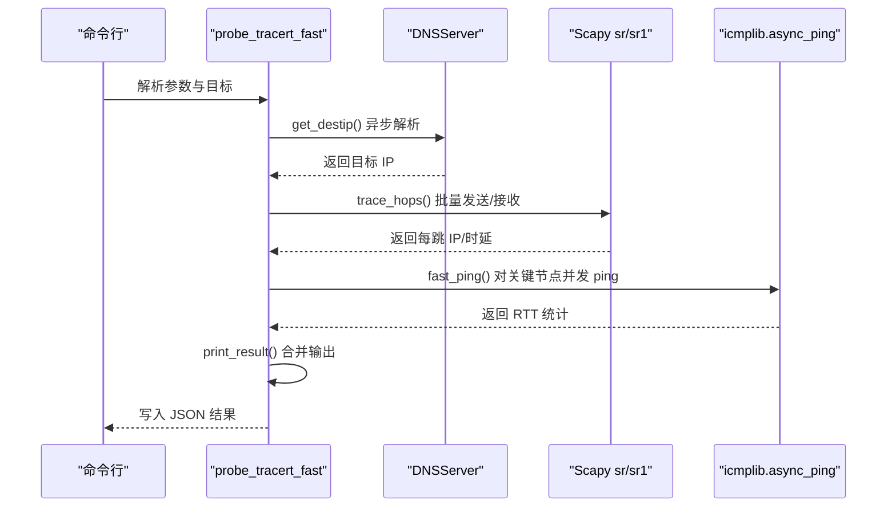
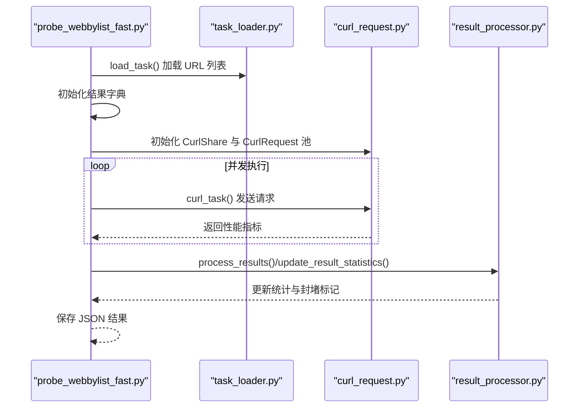
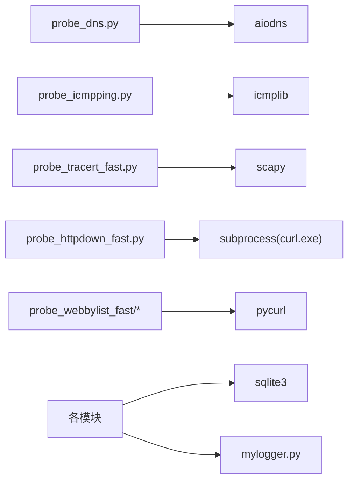
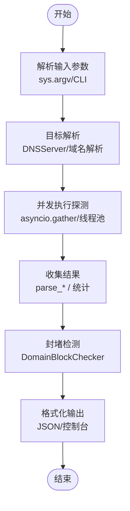

# 代码架构设计

<cite>
**本文档引用的文件**
- [probe_dns.py](file://probe_dns.py)
- [probe_httpdown_fast.py](file://probe_httpdown_fast.py)
- [probe_icmpping.py](file://probe_icmpping.py)
- [probe_tcping.py](file://probe_tcping.py)
- [probe_tracert_fast.py](file://probe_tracert_fast.py)
- [probe_dns_block.py](file://probe_dns_block.py)
- [ip_utils.py](file://ip_utils.py)
- [mylogger.py](file://mylogger.py)
- [probe_webbylist_fast\probe_webbylist_fast.py](file://probe_webbylist_fast\probe_webbylist_fast.py)
- [probe_webbylist_fast\curl_request.py](file://probe_webbylist_fast\curl_request.py)
- [probe_webbylist_fast\result_processor.py](file://probe_webbylist_fast\result_processor.py)
- [probe_webbylist_fast\task_loader.py](file://probe_webbylist_fast\task_loader.py)
- [main.spec](file://main.spec)
- [probe_webbylist_fast.spec](file://probe_webbylist_fast.spec)
</cite>

## 目录
1. [引言](#引言)
2. [项目结构](#项目结构)
3. [核心组件](#核心组件)
4. [架构总览](#架构总览)
5. [详细组件分析](#详细组件分析)
6. [依赖关系分析](#依赖关系分析)
7. [性能考量](#性能考量)
8. [故障排查指南](#故障排查指南)
9. [结论](#结论)
10. [附录](#附录)

## 引言
本项目是一套基于 Python 的网络探测工具集，涵盖 DNS 探测、HTTP 下载与页面性能评估、ICMP Ping、TCP 探测与路由追踪等能力。系统采用分层设计与模块化架构，结合 asyncio 实现高并发异步编程模式；在关键模块中引入 aiodns、icmplib、Scapy 等第三方库，分别满足异步 DNS 解析、异步 ICMP 测试与高性能路由追踪的需求。本文档将从整体架构、数据流、技术选型、扩展性设计等方面进行系统化阐述，帮助开发者快速理解并扩展该工具集。

## 项目结构
项目采用按功能模块划分的组织方式，核心探测模块独立封装为可复用类，统一通过命令行入口运行；同时提供面向网页批量子链接的性能测试子系统，采用线程池+连接共享的高性能 HTTP 请求框架。

**图表来源**
- [probe_dns.py](file://probe_dns.py)
- [probe_httpdown_fast.py](file://probe_httpdown_fast.py)
- [probe_icmpping.py](file://probe_icmpping.py)
- [probe_tcping.py](file://probe_tcping.py)
- [probe_tracert_fast.py](file://probe_tracert_fast.py)
- [probe_dns_block.py](file://probe_dns_block.py)
- [ip_utils.py](file://ip_utils.py)
- [mylogger.py](file://mylogger.py)
- [probe_webbylist_fast\probe_webbylist_fast.py](file://probe_webbylist_fast\probe_webbylist_fast.py)
- [probe_webbylist_fast\curl_request.py](file://probe_webbylist_fast\curl_request.py)
- [probe_webbylist_fast\result_processor.py](file://probe_webbylist_fast\result_processor.py)
- [probe_webbylist_fast\task_loader.py](file://probe_webbylist_fast\task_loader.py)

**章节来源**
- [probe_dns.py](file://probe_dns.py)
- [probe_httpdown_fast.py](file://probe_httpdown_fast.py)
- [probe_icmpping.py](file://probe_icmpping.py)
- [probe_tcping.py](file://probe_tcping.py)
- [probe_tracert_fast.py](file://probe_tracert_fast.py)
- [probe_dns_block.py](file://probe_dns_block.py)
- [ip_utils.py](file://ip_utils.py)
- [mylogger.py](file://mylogger.py)
- [probe_webbylist_fast\probe_webbylist_fast.py](file://probe_webbylist_fast\probe_webbylist_fast.py)
- [probe_webbylist_fast\curl_request.py](file://probe_webbylist_fast\curl_request.py)
- [probe_webbylist_fast\result_processor.py](file://probe_webbylist_fast\result_processor.py)
- [probe_webbylist_fast\task_loader.py](file://probe_webbylist_fast\task_loader.py)

## 核心组件
- 探测器类族：每个探测类型封装为独立类，负责参数校验、异步执行、结果聚合与落盘。
- DNS 封堵检测：统一的 DNSServer 与 DomainBlockChecker 提供异步 DNS 查询与封堵判定。
- IP 归属查询：ip_utils 提供 IPv4/IPv6 归属查询与统计。
- 日志系统：MyLogger 提供控制台与文件双通道、轮转策略的日志管理。
- 网页批量测试子系统：基于 pycurl 的连接共享、线程池调度与结果聚合流水线。

**章节来源**
- [probe_dns.py](file://probe_dns.py)
- [probe_httpdown_fast.py](file://probe_httpdown_fast.py)
- [probe_icmpping.py](file://probe_icmpping.py)
- [probe_tcping.py](file://probe_tcping.py)
- [probe_tracert_fast.py](file://probe_tracert_fast.py)
- [probe_dns_block.py](file://probe_dns_block.py)
- [ip_utils.py](file://ip_utils.py)
- [mylogger.py](file://mylogger.py)
- [probe_webbylist_fast\probe_webbylist_fast.py](file://probe_webbylist_fast\probe_webbylist_fast.py)
- [probe_webbylist_fast\curl_request.py](file://probe_webbylist_fast\curl_request.py)
- [probe_webbylist_fast\result_processor.py](file://probe_webbylist_fast\result_processor.py)
- [probe_webbylist_fast\task_loader.py](file://probe_webbylist_fast\task_loader.py)

## 架构总览
系统采用“模块化 + 异步 + 插件化配置”的设计：
- 分层设计：输入参数层 → 目标解析层 → 探测执行层 → 结果处理层 → 输出层。
- 异步编程：在 DNS、ICMP、HTTP 下载、路由追踪等模块广泛使用 asyncio，提升并发吞吐。
- 技术选型：aiodns（异步 DNS）、icmplib（异步 ICMP）、Scapy（高性能路由追踪）、pycurl（高性能 HTTP）。
- 扩展性：模块间通过清晰接口耦合，新增探测类型只需遵循现有类接口与结果格式规范。

[此图为概念性架构图，不直接映射具体源码文件，故无图表来源]

## 详细组件分析

### DNS 探测模块（Probe_Dns）
- 设计要点
  - 异步并发解析：使用 asyncio.Semaphore 控制并发，aiodns 并发查询 A/AAAA 记录。
  - 结果聚合：收集每次请求的解析时延与目标 IP，计算成功率、最短/最长/平均解析时间。
  - 封堵检测：根据协议类型与解析结果比对预设封堵 IP 列表，标记 dnsblock 字段。
- 关键流程

**图表来源**
- [probe_dns.py](file://probe_dns.py)
- [probe_dns_block.py](file://probe_dns_block.py)

**章节来源**
- [probe_dns.py](file://probe_dns.py)
- [probe_dns_block.py](file://probe_dns_block.py)

### HTTP 下载与性能评估（Probe_HttpDown）
- 设计要点
  - 基于 curl 命令行工具，通过 subprocess 调用，解析其输出与错误信息，提取各阶段时延与状态码。
  - 异步 DNS 封堵检测：在限定时间内异步执行封堵判定，避免阻塞主流程。
  - 结果判定：综合返回码、超时类型、重定向次数、响应体特征等，映射为统一错误码与成功标志。
- 关键流程

**图表来源**
- [probe_httpdown_fast.py](file://probe_httpdown_fast.py)
- [probe_dns_block.py](file://probe_dns_block.py)

**章节来源**
- [probe_httpdown_fast.py](file://probe_httpdown_fast.py)
- [probe_dns_block.py](file://probe_dns_block.py)

### ICMP Ping（Probe_Icmping）
- 设计要点
  - 异步解析目标 IP：若输入为域名，先通过 DNSServer 异步解析。
  - 使用 icmplib.async_ping 执行异步 ICMP 测试，聚合 min/max/avg/jitter/packet_loss 等指标。
  - IP 归属查询：解析完成后查询 IP 归属信息并写入结果。
- 关键流程

**图表来源**
- [probe_icmpping.py](file://probe_icmpping.py)
- [probe_dns_block.py](file://probe_dns_block.py)
- [ip_utils.py](file://ip_utils.py)

**章节来源**
- [probe_icmpping.py](file://probe_icmpping.py)
- [probe_dns_block.py](file://probe_dns_block.py)
- [ip_utils.py](file://ip_utils.py)

### TCP 探测（Probe_Tcping）
- 设计要点
  - 异步解析目标 IP：与 ICMP 类似，先解析再发起连接测试。
  - 使用 asyncio.open_connection 在指定地址族下建立连接，统计各次连接时延与丢包率。
  - 结果聚合：计算 min/max/avg/jitter 与 packet_loss_rate。
- 关键流程

**图表来源**
- [probe_tcping.py](file://probe_tcping.py)
- [probe_dns_block.py](file://probe_dns_block.py)

**章节来源**
- [probe_tcping.py](file://probe_tcping.py)
- [probe_dns_block.py](file://probe_dns_block.py)

### 路由追踪（Probe_TracerFast）
- 设计要点
  - 使用 Scapy 构造逐 TTL 增加的 ICMP/ICMPv6 包，批量发送并解析应答，提取每跳 IP 与往返时延。
  - 异步 ping 批处理：对部分中间节点进行并发 async_ping，加速路径评估。
  - 结果合并：将每跳信息与 ping 统计整合，输出结构化 JSON。
- 关键流程

**图表来源**
- [probe_tracert_fast.py](file://probe_tracert_fast.py)
- [probe_dns_block.py](file://probe_dns_block.py)

**章节来源**
- [probe_tracert_fast.py](file://probe_tracert_fast.py)
- [probe_dns_block.py](file://probe_dns_block.py)

### 网页批量测试子系统
- 设计要点
  - 主控流程：加载任务列表、初始化结果字典、创建 pycurl 共享对象与线程池。
  - 并发执行：线程池中每个工作线程从队列取出 CurlRequest 对象，执行 HTTP 请求并将结果放回队列。
  - 结果处理：主线程消费结果队列，更新统计信息，进行封堵检测与内容特征判断，最终输出 JSON。
- 关键流程

**图表来源**
- [probe_webbylist_fast\probe_webbylist_fast.py](file://probe_webbylist_fast\probe_webbylist_fast.py)
- [probe_webbylist_fast\task_loader.py](file://probe_webbylist_fast\task_loader.py)
- [probe_webbylist_fast\curl_request.py](file://probe_webbylist_fast\curl_request.py)
- [probe_webbylist_fast\result_processor.py](file://probe_webbylist_fast\result_processor.py)

**章节来源**
- [probe_webbylist_fast\probe_webbylist_fast.py](file://probe_webbylist_fast\probe_webbylist_fast.py)
- [probe_webbylist_fast\task_loader.py](file://probe_webbylist_fast\task_loader.py)
- [probe_webbylist_fast\curl_request.py](file://probe_webbylist_fast\curl_request.py)
- [probe_webbylist_fast\result_processor.py](file://probe_webbylist_fast\result_processor.py)

## 依赖关系分析
- 第三方库依赖
  - asyncio/aiodns：异步 DNS 解析与并发控制。
  - icmplib：异步 ICMP 测试。
  - Scapy：自定义构造与发送网络包，实现高效路由追踪。
  - pycurl：高性能 HTTP 请求，支持连接共享与回调。
  - sqlite3：IP 归属数据库查询。
- 模块内聚与耦合
  - 探测器类内部高度内聚，仅依赖支撑模块（DNS 封堵、IP 归属、日志）。
  - 网页批量测试子系统通过接口解耦：任务加载、HTTP 请求封装、结果处理三者职责清晰。
- 循环依赖
  - 未发现循环依赖，模块间单向依赖，符合分层设计。

**图表来源**
- [probe_dns.py](file://probe_dns.py)
- [probe_icmpping.py](file://probe_icmpping.py)
- [probe_tracert_fast.py](file://probe_tracert_fast.py)
- [probe_httpdown_fast.py](file://probe_httpdown_fast.py)
- [probe_webbylist_fast\probe_webbylist_fast.py](file://probe_webbylist_fast\probe_webbylist_fast.py)
- [mylogger.py](file://mylogger.py)

**章节来源**
- [probe_dns.py](file://probe_dns.py)
- [probe_icmpping.py](file://probe_icmpping.py)
- [probe_tracert_fast.py](file://probe_tracert_fast.py)
- [probe_httpdown_fast.py](file://probe_httpdown_fast.py)
- [probe_webbylist_fast\probe_webbylist_fast.py](file://probe_webbylist_fast\probe_webbylist_fast.py)
- [mylogger.py](file://mylogger.py)

## 性能考量
- 异步并发
  - DNS/ICMP/TCP/HTTP 下载均采用 asyncio.gather/并发任务，显著提升吞吐。
  - HTTP 批量测试使用线程池与 pycurl 共享对象，减少连接开销。
- 资源控制
  - 使用 asyncio.Semaphore 控制并发度，避免过度竞争。
  - 超时控制：各模块设置 per-request 与 total timeout，防止长时间阻塞。
- I/O 优化
  - pycurl 使用共享 Cookie/DNS/SSL Session，降低重复握手与 DNS 查询成本。
  - Scapy 批量 sr/sr1，减少系统调用次数。
- 数据库访问
  - SQLite 以只读 URI 方式连接，避免写锁影响；IP 查询走索引范围查询，减少扫描。

[本节为通用性能建议，无需列出章节来源]

## 故障排查指南
- DNS 解析失败
  - 现象：返回码映射为 1001 或 1008；目标 IP 被置为 0.0.0.0 或 ::。
  - 排查：确认本地 DNS 服务器配置、网络连通性；检查 DomainBlockChecker 的封堵规则。
- 连接超时/慢速
  - 现象：返回码映射为 1002/1005/1006；NAMELOOKUP/CONNECT/APPCONNECT 时间异常。
  - 排查：检查网络质量、防火墙策略、代理设置；调整超时参数。
- SSL 协商失败
  - 现象：返回码 1003；常见于证书验证关闭场景。
  - 排查：确认证书链与主机名匹配；必要时开启严格验证。
- 重定向过多
  - 现象：返回码 1007；最终指向异常 IP。
  - 排查：检查重定向链路与最终目标；必要时限制最大重定向数。
- 页面内容封堵
  - 现象：响应体包含特定关键字；标记为 1009。
  - 排查：核对响应体与封堵关键词库。

**章节来源**
- [probe_httpdown_fast.py](file://probe_httpdown_fast.py)
- [probe_webbylist_fast\result_processor.py](file://probe_webbylist_fast\result_processor.py)

## 结论
本项目通过模块化与异步编程实现了高并发网络探测能力，结合 aiocurl、icmplib、Scapy 等库在不同层面发挥各自优势。DNS 封堵检测与 IP 归属查询贯穿各模块，保证了结果的准确性与可解释性。整体架构清晰、扩展性强，便于后续新增探测类型与优化性能。

[本节为总结性内容，无需列出章节来源]

## 附录

### 数据流架构（输入-解析-执行-收集-输出）

[此图为概念性数据流图，不直接映射具体源码文件，故无图表来源]

### 技术选型说明
- asyncio：统一异步模型，简化并发控制与超时管理。
- aiodns：异步 DNS 解析，支持 AAAA/A 并发查询。
- icmplib：跨平台异步 ICMP，提供 min/max/avg/jitter/packet_loss。
- Scapy：灵活构造网络包，适合自定义路由追踪与诊断。
- pycurl：高性能 HTTP，支持连接共享、回调与多线程。
- sqlite3：轻量级数据库，用于 IP 归属查询。

[本节为通用说明，无需列出章节来源]

### 构建与打包
- 使用 PyInstaller 规划脚本生成可执行文件，便于部署与分发。
- main.spec 与 probe_webbylist_fast.spec 分别针对主程序与网页批量测试子系统。

**章节来源**
- [main.spec](file://main.spec)
- [probe_webbylist_fast.spec](file://probe_webbylist_fast.spec)