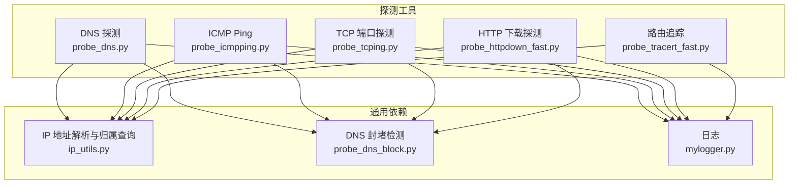
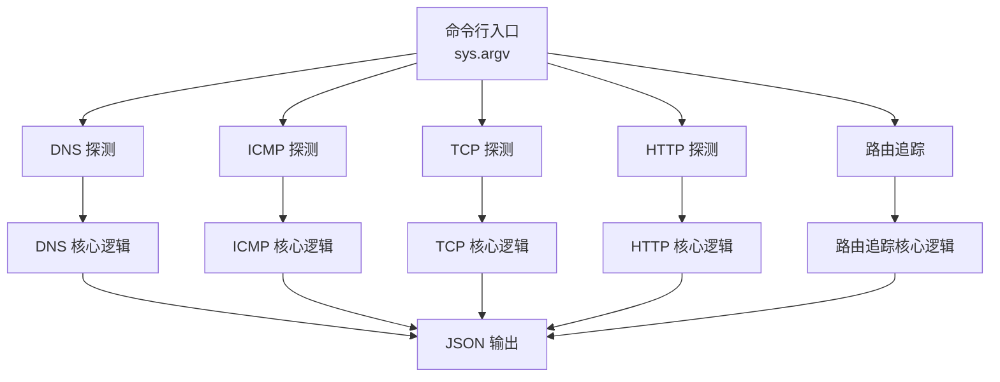
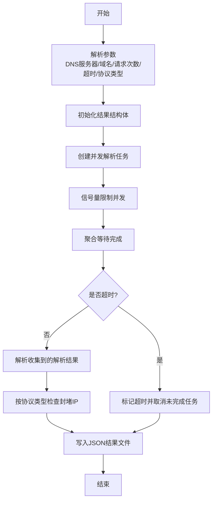
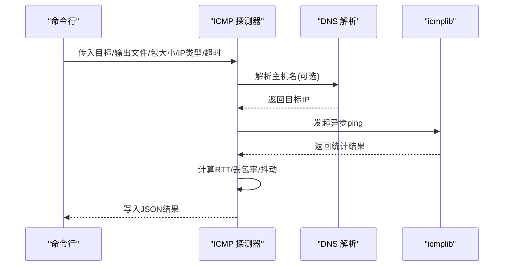
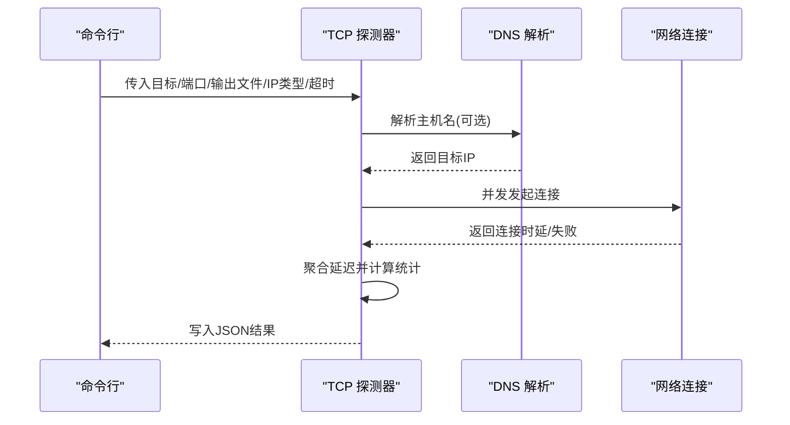
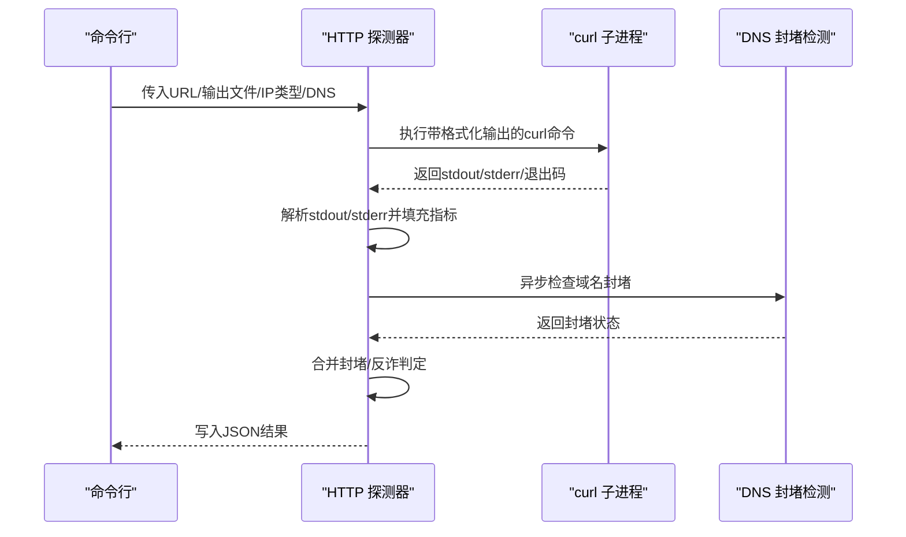
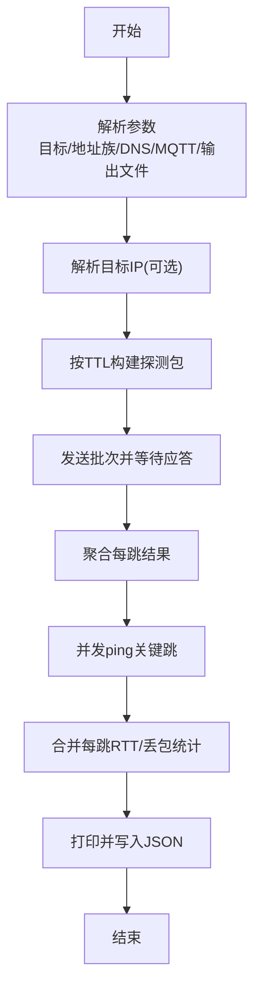
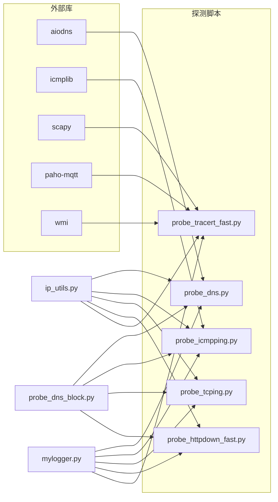

# 开发工作流程

<cite>
**本文引用的文件**
- [docs/QUICKSTART.md](file://docs/QUICKSTART.md)
- [pycurl-master/.github/CONTRIBUTING.md](file://pycurl-master/.github/CONTRIBUTING.md)
- [pycurl-master/README.rst](file://pycurl-master/README.rst)
- [pycurl-master/setup.py](file://pycurl-master/setup.py)
- [pycurl-master/requirements-dev.txt](file://pycurl-master/requirements-dev.txt)
- [probe_dns.py](file://probe_dns.py)
- [probe_icmpping.py](file://probe_icmpping.py)
- [probe_tcping.py](file://probe_tcping.py)
- [probe_httpdown_fast.py](file://probe_httpdown_fast.py)
- [probe_tracert_fast.py](file://probe_tracert_fast.py)
</cite>

## 目录
1. [简介](#简介)
2. [项目结构](#项目结构)
3. [核心组件](#核心组件)
4. [架构总览](#架构总览)
5. [详细组件分析](#详细组件分析)
6. [依赖关系分析](#依赖关系分析)
7. [性能考虑](#性能考虑)
8. [故障排查指南](#故障排查指南)
9. [结论](#结论)
10. [附录](#附录)

## 简介
本指南面向网络探测工具集的贡献者与维护者，系统阐述从环境搭建、代码贡献、规范与风格、版本与发布、代码审查、协作工具到常见开发场景的全流程实践。内容基于仓库中的实际文件与脚本，确保可落地、可复现。

## 项目结构
该项目包含多个独立的探测工具脚本，每个脚本封装了特定网络探测能力（DNS、ICMP、TCP、HTTP、路由追踪），并通过统一的JSON结果输出便于后续分析与集成。同时，仓库提供了快速开始文档与贡献指南，便于新成员快速上手。

图示来源
- [probe_dns.py](file://probe_dns.py)
- [probe_icmpping.py](file://probe_icmpping.py)
- [probe_tcping.py](file://probe_tcping.py)
- [probe_httpdown_fast.py](file://probe_httpdown_fast.py)
- [probe_tracert_fast.py](file://probe_tracert_fast.py)

章节来源
- [docs/QUICKSTART.md](file://docs/QUICKSTART.md)

## 核心组件
- DNS 探测：支持A/AAAA并发查询、超时控制、并发信号量限制、结果聚合与封堵检测。
- ICMP Ping：异步ping，统计RTT、丢包率、抖动，支持IPv4/IPv6。
- TCP 端口探测：异步建立连接，统计延迟分布与抖动，支持IPv4/IPv6。
- HTTP 下载探测：基于curl子进程采集多阶段耗时与响应信息，解析并判定成功与否。
- 路由追踪：Scapy构造ICMP/ICMPv6 Echo请求，结合异步ping与并发批处理，输出每跳信息。

章节来源
- [probe_dns.py](file://probe_dns.py)
- [probe_icmpping.py](file://probe_icmpping.py)
- [probe_tcping.py](file://probe_tcping.py)
- [probe_httpdown_fast.py](file://probe_httpdown_fast.py)
- [probe_tracert_fast.py](file://probe_tracert_fast.py)

## 架构总览
整体采用“工具脚本 + 通用模块 + 结果输出”的分层设计。各探测工具通过统一的参数入口与JSON输出，便于自动化编排与结果分析；通用模块（IP解析、封堵检测、日志）在多工具间复用。

图示来源
- [probe_dns.py](file://probe_dns.py)
- [probe_icmpping.py](file://probe_icmpping.py)
- [probe_tcping.py](file://probe_tcping.py)
- [probe_httpdown_fast.py](file://probe_httpdown_fast.py)
- [probe_tracert_fast.py](file://probe_tracert_fast.py)

## 详细组件分析

### DNS 探测组件
- 关键特性
  - 支持协议类型选择（IPv4/IPv6/双栈），并发查询A/AAAA记录。
  - 通过信号量限制并发，设置总超时，避免资源占用过高。
  - 统计最小/最大/平均解析时间与成功率，聚合所有解析到的IP。
  - 对解析到的IP进行封堵检测（针对特定IP段）。
- 数据流与处理逻辑

图示来源
- [probe_dns.py](file://probe_dns.py)

章节来源
- [probe_dns.py](file://probe_dns.py)

### ICMP Ping 组件
- 关键特性
  - 异步ping，统计min/max/avg RTT、丢包率、抖动。
  - 支持IPv4/IPv6，自动解析目标IP或使用本地DNS服务器。
  - 解析失败与超时分别映射到不同错误码。
- 数据流与处理逻辑

图示来源
- [probe_icmpping.py](file://probe_icmpping.py)

章节来源
- [probe_icmpping.py](file://probe_icmpping.py)

### TCP 端口探测组件
- 关键特性
  - 异步建立TCP连接，统计延迟分布与抖动。
  - 支持IPv4/IPv6，解析失败与超时映射到错误码。
  - 成功计数与包丢失率计算。
- 数据流与处理逻辑

图示来源
- [probe_tcping.py](file://probe_tcping.py)

章节来源
- [probe_tcping.py](file://probe_tcping.py)

### HTTP 下载探测组件
- 关键特性
  - 基于curl子进程捕获多阶段耗时（DNS/TCP/SSL/首字节/下载等）。
  - 解析stdout/stderr，填充结果字典，判定成功与否。
  - 支持IPv4/IPv6与自定义DNS服务器，内置封堵与反诈检测。
- 数据流与处理逻辑

图示来源
- [probe_httpdown_fast.py](file://probe_httpdown_fast.py)

章节来源
- [probe_httpdown_fast.py](file://probe_httpdown_fast.py)

### 路由追踪组件
- 关键特性
  - Scapy构造ICMP/ICMPv6 Echo请求，按TTL递增探测每跳。
  - 并发批处理ping辅助统计每跳RTT与丢包。
  - 支持MQTT上报与结果文件输出。
- 数据流与处理逻辑

图示来源
- [probe_tracert_fast.py](file://probe_tracert_fast.py)

章节来源
- [probe_tracert_fast.py](file://probe_tracert_fast.py)

## 依赖关系分析
- 工具脚本依赖
  - DNS/ICMP/TCP/HTTP/路由追踪均依赖IP解析与归属查询模块、封堵检测模块与日志模块。
- 外部依赖
  - DNS：aiodns
  - ICMP：icmplib
  - TCP/HTTP：Python标准库与系统curl
  - 路由追踪：Scapy、paho-mqtt、wmi（Windows）
- 开发依赖（来自项目）
  - pytest、sphinx、pyflakes、setuptools 等

图示来源
- [probe_dns.py](file://probe_dns.py)
- [probe_icmpping.py](file://probe_icmpping.py)
- [probe_tcping.py](file://probe_tcping.py)
- [probe_httpdown_fast.py](file://probe_httpdown_fast.py)
- [probe_tracert_fast.py](file://probe_tracert_fast.py)

章节来源
- [pycurl-master/requirements-dev.txt](file://pycurl-master/requirements-dev.txt)

## 性能考虑
- 并发与限流
  - DNS并发查询通过信号量限制，避免DNS服务器过载与自身资源争用。
  - HTTP与路由追踪采用批处理与并发ping，缩短总耗时。
- 超时与健壮性
  - 各组件均设置单次与总超时，超时后及时取消未完成任务并标记错误码。
- I/O与解析
  - 使用异步库减少阻塞；对结果进行聚合统计，避免重复计算。
- 系统依赖
  - HTTP探测依赖系统curl，建议在目标平台预置可用版本以保证稳定性。

[本节为通用指导，不直接分析具体文件]

## 故障排查指南
- 常见问题定位
  - 缺少依赖：根据快速开始文档安装缺失模块（如aiodns、icmplib、scapy、paho-mqtt、wmi）。
  - 权限不足：Windows下部分功能需管理员权限。
  - IPv6支持：通过参数将IP类型设为6。
  - 自定义DNS：在命令末尾追加DNS服务器IP。
- 错误码与状态
  - HTTP探测将curl返回码映射为业务错误码（如DNS解析失败、TCP连接失败、SSL握手失败、超时、重定向过多、URL格式错误、反诈命中等），便于快速定位。
- 日志与输出
  - 各工具均输出JSON结果文件，便于批量分析与二次处理。

章节来源
- [docs/QUICKSTART.md](file://docs/QUICKSTART.md)
- [probe_httpdown_fast.py](file://probe_httpdown_fast.py)

## 结论
本指南梳理了网络探测工具集的开发工作流程与最佳实践，涵盖环境搭建、代码贡献、规范与风格、版本与发布、代码审查、协作工具及常见场景处理。建议在实际开发中遵循统一的参数与输出规范，保持模块化与可测试性，持续完善文档与错误码体系。

[本节为总结性内容，不直接分析具体文件]

## 附录

### 开发环境搭建（基于快速开始）
- Python 版本要求：3.7及以上
- 虚拟环境：推荐使用 venv 创建隔离环境并激活
- 依赖安装：安装 aiodns、icmplib、scapy、paho-mqtt、wmi
- 快速验证：参考快速开始文档中的示例命令运行首个测试

章节来源
- [docs/QUICKSTART.md](file://docs/QUICKSTART.md)

### 代码贡献流程（基于贡献指南）
- Fork 项目并在 master 分支上创建功能分支
- 编写代码与测试，提交并推送
- 发起 Pull Request，关注CI测试结果
- 较大变更建议先邮件列表讨论

章节来源
- [pycurl-master/.github/CONTRIBUTING.md](file://pycurl-master/.github/CONTRIBUTING.md)
- [pycurl-master/README.rst](file://pycurl-master/README.rst)

### 代码规范与风格（建议）
- 命名约定
  - 模块与函数：使用下划线命名法（如 probe_dns.py、run_dns_test）
  - 类：使用帕斯卡命名法（如 Probe_Dns、Probe_Icmping）
- 注释与文档
  - 函数/类添加简要说明，参数与返回值清晰标注
  - 复杂逻辑处补充注释，解释关键决策点
- 输出与日志
  - 统一使用JSON输出，字段语义明确，便于下游消费
  - 使用 mylogger.py 提供一致的日志接口

[本节为通用规范建议，不直接分析具体文件]

### 版本管理与发布（建议）
- 标签管理
  - 重要里程碑打标签，配合变更日志说明
- 版本号规则
  - 采用语义化版本（主.次.修订），兼容性破坏时提升主版本
- 发布说明
  - 概述新增功能、修复问题与已知限制，附变更日志链接

[本节为通用流程建议，不直接分析具体文件]

### 代码审查（建议清单）
- 功能正确性：参数校验、边界条件、异常处理
- 性能与资源：并发度、超时、内存与CPU占用
- 可测试性：单元测试覆盖关键路径，模拟外部依赖
- 文档与注释：接口文档、错误码说明、使用示例
- 兼容性：跨平台（Windows/Linux）行为一致性

[本节为通用流程建议，不直接分析具体文件]

### 项目管理与协作（建议）
- Issue 跟踪：按类型分类（Bug/Feature/Task），明确优先级与截止日期
- 任务分配：按模块与技能分工，定期同步进展
- 进度监控：通过里程碑与PR状态跟踪交付节奏

[本节为通用协作建议，不直接分析具体文件]

### 常见开发场景
- 冲突解决：优先基于功能分支进行变更，必要时rebase或merge
- 重构策略：保持对外接口稳定，逐步替换内部实现
- 性能优化：识别瓶颈（DNS/网络/解析），引入缓存与并发批处理

[本节为通用指导，不直接分析具体文件]

### 新贡献者资源
- 快速开始：参阅快速开始文档完成首次运行
- 贡献指南：遵循Fork/分支/Pull Request流程
- 社区支持：通过邮件列表或Issue寻求帮助

章节来源
- [docs/QUICKSTART.md](file://docs/QUICKSTART.md)
- [pycurl-master/.github/CONTRIBUTING.md](file://pycurl-master/.github/CONTRIBUTING.md)
- [pycurl-master/README.rst](file://pycurl-master/README.rst)