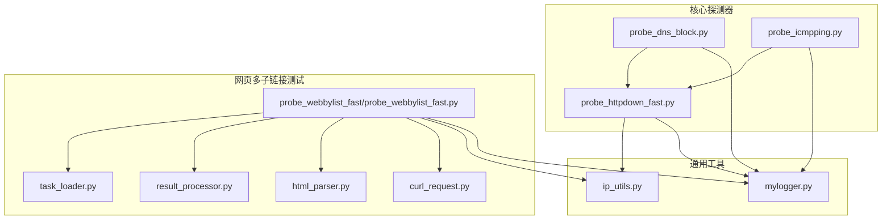
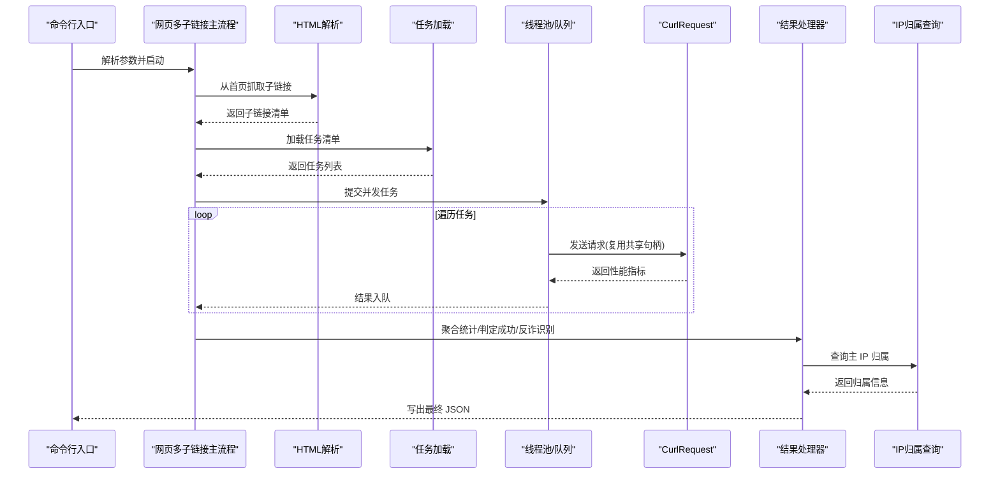
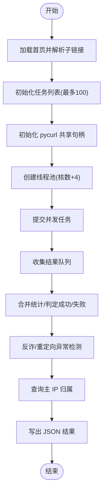
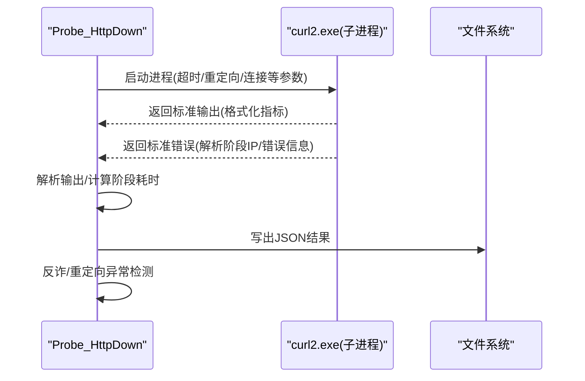
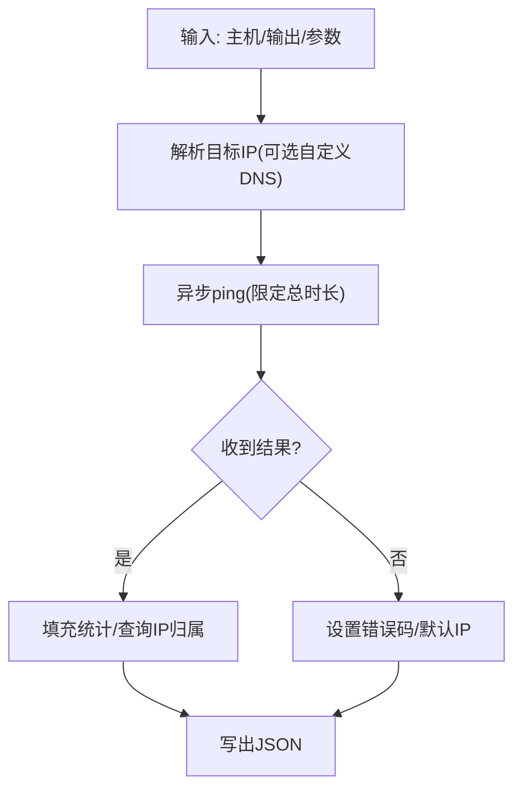
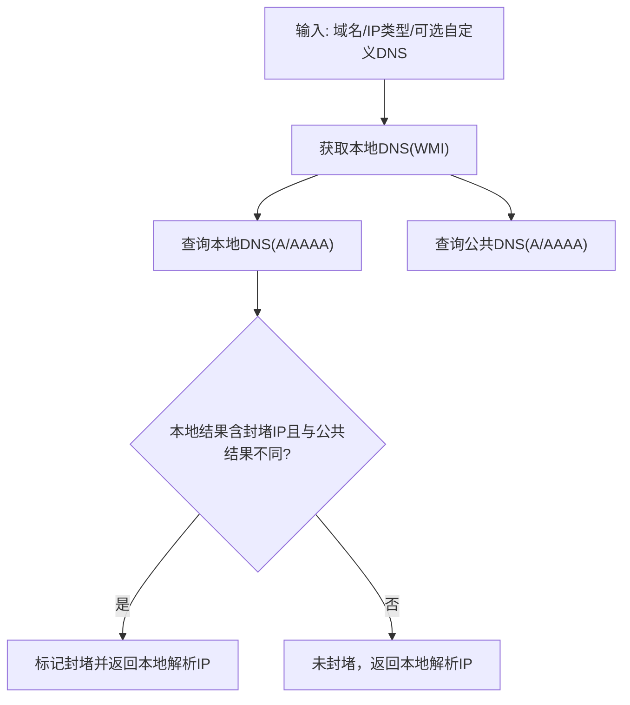
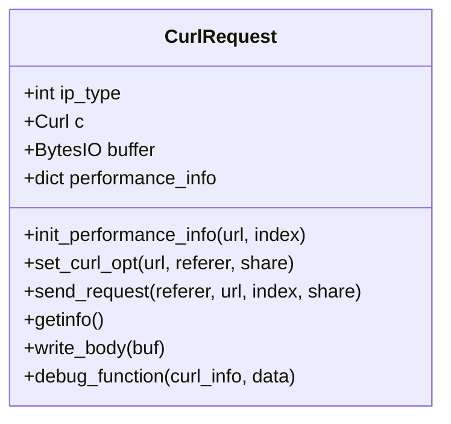
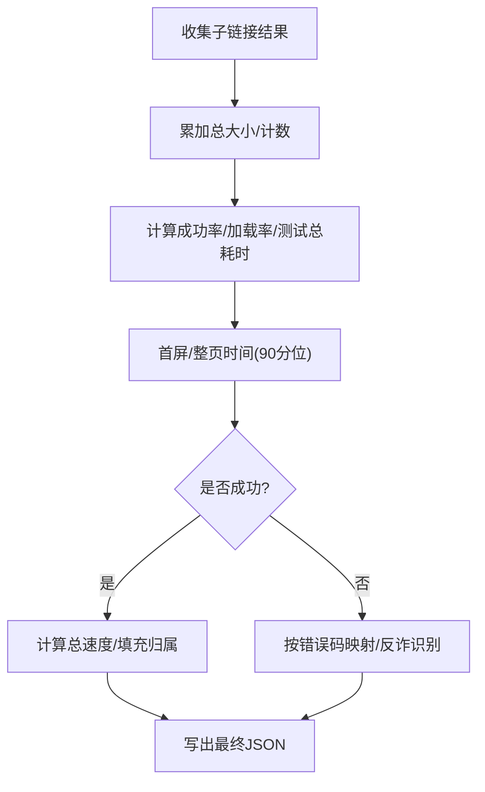
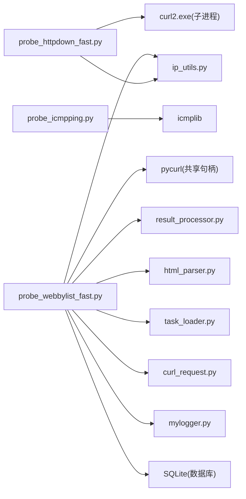

# 开发者指南

<cite>
**本文引用的文件**
- [README.md](file://README.md)
- [probe_webbylist_fast\probe_webbylist_fast.py](file://probe_webbylist_fast/probe_webbylist_fast.py)
- [probe_httpdown_fast.py](file://probe_httpdown_fast.py)
- [probe_dns_block.py](file://probe_dns_block.py)
- [probe_icmpping.py](file://probe_icmpping.py)
- [probe_webbylist_fast\task_loader.py](file://probe_webbylist_fast/task_loader.py)
- [probe_webbylist_fast\result_processor.py](file://probe_webbylist_fast/result_processor.py)
- [probe_webbylist_fast\html_parser.py](file://probe_webbylist_fast/html_parser.py)
- [probe_webbylist_fast\curl_request.py](file://probe_webbylist_fast/curl_request.py)
- [ip_utils.py](file://ip_utils.py)
- [mylogger.py](file://mylogger.py)
</cite>

## 目录
1. [简介](#简介)
2. [项目结构](#项目结构)
3. [核心组件](#核心组件)
4. [架构总览](#架构总览)
5. [详细组件分析](#详细组件分析)
6. [依赖关系分析](#依赖关系分析)
7. [性能考量](#性能考量)
8. [故障排查指南](#故障排查指南)
9. [结论](#结论)
10. [附录](#附录)

## 简介
本指南面向希望参与或扩展网络探测工具集的开发者，系统阐述项目的模块化设计、异步编程实践与组件解耦策略；提供新增探测功能与自定义配置的扩展方法；总结测试策略与最佳实践；明确代码贡献流程与规范；给出调试与开发环境搭建建议；介绍工具链与构建流程；并为有经验的开发者提供深度定制与二次开发的技术指导。

## 项目结构
项目采用按功能模块划分的扁平结构，核心探测器独立成文件，共享通用工具模块（日志、IP归属查询、DNS封堵检测）。网页多子链接测试模块位于独立子目录，体现清晰的职责分离与可复用性。

图示来源
- [probe_webbylist_fast/probe_webbylist_fast.py:1-222](file://probe_webbylist_fast/probe_webbylist_fast.py#L1-L222)
- [probe_httpdown_fast.py:1-479](file://probe_httpdown_fast.py#L1-L479)
- [probe_dns_block.py:1-230](file://probe_dns_block.py#L1-L230)
- [probe_icmpping.py:1-155](file://probe_icmpping.py#L1-L155)
- [probe_webbylist_fast/task_loader.py:1-12](file://probe_webbylist_fast/task_loader.py#L1-L12)
- [probe_webbylist_fast/result_processor.py:1-269](file://probe_webbylist_fast/result_processor.py#L1-L269)
- [probe_webbylist_fast/html_parser.py:1-78](file://probe_webbylist_fast/html_parser.py#L1-L78)
- [probe_webbylist_fast/curl_request.py:1-194](file://probe_webbylist_fast/curl_request.py#L1-L194)
- [ip_utils.py:1-235](file://ip_utils.py#L1-L235)
- [mylogger.py:1-59](file://mylogger.py#L1-L59)

章节来源
- [README.md:67-83](file://README.md#L67-L83)

## 核心组件
- 异步 DNS 封堵检测与解析：DomainBlockChecker 与 DNSServer 提供对本地与公共 DNS 的对比查询，识别封堵风险并返回解析结果。
- ICMP Ping 探测：Probe_Icmping 基于 icmplib 异步 ping，聚合丢包率、RTT 统计与抖动，并查询 IP 归属。
- HTTP 下载测试：Probe_HttpDown 通过外部 curl2.exe 执行 HTTP 请求，解析时间分解与错误码映射，识别反诈网站与重定向异常。
- 网页多子链接测试：probe_webbylist_fast 主流程结合 HTML 解析、任务加载、并发 pycurl 请求、结果聚合与 IP 归属查询，形成完整的页面性能画像。
- 通用工具：ip_utils 提供 SQLite 查询 IP 归属；mylogger 提供带轮转的日志记录。

章节来源
- [probe_dns_block.py:59-211](file://probe_dns_block.py#L59-L211)
- [probe_icmpping.py:19-124](file://probe_icmpping.py#L19-L124)
- [probe_httpdown_fast.py:13-420](file://probe_httpdown_fast.py#L13-L420)
- [probe_webbylist_fast/probe_webbylist_fast.py:180-196](file://probe_webbylist_fast/probe_webbylist_fast.py#L180-L196)
- [ip_utils.py:6-235](file://ip_utils.py#L6-L235)
- [mylogger.py:7-59](file://mylogger.py#L7-L59)

## 架构总览
系统采用“探测器 + 工具层 + 并发调度”的分层架构：
- 探测器层：各功能独立实现，统一输出结构化 JSON 结果。
- 工具层：DNS 封堵检测、IP 归属查询、日志记录等通用能力。
- 并发调度层：网页多子链接测试通过线程池与队列实现并发与资源共享；HTTP 下载测试通过子进程调用外部工具并解析输出。

图示来源
- [probe_webbylist_fast/probe_webbylist_fast.py:102-178](file://probe_webbylist_fast/probe_webbylist_fast.py#L102-L178)
- [probe_webbylist_fast/html_parser.py:11-78](file://probe_webbylist_fast/html_parser.py#L11-L78)
- [probe_webbylist_fast/task_loader.py:1-12](file://probe_webbylist_fast/task_loader.py#L1-L12)
- [probe_webbylist_fast/curl_request.py:130-155](file://probe_webbylist_fast/curl_request.py#L130-L155)
- [probe_webbylist_fast/result_processor.py:65-147](file://probe_webbylist_fast/result_processor.py#L65-L147)
- [ip_utils.py:170-186](file://ip_utils.py#L170-L186)

## 详细组件分析

### 网页多子链接测试主流程
- 任务初始化：根据首页 URL 生成任务列表，首个 URL 作为 referer，最多处理 100 个子链接。
- 并发执行：基于 CPU 核心数 + 4 的线程池，每个线程持有 pycurl 共享句柄，减少 DNS 与会话开销。
- 结果收集：使用队列收集结果，主线程汇总统计、判定成功/失败、反诈识别与内容体识别。
- IP 归属：对主 IP 与子链接进行归属查询，输出运营商、省、市等信息。

图示来源
- [probe_webbylist_fast/probe_webbylist_fast.py:22-38](file://probe_webbylist_fast/probe_webbylist_fast.py#L22-L38)
- [probe_webbylist_fast/probe_webbylist_fast.py:102-178](file://probe_webbylist_fast/probe_webbylist_fast.py#L102-L178)
- [probe_webbylist_fast/result_processor.py:65-147](file://probe_webbylist_fast/result_processor.py#L65-L147)
- [ip_utils.py:170-186](file://ip_utils.py#L170-L186)

章节来源
- [probe_webbylist_fast/probe_webbylist_fast.py:180-196](file://probe_webbylist_fast/probe_webbylist_fast.py#L180-L196)
- [probe_webbylist_fast/probe_webbylist_fast.py:102-178](file://probe_webbylist_fast/probe_webbylist_fast.py#L102-L178)

### HTTP 下载测试（外部工具驱动）
- 子进程调用 curl2.exe，使用格式化输出模板提取关键时间与指标。
- 解析 stderr 以识别解析阶段的 IP；解析 stdout 以填充各阶段耗时与下载指标。
- 错误码映射：将外部工具返回码映射为内部语义化错误码，识别 DNS/连接/SSL/超时/重定向等异常。
- 反诈识别：检查响应体是否包含特定关键词，或命中已知反诈 IP。

图示来源
- [probe_httpdown_fast.py:329-420](file://probe_httpdown_fast.py#L329-L420)
- [probe_httpdown_fast.py:216-311](file://probe_httpdown_fast.py#L216-L311)
- [probe_httpdown_fast.py:52-84](file://probe_httpdown_fast.py#L52-L84)

章节来源
- [probe_httpdown_fast.py:13-420](file://probe_httpdown_fast.py#L13-L420)

### ICMP Ping 探测
- 支持 IPv4/IPv6，先尝试 DNS 解析目标地址，再发起异步 ping。
- 统计 min/max/avg/丢包率/抖动，写入 JSON 文件。
- 若解析失败或超时，设置相应错误码与默认 IP。

图示来源
- [probe_icmpping.py:58-104](file://probe_icmpping.py#L58-L104)
- [probe_icmpping.py:107-124](file://probe_icmpping.py#L107-L124)

章节来源
- [probe_icmpping.py:19-124](file://probe_icmpping.py#L19-L124)

### DNS 封堵检测
- 通过 WMI 获取本地 DNS 列表；对比本地与公共 DNS 的解析结果。
- 对比封堵 IP 列表，判断是否被运营商封堵；支持 IPv4/IPv6 双栈。

图示来源
- [probe_dns_block.py:135-211](file://probe_dns_block.py#L135-L211)

章节来源
- [probe_dns_block.py:59-211](file://probe_dns_block.py#L59-L211)

### pycurl 请求封装
- 支持 IPv4/IPv6 解析选择、自定义 DNS、共享句柄复用、调试回调解析 primary_ip。
- perform 后读取各阶段时间与 HTTP 状态，填充性能指标。

图示来源
- [probe_webbylist_fast/curl_request.py:9-194](file://probe_webbylist_fast/curl_request.py#L9-L194)

章节来源
- [probe_webbylist_fast/curl_request.py:9-194](file://probe_webbylist_fast/curl_request.py#L9-L194)

### 结果处理与统计
- 初始化主结果结构，聚合子链接总大小、成功率、请求量与加载速率。
- 计算首屏与整页时间（90 分位），识别反诈与异常重定向。
- 填充 IP 归属信息，区分本网/异网/空等维度。

图示来源
- [probe_webbylist_fast/result_processor.py:25-147](file://probe_webbylist_fast/result_processor.py#L25-L147)
- [probe_webbylist_fast/result_processor.py:206-269](file://probe_webbylist_fast/result_processor.py#L206-L269)

章节来源
- [probe_webbylist_fast/result_processor.py:1-269](file://probe_webbylist_fast/result_processor.py#L1-L269)

## 依赖关系分析
- 探测器之间低耦合：DNS 封堵检测可被任意探测器复用；IP 归属查询独立于具体探测器。
- 并发与资源共享：网页多子链接测试通过 pycurl 共享句柄降低 DNS 与 SSL 会话成本；线程池与队列实现任务并发与结果收集。
- 外部工具依赖：HTTP 下载测试依赖 curl2.exe；ICMP 依赖 icmplib；DNS 依赖 aiodns；WMI 用于获取本地 DNS。

图示来源
- [probe_httpdown_fast.py:364-381](file://probe_httpdown_fast.py#L364-L381)
- [probe_icmpping.py:13-17](file://probe_icmpping.py#L13-L17)
- [probe_webbylist_fast/probe_webbylist_fast.py:107-116](file://probe_webbylist_fast/probe_webbylist_fast.py#L107-L116)
- [probe_webbylist_fast/curl_request.py:12-17](file://probe_webbylist_fast/curl_request.py#L12-L17)
- [ip_utils.py:23-31](file://ip_utils.py#L23-L31)

章节来源
- [README.md:56-66](file://README.md#L56-L66)

## 性能考量
- 异步与并发
  - 使用 asyncio 实现高并发探测，减少阻塞等待。
  - 网页多子链接测试通过线程池与队列控制并发度，避免资源争用。
- 资源复用
  - pycurl 共享句柄复用 DNS 与 SSL 会话，显著降低重复握手与解析开销。
- I/O 与解析
  - HTTP 下载测试通过格式化输出与正则解析，避免复杂解析器带来的额外开销。
- 超时与限流
  - 各探测器设置合理超时与最大重定向次数，防止长时间阻塞。
- 数据库访问
  - SQLite 以只读 URI 方式连接，减少锁竞争；IP 查询按需执行，避免重复查询。

[本节为通用性能讨论，不直接分析具体文件]

## 故障排查指南
- 日志定位
  - 使用 MyLogger 输出到控制台与轮转文件，便于定位并发与异常。
- 常见问题
  - DNS 解析失败：检查本地 DNS 获取（WMI）与自定义 DNS 参数；确认 DomainBlockChecker 的封堵判定。
  - HTTP 下载异常：查看错误码映射与响应体关键词识别；确认 curl2.exe 路径与参数。
  - ICMP 失败：检查主机名解析与 IPv4/IPv6 类型；关注超时与错误码。
  - pycurl 共享句柄：确保在并发场景下正确设置与释放共享句柄。
- 调试建议
  - 在关键路径增加日志级别与时间戳，观察各阶段耗时。
  - 对外部工具调用增加超时与异常捕获，避免卡死。

章节来源
- [mylogger.py:7-59](file://mylogger.py#L7-L59)
- [probe_dns_block.py:104-134](file://probe_dns_block.py#L104-L134)
- [probe_httpdown_fast.py:387-419](file://probe_httpdown_fast.py#L387-L419)
- [probe_icmpping.py:79-99](file://probe_icmpping.py#L79-L99)
- [probe_webbylist_fast/curl_request.py:130-155](file://probe_webbylist_fast/curl_request.py#L130-L155)

## 结论
该项目通过模块化与异步并发实现了高效的网络探测能力，工具层与探测器层解耦良好，便于扩展与维护。建议在新增探测器时遵循现有结构与命名约定，充分利用共享句柄与日志工具，确保结果一致性与可观测性。

[本节为总结，不直接分析具体文件]

## 附录

### 扩展开发指南
- 新增探测器
  - 参考现有探测器的类结构与参数约定，统一输出 JSON 字段。
  - 如涉及 DNS，优先复用 DomainBlockChecker；如涉及 IP 归属，使用 ip_utils。
  - 如需并发，参考网页多子链接测试的线程池与队列模式。
- 自定义配置
  - 在命令行参数中新增选项，保持与现有参数风格一致。
  - 对外部工具参数，集中在一个配置区，便于维护与调试。
- 结果标准化
  - 统一错误码映射与字段命名，便于上层聚合与展示。

章节来源
- [probe_webbylist_fast/probe_webbylist_fast.py:198-222](file://probe_webbylist_fast/probe_webbylist_fast.py#L198-L222)
- [probe_httpdown_fast.py:431-479](file://probe_httpdown_fast.py#L431-L479)
- [probe_icmpping.py:125-155](file://probe_icmpping.py#L125-L155)

### 测试策略与最佳实践
- 单元测试
  - 对独立函数（如 URL 解析、错误码映射、IP 归属查询）编写小而精的测试用例。
- 集成测试
  - 模拟真实网络环境，验证多探测器组合流程与结果一致性。
- 性能测试
  - 使用不同并发度与任务规模评估吞吐与延迟；关注 pycurl 共享句柄的收益。
- 回归测试
  - 对关键路径（DNS 封堵、反诈识别、重定向处理）建立回归用例。

[本节为通用测试建议，不直接分析具体文件]

### 代码贡献流程与规范
- 提交前检查
  - 代码风格符合项目既有模式；新增功能附带必要注释与日志。
- 文档与变更
  - 更新相关 README 与 API 文档；记录行为变更与配置项新增。
- 版本管理
  - 使用语义化版本；在 README 中记录版本与更新日期。

[本节为通用流程建议，不直接分析具体文件]

### 调试与开发环境搭建
- IDE 配置
  - 使用断点在关键异步函数与并发入口处；对 pycurl 的 perform 与 getinfo 增加日志。
- 断点调试
  - 在 probe_webbylist_fast 的并发提交与结果收集处设置断点，观察队列状态。
- 性能分析
  - 关注 DNS 与 SSL 会话复用带来的性能提升；对慢查询与慢响应进行采样分析。

[本节为通用调试建议，不直接分析具体文件]

### 工具链与构建流程
- 依赖管理
  - 使用 requirements.txt（若存在）或 setup.py 定义依赖；pycurl 通过外部 wheel/源码构建。
- 构建与打包
  - 使用 PyInstaller（.spec 文件）将探测器与工具打包为可执行文件；注意将 curl2.exe 与数据库文件一并打包。
- 运行与验证
  - 在 Windows 环境下运行，确保 WMI 可用与 DNS 解析正常。

[本节为通用工具链说明，不直接分析具体文件]

### 架构演进与规划
- 当前演进
  - 从单一探测器向多探测器与多子链接测试演进，增强页面级性能画像能力。
- 未来规划
  - 增强可视化与报告生成功能；引入更多探测协议（如 QUIC/TLS 1.3）；优化数据库查询与缓存策略；完善自动化测试与 CI/CD 流水线。

[本节为概念性演进说明，不直接分析具体文件]