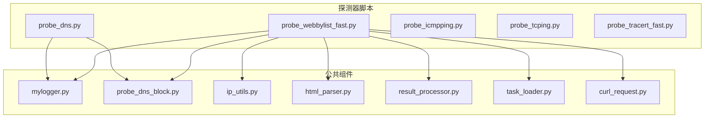
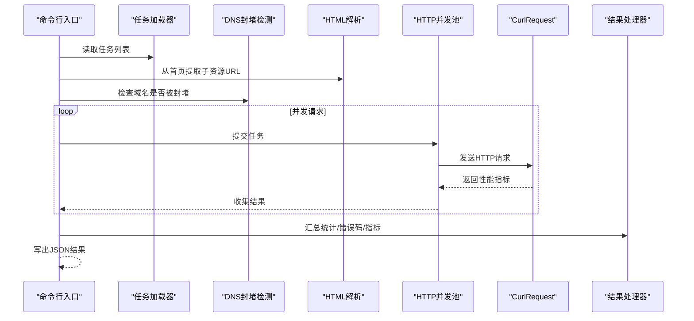
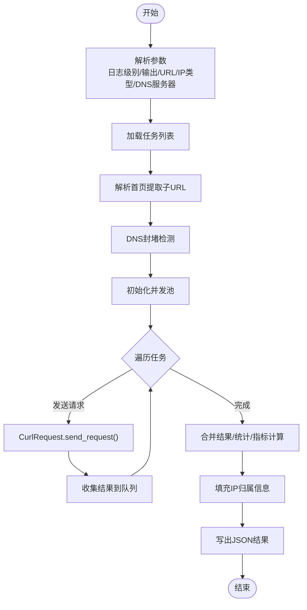
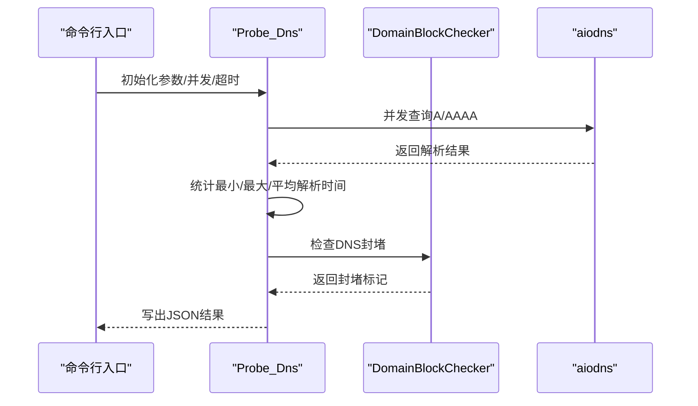
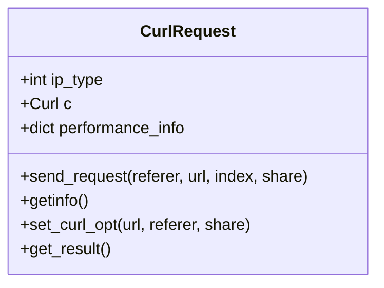
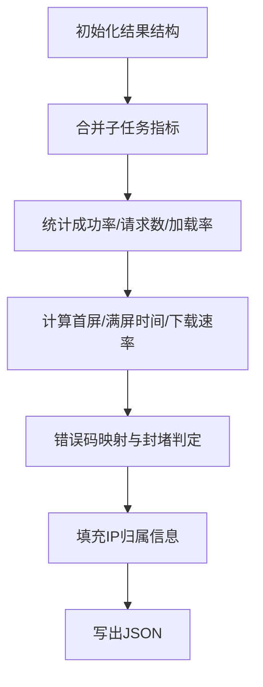
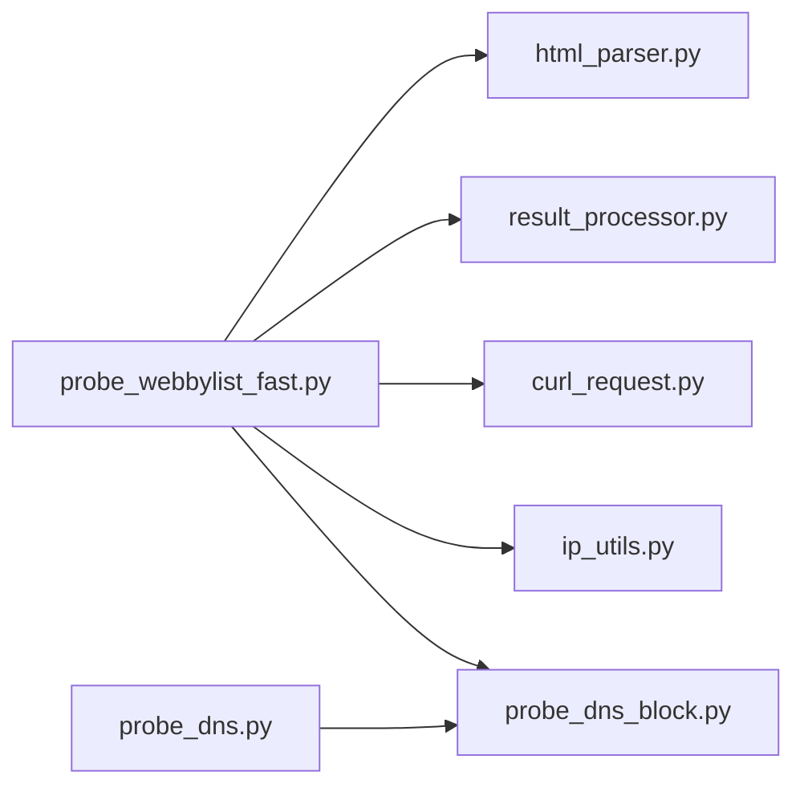

# 扩展开发指南

<cite>
**本文引用的文件**   
- [probe_webbylist_fast.py](file://probe_webbylist_fast/probe_webbylist_fast.py)
- [result_processor.py](file://probe_webbylist_fast/result_processor.py)
- [task_loader.py](file://probe_webbylist_fast/task_loader.py)
- [curl_request.py](file://probe_webbylist_fast/curl_request.py)
- [html_parser.py](file://probe_webbylist_fast/html_parser.py)
- [probe_dns_block.py](file://probe_webbylist_fast/probe_dns_block.py)
- [ip_utils.py](file://ip_utils.py)
- [mylogger.py](file://mylogger.py)
- [probe_dns.py](file://probe_dns.py)
- [probe_webbylist_fast.spec](file://probe_webbylist_fast/probe_webbylist_fast.spec)
- [README.md](file://README.md)
</cite>

## 目录
1. [简介](#简介)
2. [项目结构](#项目结构)
3. [核心组件](#核心组件)
4. [架构总览](#架构总览)
5. [详细组件分析](#详细组件分析)
6. [依赖分析](#依赖分析)
7. [性能考量](#性能考量)
8. [故障排查指南](#故障排查指南)
9. [结论](#结论)
10. [附录](#附录)

## 简介
本指南面向希望在现有网络探测工具集中进行扩展开发的工程师，提供从“创建新探测模块”到“注册到主程序”的完整流程；涵盖“配置项扩展”、“输出格式扩展（JSON/XML/CSV）”、“插件化最佳实践”、“与现有组件集成”以及“测试方法”。读者无需深入掌握每个模块细节，即可按步骤完成扩展。

## 项目结构
该项目采用“多探测器独立脚本 + 公共组件复用”的组织方式，核心探测器以命令行入口运行，共享日志、DNS 封堵检测、IP 归属查询、HTML 解析等通用能力。

图表来源
- [probe_webbylist_fast.py:1-222](file://probe_webbylist_fast/probe_webbylist_fast.py#L1-L222)
- [probe_dns.py:1-203](file://probe_dns.py#L1-L203)
- [mylogger.py:1-59](file://mylogger.py#L1-L59)
- [probe_dns_block.py:1-207](file://probe_webbylist_fast/probe_dns_block.py#L1-L207)
- [ip_utils.py:1-235](file://ip_utils.py#L1-L235)
- [html_parser.py:1-78](file://probe_webbylist_fast/html_parser.py#L1-L78)
- [result_processor.py:1-269](file://probe_webbylist_fast/result_processor.py#L1-L269)
- [task_loader.py:1-12](file://probe_webbylist_fast/task_loader.py#L1-L12)
- [curl_request.py:1-194](file://probe_webbylist_fast/curl_request.py#L1-L194)

章节来源
- [README.md:67-83](file://README.md#L67-L83)
- [probe_webbylist_fast.py:1-222](file://probe_webbylist_fast/probe_webbylist_fast.py#L1-L222)

## 核心组件
- 日志模块：统一日志格式与输出，支持控制台与文件轮转。
- DNS 封堵检测：基于本地 DNS 与公共 DNS 结果比对，判断域名是否被运营商封堵。
- IP 归属查询：通过 SQLite 数据库查询 IP 的运营商、省份、城市信息。
- HTML 解析：抓取页面中的静态资源链接，生成子任务列表。
- 结果处理器：汇总统计、错误码映射、指标计算、IP 归属填充。
- 任务加载器：从文件读取待探测 URL 列表。
- HTTP 请求封装：基于 pycurl 的请求封装，采集性能指标与错误信息。

章节来源
- [mylogger.py:1-59](file://mylogger.py#L1-L59)
- [probe_dns_block.py:1-207](file://probe_webbylist_fast/probe_dns_block.py#L1-L207)
- [ip_utils.py:1-235](file://ip_utils.py#L1-L235)
- [html_parser.py:1-78](file://probe_webbylist_fast/html_parser.py#L1-L78)
- [result_processor.py:1-269](file://probe_webbylist_fast/result_processor.py#L1-L269)
- [task_loader.py:1-12](file://probe_webbylist_fast/task_loader.py#L1-L12)
- [curl_request.py:1-194](file://probe_webbylist_fast/curl_request.py#L1-L194)

## 架构总览
整体采用“命令行入口 + 异步并发 + 组件复用”的架构。探测器脚本负责参数解析与流程编排，公共组件提供可插拔的能力。

图表来源
- [probe_webbylist_fast.py:102-178](file://probe_webbylist_fast/probe_webbylist_fast.py#L102-L178)
- [task_loader.py:1-12](file://probe_webbylist_fast/task_loader.py#L1-L12)
- [html_parser.py:11-78](file://probe_webbylist_fast/html_parser.py#L11-L78)
- [curl_request.py:130-155](file://probe_webbylist_fast/curl_request.py#L130-L155)
- [result_processor.py:65-99](file://probe_webbylist_fast/result_processor.py#L65-L99)

## 详细组件分析

### 组件A：网页子资源批量探测（probe_webbylist_fast）
- 职责：从首页抓取子资源，批量并发探测，汇总性能指标与封堵判定。
- 关键流程：参数解析 → 任务加载 → 首页解析 → DNS 封堵检查 → 并发请求 → 结果处理 → 写出 JSON。
- 并发模型：线程池 + 队列，避免重复创建 pycurl 对象，提升性能。
- 输出：JSON 文件，包含主 URL、各子请求指标、IP 归属、错误码等。

图表来源
- [probe_webbylist_fast.py:102-178](file://probe_webbylist_fast/probe_webbylist_fast.py#L102-L178)
- [curl_request.py:130-155](file://probe_webbylist_fast/curl_request.py#L130-L155)
- [result_processor.py:65-147](file://probe_webbylist_fast/result_processor.py#L65-L147)

章节来源
- [probe_webbylist_fast.py:1-222](file://probe_webbylist_fast/probe_webbylist_fast.py#L1-L222)
- [curl_request.py:1-194](file://probe_webbylist_fast/curl_request.py#L1-L194)
- [result_processor.py:1-269](file://probe_webbylist_fast/result_processor.py#L1-L269)

### 组件B：DNS 解析探测（probe_dns）
- 职责：支持 A/AAAA 记录查询，统计解析时间与成功率，支持 DNS 封堵检测。
- 关键流程：参数解析 → 并发查询 → 结果聚合 → 写出 JSON。
- 并发模型：信号量限制并发，超时控制。
- 输出：JSON 文件，包含目标 IP、解析时间统计、封堵标记等。

图表来源
- [probe_dns.py:55-93](file://probe_dns.py#L55-L93)
- [probe_dns_block.py:132-207](file://probe_webbylist_fast/probe_dns_block.py#L132-L207)

章节来源
- [probe_dns.py:1-203](file://probe_dns.py#L1-L203)
- [probe_dns_block.py:1-207](file://probe_webbylist_fast/probe_dns_block.py#L1-L207)

### 组件C：HTTP 请求封装（CurlRequest）
- 职责：封装 pycurl 请求，采集性能指标（DNS/TCP/SSL/TTFB/总时长）、错误码、重定向次数、内容类型、主 IP 等。
- 关键点：支持 IPv4/IPv6 解析切换、共享 DNS/会话缓存、调试回调提取主 IP、异常捕获与错误码映射。

图表来源
- [curl_request.py:9-194](file://probe_webbylist_fast/curl_request.py#L9-L194)

章节来源
- [curl_request.py:1-194](file://probe_webbylist_fast/curl_request.py#L1-L194)

### 组件D：结果处理器（result_processor）
- 职责：初始化结果结构、合并子任务结果、统计成功率、计算首屏/满屏时间、错误码映射、内容体封堵检测、跳转封堵检测、IP 归属填充。
- 关键点：统一字段命名与单位换算（毫秒），对异常与超时进行分类映射。

图表来源
- [result_processor.py:25-147](file://probe_webbylist_fast/result_processor.py#L25-L147)

章节来源
- [result_processor.py:1-269](file://probe_webbylist_fast/result_processor.py#L1-L269)

### 组件E：IP 归属查询（ip_utils）
- 职责：根据 IP 查询运营商、省份、城市，支持 IPv4/IPv6，统计“本网/异网/其他/空”等维度。
- 关键点：SQLite 只读连接、IP 范围匹配、本地网络运营商配置读取。

章节来源
- [ip_utils.py:1-235](file://ip_utils.py#L1-L235)

### 组件F：HTML 解析（html_parser）
- 职责：从首页提取图片、样式表、脚本等静态资源链接，生成子任务文件。
- 关键点：相对路径补全、协议前缀处理、历史重定向跟踪。

章节来源
- [html_parser.py:1-78](file://probe_webbylist_fast/html_parser.py#L1-L78)

### 组件G：DNS 封堵检测（probe_dns_block）
- 职责：对比本地 DNS 与公共 DNS 查询结果，判断是否封堵；支持 IPv4/IPv6。
- 关键点：WMI 获取本地 DNS、异步查询、封堵 IP 白名单。

章节来源
- [probe_dns_block.py:1-207](file://probe_webbylist_fast/probe_dns_block.py#L1-L207)

## 依赖分析
- 组件内聚与耦合
  - probe_webbylist_fast 与 html_parser、result_processor、curl_request、ip_utils、probe_dns_block 高度耦合，但职责清晰。
  - probe_dns 与 probe_dns_block 轻耦合，仅在需要封堵检测时调用。
- 外部依赖
  - pycurl、aiodns、requests、BeautifulSoup、sqlite3、wmi、asyncio 等。
- 潜在循环依赖
  - 当前未发现循环依赖，建议新增模块时保持单向依赖。

图表来源
- [probe_webbylist_fast.py:1-222](file://probe_webbylist_fast/probe_webbylist_fast.py#L1-L222)
- [probe_dns.py:1-203](file://probe_dns.py#L1-L203)
- [html_parser.py:1-78](file://probe_webbylist_fast/html_parser.py#L1-L78)
- [result_processor.py:1-269](file://probe_webbylist_fast/result_processor.py#L1-L269)
- [curl_request.py:1-194](file://probe_webbylist_fast/curl_request.py#L1-L194)
- [ip_utils.py:1-235](file://ip_utils.py#L1-L235)
- [probe_dns_block.py:1-207](file://probe_webbylist_fast/probe_dns_block.py#L1-L207)

## 性能考量
- 并发策略
  - 使用线程池 + 队列复用 Curl 对象，减少频繁创建销毁开销。
  - DNS 查询使用异步与信号量限制并发，避免阻塞。
- I/O 优化
  - 日志采用轮转文件，避免日志过大影响性能。
  - SQLite 以只读 URI 方式连接，降低锁竞争。
- 指标采集
  - 仅在成功请求时计算首屏/满屏时间，避免无效计算。
- 超时控制
  - 单请求与总超时双重控制，防止长时间阻塞。

章节来源
- [probe_webbylist_fast.py:117-136](file://probe_webbylist_fast/probe_webbylist_fast.py#L117-L136)
- [curl_request.py:101-117](file://probe_webbylist_fast/curl_request.py#L101-L117)
- [result_processor.py:206-236](file://probe_webbylist_fast/result_processor.py#L206-L236)

## 故障排查指南
- 常见错误码映射
  - 执行错误码与 HTTP 状态码映射，区分超时、解析失败、连接失败、封堵等情况。
- 日志定位
  - 使用 MyLogger 的 debug/info/warning/error 级别输出，结合文件轮转定位问题。
- DNS 封堵
  - 若命中封堵 IP 或重定向至特定域名，需检查本地 DNS 与公共 DNS 结果差异。
- IP 归属
  - SQLite 连接失败或 IP 不在库中时，结果中归属字段为空，需确认数据库文件与网络配置。

章节来源
- [result_processor.py:148-199](file://probe_webbylist_fast/result_processor.py#L148-L199)
- [mylogger.py:1-59](file://mylogger.py#L1-L59)
- [probe_dns_block.py:132-207](file://probe_webbylist_fast/probe_dns_block.py#L132-L207)
- [ip_utils.py:23-31](file://ip_utils.py#L23-L31)

## 结论
通过以上组件与流程，项目实现了高并发、可扩展的网络探测能力。新增探测器只需遵循统一的参数约定、结果输出规范与日志规范，即可快速融入现有生态。

## 附录

### 一、添加新探测功能的完整流程
- 步骤1：创建新模块文件
  - 在根目录新建探测脚本，例如：[new_probe.py](file://new_probe.py)
  - 参考现有脚本的参数解析与入口组织方式。
- 步骤2：实现统一接口
  - 定义参数解析函数，输出文件、目标、超时、协议类型等。
  - 定义 run 方法，内部实现并发与结果聚合。
- 步骤3：注册到主程序
  - 在命令行入口中增加参数解析与调用逻辑。
  - 若需复用公共组件，直接导入对应模块（如 mylogger、ip_utils、probe_dns_block）。
- 步骤4：输出格式标准化
  - 统一输出 JSON，字段命名与单位与现有模块一致。
- 步骤5：打包与分发
  - 如需打包，参考 [probe_webbylist_fast.spec:1-45](file://probe_webbylist_fast/probe_webbylist_fast.spec#L1-L45) 的 PyInstaller 配置。

章节来源
- [probe_webbylist_fast.py:198-222](file://probe_webbylist_fast/probe_webbylist_fast.py#L198-L222)
- [probe_dns.py:172-203](file://probe_dns.py#L172-L203)
- [probe_webbylist_fast.spec:1-45](file://probe_webbylist_fast/probe_webbylist_fast.spec#L1-L45)

### 二、扩展配置选项（参数验证与默认值）
- 建议在新模块中使用 argparse 定义参数，提供默认值与类型约束。
- 常见参数
  - 输出文件：字符串，必填
  - 目标：字符串，必填
  - 并发/超时：整数/浮点数，带默认值与最小阈值校验
  - 协议类型：枚举（4/6/0），默认 0
- 默认值建议
  - 并发：10
  - 单次超时：1 秒
  - 总超时：60 秒
  - 日志级别：info

章节来源
- [probe_dns.py:16-41](file://probe_dns.py#L16-L41)
- [probe_webbylist_fast.py:199-206](file://probe_webbylist_fast/probe_webbylist_fast.py#L199-L206)

### 三、实现新的输出格式（JSON/XML/CSV）
- JSON（推荐）
  - 保持与现有模块一致的字段命名与单位，便于统一处理。
  - 参考现有写文件方式：[result_processor.py:43-46](file://probe_webbylist_fast/result_processor.py#L43-L46)
- XML/CSV
  - 可在模块内部转换为 JSON 后再导出，或直接生成 XML/CSV。
  - 建议保留关键字段：目标、状态、耗时、错误码、封堵标记等。

章节来源
- [result_processor.py:43-46](file://probe_webbylist_fast/result_processor.py#L43-L46)

### 四、插件化开发最佳实践
- 模块接口设计
  - 统一的 run() 方法，返回标准字典或 JSON 字符串。
  - 明确的异常抛出与错误码映射。
- 错误处理
  - 对网络异常、超时、解析失败分别捕获并记录。
  - 使用 MyLogger 输出详细上下文。
- 日志记录
  - 采用统一格式，包含时间、文件名、行号、线程 ID、级别、消息。
- 并发与资源管理
  - 使用信号量限制并发，避免资源争用。
  - 正确关闭句柄与连接，释放资源。

章节来源
- [mylogger.py:1-59](file://mylogger.py#L1-L59)
- [probe_dns.py:55-93](file://probe_dns.py#L55-L93)

### 五、与现有组件的集成方式
- 数据交换格式
  - 统一使用 JSON 字符串，字段命名与单位保持一致。
- 异常处理
  - 通过错误码映射与日志输出，确保上层能正确识别失败原因。
- 性能考虑
  - 复用 CurlRequest 与 IP 归属查询，避免重复实现。
  - 使用异步与并发策略，减少总耗时。

章节来源
- [curl_request.py:130-155](file://probe_webbylist_fast/curl_request.py#L130-L155)
- [ip_utils.py:170-225](file://ip_utils.py#L170-L225)

### 六、扩展开发模板与测试方法
- 开发模板
  - 参考 [probe_dns.py:15-93](file://probe_dns.py#L15-L93) 的类结构与异步实现。
  - 参考 [probe_webbylist_fast.py:198-222](file://probe_webbylist_fast/probe_webbylist_fast.py#L198-L222) 的命令行入口与参数解析。
- 测试方法
  - 单元测试：针对关键函数（如错误码映射、IP 归属查询）编写断言。
  - 集成测试：使用真实 URL 与目标网络环境，验证并发与超时控制。
  - 回归测试：对比历史输出，确保字段与格式稳定。

章节来源
- [probe_dns.py:15-93](file://probe_dns.py#L15-L93)
- [probe_webbylist_fast.py:198-222](file://probe_webbylist_fast/probe_webbylist_fast.py#L198-L222)