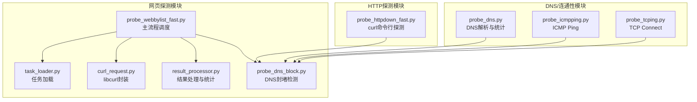
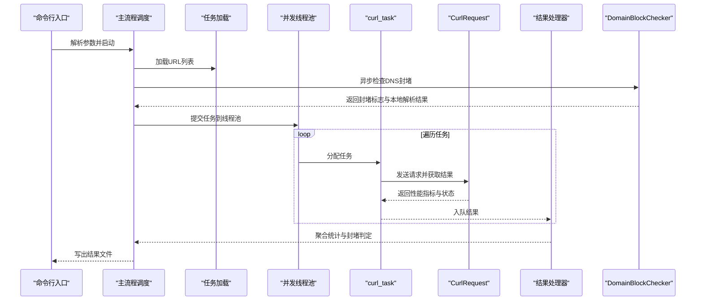
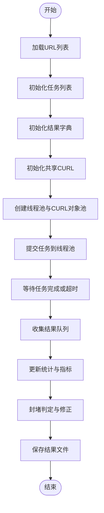
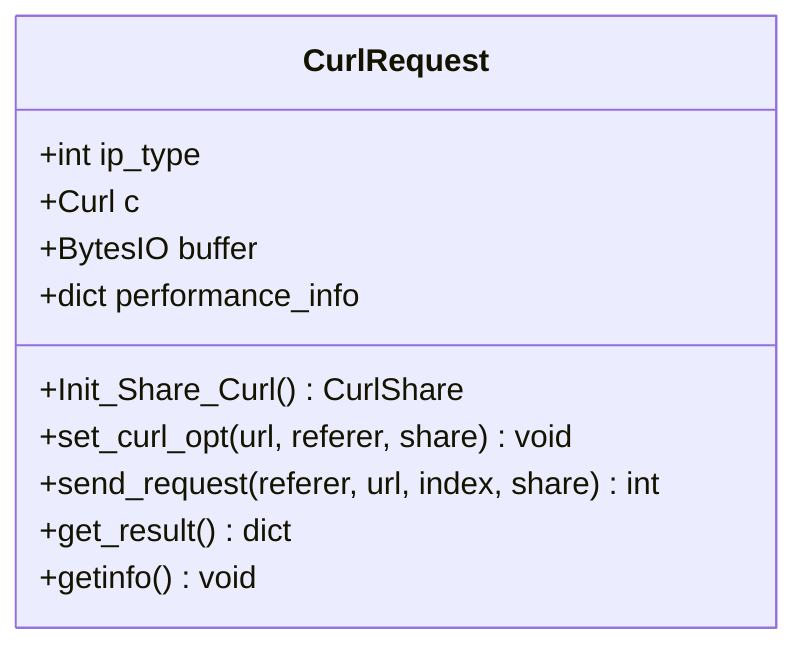
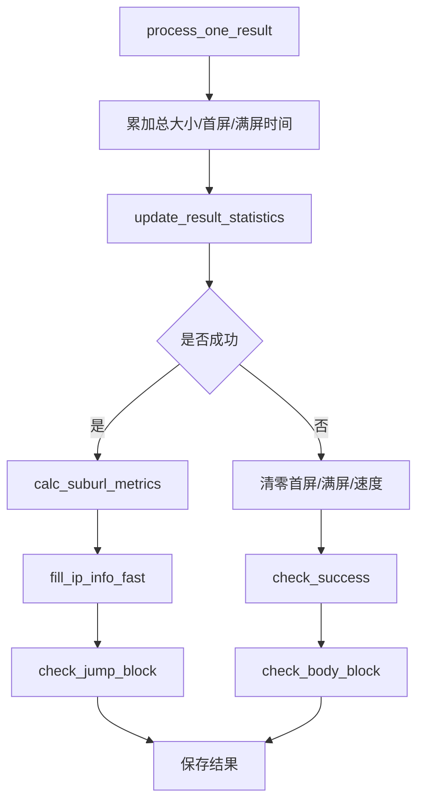
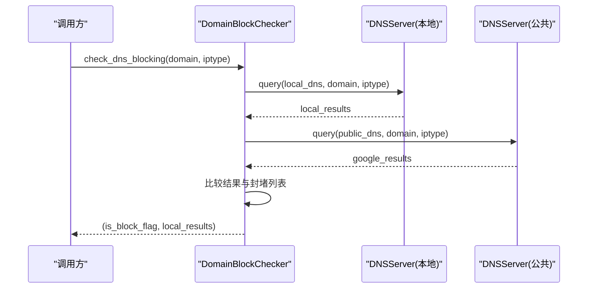
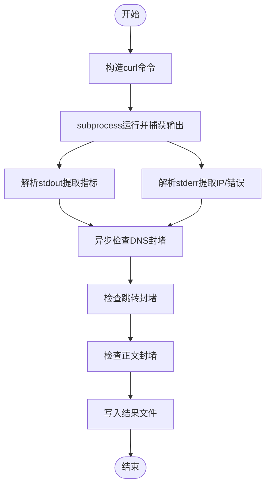
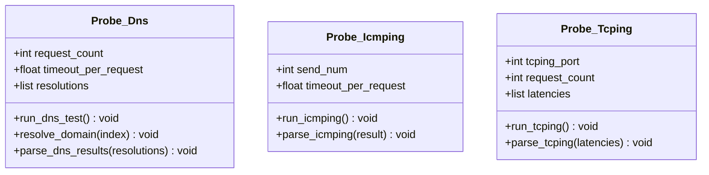
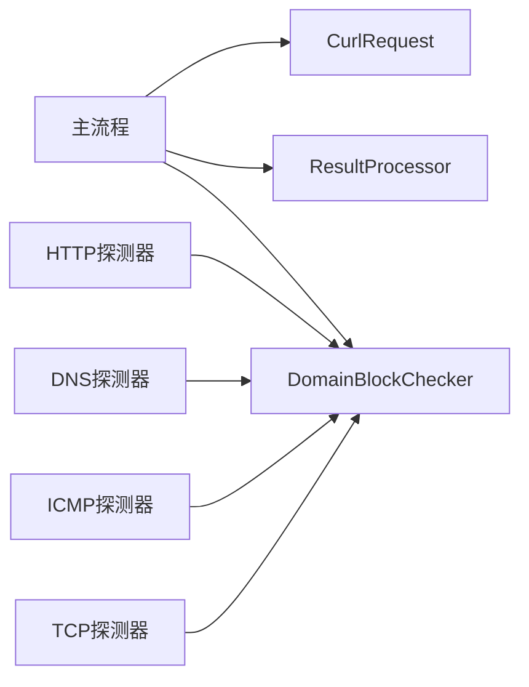

# 测试策略与实践

<cite>
**本文引用的文件**   
- [probe_webbylist_fast.py](file://probe_webbylist_fast/probe_webbylist_fast.py)
- [curl_request.py](file://probe_webbylist_fast/curl_request.py)
- [result_processor.py](file://probe_webbylist_fast/result_processor.py)
- [task_loader.py](file://probe_webbylist_fast/task_loader.py)
- [probe_dns_block.py](file://probe_webbylist_fast/probe_dns_block.py)
- [probe_httpdown_fast.py](file://probe_httpdown_fast.py)
- [probe_dns.py](file://probe_dns.py)
- [probe_icmpping.py](file://probe_icmpping.py)
- [probe_tcping.py](file://probe_tcping.py)
- [test_scapy.py](file://test_scapy.py)
- [pytest.ini](file://pycurl-master/pytest.ini)
- [requirements-dev.txt](file://pycurl-master/requirements-dev.txt)
</cite>

## 目录
1. [引言](#引言)
2. [项目结构](#项目结构)
3. [核心组件](#核心组件)
4. [架构总览](#架构总览)
5. [详细组件分析](#详细组件分析)
6. [依赖分析](#依赖分析)
7. [性能考虑](#性能考虑)
8. [故障排查指南](#故障排查指南)
9. [结论](#结论)
10. [附录](#附录)

## 引言
本指南面向网络探测工具集的测试工作，围绕单元测试、集成测试、性能测试、测试环境搭建、覆盖率要求、持续集成与自动化测试等方面，提供系统化的策略与实践建议。文档同时结合代码中的异步处理、并发队列、外部进程调用、DNS解析与封堵检测等关键特性，给出可落地的测试设计与实施方法。

## 项目结构
该仓库包含多类网络探测工具，涵盖 HTTP 下载探测、DNS 解析与封堵检测、ICMP/TCP 连通性探测等模块；其中 webbylist_fast 为高性能网页子资源探测流程，包含任务加载、并发请求、结果聚合与封堵判定等环节。

图表来源
- [probe_webbylist_fast.py:102-178](file://probe_webbylist_fast/probe_webbylist_fast.py#L102-L178)
- [task_loader.py:1-12](file://probe_webbylist_fast/task_loader.py#L1-L12)
- [curl_request.py:9-194](file://probe_webbylist_fast/curl_request.py#L9-L194)
- [result_processor.py:25-269](file://probe_webbylist_fast/result_processor.py#L25-L269)
- [probe_dns_block.py:58-207](file://probe_webbylist_fast/probe_dns_block.py#L58-L207)
- [probe_httpdown_fast.py:13-479](file://probe_httpdown_fast.py#L13-L479)
- [probe_dns.py:15-203](file://probe_dns.py#L15-L203)
- [probe_icmpping.py:19-155](file://probe_icmpping.py#L19-L155)
- [probe_tcping.py:11-164](file://probe_tcping.py#L11-L164)

章节来源
- [probe_webbylist_fast.py:102-178](file://probe_webbylist_fast/probe_webbylist_fast.py#L102-L178)
- [probe_httpdown_fast.py:13-479](file://probe_httpdown_fast.py#L13-L479)
- [probe_dns.py:15-203](file://probe_dns.py#L15-L203)
- [probe_icmpping.py:19-155](file://probe_icmpping.py#L19-L155)
- [probe_tcping.py:11-164](file://probe_tcping.py#L11-L164)

## 核心组件
- 网页子资源探测主流程：负责任务初始化、并发调度、结果聚合与封堵判定。
- libcurl 请求封装：统一设置请求选项、性能指标采集、错误码映射。
- 结果处理器：汇总统计、成功率、首屏/满屏时间、IP归属与运营商统计。
- DNS 封堵检测：对比本地与公共 DNS 解析结果，判定封堵风险。
- HTTP 探测器：通过 curl 命令行发起请求，解析输出并写入结果文件。
- DNS/ICMP/TCP 探测器：分别进行域名解析、ICMP Ping、TCP Connect 探测，输出统计指标。

章节来源
- [probe_webbylist_fast.py:102-178](file://probe_webbylist_fast/probe_webbylist_fast.py#L102-L178)
- [curl_request.py:9-194](file://probe_webbylist_fast/curl_request.py#L9-L194)
- [result_processor.py:25-269](file://probe_webbylist_fast/result_processor.py#L25-L269)
- [probe_dns_block.py:58-207](file://probe_webbylist_fast/probe_dns_block.py#L58-L207)
- [probe_httpdown_fast.py:13-479](file://probe_httpdown_fast.py#L13-L479)
- [probe_dns.py:15-203](file://probe_dns.py#L15-L203)
- [probe_icmpping.py:19-155](file://probe_icmpping.py#L19-L155)
- [probe_tcping.py:11-164](file://probe_tcping.py#L11-L164)

## 架构总览
下图展示网页探测主流程与各子模块之间的交互关系，以及异步与并发的关键节点。

图表来源
- [probe_webbylist_fast.py:102-178](file://probe_webbylist_fast/probe_webbylist_fast.py#L102-L178)
- [task_loader.py:1-12](file://probe_webbylist_fast/task_loader.py#L1-L12)
- [curl_request.py:130-155](file://probe_webbylist_fast/curl_request.py#L130-L155)
- [result_processor.py:65-99](file://probe_webbylist_fast/result_processor.py#L65-L99)
- [probe_dns_block.py:132-207](file://probe_webbylist_fast/probe_dns_block.py#L132-L207)

## 详细组件分析

### 组件A：网页子资源探测主流程
- 设计要点
  - 任务初始化：为每个URL构建任务对象，设置 referer 与索引。
  - 并发调度：使用线程池与队列管理 libcurl 实例，控制并发度。
  - 超时控制：整体超时与单任务超时双重保护。
  - 结果聚合：从队列中取出结果，更新主结果字典并计算统计指标。
  - 封堵判定：基于 DNS 封堵、跳转封堵、正文封堵规则综合判定。
- 关键流程图（主流程）

图表来源
- [probe_webbylist_fast.py:102-178](file://probe_webbylist_fast/probe_webbylist_fast.py#L102-L178)

章节来源
- [probe_webbylist_fast.py:102-178](file://probe_webbylist_fast/probe_webbylist_fast.py#L102-L178)

### 组件B：libcurl 请求封装
- 设计要点
  - 共享句柄：通过 CurlShare 减少 DNS 与会话开销。
  - 请求选项：统一设置 IP 解析策略、超时、重定向、用户代理、Referer 等。
  - 性能指标：采集各阶段耗时、HTTP 状态码、重定向次数、内容类型等。
  - 错误码映射：将底层错误码映射为业务错误码，便于上层判定。
- 类关系图

图表来源
- [curl_request.py:9-194](file://probe_webbylist_fast/curl_request.py#L9-L194)

章节来源
- [curl_request.py:9-194](file://probe_webbylist_fast/curl_request.py#L9-L194)

### 组件C：结果处理器
- 设计要点
  - 初始化主结果字典与子结果数组。
  - 单条结果处理：累加下载量、计算首屏/满屏时间、速度等。
  - 统计更新：计算总请求数、成功数、成功率、测试总耗时。
  - 封堵判定：根据错误码、重定向目标、正文特征等进行综合判定。
  - IP 归属：查询数据库，填充运营商与地区信息。
- 流程图（统计与封堵判定）

图表来源
- [result_processor.py:65-269](file://probe_webbylist_fast/result_processor.py#L65-L269)

章节来源
- [result_processor.py:25-269](file://probe_webbylist_fast/result_processor.py#L25-L269)

### 组件D：DNS 封堵检测
- 设计要点
  - 支持 IPv4/IPv6 双栈查询，对比本地与公共 DNS 结果差异。
  - 通过 WMI 获取本机 DNS 服务器，避免硬编码。
  - 对封堵 IP 列表进行校验，返回封堵标志与解析结果。
- 序列图（DNS 封堵检测）

图表来源
- [probe_dns_block.py:132-207](file://probe_webbylist_fast/probe_dns_block.py#L132-L207)

章节来源
- [probe_dns_block.py:58-207](file://probe_webbylist_fast/probe_dns_block.py#L58-L207)

### 组件E：HTTP 探测器（curl 命令行）
- 设计要点
  - 通过 subprocess 调用 curl，设置超时、重定向上限、连接超时等参数。
  - 解析 stdout/stderr，提取性能指标与错误信息。
  - 结合 DNS 封堵与跳转封堵、正文封堵规则，综合判定结果。
- 流程图（HTTP 探测）

图表来源
- [probe_httpdown_fast.py:329-420](file://probe_httpdown_fast.py#L329-L420)

章节来源
- [probe_httpdown_fast.py:13-479](file://probe_httpdown_fast.py#L13-L479)

### 组件F：DNS/ICMP/TCP 探测器
- 设计要点
  - DNS：并发查询 AAAA/A 记录，统计成功率、最值与均值。
  - ICMP：使用 icmplib 异步 ping，统计丢包率、抖动、RTT。
  - TCP：并发 open_connection，统计延迟分布与抖动。
- 类关系图（简要）

图表来源
- [probe_dns.py:15-203](file://probe_dns.py#L15-L203)
- [probe_icmpping.py:19-155](file://probe_icmpping.py#L19-L155)
- [probe_tcping.py:11-164](file://probe_tcping.py#L11-L164)

章节来源
- [probe_dns.py:15-203](file://probe_dns.py#L15-L203)
- [probe_icmpping.py:19-155](file://probe_icmpping.py#L19-L155)
- [probe_tcping.py:11-164](file://probe_tcping.py#L11-L164)

## 依赖分析
- 组件耦合
  - 主流程与 libcurl 封装强耦合，通过队列与线程池解耦。
  - 结果处理器与 IP 数据库耦合，需保证数据一致性。
  - DNS 封堵检测贯穿多个模块，应优先异步执行并缓存结果。
- 外部依赖
  - pycurl、aiodns、icmplib、subprocess（curl）、WMI（Windows DNS 查询）。
- 潜在环路
  - 当前模块间为单向依赖，未见循环导入。

图表来源
- [probe_webbylist_fast.py:102-178](file://probe_webbylist_fast/probe_webbylist_fast.py#L102-L178)
- [curl_request.py:9-194](file://probe_webbylist_fast/curl_request.py#L9-L194)
- [result_processor.py:25-269](file://probe_webbylist_fast/result_processor.py#L25-L269)
- [probe_dns_block.py:58-207](file://probe_webbylist_fast/probe_dns_block.py#L58-L207)
- [probe_httpdown_fast.py:13-479](file://probe_httpdown_fast.py#L13-L479)
- [probe_dns.py:15-203](file://probe_dns.py#L15-L203)
- [probe_icmpping.py:19-155](file://probe_icmpping.py#L19-L155)
- [probe_tcping.py:11-164](file://probe_tcping.py#L11-L164)

## 性能考虑
- 并发测试
  - 通过线程池与队列控制并发度，避免 libcurl 共享句柄竞争。
  - 在高并发场景下，适当降低单任务超时阈值，提升吞吐。
- 负载测试
  - 使用不同规模的 URL 列表，观察总耗时、成功率与 CPU/内存占用。
  - 对比启用/禁用共享句柄的性能差异。
- 压力测试
  - 引入限流与背压机制，防止队列积压导致 OOM。
  - 对 DNS 查询增加超时与取消逻辑，避免长时间阻塞。

## 故障排查指南
- 常见错误与定位
  - DNS 解析失败：检查本地 DNS 服务器列表与网络可达性。
  - 连接超时/慢速：调整连接超时、低速阈值与重定向上限。
  - 证书/SSL 失败：确认 SSL 参数与证书链有效性。
  - 结果文件为空或过小：检查 curl 输出解析与 gzip 解压逻辑。
- 日志与调试
  - 开启 libcurl 详细日志与自定义调试回调，定位首包/首传时间异常。
  - 对异步任务添加超时与取消，避免长时间挂起。

章节来源
- [curl_request.py:69-117](file://probe_webbylist_fast/curl_request.py#L69-L117)
- [result_processor.py:148-269](file://probe_webbylist_fast/result_processor.py#L148-L269)
- [probe_httpdown_fast.py:387-420](file://probe_httpdown_fast.py#L387-L420)

## 结论
本指南提供了针对网络探测工具集的系统化测试策略，覆盖单元测试、集成测试、性能测试与 CI/CD 自动化。通过明确异步与并发关键点、外部依赖与封堵判定逻辑，开发者可以更有针对性地编写高质量测试用例，确保关键功能得到充分验证。

## 附录

### 单元测试设计原则与实现方法
- 异步函数测试
  - 使用事件循环或异步测试框架，对 DNS 封堵检测、ICMP/TCP 探测等异步流程进行断言。
  - 示例参考：[probe_dns_block.py:132-207](file://probe_webbylist_fast/probe_dns_block.py#L132-L207)、[probe_dns.py:55-93](file://probe_dns.py#L55-L93)、[probe_icmpping.py:79-103](file://probe_icmpping.py#L79-L103)、[probe_tcping.py:73-95](file://probe_tcping.py#L73-L95)
- 模拟网络请求
  - 对 libcurl 封装进行接口隔离，使用 mock 替换 perform/getinfo 行为，验证错误码映射与指标采集。
  - 示例参考：[curl_request.py:130-155](file://probe_webbylist_fast/curl_request.py#L130-L155)
- 结果准确性验证
  - 针对封堵判定与统计逻辑，构造边界用例（空结果、超时、重定向、正文特征）。
  - 示例参考：[result_processor.py:148-269](file://probe_webbylist_fast/result_processor.py#L148-L269)

### 集成测试策略
- 端到端测试
  - 使用真实或模拟的 URL 列表，验证主流程从任务加载到结果写出的完整链路。
  - 示例参考：[probe_webbylist_fast.py:102-178](file://probe_webbylist_fast/probe_webbylist_fast.py#L102-L178)、[task_loader.py:1-12](file://probe_webbylist_fast/task_loader.py#L1-L12)
- 跨模块测试
  - 验证 DNS 封堵检测与 HTTP/ICMP/TCP 探测模块的协同行为。
  - 示例参考：[probe_dns_block.py:132-207](file://probe_webbylist_fast/probe_dns_block.py#L132-L207)
- 系统级测试
  - 在受限环境中（如容器/沙箱）运行，验证依赖库版本与权限要求。

### 性能测试实践
- 并发测试
  - 逐步增大并发度，观察吞吐与延迟变化，确定最优线程池大小。
  - 示例参考：[probe_webbylist_fast.py:117-133](file://probe_webbylist_fast/probe_webbylist_fast.py#L117-L133)
- 负载测试
  - 使用不同规模任务集，评估内存占用与磁盘 IO。
  - 示例参考：[result_processor.py:88-99](file://probe_webbylist_fast/result_processor.py#L88-L99)
- 压力测试
  - 引入超时与取消，验证系统在异常情况下的稳定性。
  - 示例参考：[probe_httpdown_fast.py:387-420](file://probe_httpdown_fast.py#L387-L420)

### 测试环境搭建指南
- 测试数据准备
  - 准备多种类型的 URL（正常、重定向、封堵、慢响应），并生成对应的 urllist 文件。
  - 示例参考：[task_loader.py:1-12](file://probe_webbylist_fast/task_loader.py#L1-L12)
- 测试工具配置
  - 安装 pytest 与 flaky 等开发依赖，配置标记在线/离线测试。
  - 示例参考：[requirements-dev.txt:1-7](file://pycurl-master/requirements-dev.txt#L1-L7)、[pytest.ini:1-10](file://pycurl-master/pytest.ini#L1-L10)
- 模拟环境设置
  - Windows 环境下使用 WMI 获取 DNS 服务器，或通过参数注入本地 DNS 列表。
  - 示例参考：[probe_dns_block.py:103-130](file://probe_webbylist_fast/probe_dns_block.py#L103-L130)

### 测试覆盖率与度量
- 覆盖率要求
  - 关键模块（结果处理、封堵判定、DNS 封堵检测）达到较高覆盖率。
  - 异步分支与异常路径必须覆盖。
- 度量方法
  - 使用 pytest 与覆盖率工具生成报告，定期审查回归用例。

### 持续集成与自动化测试
- CI/CD 流水线
  - 触发条件：push/pr 触发，带标签构建发布。
  - 步骤：安装依赖、运行单元/集成测试、生成覆盖率报告、上传 artifacts。
- 测试报告生成
  - 使用 pytest-html 或 junitxml 生成测试报告，便于评审与追溯。
- 参考配置
  - 示例参考：[pytest.ini:1-10](file://pycurl-master/pytest.ini#L1-L10)、[requirements-dev.txt:1-7](file://pycurl-master/requirements-dev.txt#L1-L7)

### 具体测试用例示例与最佳实践
- 用例示例
  - DNS 封堵：构造本地解析为封堵 IP、公共 DNS 解析为正常 IP 的场景，断言封堵标志。
  - HTTP 探测：构造超时/慢速/重定向/正文封堵等场景，断言最终状态码与错误码。
  - 并发与超时：构造大量任务与短超时，断言任务取消与统计指标。
- 最佳实践
  - 使用参数化测试覆盖多协议与边界值。
  - 对外部依赖进行隔离与模拟，确保测试稳定。
  - 对异步逻辑使用超时与取消，避免测试悬挂。