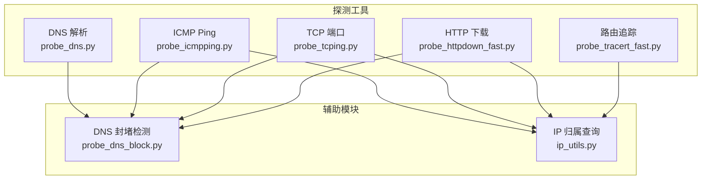
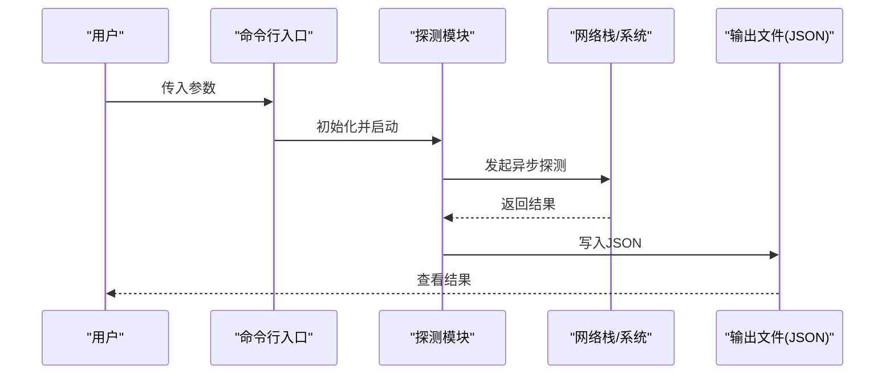
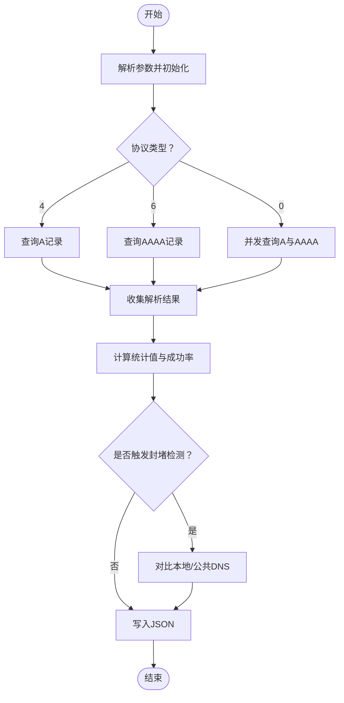
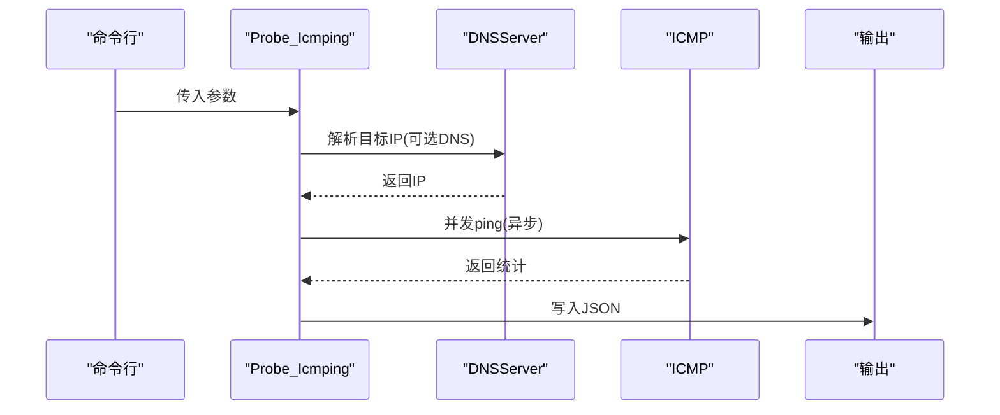
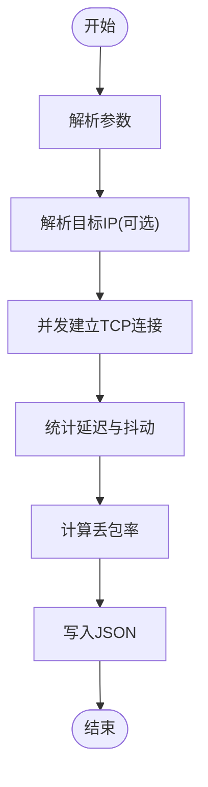
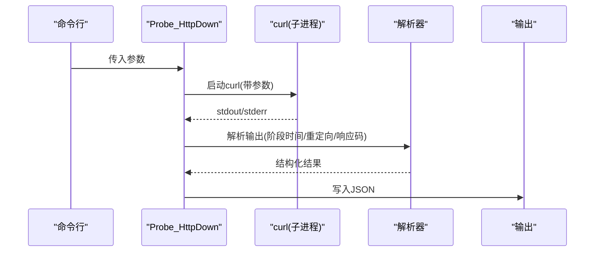
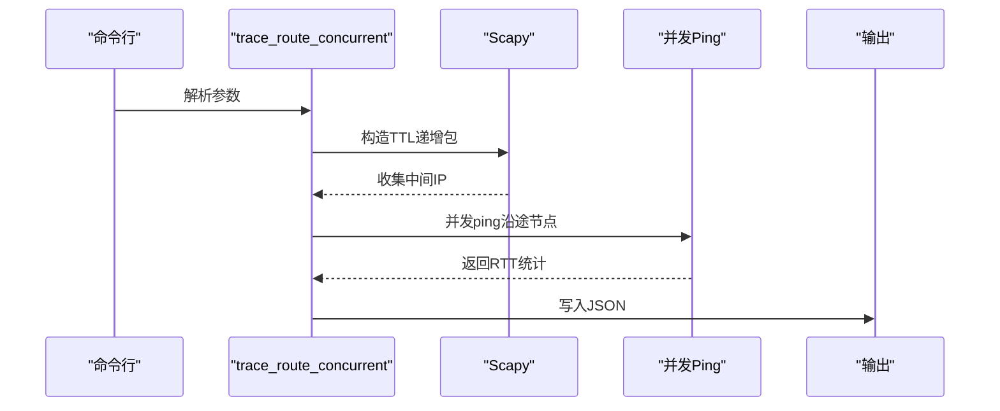
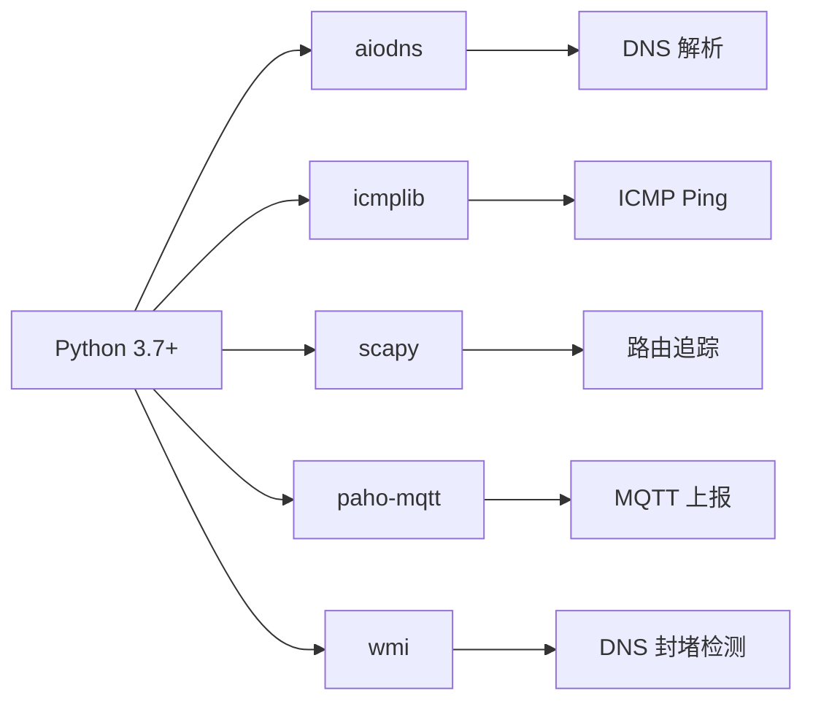

# 快速开始

<cite>
**本文引用的文件**   
- [README.md](file://README.md)
- [docs/QUICKSTART.md](file://docs/QUICKSTART.md)
- [probe_dns.py](file://probe_dns.py)
- [probe_icmpping.py](file://probe_icmpping.py)
- [probe_tcping.py](file://probe_tcping.py)
- [probe_httpdown_fast.py](file://probe_httpdown_fast.py)
- [probe_tracert_fast.py](file://probe_tracert_fast.py)
- [probe_dns_block.py](file://probe_dns_block.py)
- [ip_utils.py](file://ip_utils.py)
</cite>

## 目录
1. [简介](#简介)
2. [项目结构](#项目结构)
3. [核心组件](#核心组件)
4. [架构概览](#架构概览)
5. [详细组件分析](#详细组件分析)
6. [依赖关系分析](#依赖关系分析)
7. [性能注意事项](#性能注意事项)
8. [故障排查指南](#故障排查指南)
9. [结论](#结论)
10. [附录](#附录)

## 简介
本指南面向首次使用者，帮助你在 5 分钟内完成环境准备、安装与基础测试，掌握 DNS 解析、ICMP Ping、TCP 端口、HTTP 下载与路由追踪等核心功能。项目支持 Windows 系统与 Python 3.7+，并提供标准化 JSON 输出结果，便于后续自动化分析。

## 项目结构
- 工具集由多个独立脚本组成，分别实现不同网络探测能力
- 所有脚本均支持命令行参数，输出统一为 JSON 文件
- 依赖库通过 pip 安装，部分功能依赖系统权限（如 ICMP、Scapy）

图表来源
- [probe_dns.py:1-203](file://probe_dns.py#L1-L203)
- [probe_icmpping.py:1-155](file://probe_icmpping.py#L1-L155)
- [probe_tcping.py:1-164](file://probe_tcping.py#L1-L164)
- [probe_httpdown_fast.py:1-479](file://probe_httpdown_fast.py#L1-L479)
- [probe_tracert_fast.py:1-417](file://probe_tracert_fast.py#L1-L417)
- [probe_dns_block.py:1-230](file://probe_dns_block.py#L1-L230)
- [ip_utils.py:1-235](file://ip_utils.py#L1-L235)

章节来源
- [README.md:85-146](file://README.md#L85-L146)

## 核心组件
- DNS 解析测试：支持 A/AAAA 记录查询、自定义 DNS 服务器、解析时间统计、DNS 封堵检测
- ICMP Ping 测试：支持 IPv4/IPv6，统计丢包率与 RTT、IP 归属查询
- TCP 端口测试：支持自定义端口与 IPv4/IPv6，统计连接延迟与抖动
- HTTP 下载测试：基于 curl 子进程，分解各阶段耗时、重定向跟踪、反诈识别
- 路由追踪：基于 Scapy 构造探测包，支持并发 ping 沿途节点，IP 归属查询与 MQTT 上报

章节来源
- [README.md:11-52](file://README.md#L11-L52)

## 架构概览
- 异步并发：DNS、ICMP、HTTP、路由追踪均采用 asyncio 实现高并发
- 统一输出：所有测试结果以 JSON 格式写入指定文件
- 双栈支持：IPv4/IPv6 可通过参数切换
- 辅助能力：DNS 封堵检测、IP 归属查询、反诈识别

图表来源
- [probe_dns.py:172-203](file://probe_dns.py#L172-L203)
- [probe_icmpping.py:125-155](file://probe_icmpping.py#L125-L155)
- [probe_tcping.py:136-164](file://probe_tcping.py#L136-L164)
- [probe_httpdown_fast.py:431-479](file://probe_httpdown_fast.py#L431-L479)
- [probe_tracert_fast.py:414-417](file://probe_tracert_fast.py#L414-L417)

## 详细组件分析

### DNS 解析测试
- 功能要点
  - 支持 A/AAAA 记录查询，可指定 DNS 服务器
  - 统计解析时间（最小/最大/平均）、成功率
  - IPv4/IPv6 协议类型参数控制
  - DNS 封堵检测（对比本地与公共 DNS）
- 典型用法
  - 命令示例：python probe_dns.py output.json www.example.com 8.8.8.8 10 1 60 4
- 参数说明
  - 输出文件、域名、DNS 服务器、请求次数、单次超时、总超时、协议类型（4/6/0）
- 预期输出
  - 包含 code、domain、target_ip、解析统计、成功率、dnsblock 等字段

图表来源
- [probe_dns.py:55-93](file://probe_dns.py#L55-L93)
- [probe_dns.py:150-171](file://probe_dns.py#L150-L171)

章节来源
- [probe_dns.py:14-93](file://probe_dns.py#L14-L93)
- [probe_dns.py:172-203](file://probe_dns.py#L172-L203)
- [docs/QUICKSTART.md:37-66](file://docs/QUICKSTART.md#L37-L66)

### ICMP Ping 测试
- 功能要点
  - 支持 IPv4/IPv6，统计丢包率、RTT（min/max/avg）、抖动
  - 可选指定 DNS 服务器解析目标
  - IP 归属查询
- 典型用法
  - 命令示例：python probe_icmpping.py ping_result.json www.baidu.com 10 56 4 0.5 10
- 参数说明
  - 输出文件、目标、发送次数、包大小、IP 类型、单次/总超时、可选 DNS 服务器
- 预期输出
  - 包含 code、host_ip、ip_info、丢包率、RTT 统计、发送/成功数量等

图表来源
- [probe_icmpping.py:58-103](file://probe_icmpping.py#L58-L103)
- [probe_dns_block.py:11-57](file://probe_dns_block.py#L11-L57)

章节来源
- [probe_icmpping.py:19-103](file://probe_icmpping.py#L19-L103)
- [probe_icmpping.py:125-155](file://probe_icmpping.py#L125-L155)
- [docs/QUICKSTART.md:69-96](file://docs/QUICKSTART.md#L69-L96)

### TCP 端口测试
- 功能要点
  - 支持 IPv4/IPv6，统计连接延迟、抖动与丢包率
  - 可选指定 DNS 服务器解析目标
  - IP 归属查询
- 典型用法
  - 命令示例：python probe_tcping.py tcp_result.json www.baidu.com 443 4
- 参数说明
  - 输出文件、目标、端口、IP 类型、可选 DNS 服务器
- 预期输出
  - 包含 code、host_ip、ip_info、min/max/avg、抖动、丢包率、请求/成功次数等

图表来源
- [probe_tcping.py:73-95](file://probe_tcping.py#L73-L95)
- [probe_dns_block.py:11-57](file://probe_dns_block.py#L11-L57)

章节来源
- [probe_tcping.py:11-95](file://probe_tcping.py#L11-L95)
- [probe_tcping.py:136-164](file://probe_tcping.py#L136-L164)
- [docs/QUICKSTART.md:98-126](file://docs/QUICKSTART.md#L98-L126)

### HTTP 下载测试
- 功能要点
  - 基于 curl 子进程发起 HTTP/HTTPS 请求，解析各阶段耗时
  - 支持 IPv4/IPv6、自定义 DNS 服务器
  - 重定向跟踪、DNS 封堵检测、反诈识别
- 典型用法
  - 命令示例：python probe_httpdown_fast.py http_result.json 4 https://www.baidu.com
- 参数说明
  - 输出文件、IP 类型、URL、可选 DNS 服务器
- 预期输出
  - 包含各阶段时间（DNS/TCP/SSL/首字节/总时长）、响应码、下载速度、大小、是否成功、重定向次数等

图表来源
- [probe_httpdown_fast.py:329-420](file://probe_httpdown_fast.py#L329-L420)
- [probe_dns_block.py:59-211](file://probe_dns_block.py#L59-L211)

章节来源
- [probe_httpdown_fast.py:13-420](file://probe_httpdown_fast.py#L13-L420)
- [probe_httpdown_fast.py:431-479](file://probe_httpdown_fast.py#L431-L479)
- [docs/QUICKSTART.md:128-170](file://docs/QUICKSTART.md#L128-L170)

### 路由追踪
- 功能要点
  - 使用 Scapy 构造探测包，按 TTL 递增发现中间节点
  - 支持并发 ping 沿途节点，IP 归属查询，MQTT 上报
- 典型用法
  - 命令示例：python probe_tracert_fast.py www.baidu.com --address-family ipv4 --output-file trace.json
- 参数说明
  - 目标、可选地址族（ipv4/ipv6）、MQTT 信息、输出文件、DNS 服务器
- 预期输出
  - 每跳信息（hop、ip、ip_info、发送/接收/丢包率、min/max/avg）

图表来源
- [probe_tracert_fast.py:205-246](file://probe_tracert_fast.py#L205-L246)
- [probe_tracert_fast.py:345-413](file://probe_tracert_fast.py#L345-L413)

章节来源
- [probe_tracert_fast.py:1-417](file://probe_tracert_fast.py#L1-L417)
- [docs/QUICKSTART.md:171-205](file://docs/QUICKSTART.md#L171-L205)

## 依赖关系分析
- Python 版本：3.7+
- 关键依赖
  - aiodns：异步 DNS 解析
  - icmplib：ICMP Ping
  - scapy：网络包构造（路由追踪）
  - paho-mqtt：MQTT 上报（路由追踪）
  - wmi：Windows 系统信息（DNS 封堵检测）
- 依赖安装建议
  - pip install aiodns icmplib scapy paho-mqtt wmi

图表来源
- [README.md:56-66](file://README.md#L56-L66)
- [docs/QUICKSTART.md:15-32](file://docs/QUICKSTART.md#L15-L32)

章节来源
- [README.md:56-91](file://README.md#L56-L91)
- [docs/QUICKSTART.md:15-32](file://docs/QUICKSTART.md#L15-L32)

## 性能注意事项
- 异步并发：DNS、ICMP、HTTP、路由追踪均采用异步并发，减少串行等待
- 超时控制：各模块提供单次与总超时参数，避免长时间阻塞
- 资源限制：路由追踪与并发 ping 可能占用较多 CPU/内存，建议根据机器性能调整并发度
- 权限要求：ICMP 与 Scapy 需要管理员权限（Windows），否则可能失败

## 故障排查指南
- 缺少依赖
  - 症状：模块导入失败
  - 处理：pip install aiodns icmplib scapy paho-mqtt wmi
- Windows 权限不足
  - 症状：ICMP/路由追踪失败
  - 处理：以管理员身份运行命令提示符
- IPv6 不可用
  - 症状：IPv6 相关测试失败
  - 处理：确认系统启用 IPv6，或改用 IPv4 参数
- DNS 解析异常
  - 症状：目标无法解析或解析到封堵 IP
  - 处理：指定公共 DNS 服务器，或检查本地 DNS 配置
- HTTP 下载超时
  - 症状：curl 超时或响应码异常
  - 处理：增加超时、检查网络策略、确认目标可达

章节来源
- [docs/QUICKSTART.md:240-262](file://docs/QUICKSTART.md#L240-L262)

## 结论
通过本快速开始指南，你可以在 5 分钟内完成环境准备、安装依赖并运行首个 DNS 解析测试；随后逐步尝试 ICMP Ping、TCP 端口、HTTP 下载与路由追踪。所有测试结果以 JSON 输出，便于自动化集成与二次分析。

## 附录

### 环境要求与安装步骤
- 环境要求
  - 操作系统：Windows（支持 WMI 调用）
  - Python：3.7 或更高版本
- 安装步骤
  - 创建并激活虚拟环境
  - 安装依赖：pip install aiodns icmplib scapy paho-mqtt wmi
- 验证安装
  - 运行任意测试脚本查看输出 JSON 文件是否生成

章节来源
- [README.md:87-111](file://README.md#L87-L111)
- [docs/QUICKSTART.md:5-32](file://docs/QUICKSTART.md#L5-L32)

### 快速测试示例与参数速查
- DNS 解析
  - 示例：python probe_dns.py test_result.json www.baidu.com 8.8.8.8 5 1 30 4
  - 参数：输出文件、域名、DNS 服务器、请求次数、单次超时、总超时、协议类型
- ICMP Ping
  - 示例：python probe_icmpping.py ping_result.json www.baidu.com 10 56 4 0.5 10
  - 参数：输出文件、目标、发送次数、包大小、IP 类型、单次/总超时、可选 DNS 服务器
- TCP 端口
  - 示例：python probe_tcping.py tcp_result.json www.baidu.com 443 4
  - 参数：输出文件、目标、端口、IP 类型、可选 DNS 服务器
- HTTP 下载
  - 示例：python probe_httpdown_fast.py http_result.json 4 https://www.baidu.com
  - 参数：输出文件、IP 类型、URL、可选 DNS 服务器
- 路由追踪
  - 示例：python probe_tracert_fast.py www.baidu.com --address-family ipv4 --output-file trace.json
  - 参数：目标、可选地址族、MQTT 信息、输出文件、DNS 服务器

章节来源
- [README.md:112-146](file://README.md#L112-L146)
- [docs/QUICKSTART.md:33-233](file://docs/QUICKSTART.md#L33-L233)