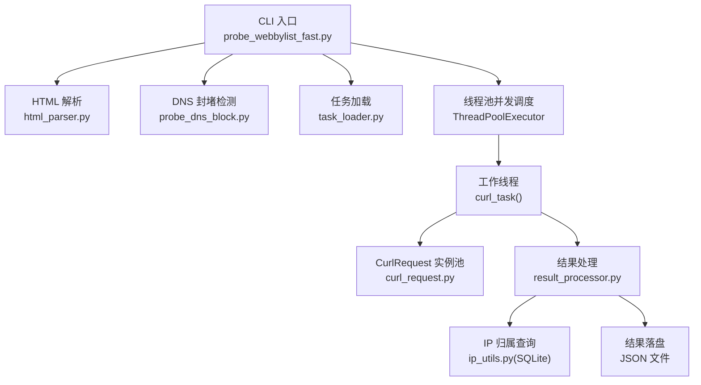
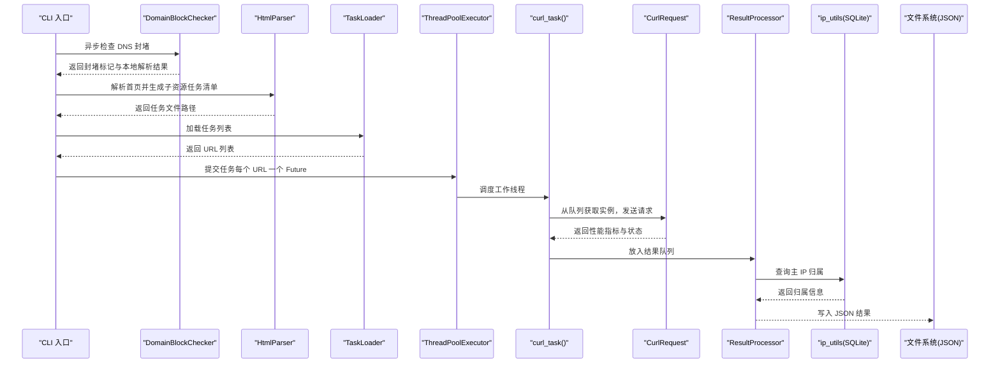
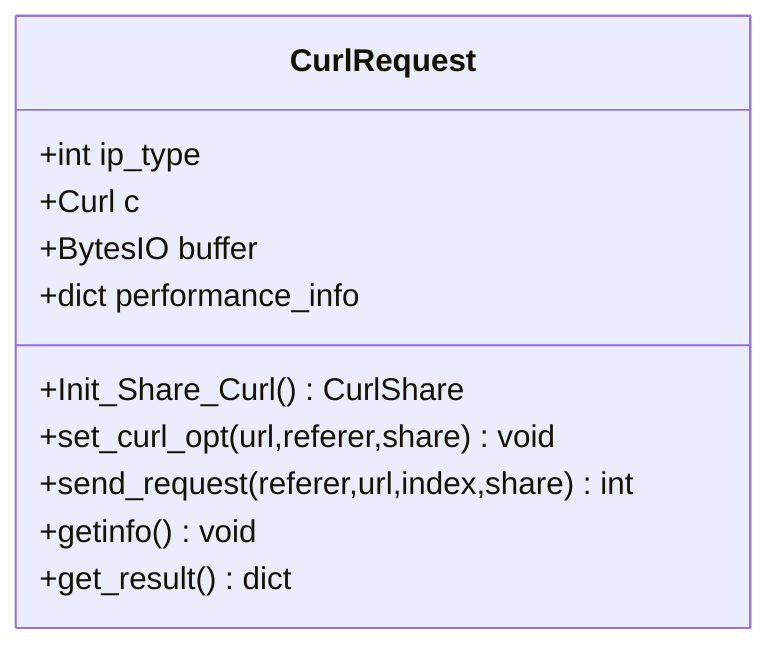
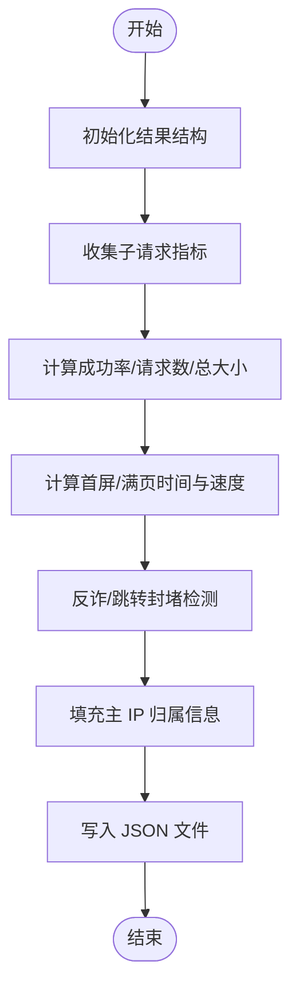
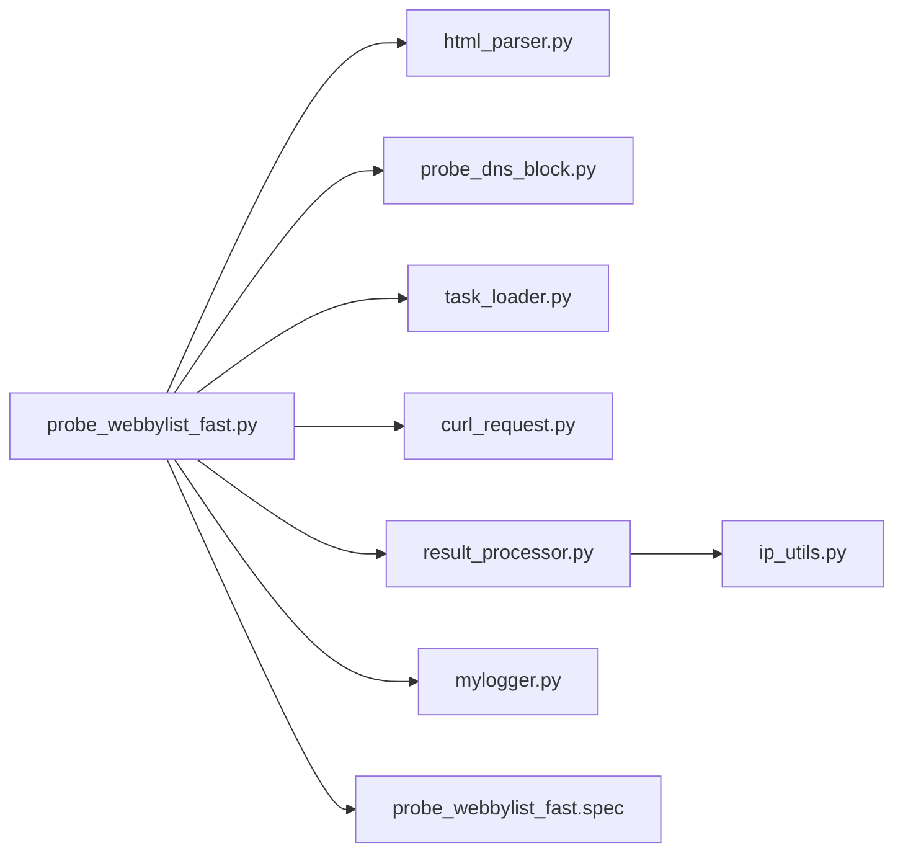

# 技术架构设计

<cite>
**本文引用的文件**
- [probe_webbylist_fast.py](file://probe_webbylist_fast/probe_webbylist_fast.py)
- [curl_request.py](file://probe_webbylist_fast/curl_request.py)
- [result_processor.py](file://probe_webbylist_fast/result_processor.py)
- [task_loader.py](file://probe_webbylist_fast/task_loader.py)
- [mylogger.py](file://probe_webbylist_fast/mylogger.py)
- [html_parser.py](file://probe_webbylist_fast/html_parser.py)
- [probe_dns_block.py](file://probe_webbylist_fast/probe_dns_block.py)
- [ip_utils.py](file://ip_utils.py)
- [README.md（架构）](file://docs/architecture/README.md)
- [README.md（部署）](file://docs/deployment/README.md)
- [QUICKSTART.md](file://docs/QUICKSTART.md)
- [probe_webbylist_fast.spec](file://probe_webbylist_fast.spec)
</cite>

## 目录
1. [引言](#引言)
2. [项目结构](#项目结构)
3. [核心组件](#核心组件)
4. [架构总览](#架构总览)
5. [详细组件分析](#详细组件分析)
6. [依赖分析](#依赖分析)
7. [性能考量](#性能考量)
8. [故障排查指南](#故障排查指南)
9. [结论](#结论)
10. [附录](#附录)

## 引言
本文件面向网络探测工具集“网页子资源列表快速探测”模块，提供系统化的技术架构文档。重点阐述模块化架构、异步编程模式与组件交互关系；解释核心技术决策（如 asyncio、pycurl、SQLite）的动机与权衡；明确系统边界与集成模式；梳理数据流与控制流；深入分析核心组件的设计模式（CurlRequest 的共享实例管理、ResultProcessor 的统计分析算法、TaskLoader 的任务调度机制）；给出基础设施要求、可扩展性与部署拓扑；覆盖安全性、监控与灾难恢复等横切关注点，并记录技术栈、第三方依赖与版本兼容性。

## 项目结构
该模块位于 probe_webbylist_fast 子目录，围绕“网页子资源列表快速探测”这一主线任务，采用分层与模块化结合的组织方式：
- CLI 层：命令行入口负责参数解析与日志初始化
- 探测层：HTML 解析、DNS 封堵检测、HTTP 子资源并发探测
- 基础服务层：日志、DNS 解析（aiodns）、IP 归属查询（SQLite）
- 数据存储层：SQLite 数据库、JSON 结果文件

图表来源
- [probe_webbylist_fast.py:102-195](file://probe_webbylist_fast/probe_webbylist_fast.py#L102-L195)
- [html_parser.py:11-78](file://probe_webbylist_fast/html_parser.py#L11-L78)
- [probe_dns_block.py:132-207](file://probe_webbylist_fast/probe_dns_block.py#L132-L207)
- [task_loader.py:1-12](file://probe_webbylist_fast/task_loader.py#L1-L12)
- [curl_request.py:9-194](file://probe_webbylist_fast/curl_request.py#L9-L194)
- [result_processor.py:65-269](file://probe_webbylist_fast/result_processor.py#L65-L269)
- [ip_utils.py:1-235](file://ip_utils.py#L1-L235)

章节来源
- [probe_webbylist_fast.py:102-195](file://probe_webbylist_fast/probe_webbylist_fast.py#L102-L195)
- [README.md（架构）:15-67](file://docs/architecture/README.md#L15-L67)

## 核心组件
- CurlRequest：封装 pycurl 的请求生命周期，提供共享实例池化与性能指标采集
- ResultProcessor：负责结果聚合、统计分析、错误码映射与页面首屏/满页指标计算
- TaskLoader：从任务文件加载待探测 URL 列表
- HtmlParser：抓取首页并解析子资源链接，生成子资源任务列表
- DomainBlockChecker：异步 DNS 封堵检测，对比本地与公共 DNS 结果
- MyLogger：统一日志输出与轮转
- ip_utils：SQLite 查询 IP 归属信息，支持 IPv4/IPv6

章节来源
- [curl_request.py:9-194](file://probe_webbylist_fast/curl_request.py#L9-L194)
- [result_processor.py:25-269](file://probe_webbylist_fast/result_processor.py#L25-L269)
- [task_loader.py:1-12](file://probe_webbylist_fast/task_loader.py#L1-L12)
- [html_parser.py:11-78](file://probe_webbylist_fast/html_parser.py#L11-L78)
- [probe_dns_block.py:58-207](file://probe_webbylist_fast/probe_dns_block.py#L58-L207)
- [mylogger.py:7-59](file://probe_webbylist_fast/mylogger.py#L7-L59)
- [ip_utils.py:6-235](file://ip_utils.py#L6-L235)

## 架构总览
系统采用“异步 + 并发线程池”的混合并发模型：
- 异步：DNS 封堵检测与 HTML 解析使用 asyncio
- 并发线程池：HTTP 子资源探测使用 ThreadPoolExecutor，每个工作线程复用 CurlRequest 实例池
- 共享资源：pycurl CurlShare 对象跨连接共享 Cookie/DNS/SSL Session，降低重复开销
- 数据流：HTML 解析 → 任务加载 → 并发探测 → 结果聚合 → IP 归属 → 统计分析 → JSON 输出

图表来源
- [probe_webbylist_fast.py:102-195](file://probe_webbylist_fast/probe_webbylist_fast.py#L102-L195)
- [probe_dns_block.py:132-207](file://probe_webbylist_fast/probe_dns_block.py#L132-L207)
- [html_parser.py:11-78](file://probe_webbylist_fast/html_parser.py#L11-L78)
- [task_loader.py:1-12](file://probe_webbylist_fast/task_loader.py#L1-L12)
- [curl_request.py:60-155](file://probe_webbylist_fast/curl_request.py#L60-L155)
- [result_processor.py:65-269](file://probe_webbylist_fast/result_processor.py#L65-L269)
- [ip_utils.py:170-235](file://ip_utils.py#L170-L235)

## 详细组件分析

### CurlRequest：共享实例管理与性能采集
- 设计要点
  - 通过静态方法初始化 CurlShare，开启 Cookie/DNS/SSL Session 共享，减少重复解析与握手成本
  - 每个实例维护独立的 BytesIO 缓冲区与性能指标字典，支持多路复用
  - 支持 IPv4/IPv6 切换与自定义 DNS 服务器
  - 通过 debug 回调提取 primary_ip，辅助后续 IP 归属查询
- 并发与池化
  - 工作线程从队列取出实例执行请求，结束后归还，实现轻量池化
  - 与 CurlShare 配合，提升多任务下的连接复用效率
- 错误处理
  - perform 异常捕获并记录 execute_code 与 error_message，供上层统一判定

图表来源
- [curl_request.py:9-194](file://probe_webbylist_fast/curl_request.py#L9-L194)

章节来源
- [curl_request.py:11-17](file://probe_webbylist_fast/curl_request.py#L11-L17)
- [curl_request.py:80-117](file://probe_webbylist_fast/curl_request.py#L80-L117)
- [curl_request.py:130-155](file://probe_webbylist_fast/curl_request.py#L130-L155)
- [curl_request.py:157-194](file://probe_webbylist_fast/curl_request.py#L157-L194)

### ResultProcessor：统计分析与错误码映射
- 设计要点
  - 初始化结果主表与子表，聚合子请求的下载量、时延、HTTP 状态等
  - 计算成功率、首屏/满页时间（PP90 与最大值），以及总吞吐速度
  - 错误码映射覆盖 DNS 解析、连接超时、慢速、重定向异常等多种场景
  - 页面内容反诈检测与跳转封堵检测，修正最终状态
- 算法复杂度
  - 统计过程 O(n)，排序与 PP90 计算 O(n log n)
  - 字典查找与计数 O(1)，整体满足大规模子资源场景

图表来源
- [result_processor.py:25-147](file://probe_webbylist_fast/result_processor.py#L25-L147)
- [result_processor.py:148-269](file://probe_webbylist_fast/result_processor.py#L148-L269)

章节来源
- [result_processor.py:25-147](file://probe_webbylist_fast/result_processor.py#L25-L147)
- [result_processor.py:148-269](file://probe_webbylist_fast/result_processor.py#L148-L269)

### TaskLoader：任务调度机制
- 设计要点
  - 从任务文件逐行读取 URL，过滤短小无效行，返回列表
  - 与 CLI 层配合，限定最大任务数（例如前 100 个）
- 与并发调度的关系
  - 作为 ThreadPoolExecutor 的输入源，每个任务对应一个 Future
  - 与超时控制结合，避免长时间阻塞

章节来源
- [task_loader.py:1-12](file://probe_webbylist_fast/task_loader.py#L1-L12)
- [probe_webbylist_fast.py:104-136](file://probe_webbylist_fast/probe_webbylist_fast.py#L104-L136)

### HtmlParser：子资源发现与任务生成
- 设计要点
  - 抓取首页 HTML，解析 img/link[stylesheet]/script 标签，拼接绝对 URL
  - 生成临时任务文件，包含主 URL 与所有子资源 URL
- 清理策略
  - 定期清理 task_tmp 下过期文件，避免磁盘膨胀

章节来源
- [html_parser.py:11-78](file://probe_webbylist_fast/html_parser.py#L11-L78)

### DomainBlockChecker：异步 DNS 封堵检测
- 设计要点
  - 优先使用系统 WMI 获取本地 DNS，否则回退公共 DNS
  - 同时查询 A/AAAA 记录，对比本地与公共结果，判定封堵
  - 支持 IPv4/IPv6 双栈检测
- 与主流程集成
  - CLI 层先执行异步检测，再进入并发探测阶段

章节来源
- [probe_dns_block.py:132-207](file://probe_webbylist_fast/probe_dns_block.py#L132-L207)

### MyLogger：统一日志与轮转
- 设计要点
  - 支持控制台与文件双通道，支持轮转与级别动态调整
  - 为各组件提供一致的日志接口

章节来源
- [mylogger.py:7-59](file://probe_webbylist_fast/mylogger.py#L7-L59)

### ip_utils：SQLite IP 归属查询
- 设计要点
  - 通过只读 URI 连接 SQLite，避免写入干扰
  - 支持 IPv4/IPv6 双库查询，优先 CDN 库，其次主库
  - 提供主 IP 归属与子 IP 分组统计能力

章节来源
- [ip_utils.py:11-31](file://ip_utils.py#L11-L31)
- [ip_utils.py:170-235](file://ip_utils.py#L170-L235)

## 依赖分析
- 内部依赖
  - CLI 依赖 HtmlParser、DomainBlockChecker、TaskLoader、CurlRequest、ResultProcessor、MyLogger
  - ResultProcessor 依赖 ip_utils
- 外部依赖
  - asyncio、aiodns、requests、BeautifulSoup、pycurl、sqlite3、wmi
- 构建打包
  - 使用 PyInstaller 规则文件将模块与依赖打包为单文件可执行程序

图表来源
- [probe_webbylist_fast.py:14-19](file://probe_webbylist_fast/probe_webbylist_fast.py#L14-L19)
- [probe_webbylist_fast.spec:4-44](file://probe_webbylist_fast.spec#L4-L44)

章节来源
- [probe_webbylist_fast.py:14-19](file://probe_webbylist_fast/probe_webbylist_fast.py#L14-L19)
- [probe_webbylist_fast.spec:4-44](file://probe_webbylist_fast.spec#L4-L44)

## 性能考量
- 异步并发
  - 使用 asyncio.gather 与 Semaphore 控制并发，避免 DNS/HTTP 服务器过载
- 连接复用
  - pycurl CurlShare 共享 Cookie/DNS/SSL Session，显著降低重复解析与握手成本
- 线程池并发
  - ThreadPoolExecutor 与队列池化结合，CPU 核心数 + 4 作为池大小，平衡吞吐与资源占用
- 超时与取消
  - 总超时控制与 Future 取消，防止长尾任务拖垮整体
- I/O 优化
  - SQLite 只读连接、日志轮转、临时文件清理，降低磁盘与内存压力

章节来源
- [probe_webbylist_fast.py:102-136](file://probe_webbylist_fast/probe_webbylist_fast.py#L102-L136)
- [curl_request.py:11-17](file://probe_webbylist_fast/curl_request.py#L11-L17)
- [ip_utils.py:23-31](file://ip_utils.py#L23-L31)
- [README.md（架构）:577-664](file://docs/architecture/README.md#L577-L664)

## 故障排查指南
- 常见错误与定位
  - DNS 解析失败（code 1001）：检查本地 DNS 与网络连通性
  - 连接/超时（code 1002/1005）：调整超时参数或更换 DNS
  - 慢速中断（code 1005）：网络带宽或目标服务器限速
  - 重定向异常（code 1006）：检查重定向链与封堵情况
  - 反诈/跳转封堵：查看反诈关键词与跳转封堵逻辑
- 日志与诊断
  - 启用 debug 级别日志，观察 curl_task、CurlRequest、ResultProcessor 关键节点
  - 检查 pycurl 版本与 CurlShare 配置
- 数据一致性
  - 确保 SQLite 数据库文件存在且可读
  - 核对任务文件生成与清理逻辑

章节来源
- [result_processor.py:148-269](file://probe_webbylist_fast/result_processor.py#L148-L269)
- [mylogger.py:7-59](file://probe_webbylist_fast/mylogger.py#L7-L59)
- [ip_utils.py:23-31](file://ip_utils.py#L23-L31)

## 结论
本模块通过“异步 + 并发线程池”的混合并发模型，结合 pycurl CurlShare 的连接复用与 SQLite 的本地查询能力，实现了高效、稳定的网页子资源探测。CurlRequest 的共享实例管理、ResultProcessor 的统计分析算法与 TaskLoader 的任务调度机制共同构成了高内聚、低耦合的体系。在部署层面，PyInstaller 打包与日志轮转保障了可运维性；在安全与监控方面，建议引入外部监控告警与结果审计机制，以满足生产环境需求。

## 附录

### 系统边界与集成模式
- 边界
  - 输入：URL 主页、可选 DNS 服务器、IP 类型
  - 输出：JSON 结果文件，包含主/子请求指标、错误码、IP 归属与统计
- 集成
  - 与系统 DNS/WMI 集成，自动获取本地 DNS
  - 与 pycurl/libcurl 集成，获取详细时间指标
  - 与 SQLite 集成，查询 IP 归属

章节来源
- [probe_webbylist_fast.py:102-195](file://probe_webbylist_fast/probe_webbylist_fast.py#L102-L195)
- [probe_dns_block.py:132-207](file://probe_webbylist_fast/probe_dns_block.py#L132-L207)
- [ip_utils.py:170-235](file://ip_utils.py#L170-L235)

### 基础设施要求与部署拓扑
- 操作系统：Windows 10/11 或 Windows Server 2016/2019/2022（需管理员权限以执行部分探测）
- Python：3.7+（推荐 3.9+）
- 依赖：aiodns、icmplib、scapy、paho-mqtt、WMI、pycurl、requests、beautifulsoup4
- 数据库：SQLite（nettest_ipaddress.db）
- 工具：curl2.exe（HTTP 测试）

章节来源
- [README.md（部署）:15-117](file://docs/deployment/README.md#L15-L117)
- [QUICKSTART.md:15-32](file://docs/QUICKSTART.md#L15-L32)

### 技术栈、第三方依赖与版本兼容性
- asyncio：原生异步并发
- pycurl：高性能 HTTP 请求与指标采集
- SQLite：本地 IP 归属查询
- aiodns：异步 DNS 解析
- requests/BeautifulSoup：HTML 解析与任务生成
- WMI：系统 DNS 获取
- PyInstaller：打包为单文件可执行程序

章节来源
- [README.md（架构）:577-664](file://docs/architecture/README.md#L577-L664)
- [probe_webbylist_fast.spec:4-44](file://probe_webbylist_fast.spec#L4-L44)