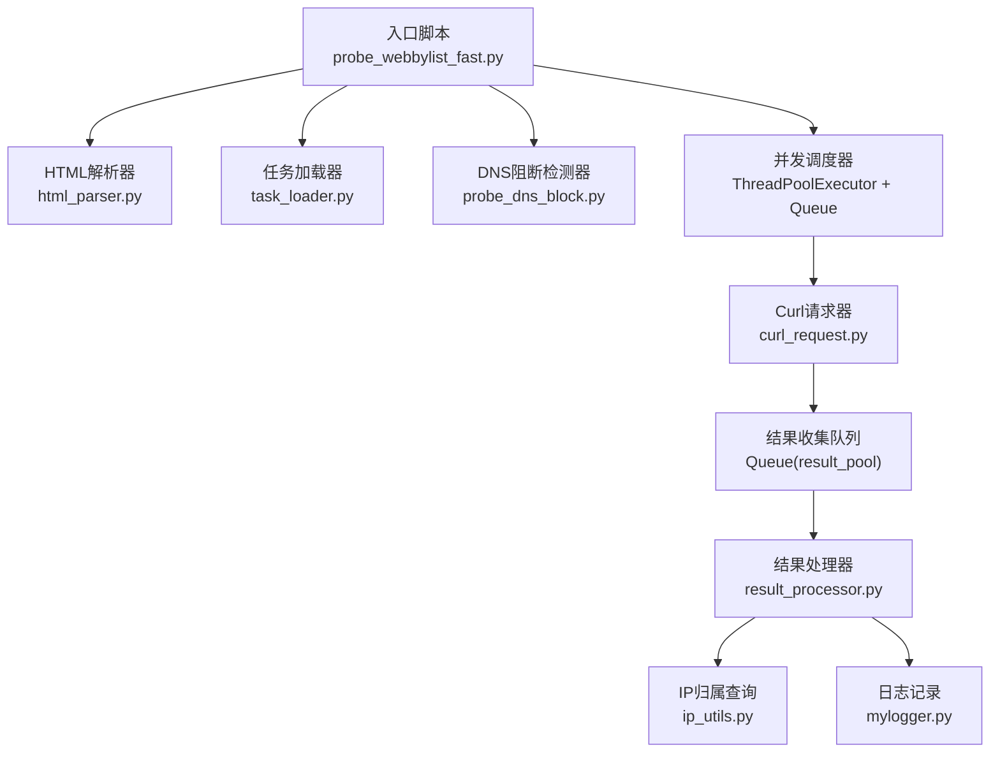
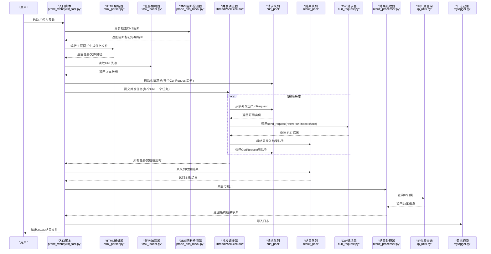
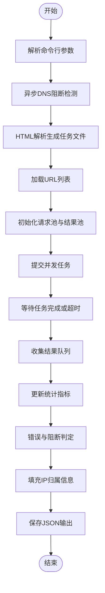
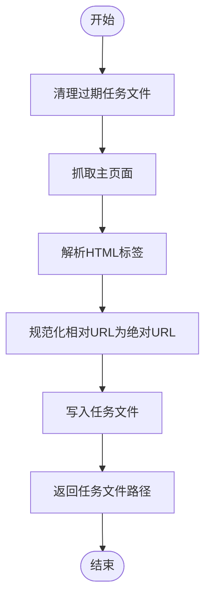
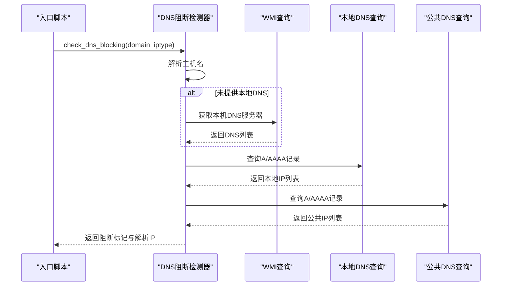
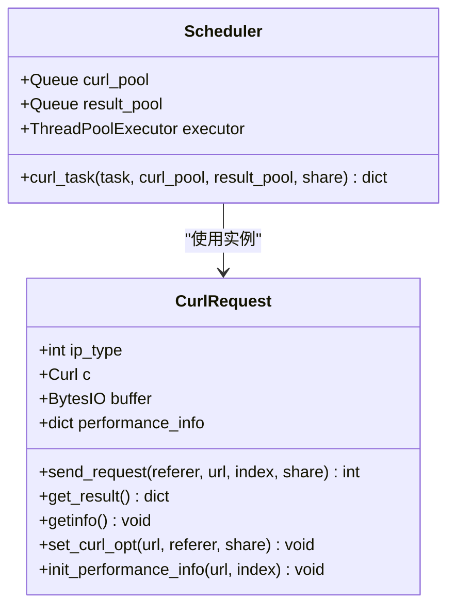
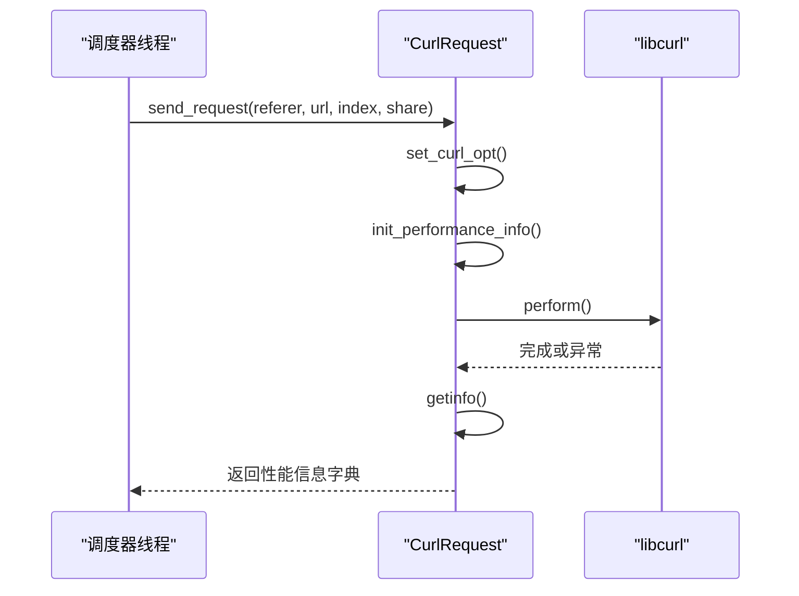
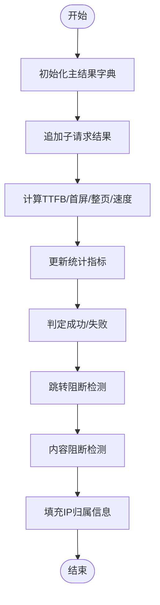
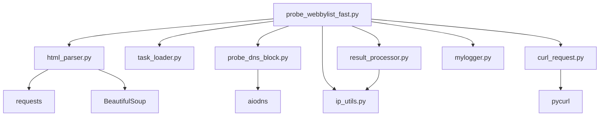

# 数据流分析

<cite>
**本文档引用的文件**
- [probe_webbylist_fast.py](file://probe_webbylist_fast/probe_webbylist_fast.py)
- [task_loader.py](file://probe_webbylist_fast/task_loader.py)
- [result_processor.py](file://probe_webbylist_fast/result_processor.py)
- [curl_request.py](file://probe_webbylist_fast/curl_request.py)
- [html_parser.py](file://probe_webbylist_fast/html_parser.py)
- [probe_dns_block.py](file://probe_webbylist_fast/probe_dns_block.py)
- [mylogger.py](file://mylogger.py)
- [ip_utils.py](file://ip_utils.py)
- [probe_webbylist_fast.spec](file://probe_webbylist_fast.spec)
</cite>

## 目录
1. [简介](#简介)
2. [项目结构](#项目结构)
3. [核心组件](#核心组件)
4. [架构总览](#架构总览)
5. [详细组件分析](#详细组件分析)
6. [依赖关系分析](#依赖关系分析)
7. [性能考量](#性能考量)
8. [故障排查指南](#故障排查指南)
9. [结论](#结论)

## 简介
本文件针对网络探测工具集“网页子资源批量探测”模块进行系统性的数据流分析。文档覆盖从输入URL到最终结果输出的完整数据流程，包括任务加载、并发处理、结果收集与统计分析等环节；深入解释Queue与ThreadPoolExecutor在数据传递中的作用，分析异步请求处理的数据流向；阐述性能指标（TTFB、DNS解析时间、TCP连接时间、页面加载时间）的测量机制；分析错误处理与异常传播的数据流，并说明在多线程环境中如何保证数据一致性。同时提供数据流图与时序图，直观展示各组件间的数据交换与控制传递。

## 项目结构
该工具集采用分层模块化设计：
- 入口与调度层：负责参数解析、DNS阻断检测、任务列表生成与并发调度
- 请求执行层：基于libcurl封装的并发请求器，支持共享会话与性能计时
- 结果处理层：负责结果聚合、统计计算、错误判定与IP归属解析
- 工具与配置层：日志、DNS阻断检测、IP归属数据库查询

图表来源
- [probe_webbylist_fast.py:102-178](file://probe_webbylist_fast/probe_webbylist_fast.py#L102-L178)
- [html_parser.py:11-78](file://probe_webbylist_fast/html_parser.py#L11-L78)
- [task_loader.py:1-12](file://probe_webbylist_fast/task_loader.py#L1-L12)
- [probe_dns_block.py:132-207](file://probe_webbylist_fast/probe_dns_block.py#L132-L207)
- [curl_request.py:9-194](file://probe_webbylist_fast/curl_request.py#L9-L194)
- [result_processor.py:25-269](file://probe_webbylist_fast/result_processor.py#L25-L269)
- [ip_utils.py:6-235](file://ip_utils.py#L6-L235)
- [mylogger.py:7-59](file://mylogger.py#L7-L59)

章节来源
- [probe_webbylist_fast.py:198-222](file://probe_webbylist_fast/probe_webbylist_fast.py#L198-L222)
- [probe_webbylist_fast.spec:4-45](file://probe_webbylist_fast.spec#L4-L45)

## 核心组件
- 入口与调度器：负责参数解析、DNS阻断检测、任务列表生成、并发调度与超时控制
- HTML解析器：抓取主页面并提取子资源URL，生成任务文件
- 任务加载器：从任务文件读取URL列表
- DNS阻断检测器：通过本地DNS与公共DNS比对判断是否被阻断
- 并发调度器：使用ThreadPoolExecutor与两个Queue实现请求并发与结果收集
- Curl请求器：封装libcurl，采集性能指标并返回结果字典
- 结果处理器：聚合子请求结果、计算统计指标、判定成功/失败与阻断类型
- IP归属查询：基于SQLite数据库查询IP归属信息
- 日志记录：统一格式化日志输出

章节来源
- [probe_webbylist_fast.py:102-178](file://probe_webbylist_fast/probe_webbylist_fast.py#L102-L178)
- [html_parser.py:11-78](file://probe_webbylist_fast/html_parser.py#L11-L78)
- [task_loader.py:1-12](file://probe_webbylist_fast/task_loader.py#L1-L12)
- [probe_dns_block.py:58-207](file://probe_webbylist_fast/probe_dns_block.py#L58-L207)
- [curl_request.py:9-194](file://probe_webbylist_fast/curl_request.py#L9-L194)
- [result_processor.py:25-269](file://probe_webbylist_fast/result_processor.py#L25-L269)
- [ip_utils.py:6-235](file://ip_utils.py#L6-L235)
- [mylogger.py:7-59](file://mylogger.py#L7-L59)

## 架构总览
整体采用“入口调度 + 并发执行 + 结果聚合”的流水线式架构。入口脚本负责准备任务与环境，HTML解析器生成任务文件，任务加载器读取URL，随后并发调度器将每个URL分配给独立的Curl请求器实例，每个实例独立完成请求与性能指标采集，结果通过队列回传至主线程，由结果处理器统一汇总与统计。

图表来源
- [probe_webbylist_fast.py:102-178](file://probe_webbylist_fast/probe_webbylist_fast.py#L102-L178)
- [html_parser.py:11-78](file://probe_webbylist_fast/html_parser.py#L11-L78)
- [task_loader.py:1-12](file://probe_webbylist_fast/task_loader.py#L1-L12)
- [probe_dns_block.py:132-207](file://probe_webbylist_fast/probe_dns_block.py#L132-L207)
- [curl_request.py:130-155](file://probe_webbylist_fast/curl_request.py#L130-L155)
- [result_processor.py:65-99](file://probe_webbylist_fast/result_processor.py#L65-L99)
- [ip_utils.py:170-186](file://ip_utils.py#L170-L186)
- [mylogger.py:7-59](file://mylogger.py#L7-L59)

## 详细组件分析

### 组件A：入口与调度器（probe_webbylist_fast.py）
职责与流程：
- 参数解析与初始化：解析命令行参数，设置日志级别、输出文件名、URL与IP类型
- DNS阻断检测：异步调用DNS阻断检测器，决定后续行为
- 子资源URL提取：调用HTML解析器抓取主页面并生成任务文件
- 任务列表加载：从任务文件读取URL列表，限制最大数量
- 并发调度：初始化共享libcurl会话，创建请求池与结果池，使用ThreadPoolExecutor提交任务
- 超时控制：遍历已完成任务，若累计耗时超过阈值则取消未完成任务
- 结果收集与统计：从结果池收集结果，更新统计指标，执行错误判定与阻断检测，填充IP归属信息，保存结果

图表来源
- [probe_webbylist_fast.py:102-178](file://probe_webbylist_fast/probe_webbylist_fast.py#L102-L178)

章节来源
- [probe_webbylist_fast.py:102-178](file://probe_webbylist_fast/probe_webbylist_fast.py#L102-L178)

### 组件B：HTML解析器（html_parser.py）
职责与流程：
- 清理过期任务文件
- 抓取主页面，记录重定向历史
- 解析HTML，提取图片、样式表、脚本等外部资源链接
- 规范化相对链接为绝对URL
- 写入任务文件，返回文件路径

图表来源
- [html_parser.py:11-78](file://probe_webbylist_fast/html_parser.py#L11-L78)

章节来源
- [html_parser.py:11-78](file://probe_webbylist_fast/html_parser.py#L11-L78)

### 组件C：任务加载器（task_loader.py）
职责与流程：
- 从任务文件逐行读取URL
- 过滤长度小于等于3的无效行
- 返回URL列表

章节来源
- [task_loader.py:1-12](file://probe_webbylist_fast/task_loader.py#L1-L12)

### 组件D：DNS阻断检测器（probe_dns_block.py）
职责与流程：
- 解析输入URL，提取主机名
- 若未显式提供DNS服务器，则通过WMI查询本机DNS
- 分别使用本地DNS与公共DNS查询A/AAAA记录
- 对比结果，判断是否被阻断（本地返回特定阻断IP且与公共DNS不一致）

图表来源
- [probe_dns_block.py:132-207](file://probe_webbylist_fast/probe_dns_block.py#L132-L207)

章节来源
- [probe_dns_block.py:58-207](file://probe_webbylist_fast/probe_dns_block.py#L58-L207)

### 组件E：并发调度器与队列（probe_webbylist_fast.py + curl_request.py）
职责与流程：
- 请求池（Queue）：存放可复用的CurlRequest实例，避免频繁创建销毁
- 结果池（Queue）：收集各线程返回的结果字典
- 线程池（ThreadPoolExecutor）：按CPU核心数+4创建工作线程，每个线程执行curl_task
- curl_task：从请求池取出实例，调用CurlRequest.send_request，获取结果后放回请求池并写入结果池

图表来源
- [curl_request.py:9-194](file://probe_webbylist_fast/curl_request.py#L9-L194)
- [probe_webbylist_fast.py:66-99](file://probe_webbylist_fast/probe_webbylist_fast.py#L66-L99)

章节来源
- [probe_webbylist_fast.py:66-99](file://probe_webbylist_fast/probe_webbylist_fast.py#L66-L99)
- [curl_request.py:9-194](file://probe_webbylist_fast/curl_request.py#L9-L194)

### 组件F：Curl请求器（curl_request.py）
职责与流程：
- 初始化libcurl句柄与性能信息字典
- set_curl_opt：设置IP版本、DNS服务器、重定向、SSL验证、超时、User-Agent等选项，并绑定共享会话
- send_request：设置请求参数，记录起止时间，执行perform，捕获异常并记录执行码与错误消息，调用getinfo采集性能指标
- getinfo：读取总时间、DNS/TCP/SSL/TTFB、HTTP状态码、重定向次数、内容类型、主IP、有效URL等

图表来源
- [curl_request.py:130-155](file://probe_webbylist_fast/curl_request.py#L130-L155)
- [curl_request.py:157-194](file://probe_webbylist_fast/curl_request.py#L157-L194)

章节来源
- [curl_request.py:9-194](file://probe_webbylist_fast/curl_request.py#L9-L194)

### 组件G：结果处理器（result_processor.py）
职责与流程：
- 初始化结果字典：包含主请求指标与子请求列表
- process_one_result：将单条子请求结果合并到主字典，累加下载大小，填充DNS/TCP/SSL/TTFB/总时间、HTTP状态、速度、首屏/整页时间等
- update_result_statistics：统计成功数、成功率、总测试时间
- calc_suburl_metrics：筛选成功请求，按结束时间排序，计算首屏与整页时间（PP90），计算整页速度
- check_success/check_jump_block/check_body_block：根据执行码与HTTP状态判定成功与否，识别跳转阻断与内容阻断
- fill_ip_info_fast：查询IP归属，修正时间戳为相对时间

图表来源
- [result_processor.py:25-269](file://probe_webbylist_fast/result_processor.py#L25-L269)

章节来源
- [result_processor.py:25-269](file://probe_webbylist_fast/result_processor.py#L25-L269)

### 组件H：IP归属查询（ip_utils.py）
职责与流程：
- 基于SQLite数据库查询IPv4/IPv6归属信息
- 支持CDN与普通IP库查询
- 统计不同IP组的数量（本网本省、本网外省、异网、其他、空）

章节来源
- [ip_utils.py:6-235](file://ip_utils.py#L6-L235)

### 组件I：日志记录（mylogger.py）
职责与流程：
- 提供统一的日志接口，支持控制台与文件输出，带轮转策略

章节来源
- [mylogger.py:7-59](file://mylogger.py#L7-L59)

## 依赖关系分析
- 模块内聚性：各模块职责清晰，耦合度低
- 外部依赖：pycurl、aiodns、requests、BeautifulSoup、sqlite3、logging、concurrent.futures、asyncio
- 关键依赖链：
  - 入口脚本依赖HTML解析器、任务加载器、DNS阻断检测器、并发调度器、结果处理器、IP归属查询、日志记录
  - 并发调度器依赖Curl请求器与两个Queue
  - 结果处理器依赖IP归属查询与日志记录

图表来源
- [probe_webbylist_fast.py:14-20](file://probe_webbylist_fast/probe_webbylist_fast.py#L14-L20)
- [html_parser.py:5-6](file://probe_webbylist_fast/html_parser.py#L5-L6)
- [probe_dns_block.py:4](file://probe_webbylist_fast/probe_dns_block.py#L4)
- [curl_request.py:3](file://probe_webbylist_fast/curl_request.py#L3)

章节来源
- [probe_webbylist_fast.py:14-20](file://probe_webbylist_fast/probe_webbylist_fast.py#L14-L20)

## 性能考量
- 并发模型：使用ThreadPoolExecutor与Queue实现请求并发，请求池复用CurlRequest实例，减少初始化开销
- 超时控制：入口脚本对总耗时进行监控，超过阈值即取消未完成任务，避免长时间阻塞
- 指标采集：
  - DNS解析时间：NAMELOOKUP_TIME
  - TCP连接时间：CONNECT_TIME - NAMELOOKUP_TIME
  - SSL握手时间：APPCONNECT_TIME - CONNECT_TIME
  - TTFB：STARTTRANSFER_TIME - PRETRANSFER_TIME
  - 页面加载时间：TOTAL_TIME
  - 首屏/整页时间：基于子请求结束时间的PP90计算
  - 整页速度：总字节数/总测试时间
- I/O与网络：HTML解析与请求均设置合理超时，避免阻塞；共享libcurl会话提升DNS与SSL会话复用效率

章节来源
- [curl_request.py:157-194](file://probe_webbylist_fast/curl_request.py#L157-L194)
- [result_processor.py:206-236](file://probe_webbylist_fast/result_processor.py#L206-L236)
- [probe_webbylist_fast.py:122-136](file://probe_webbylist_fast/probe_webbylist_fast.py#L122-L136)

## 故障排查指南
- DNS阻断：若返回阻断标记，检查本地DNS与公共DNS差异，确认是否被强制解析为阻断IP
- 超时与取消：若总耗时超过阈值，任务会被取消；适当提高阈值或减少并发数
- 错误码映射：根据执行码与HTTP状态码映射到具体错误类型，便于定位问题
- 日志定位：启用DEBUG级别日志，关注CurlRequest与调度器线程的关键节点输出
- IP归属：若IP归属为空，检查数据库文件与网络连接

章节来源
- [probe_dns_block.py:132-207](file://probe_webbylist_fast/probe_dns_block.py#L132-L207)
- [result_processor.py:148-199](file://probe_webbylist_fast/result_processor.py#L148-L199)
- [mylogger.py:7-59](file://mylogger.py#L7-L59)

## 结论
该工具集通过清晰的模块划分与合理的并发模型，实现了从URL到结果的高效数据流。Queue与ThreadPoolExecutor在数据传递中承担了关键角色：请求池确保实例复用，结果池保障结果汇聚，线程池实现高吞吐并发。性能指标采集与统计分析覆盖DNS、TCP、SSL、TTFB与页面加载等关键阶段，错误处理与异常传播在多线程环境下通过队列与日志得到可靠保障。建议在大规模场景下进一步优化超时阈值与并发度，并增强对异常情况的快速失败与重试策略。