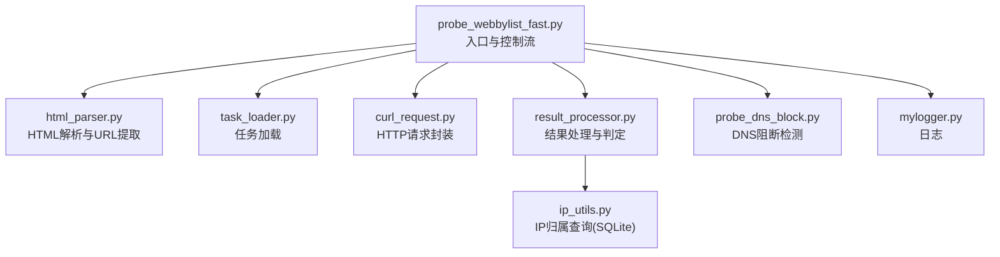
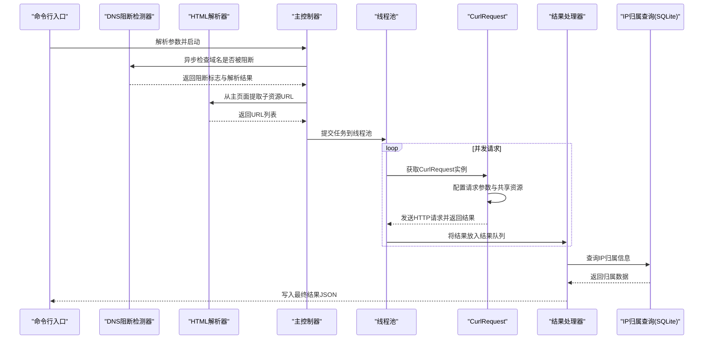
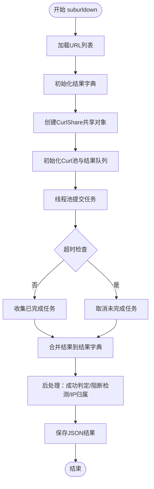
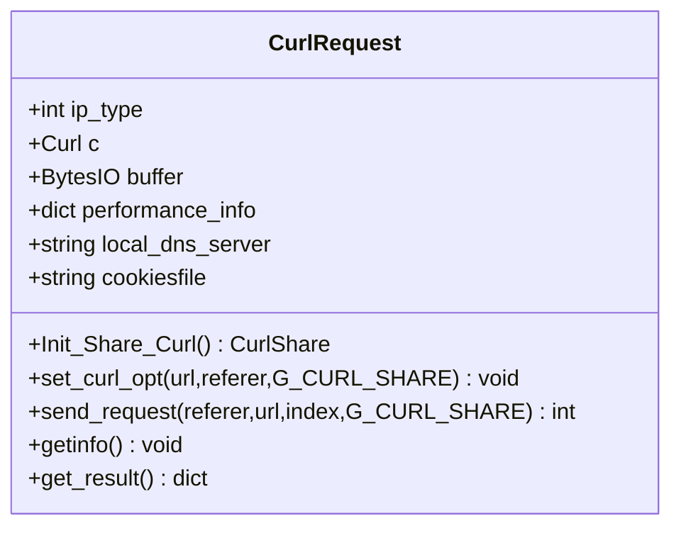
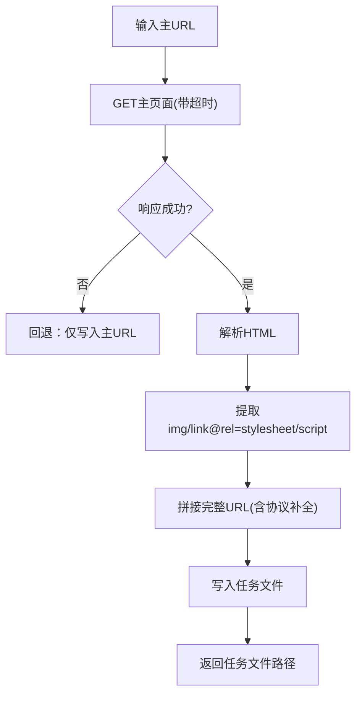
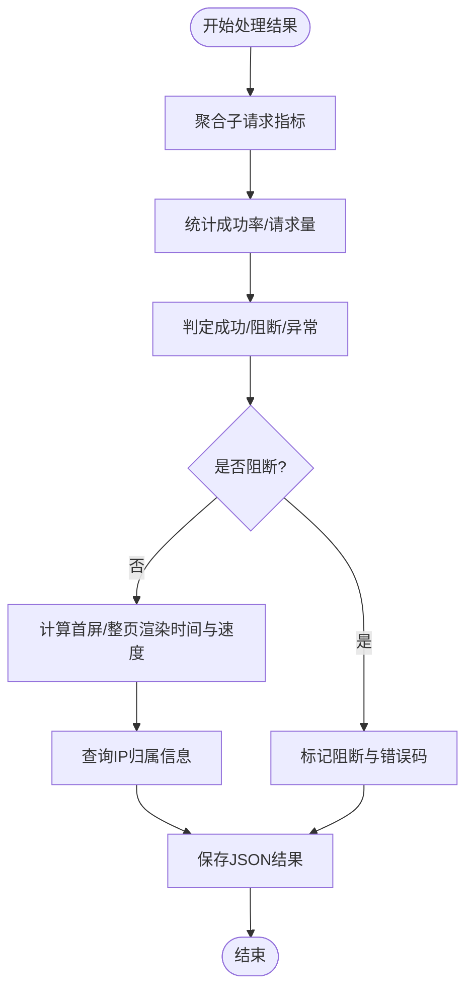
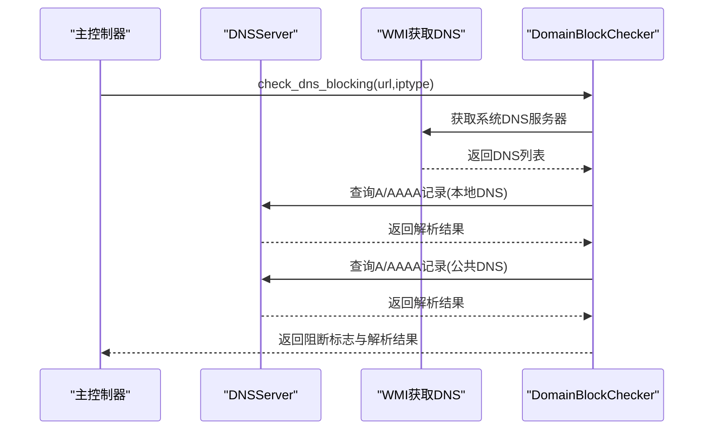
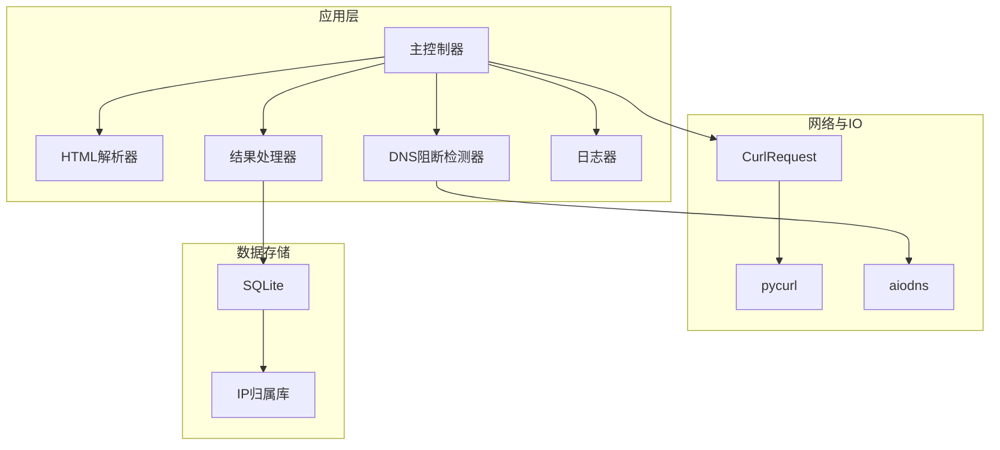
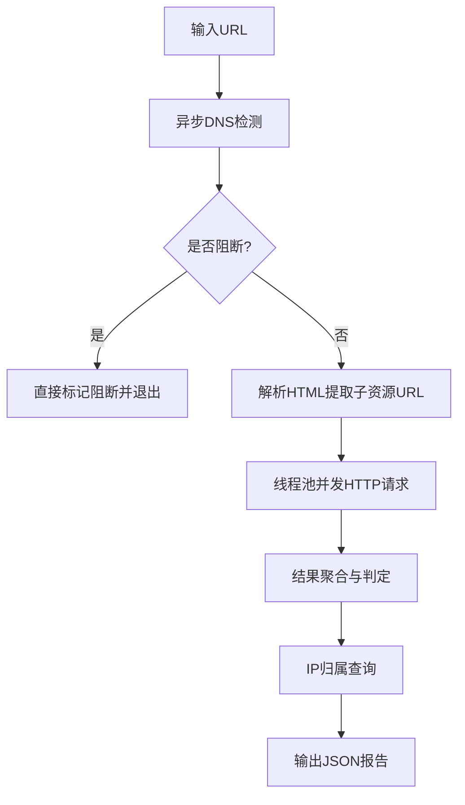

# 架构概览

<cite>
**本文档引用的文件**
- [probe_webbylist_fast.py](file://probe_webbylist_fast/probe_webbylist_fast.py)
- [curl_request.py](file://probe_webbylist_fast/curl_request.py)
- [task_loader.py](file://probe_webbylist_fast/task_loader.py)
- [result_processor.py](file://probe_webbylist_fast/result_processor.py)
- [html_parser.py](file://probe_webbylist_fast/html_parser.py)
- [probe_dns_block.py](file://probe_webbylist_fast/probe_dns_block.py)
- [mylogger.py](file://mylogger.py)
- [ip_utils.py](file://ip_utils.py)
- [probe_webbylist_fast.spec](file://probe_webbylist_fast/probe_webbylist_fast.spec)
- [main.spec](file://main.spec)
</cite>

## 目录
1. [简介](#简介)
2. [项目结构](#项目结构)
3. [核心组件](#核心组件)
4. [架构总览](#架构总览)
5. [详细组件分析](#详细组件分析)
6. [依赖关系分析](#依赖关系分析)
7. [性能考量](#性能考量)
8. [故障排查指南](#故障排查指南)
9. [结论](#结论)
10. [附录](#附录)

## 简介
本文件为网络探测工具集的架构概览文档，聚焦于“网页子资源批量探测”模块（probe_webbylist_fast），系统通过异步DNS检测与多线程并发HTTP请求相结合的方式，实现对目标站点主页面及其子资源的快速探测与性能指标采集。文档从模块化架构、异步编程模式、组件交互关系、技术栈选型（asyncio、pycurl、SQLite）等方面进行深入解析，并给出系统边界、数据流与控制流、性能优化建议与故障排查要点。

## 项目结构
该工具集采用按功能域分层的模块化组织方式：
- 探测入口与控制流：probe_webbylist_fast.py
- 网络请求封装：curl_request.py
- 任务加载与HTML解析：task_loader.py、html_parser.py
- 结果处理与判定：result_processor.py
- DNS阻断检测：probe_dns_block.py
- 日志：mylogger.py
- IP归属查询：ip_utils.py（SQLite）
- 打包配置：probe_webbylist_fast.spec、main.spec

图表来源
- [probe_webbylist_fast.py:102-191](file://probe_webbylist_fast/probe_webbylist_fast.py#L102-L191)
- [html_parser.py:11-78](file://probe_webbylist_fast/html_parser.py#L11-L78)
- [task_loader.py:1-12](file://probe_webbylist_fast/task_loader.py#L1-L12)
- [curl_request.py:9-194](file://probe_webbylist_fast/curl_request.py#L9-L194)
- [result_processor.py:25-269](file://probe_webbylist_fast/result_processor.py#L25-L269)
- [probe_dns_block.py:58-207](file://probe_webbylist_fast/probe_dns_block.py#L58-L207)
- [mylogger.py:7-59](file://mylogger.py#L7-L59)
- [ip_utils.py:6-235](file://ip_utils.py#L6-L235)

章节来源
- [probe_webbylist_fast.py:102-191](file://probe_webbylist_fast/probe_webbylist_fast.py#L102-L191)
- [probe_webbylist_fast.spec:4-44](file://probe_webbylist_fast/probe_webbylist_fast.spec#L4-L44)
- [main.spec:4-44](file://main.spec#L4-L44)

## 核心组件
- 探测主流程控制器：负责任务初始化、并发调度、超时控制、结果聚合与落盘。
- HTTP请求封装器：基于pycurl，统一设置连接参数、共享Cookie/DNS/SSL会话、采集性能指标。
- HTML解析器：抓取主页面，解析图片、样式表、脚本等子资源链接，生成任务列表。
- 结果处理器：汇总子请求指标、计算成功率、判定阻断与异常、填充IP归属信息。
- DNS阻断检测器：使用aiodns异步查询，对比本地与公共DNS结果，识别阻断。
- 日志器：支持控制台与文件轮转输出。
- IP归属查询器：基于SQLite数据库查询IP段归属，支持IPv4/IPv6。

章节来源
- [probe_webbylist_fast.py:102-191](file://probe_webbylist_fast/probe_webbylist_fast.py#L102-L191)
- [curl_request.py:9-194](file://probe_webbylist_fast/curl_request.py#L9-L194)
- [html_parser.py:11-78](file://probe_webbylist_fast/html_parser.py#L11-L78)
- [result_processor.py:25-269](file://probe_webbylist_fast/result_processor.py#L25-L269)
- [probe_dns_block.py:58-207](file://probe_webbylist_fast/probe_dns_block.py#L58-L207)
- [mylogger.py:7-59](file://mylogger.py#L7-L59)
- [ip_utils.py:6-235](file://ip_utils.py#L6-L235)

## 架构总览
系统采用“异步DNS检测 + 多线程并发HTTP请求”的混合并发模型：
- 异步阶段：使用asyncio与aiodns进行DNS阻断检测，避免阻塞主线程。
- 并发阶段：使用ThreadPoolExecutor与Queue池化管理CurlRequest实例，实现高并发HTTP探测。
- 共享资源：通过pycurl的CurlShare对象共享Cookie/DNS/SSL会话，降低重复开销。
- 数据流：HTML解析生成URL列表 → DNS阻断检测 → 并发HTTP请求 → 结果聚合 → IP归属查询 → 输出JSON。

图表来源
- [probe_webbylist_fast.py:180-196](file://probe_webbylist_fast/probe_webbylist_fast.py#L180-L196)
- [probe_dns_block.py:132-207](file://probe_webbylist_fast/probe_dns_block.py#L132-L207)
- [html_parser.py:11-78](file://probe_webbylist_fast/html_parser.py#L11-L78)
- [curl_request.py:80-155](file://probe_webbylist_fast/curl_request.py#L80-L155)
- [result_processor.py:65-147](file://probe_webbylist_fast/result_processor.py#L65-L147)
- [ip_utils.py:170-186](file://ip_utils.py#L170-L186)

## 详细组件分析

### 组件A：主控制器与并发调度
- 职责：加载任务、初始化结果字典、创建Curl共享对象、线程池并发执行、超时控制、结果聚合与落盘。
- 关键点：
  - 使用Queue作为CurlRequest池与结果队列，避免频繁创建销毁对象。
  - ThreadPoolExecutor配合as_completed实现有序回收与超时控制。
  - 通过全局CurlShare减少DNS/Cookie/SSL会话重复建立成本。

图表来源
- [probe_webbylist_fast.py:102-178](file://probe_webbylist_fast/probe_webbylist_fast.py#L102-L178)

章节来源
- [probe_webbylist_fast.py:102-178](file://probe_webbylist_fast/probe_webbylist_fast.py#L102-L178)

### 组件B：HTTP请求封装器（CurlRequest）
- 职责：封装pycurl请求，统一设置参数、采集性能指标、共享资源管理。
- 关键点：
  - 支持IPv4/IPv6解析切换与自定义DNS服务器。
  - 通过CurlShare共享Cookie/DNS/SSL会话，提升复用效率。
  - 采集时间链路指标（DNS/TCP/SSL/TTFB/总时长）、HTTP状态码、重定向次数、下载速度等。
  - 错误码映射与异常捕获，保证探测稳定性。

图表来源
- [curl_request.py:9-194](file://probe_webbylist_fast/curl_request.py#L9-L194)

章节来源
- [curl_request.py:9-194](file://probe_webbylist_fast/curl_request.py#L9-L194)

### 组件C：HTML解析与URL提取
- 职责：抓取主页面，解析img/link/script标签，生成相对或绝对URL，写入临时任务文件。
- 关键点：
  - 使用BeautifulSoup解析HTML，支持相对路径拼接与协议补全。
  - 对data:等非HTTP资源进行过滤。
  - 清理过期任务文件，避免磁盘膨胀。

图表来源
- [html_parser.py:11-78](file://probe_webbylist_fast/html_parser.py#L11-L78)

章节来源
- [html_parser.py:11-78](file://probe_webbylist_fast/html_parser.py#L11-L78)

### 组件D：结果处理与判定
- 职责：聚合子请求指标、计算成功率、判定阻断与异常、填充IP归属信息。
- 关键点：
  - 主请求指标（DNS/TCP/SSL/TTFB/总时长）与首屏/整页渲染时间计算。
  - 成功判定：HTTP 2xx且执行成功；失败映射到统一错误码。
  - 阻断判定：跳转至本地回环/私有地址、特定IP段命中、内容关键字等。
  - IP归属：优先IPv6，其次CDN库，再回退标准库，支持本地网络运营商识别。

图表来源
- [result_processor.py:65-269](file://probe_webbylist_fast/result_processor.py#L65-L269)
- [ip_utils.py:170-225](file://ip_utils.py#L170-L225)

章节来源
- [result_processor.py:65-269](file://probe_webbylist_fast/result_processor.py#L65-L269)
- [ip_utils.py:170-225](file://ip_utils.py#L170-L225)

### 组件E：DNS阻断检测器
- 职责：异步查询域名解析结果，对比本地DNS与公共DNS差异，判断阻断。
- 关键点：
  - 使用aiodns进行A/AAAA记录查询，支持自定义nameservers与超时。
  - 通过WMI获取系统默认DNS服务器，兼容Windows环境。
  - 定义阻断IP白名单，结合结果差异判定阻断。

图表来源
- [probe_dns_block.py:132-207](file://probe_webbylist_fast/probe_dns_block.py#L132-L207)

章节来源
- [probe_dns_block.py:58-207](file://probe_webbylist_fast/probe_dns_block.py#L58-L207)

### 组件F：日志与打包配置
- 日志：MyLogger提供控制台与文件轮转输出，格式包含时间、文件名、行号、线程ID、级别与消息。
- 打包：使用PyInstaller spec文件将模块打包为独立可执行程序，便于部署。

章节来源
- [mylogger.py:7-59](file://mylogger.py#L7-L59)
- [probe_webbylist_fast.spec:4-44](file://probe_webbylist_fast/probe_webbylist_fast.spec#L4-L44)
- [main.spec:4-44](file://main.spec#L4-L44)

## 依赖关系分析
- 模块内聚性：各模块职责清晰，耦合度低，通过函数接口与队列进行交互。
- 外部依赖：
  - pycurl：高性能HTTP/FTP等协议客户端，支持CurlShare共享。
  - aiodns：异步DNS解析，配合asyncio实现非阻塞查询。
  - requests/beautifulsoup：用于主页面抓取与HTML解析。
  - sqlite3：IP归属查询的轻量级数据库访问。
- 并发与资源共享：
  - 线程池：ThreadPoolExecutor管理工作线程，避免过多线程导致上下文切换开销。
  - Queue池：CurlRequest实例池化，减少对象创建与销毁成本。
  - CurlShare：共享Cookie/DNS/SSL会话，降低重复握手与解析成本。

图表来源
- [probe_webbylist_fast.py:102-191](file://probe_webbylist_fast/probe_webbylist_fast.py#L102-L191)
- [curl_request.py:9-194](file://probe_webbylist_fast/curl_request.py#L9-L194)
- [html_parser.py:11-78](file://probe_webbylist_fast/html_parser.py#L11-L78)
- [result_processor.py:25-269](file://probe_webbylist_fast/result_processor.py#L25-L269)
- [probe_dns_block.py:58-207](file://probe_webbylist_fast/probe_dns_block.py#L58-L207)
- [ip_utils.py:6-235](file://ip_utils.py#L6-L235)

章节来源
- [probe_webbylist_fast.py:102-191](file://probe_webbylist_fast/probe_webbylist_fast.py#L102-L191)
- [curl_request.py:9-194](file://probe_webbylist_fast/curl_request.py#L9-L194)
- [html_parser.py:11-78](file://probe_webbylist_fast/html_parser.py#L11-L78)
- [result_processor.py:25-269](file://probe_webbylist_fast/result_processor.py#L25-L269)
- [probe_dns_block.py:58-207](file://probe_webbylist_fast/probe_dns_block.py#L58-L207)
- [ip_utils.py:6-235](file://ip_utils.py#L6-L235)

## 性能考量
- 技术栈优势与权衡
  - asyncio：在DNS查询阶段实现非阻塞，避免主线程等待，提升整体吞吐。
  - pycurl：底层C实现，性能优异，支持CurlShare共享，显著降低重复握手与解析成本。
  - SQLite：轻量、零配置，适合小规模IP归属查询；若并发极高，可考虑连接池或外部数据库。
- 并发策略
  - 线程池大小：CPU核心数+4，兼顾I/O密集与少量CPU占用的请求场景。
  - Queue池：限制最大并发，防止内存与句柄溢出。
  - 超时控制：总超时与单任务超时结合，避免长时间卡死。
- 资源共享
  - CurlShare共享Cookie/DNS/SSL会话，减少重复开销；注意线程安全与生命周期管理。
- I/O与解析
  - HTML解析与DNS查询采用异步，HTTP请求采用线程池并发，平衡了CPU与I/O负载。
- 建议
  - 对于更高并发，可引入CurlMulti多句柄模型以进一步提升吞吐。
  - SQLite查询可增加索引或缓存热点IP，减少重复查询。
  - 在Windows上使用WindowsSelectorEventLoopPolicy，确保事件循环兼容性。

[本节为通用性能讨论，不直接分析具体文件]

## 故障排查指南
- 常见问题定位
  - DNS阻断：检查DomainBlockChecker返回的阻断标志与解析结果，确认本地DNS与公共DNS差异。
  - HTTP超时/慢速：查看CurlRequest的错误码映射与getinfo采集的时间链路指标，定位瓶颈。
  - IP归属缺失：确认IP库文件存在且可读，检查SQLite连接URI与权限。
  - 日志：通过MyLogger输出的线程ID与时间戳定位问题发生位置。
- 关键检查点
  - CurlRequest.set_curl_opt与getinfo异常捕获。
  - result_processor中错误码映射与阻断判定逻辑。
  - html_parser的URL拼接与任务文件清理逻辑。

章节来源
- [probe_dns_block.py:132-207](file://probe_webbylist_fast/probe_dns_block.py#L132-L207)
- [curl_request.py:115-194](file://probe_webbylist_fast/curl_request.py#L115-L194)
- [result_processor.py:148-269](file://probe_webbylist_fast/result_processor.py#L148-L269)
- [html_parser.py:29-78](file://probe_webbylist_fast/html_parser.py#L29-L78)
- [mylogger.py:30-59](file://mylogger.py#L30-L59)

## 结论
该系统通过“异步DNS + 多线程HTTP”的组合模式，在保证探测准确性的同时实现了高并发与低开销。pycurl的CurlShare共享机制与线程池池化管理有效降低了资源消耗；SQLite的轻量特性满足中小规模IP归属查询需求。未来可在CurlMulti与数据库层面进一步优化，以适配更高并发与更大规模的探测场景。

[本节为总结性内容，不直接分析具体文件]

## 附录
- 系统边界与集成模式
  - 边界：面向目标站点的子资源探测，输出标准化JSON报告。
  - 集成：可作为更大监控体系中的探测节点，通过命令行参数与日志输出与上层系统对接。
- 关键流程图（概念示意）

[本图为概念示意，不对应具体源文件]