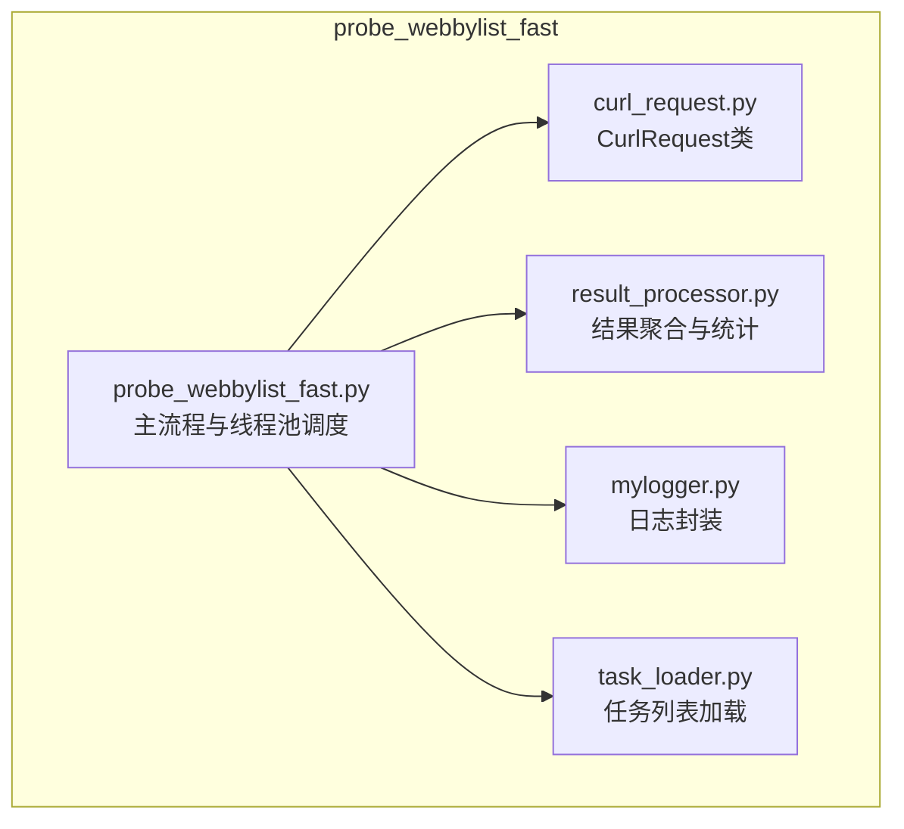
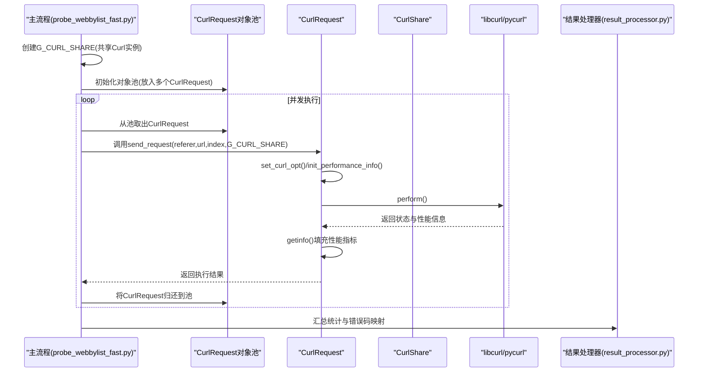
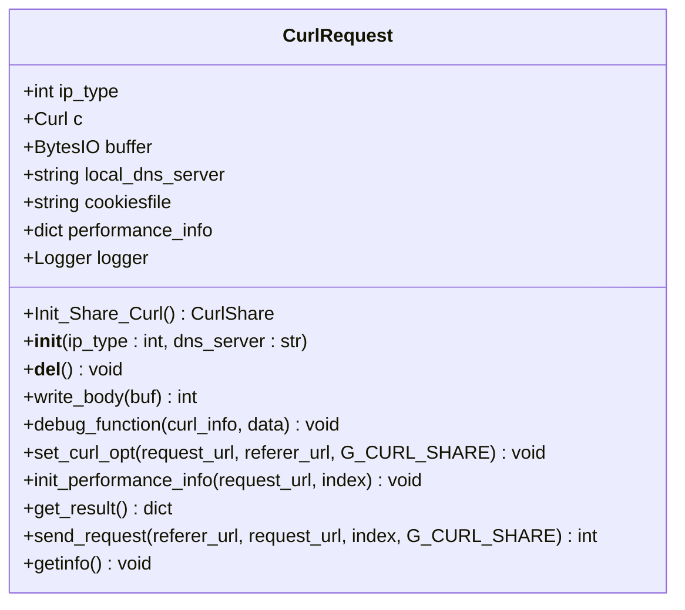
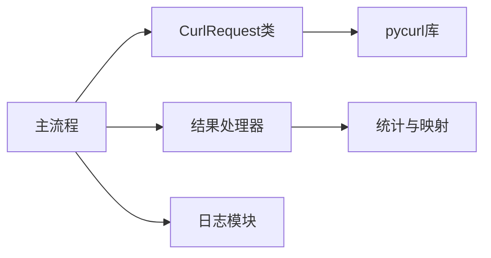

# CurlRequest类设计

<cite>
**本文引用的文件**
- [curl_request.py](file://probe_webbylist_fast/curl_request.py)
- [probe_webbylist_fast.py](file://probe_webbylist_fast/probe_webbylist_fast.py)
- [result_processor.py](file://probe_webbylist_fast/result_processor.py)
- [mylogger.py](file://probe_webbylist_fast/mylogger.py)
- [task_loader.py](file://probe_webbylist_fast/task_loader.py)
</cite>

## 目录
1. [简介](#简介)
2. [项目结构](#项目结构)
3. [核心组件](#核心组件)
4. [架构总览](#架构总览)
5. [详细组件分析](#详细组件分析)
6. [依赖分析](#依赖分析)
7. [性能考量](#性能考量)
8. [故障排查指南](#故障排查指南)
9. [结论](#结论)
10. [附录](#附录)

## 简介
本文围绕CurlRequest类展开，系统性阐述其在高性能HTTP请求中的设计与实现，重点包括：
- 共享Curl实例管理机制：通过静态方法创建CurlShare对象以实现Cookie、DNS和SSL会话共享。
- 初始化流程：IP类型选择、缓冲区设置、性能指标字典构建。
- 请求配置方法set_curl_opt：DNS服务器设置、超时参数配置、调试功能启用。
- 请求发送流程send_request：URL验证、性能信息初始化、结果获取。
- 性能指标收集机制：各阶段时间指标计算与错误码映射。
- 使用示例与最佳实践：如何正确使用CurlRequest进行高性能HTTP请求处理。

## 项目结构
该模块位于“probe_webbylist_fast”目录下，围绕CurlRequest类组织了任务加载、结果处理、日志记录等配套模块，形成一个完整的HTTP探测与性能统计子系统。

图表来源
- [curl_request.py:1-209](file://probe_webbylist_fast/curl_request.py#L1-L209)
- [probe_webbylist_fast.py:1-222](file://probe_webbylist_fast/probe_webbylist_fast.py#L1-L222)
- [result_processor.py:1-269](file://probe_webbylist_fast/result_processor.py#L1-L269)
- [mylogger.py:1-59](file://probe_webbylist_fast/mylogger.py#L1-L59)
- [task_loader.py:1-12](file://probe_webbylist_fast/task_loader.py#L1-L12)

章节来源
- [curl_request.py:1-209](file://probe_webbylist_fast/curl_request.py#L1-L209)
- [probe_webbylist_fast.py:1-222](file://probe_webbylist_fast/probe_webbylist_fast.py#L1-L222)

## 核心组件
- CurlRequest类：负责单次HTTP请求的配置、执行与性能指标采集，支持IPv4/IPv6解析策略、自定义DNS服务器、调试输出、共享Curl实例等能力。
- 共享Curl实例：通过静态方法创建CurlShare对象，开启Cookie、DNS和SSL会话共享，提升多请求场景下的性能与一致性。
- 主流程与线程池：在主程序中创建共享CurlShare，并维护CurlRequest对象池，配合线程池并发执行请求。
- 结果处理器：对每个请求的结果进行聚合、统计与错误码映射，生成最终报告。

章节来源
- [curl_request.py:9-209](file://probe_webbylist_fast/curl_request.py#L9-L209)
- [probe_webbylist_fast.py:66-178](file://probe_webbylist_fast/probe_webbylist_fast.py#L66-L178)
- [result_processor.py:65-100](file://probe_webbylist_fast/result_processor.py#L65-L100)

## 架构总览
CurlRequest在整体架构中承担“请求执行器”的角色，与主流程协同工作，形成如下交互：

图表来源
- [probe_webbylist_fast.py:102-178](file://probe_webbylist_fast/probe_webbylist_fast.py#L102-L178)
- [curl_request.py:80-170](file://probe_webbylist_fast/curl_request.py#L80-L170)
- [result_processor.py:65-100](file://probe_webbylist_fast/result_processor.py#L65-L100)

## 详细组件分析

### 共享Curl实例管理机制
- 静态方法Init_Share_Curl用于创建CurlShare对象，并设置共享类型为Cookie、DNS和SSL会话，从而在多请求间复用缓存，减少重复解析与握手开销。
- 主流程中创建全局共享实例后，将其传入每个CurlRequest的set_curl_opt方法，确保同一进程内的多个Curl句柄共享这些资源。

章节来源
- [curl_request.py:11-17](file://probe_webbylist_fast/curl_request.py#L11-L17)
- [probe_webbylist_fast.py:107-115](file://probe_webbylist_fast/probe_webbylist_fast.py#L107-L115)

### CurlRequest类初始化
- IP类型选择：构造函数接收ip_type参数，决定使用IPv4或IPv6解析策略。
- 缓冲区设置：内部使用BytesIO作为响应写入缓冲区，便于后续读取与分析。
- 性能指标字典：初始化包含URL、各阶段耗时、下载/上传大小与速度、索引、主IP、有效URL、HTTP状态码、执行码、错误消息、起止时间、成功标记、内容类型、最小正文片段等字段。
- 日志器：为CurlRequest单独建立日志器，便于调试与问题定位。

章节来源
- [curl_request.py:18-49](file://probe_webbylist_fast/curl_request.py#L18-L49)

### HTTP请求配置方法set_curl_opt
- 解析策略：根据ip_type设置IPRESOLVE为V4或V6。
- DNS服务器：若提供了local_dns_server，则设置DNS_SERVERS。
- URL与回调：设置URL、写数据回调、头部写入、跟随重定向、自动Referer等。
- 安全与连接：关闭SSL校验与主机名校验；设置连接超时与总超时；禁用快速重用与强制新连接；限制最大重定向次数；关闭TCP KeepAlive。
- 用户代理与请求头：设置浏览器标准UA与常用请求头，降低被WAF/反爬拦截概率。
- 调试功能：启用VERBOSE与DEBUGFUNCTION，记录调试信息并尝试提取Primary IP。
- 共享实例：若传入G_CURL_SHARE，则先尝试unsetopt再setopt绑定共享实例。

章节来源
- [curl_request.py:80-132](file://probe_webbylist_fast/curl_request.py#L80-L132)

### 请求发送流程send_request
- URL验证：判断referer是否为IP地址，若是则跳过set_curl_opt，直接使用当前Curl实例配置。
- 性能信息初始化：记录开始时间、URL与索引。
- 执行请求：调用perform()，捕获异常并记录执行码与错误消息。
- 结束时间与结果获取：记录结束时间，调用getinfo()填充性能指标；根据HTTP状态码范围设置success标志。

章节来源
- [curl_request.py:145-170](file://probe_webbylist_fast/curl_request.py#L145-L170)

### 性能指标收集机制
- getinfo()阶段：仅当execute_code非负时进行指标读取，避免异常状态下读取不一致。
- 时间指标：总耗时、DNS解析、TCP连接、SSL握手、预传输、首字节到达、重定向耗时等；部分差值按正数约束。
- 内容与重定向：内容类型、重定向次数、有效URL、主IP等。
- 成功判定：HTTP状态码在2xx范围内视为成功。
- 错误码映射：在结果处理器中对常见execute_code进行映射，结合错误消息前缀进一步细化错误类型。

章节来源
- [curl_request.py:172-209](file://probe_webbylist_fast/curl_request.py#L172-L209)
- [result_processor.py:148-199](file://probe_webbylist_fast/result_processor.py#L148-L199)

### 类图（代码级）

图表来源
- [curl_request.py:9-209](file://probe_webbylist_fast/curl_request.py#L9-L209)

## 依赖分析
- CurlRequest依赖pycurl库进行底层网络操作与性能信息读取。
- 主流程通过线程池与对象池管理CurlRequest实例，提高并发效率。
- 结果处理器对每个请求的结果进行聚合与统计，并进行错误码映射。
- 日志模块MyLogger统一输出格式，便于问题排查。

图表来源
- [curl_request.py:1-209](file://probe_webbylist_fast/curl_request.py#L1-L209)
- [probe_webbylist_fast.py:1-222](file://probe_webbylist_fast/probe_webbylist_fast.py#L1-L222)
- [result_processor.py:1-269](file://probe_webbylist_fast/result_processor.py#L1-L269)
- [mylogger.py:1-59](file://probe_webbylist_fast/mylogger.py#L1-L59)

章节来源
- [curl_request.py:1-209](file://probe_webbylist_fast/curl_request.py#L1-L209)
- [probe_webbylist_fast.py:1-222](file://probe_webbylist_fast/probe_webbylist_fast.py#L1-L222)
- [result_processor.py:1-269](file://probe_webbylist_fast/result_processor.py#L1-L269)
- [mylogger.py:1-59](file://probe_webbylist_fast/mylogger.py#L1-L59)

## 性能考量
- 共享实例：通过CurlShare复用Cookie、DNS与SSL会话，显著降低重复解析与握手成本。
- 对象池：在高并发场景下复用CurlRequest实例，减少频繁创建销毁带来的开销。
- 超时与限速：设置低速阈值与超时时间，避免慢连接占用资源。
- 请求头伪装：添加浏览器标准请求头，有助于绕过简单防护策略。
- 统计维度：提供DNS、TCP、SSL、TTFB、总耗时等细粒度指标，便于性能分析与优化。

## 故障排查指南
- 调试输出：启用VERBOSE与DEBUGFUNCTION，观察连接尝试与错误信息，辅助定位IP解析与连接问题。
- 错误码映射：在结果处理器中对常见execute_code进行映射，结合错误消息前缀可快速识别超时、解析失败、连接失败等问题。
- 日志级别：使用MyLogger统一输出格式，必要时提升日志级别以获取更详细信息。
- 资源释放：确保共享CurlShare在主流程结束时正确关闭，避免资源泄漏。

章节来源
- [curl_request.py:69-79](file://probe_webbylist_fast/curl_request.py#L69-L79)
- [result_processor.py:148-199](file://probe_webbylist_fast/result_processor.py#L148-L199)
- [mylogger.py:1-59](file://probe_webbylist_fast/mylogger.py#L1-L59)

## 结论
CurlRequest类通过共享Curl实例、完善的性能指标采集与错误码映射，为高性能HTTP请求处理提供了可靠基础。结合主流程的对象池与线程池调度，可在保证稳定性的同时最大化吞吐量。建议在生产环境中合理配置DNS服务器、超时参数与请求头，并持续监控关键指标以指导优化。

## 附录

### 使用示例与最佳实践
- 创建共享Curl实例：在主流程中调用静态方法创建G_CURL_SHARE，并在每个CurlRequest的set_curl_opt中传入该共享实例。
- 初始化对象池：根据CPU核心数+4设置池大小，将多个CurlRequest实例放入队列，供线程池并发使用。
- 设置DNS服务器：若需要强制走特定DNS，可通过构造函数传入local_dns_server，或在set_curl_opt中设置DNS_SERVERS。
- 超时与重定向：根据业务需求调整CONNECTTIMEOUT、TIMEOUT与MAXREDIRS，避免长时间阻塞。
- 调试与监控：启用DEBUGFUNCTION与日志输出，关注Primary IP、各阶段耗时与错误消息，及时发现异常。
- 资源清理：任务结束后关闭G_CURL_SHARE，确保资源回收。

章节来源
- [probe_webbylist_fast.py:102-178](file://probe_webbylist_fast/probe_webbylist_fast.py#L102-L178)
- [curl_request.py:18-132](file://probe_webbylist_fast/curl_request.py#L18-L132)