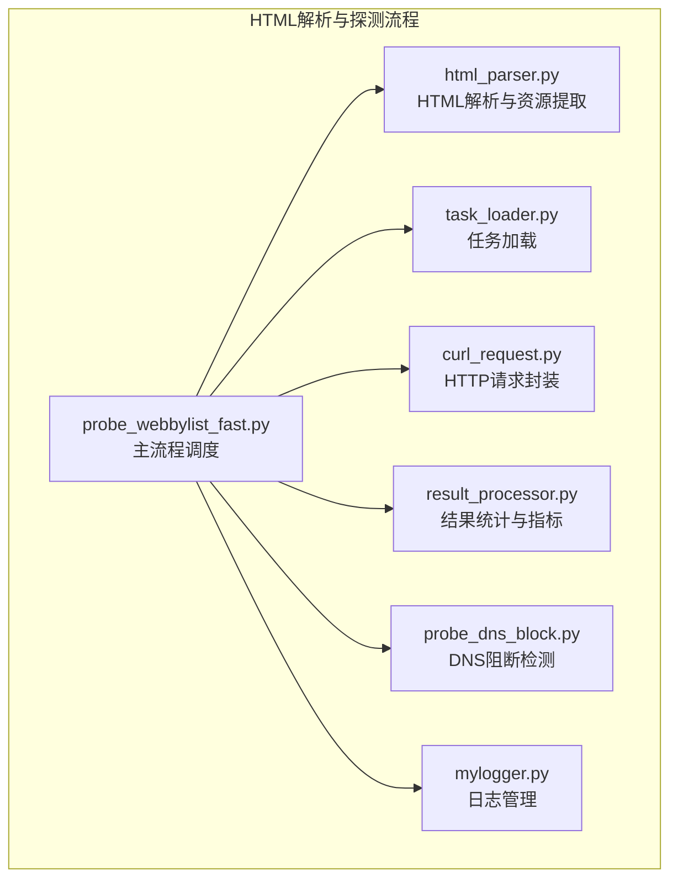
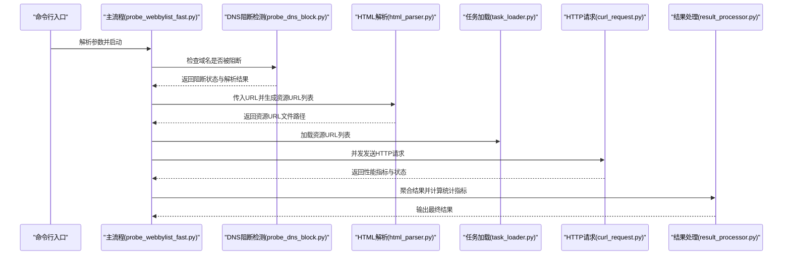
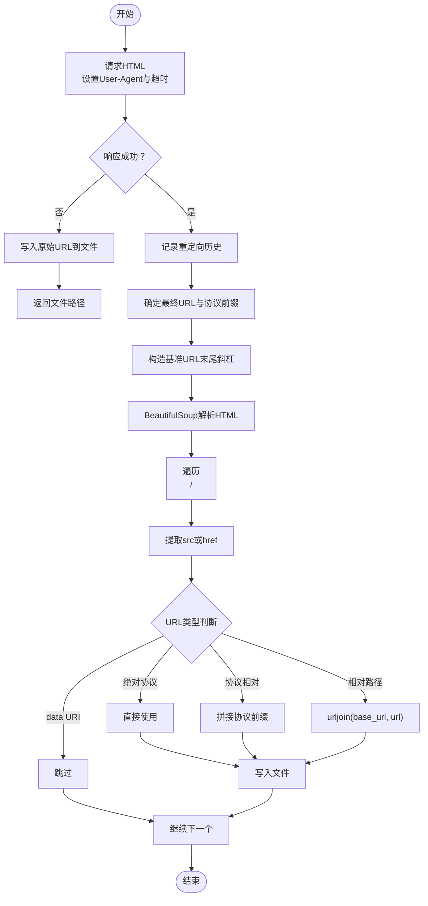
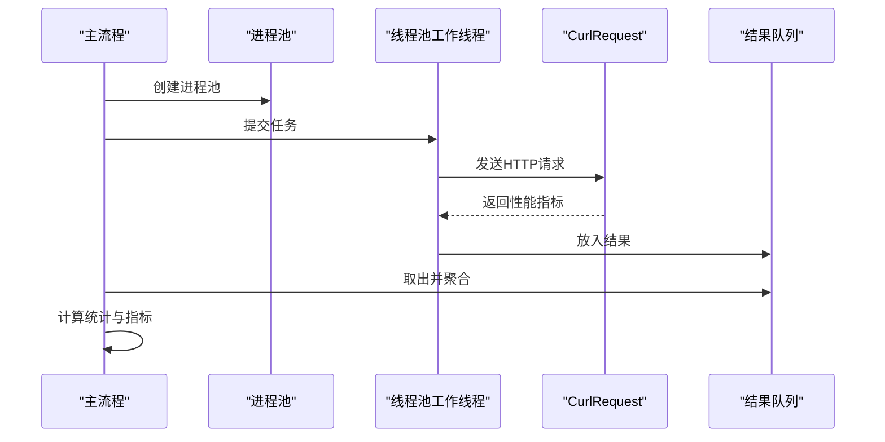
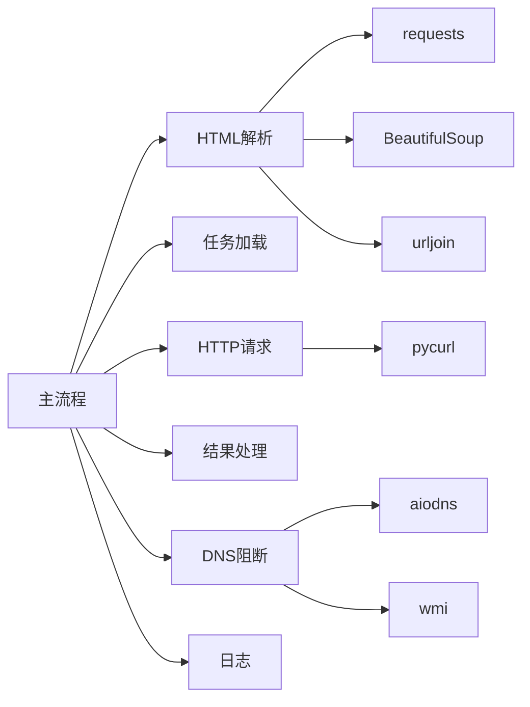

# HTML解析器设计

<cite>
**本文引用的文件**
- [html_parser.py](file://probe_webbylist_fast/html_parser.py)
- [probe_webbylist_fast.py](file://probe_webbylist_fast/probe_webbylist_fast.py)
- [result_processor.py](file://probe_webbylist_fast/result_processor.py)
- [task_loader.py](file://probe_webbylist_fast/task_loader.py)
- [curl_request.py](file://probe_webbylist_fast/curl_request.py)
- [probe_dns_block.py](file://probe_webbylist_fast/probe_dns_block.py)
- [mylogger.py](file://probe_webbylist_fast/mylogger.py)
- [probe_webbylist_fast.spec](file://probe_webbylist_fast/probe_webbylist_fast.spec)
</cite>

## 目录
1. [引言](#引言)
2. [项目结构](#项目结构)
3. [核心组件](#核心组件)
4. [架构总览](#架构总览)
5. [详细组件分析](#详细组件分析)
6. [依赖关系分析](#依赖关系分析)
7. [性能考虑](#性能考虑)
8. [故障排查指南](#故障排查指南)
9. [结论](#结论)
10. [附录](#附录)

## 引言
本设计文档围绕HTML解析器展开，重点阐述以下方面：
- 页面资源提取算法：从HTML内容中识别并提取各类资源链接（CSS、JS、图片等）。
- URL处理与规范化：相对路径转换、协议补全、域名解析与最终URL构造。
- 资源类型识别：区分CSS、JavaScript、图片与其他媒体文件。
- 页面内容分析：标题提取、元数据获取、主要内容识别（本模块当前未实现，仅在设计层面给出建议）。
- 性能优化策略：内存控制、并发与超时设置、缓存与连接复用。
- 集成示例：如何将HTML解析器接入网络探测流程。
- 错误处理与异常：针对HTTP错误、连接错误、超时、解析异常的处理策略。

## 项目结构
该模块位于“probe_webbylist_fast”子目录，主要由以下文件组成：
- html_parser.py：HTML解析与资源提取的核心实现。
- probe_webbylist_fast.py：主流程调度，负责任务初始化、并发执行、结果汇总与保存。
- result_processor.py：结果统计与指标计算（含URL截断、成功率统计、首屏/满页时间计算等）。
- task_loader.py：从任务文件加载待测URL列表。
- curl_request.py：基于pycurl的HTTP请求封装，包含性能信息采集与错误码映射。
- probe_dns_block.py：DNS阻断检测与本地DNS解析。
- mylogger.py：统一日志管理。
- probe_webbylist_fast.spec：打包配置（用于构建可执行文件）。

图表来源
- [probe_webbylist_fast.py:1-222](file://probe_webbylist_fast/probe_webbylist_fast.py#L1-L222)
- [html_parser.py:1-78](file://probe_webbylist_fast/html_parser.py#L1-L78)
- [result_processor.py:1-269](file://probe_webbylist_fast/result_processor.py#L1-L269)
- [task_loader.py:1-12](file://probe_webbylist_fast/task_loader.py#L1-L12)
- [curl_request.py:1-209](file://probe_webbylist_fast/curl_request.py#L1-L209)
- [probe_dns_block.py:1-207](file://probe_webbylist_fast/probe_dns_block.py#L1-L207)
- [mylogger.py:1-59](file://probe_webbylist_fast/mylogger.py#L1-L59)

章节来源
- [probe_webbylist_fast.py:1-222](file://probe_webbylist_fast/probe_webbylist_fast.py#L1-L222)
- [html_parser.py:1-78](file://probe_webbylist_fast/html_parser.py#L1-L78)
- [result_processor.py:1-269](file://probe_webbylist_fast/result_processor.py#L1-L269)
- [task_loader.py:1-12](file://probe_webbylist_fast/task_loader.py#L1-L12)
- [curl_request.py:1-209](file://probe_webbylist_fast/curl_request.py#L1-L209)
- [probe_dns_block.py:1-207](file://probe_webbylist_fast/probe_dns_block.py#L1-L207)
- [mylogger.py:1-59](file://probe_webbylist_fast/mylogger.py#L1-L59)

## 核心组件
- HTML解析与资源提取（html_parser.py）
  - 功能：下载HTML、解析DOM、提取img/link(stylesheet)/script标签的src或href，并进行URL规范化。
  - 关键点：支持相对路径、协议相对URL、data URI跳过；使用BeautifulSoup与urljoin进行规范化。
- 主流程调度（probe_webbylist_fast.py）
  - 功能：初始化任务列表、并发执行HTTP探测、聚合结果、更新统计、保存输出。
  - 并发模型：多进程+线程池，使用pycurl共享会话以减少DNS与SSL开销。
- 结果处理（result_processor.py）
  - 功能：统计成功率、计算首屏/满页时间、内容类型与重定向计数、IP归属信息填充。
- 任务加载（task_loader.py）
  - 功能：从文件读取URL列表，过滤短行。
- HTTP请求封装（curl_request.py）
  - 功能：设置请求头、超时、重定向、共享会话、性能信息采集、错误码映射。
- DNS阻断检测（probe_dns_block.py）
  - 功能：解析URL、获取本地DNS、对比本地与公共DNS结果，判断是否阻断。
- 日志管理（mylogger.py）
  - 功能：控制台与文件双通道日志，支持滚动文件与格式化。

章节来源
- [html_parser.py:11-78](file://probe_webbylist_fast/html_parser.py#L11-L78)
- [probe_webbylist_fast.py:22-196](file://probe_webbylist_fast/probe_webbylist_fast.py#L22-L196)
- [result_processor.py:25-269](file://probe_webbylist_fast/result_processor.py#L25-L269)
- [task_loader.py:1-12](file://probe_webbylist_fast/task_loader.py#L1-L12)
- [curl_request.py:9-209](file://probe_webbylist_fast/curl_request.py#L9-L209)
- [probe_dns_block.py:58-207](file://probe_webbylist_fast/probe_dns_block.py#L58-L207)
- [mylogger.py:7-59](file://probe_webbylist_fast/mylogger.py#L7-L59)

## 架构总览
下图展示了从入口到资源提取再到HTTP探测的整体流程：

图表来源
- [probe_webbylist_fast.py:180-196](file://probe_webbylist_fast/probe_webbylist_fast.py#L180-L196)
- [probe_dns_block.py:132-207](file://probe_webbylist_fast/probe_dns_block.py#L132-L207)
- [html_parser.py:11-78](file://probe_webbylist_fast/html_parser.py#L11-L78)
- [task_loader.py:1-12](file://probe_webbylist_fast/task_loader.py#L1-L12)
- [curl_request.py:145-170](file://probe_webbylist_fast/curl_request.py#L145-L170)
- [result_processor.py:65-269](file://probe_webbylist_fast/result_processor.py#L65-L269)

## 详细组件分析

### HTML解析与资源提取（html_parser.py）
- 输入：目标URL字符串。
- 处理流程：
  - 发送HTTP请求（带User-Agent与超时），记录历史重定向。
  - 若请求失败，写入原始URL到任务文件并返回。
  - 成功后，确定最终URL协议前缀与基准URL（末尾斜杠）。
  - 使用BeautifulSoup解析HTML，遍历img、link(rel=stylesheet)、script标签，提取src或href。
  - URL规范化：
    - 已含协议（http/https）：直接使用。
    - 协议相对（//）：根据最终URL协议前缀拼接。
    - data URI：跳过。
    - 其他相对路径：使用urljoin(base_url, url)。
  - 将规范化后的URL写入临时文件，逐行输出。
- 输出：资源URL文件路径（供后续并发探测使用）。

图表来源
- [html_parser.py:29-78](file://probe_webbylist_fast/html_parser.py#L29-L78)

章节来源
- [html_parser.py:11-78](file://probe_webbylist_fast/html_parser.py#L11-L78)

### URL处理与规范化机制
- 绝对URL：直接采用。
- 协议相对URL（//example.com/path）：根据最终URL协议（http/https）补全。
- 相对路径：使用urljoin(base_url, url)进行规范化，确保路径正确拼接。
- data URI：直接跳过，不作为外部资源探测目标。
- 域名解析：通过DNS阻断检测模块完成，避免被阻断的域名进入探测流程。

章节来源
- [html_parser.py:48-76](file://probe_webbylist_fast/html_parser.py#L48-L76)
- [probe_dns_block.py:132-207](file://probe_webbylist_fast/probe_dns_block.py#L132-L207)

### 资源类型识别逻辑
- 图片资源：提取标签的src属性。
- 样式表：提取<link rel="stylesheet">标签的href属性。
- 脚本资源：提取<script>标签的src属性。
- 其他媒体：当前实现未覆盖video/audio等标签，可在扩展中加入相应逻辑。

章节来源
- [html_parser.py:56-63](file://probe_webbylist_fast/html_parser.py#L56-L63)

### 页面内容分析功能
- 当前实现：
  - 未实现标题提取、meta标签解析、主要内容识别等。
- 设计建议（概念性说明）：
  - 标题提取：解析<title>标签文本。
  - 元数据：解析<meta name/property>与<link rel="canonical">等。
  - 主要内容识别：可结合语义标签（如<article>、<main>）或启发式规则（如最长段落、特定选择器权重）。
  - 注意：上述为概念性建议，非现有实现。

章节来源
- [html_parser.py:55-55](file://probe_webbylist_fast/html_parser.py#L55-L55)

### 主流程与并发执行（probe_webbylist_fast.py）
- 任务初始化：为每个URL生成任务对象（包含索引与引用页）。
- 并发模型：多进程池（CPU核数+4）+线程池，每个工作线程持有独立CurlRequest实例。
- 超时控制：整体超时限制，超过则取消未完成任务。
- 结果聚合：从结果队列收集，更新统计信息，计算首屏/满页时间，填充IP归属信息。
- 输出：将结果字典序列化为JSON文件。

图表来源
- [probe_webbylist_fast.py:102-178](file://probe_webbylist_fast/probe_webbylist_fast.py#L102-L178)
- [curl_request.py:145-170](file://probe_webbylist_fast/curl_request.py#L145-L170)

章节来源
- [probe_webbylist_fast.py:22-196](file://probe_webbylist_fast/probe_webbylist_fast.py#L22-L196)

### HTTP请求封装与性能指标（curl_request.py）
- 请求配置：
  - IP解析策略：按IPv4/IPv6选择。
  - DNS服务器：可选本地DNS。
  - 超时：连接超时、总超时。
  - 重定向：最大次数与跟随。
  - 请求头：完整浏览器头部集合，降低被拦截概率。
  - 共享会话：启用Cookie/DNS/SSL Session共享。
- 性能指标采集：
  - 名称解析、TCP握手、SSL握手、预传输、首字节、重定向、下载大小、速度、有效URL、内容类型、重定向次数、主IP等。
- 错误码映射：将底层错误码映射为业务错误码，便于上层判断。

章节来源
- [curl_request.py:80-209](file://probe_webbylist_fast/curl_request.py#L80-L209)

### 结果处理与统计（result_processor.py）
- 主要功能：
  - 初始化结果结构体，包含各阶段耗时、HTTP状态、错误码、重定向次数、成功率等。
  - 聚合单个结果：累加下载量、计算首包速度、记录首屏/满页时间等。
  - 更新统计：计算总请求数、成功数、成功率、测试总耗时。
  - 指标计算：按90分位计算首屏与满页时间，计算总速率。
  - 内容类型与跳转阻断：检查内容类型、重定向目标主机是否为内网/环回地址，判定阻断。
  - IP归属：根据数据库填充运营商、省份、城市等信息。

章节来源
- [result_processor.py:25-269](file://probe_webbylist_fast/result_processor.py#L25-L269)

### 任务加载（task_loader.py）
- 从任务文件逐行读取URL，去除空白字符，过滤长度小于等于3的行，返回URL列表。

章节来源
- [task_loader.py:1-12](file://probe_webbylist_fast/task_loader.py#L1-L12)

### DNS阻断检测（probe_dns_block.py）
- 功能：解析URL、获取本地DNS服务器、查询A/AAAA记录，对比本地与公共DNS结果，判断是否阻断。
- 阻断判定：若本地解析结果全部命中已知阻断IP且与公共DNS结果不同，则标记阻断。

章节来源
- [probe_dns_block.py:132-207](file://probe_webbylist_fast/probe_dns_block.py#L132-L207)

### 日志管理（mylogger.py）
- 提供统一日志接口，支持控制台与文件双通道，使用旋转文件处理器，格式化输出。

章节来源
- [mylogger.py:7-59](file://probe_webbylist_fast/mylogger.py#L7-L59)

## 依赖关系分析
- 模块耦合：
  - 主流程依赖HTML解析、任务加载、HTTP请求、结果处理、DNS检测与日志模块。
  - HTML解析依赖requests与BeautifulSoup，使用urljoin进行URL规范化。
  - HTTP请求封装依赖pycurl，使用共享会话减少重复开销。
- 外部依赖：
  - requests：用于HTML获取。
  - BeautifulSoup：用于DOM解析。
  - pycurl：用于高性能HTTP请求与性能指标采集。
  - aiodns/wmi：用于DNS阻断检测与本地DNS获取。
- 潜在循环依赖：未发现明显循环导入。

图表来源
- [probe_webbylist_fast.py:1-222](file://probe_webbylist_fast/probe_webbylist_fast.py#L1-L222)
- [html_parser.py:1-8](file://probe_webbylist_fast/html_parser.py#L1-L8)
- [curl_request.py:1-8](file://probe_webbylist_fast/curl_request.py#L1-L8)
- [probe_dns_block.py:1-10](file://probe_webbylist_fast/probe_dns_block.py#L1-L10)

章节来源
- [probe_webbylist_fast.py:1-222](file://probe_webbylist_fast/probe_webbylist_fast.py#L1-L222)
- [html_parser.py:1-8](file://probe_webbylist_fast/html_parser.py#L1-L8)
- [curl_request.py:1-8](file://probe_webbylist_fast/curl_request.py#L1-L8)
- [probe_dns_block.py:1-10](file://probe_webbylist_fast/probe_dns_block.py#L1-L10)

## 性能考虑
- 内存控制：
  - 使用BytesIO接收响应体，避免一次性加载大文件至内存。
  - 对响应体进行最小片段截取（仅保留前若干字节）用于初步判断，降低内存占用。
- 并发与超时：
  - 进程池大小为CPU核心数+4，线程池并发度与之匹配，平衡吞吐与资源消耗。
  - 连接与总超时设置合理，防止长时间阻塞。
  - 整体超时控制，超时后取消未完成任务，避免资源泄漏。
- 连接复用与共享：
  - 启用pycurl共享会话（Cookie/DNS/SSL Session），减少DNS查询与SSL握手开销。
- I/O与文件管理：
  - 临时任务文件定期清理，避免磁盘空间膨胀。
  - 结果写入采用二进制方式，减少编码开销。

章节来源
- [curl_request.py:56-67](file://probe_webbylist_fast/curl_request.py#L56-L67)
- [probe_webbylist_fast.py:110-136](file://probe_webbylist_fast/probe_webbylist_fast.py#L110-L136)
- [html_parser.py:12-24](file://probe_webbylist_fast/html_parser.py#L12-L24)

## 故障排查指南
- HTTP错误：
  - 记录HTTP错误、连接错误、超时与通用请求异常，便于定位问题。
- DNS阻断：
  - 若本地DNS解析结果全部命中阻断IP且与公共DNS不同，判定为阻断，主流程中可直接标记失败。
- 内容阻断与跳转阻断：
  - 检查正文是否包含特定关键词，判定内容阻断。
  - 检查重定向目标主机是否为内网/环回地址，判定跳转阻断。
- 错误码映射：
  - 将底层错误码映射为业务错误码，便于统一处理与统计。
- 日志：
  - 使用MyLogger输出详细调试信息，便于问题定位。

章节来源
- [html_parser.py:29-40](file://probe_webbylist_fast/html_parser.py#L29-L40)
- [result_processor.py:148-269](file://probe_webbylist_fast/result_processor.py#L148-L269)
- [probe_dns_block.py:132-207](file://probe_webbylist_fast/probe_dns_block.py#L132-L207)
- [mylogger.py:7-59](file://probe_webbylist_fast/mylogger.py#L7-L59)

## 结论
本HTML解析器实现了从HTML中提取关键资源链接并进行URL规范化的基础能力，配合高性能HTTP探测与结果统计，形成完整的页面资源探测流程。当前未实现页面内容分析（标题、元数据、主要内容识别），可在后续版本中扩展。整体设计注重并发性能、内存控制与错误处理，适合大规模页面资源探测场景。

## 附录
- 打包配置：probe_webbylist_fast.spec用于构建可执行文件，包含脚本、二进制、数据与收集配置。

章节来源
- [probe_webbylist_fast.spec:1-45](file://probe_webbylist_fast/probe_webbylist_fast.spec#L1-L45)