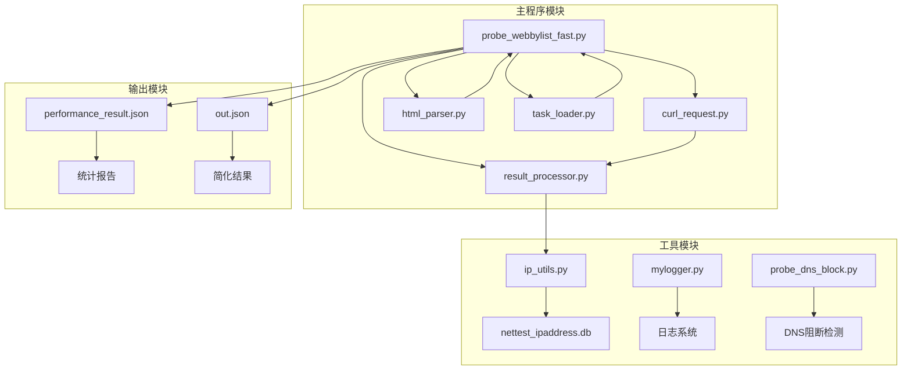
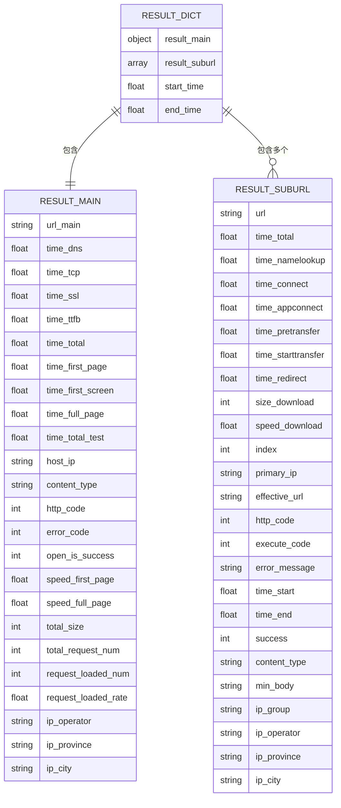
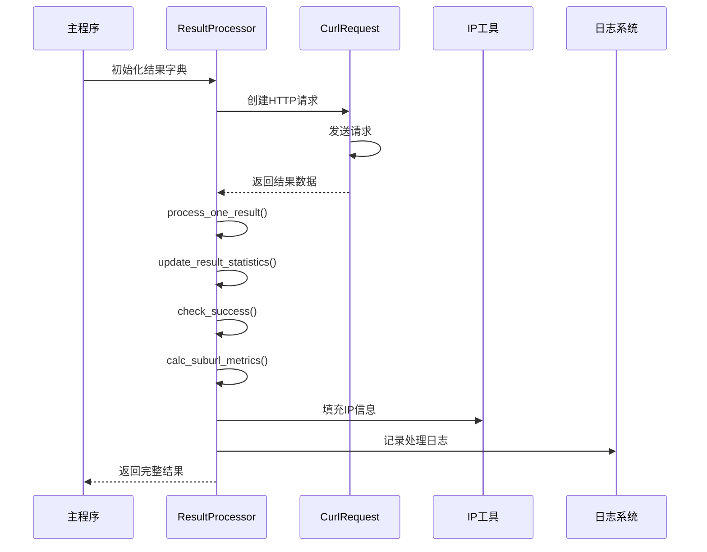
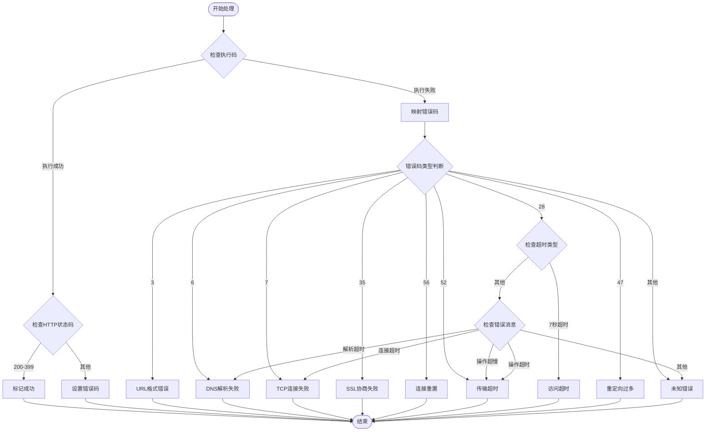
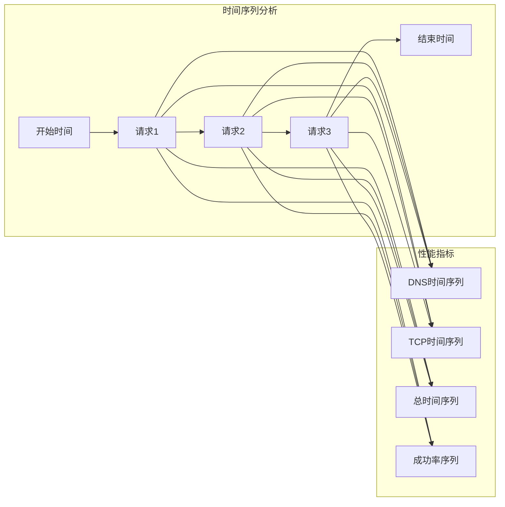
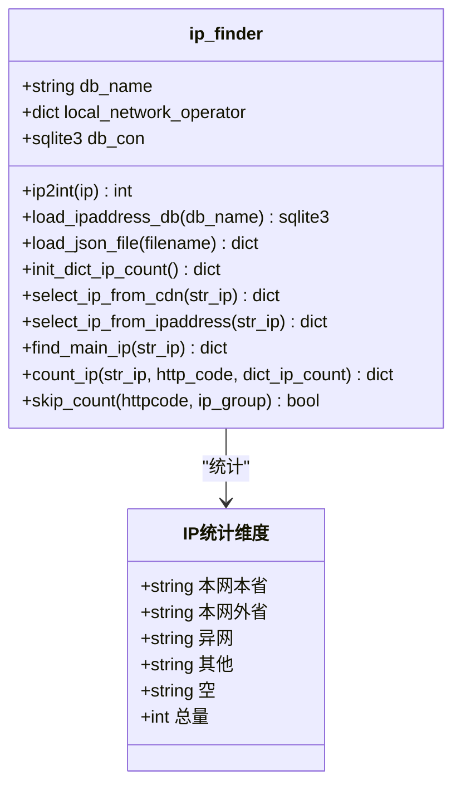
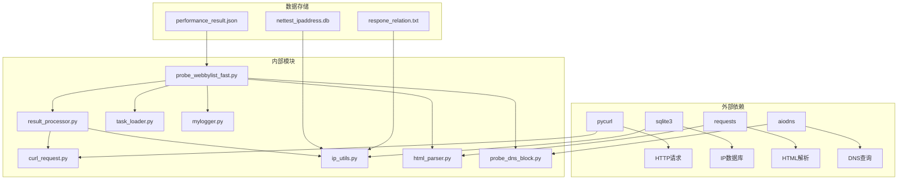

# ResultProcessor类设计

<cite>
**本文档引用的文件**
- [result_processor.py](file://probe_webbylist_fast/result_processor.py)
- [probe_webbylist_fast.py](file://probe_webbylist_fast/probe_webbylist_fast.py)
- [curl_request.py](file://probe_webbylist_fast/curl_request.py)
- [ip_utils.py](file://probe_webbylist_fast/ip_utils.py)
- [html_parser.py](file://probe_webbylist_fast/html_parser.py)
- [task_loader.py](file://probe_webbylist_fast/task_loader.py)
- [mylogger.py](file://probe_webbylist_fast/mylogger.py)
- [probe_dns_block.py](file://probe_webbylist_fast/probe_dns_block.py)
- [out.json](file://out.json)
- [performance_result.json](file://performance_result.json)
</cite>

## 目录
1. [简介](#简介)
2. [项目结构](#项目结构)
3. [核心组件](#核心组件)
4. [架构概览](#架构概览)
5. [详细组件分析](#详细组件分析)
6. [依赖关系分析](#依赖关系分析)
7. [性能考虑](#性能考虑)
8. [故障排除指南](#故障排除指南)
9. [结论](#结论)
10. [附录](#附录)

## 简介

ResultProcessor类是网页子资源探测工具的核心组件，负责收集、处理和分析网络探测指标。该系统通过并发HTTP请求收集详细的性能数据，包括DNS解析时间、TCP连接时间、SSL握手时间、首包时间等关键指标，并提供全面的结果统计和分析功能。

该工具主要用于检测网页子资源的加载性能，识别网络阻断情况，以及分析不同IP地址和域名的性能表现。系统支持IPv4和IPv6双栈环境，能够处理复杂的网络拓扑和路由情况。

## 项目结构

项目采用模块化设计，主要包含以下核心模块：



**图表来源**
- [probe_webbylist_fast.py:1-222](file://probe_webbylist_fast/probe_webbylist_fast.py#L1-L222)
- [result_processor.py:1-269](file://probe_webbylist_fast/result_processor.py#L1-L269)

**章节来源**
- [probe_webbylist_fast.py:1-222](file://probe_webbylist_fast/probe_webbylist_fast.py#L1-L222)
- [result_processor.py:1-269](file://probe_webbylist_fast/result_processor.py#L1-L269)

## 核心组件

ResultProcessor系统由多个相互协作的组件构成，每个组件都有明确的职责和接口：

### 主要数据结构

系统使用统一的结果字典结构来存储所有探测数据：



**图表来源**
- [result_processor.py:25-63](file://probe_webbylist_fast/result_processor.py#L25-L63)
- [result_processor.py:65-88](file://probe_webbylist_fast/result_processor.py#L65-L88)

### 关键处理函数

系统提供了多个专门的处理函数来执行不同的统计和分析任务：

1. **init_result_info**: 初始化结果数据结构
2. **process_one_result**: 处理单个探测结果
3. **update_result_statistics**: 更新统计信息
4. **calc_suburl_metrics**: 计算子URL指标
5. **check_success**: 错误码检查和映射
6. **fill_ip_info**: IP地址信息填充

**章节来源**
- [result_processor.py:25-63](file://probe_webbylist_fast/result_processor.py#L25-L63)
- [result_processor.py:65-88](file://probe_webbylist_fast/result_processor.py#L65-L88)
- [result_processor.py:88-99](file://probe_webbylist_fast/result_processor.py#L88-L99)

## 架构概览

ResultProcessor采用分层架构设计，从底层的HTTP请求到高层的统计分析形成完整的处理流水线：



**图表来源**
- [probe_webbylist_fast.py:102-178](file://probe_webbylist_fast/probe_webbylist_fast.py#L102-L178)
- [result_processor.py:65-269](file://probe_webbylist_fast/result_processor.py#L65-L269)

系统架构的关键特点：

1. **并发处理**: 使用多进程池和线程池实现高并发HTTP请求
2. **分层处理**: 将数据收集、处理、分析分离到不同层次
3. **错误处理**: 完善的错误捕获和错误码映射机制
4. **统计分析**: 提供多层次的统计指标计算

**章节来源**
- [probe_webbylist_fast.py:102-178](file://probe_webbylist_fast/probe_webbylist_fast.py#L102-L178)
- [result_processor.py:148-269](file://probe_webbylist_fast/result_processor.py#L148-L269)

## 详细组件分析

### 数据收集层

数据收集层负责从HTTP请求中提取详细的性能指标：

#### HTTP性能指标收集

系统收集以下关键性能指标：

| 指标名称 | 描述 | 单位 | 采集方式 |
|---------|------|------|----------|
| time_namelookup | DNS解析时间 | 毫秒 | pycurl.NAMELOOKUP_TIME |
| time_connect | TCP连接时间 | 毫秒 | CONNECT_TIME - NAMELOOKUP_TIME |
| time_appconnect | SSL握手时间 | 毫秒 | APPCONNECT_TIME - CONNECT_TIME |
| time_pretransfer | 预传输时间 | 毫秒 | PRETRANSFER_TIME - APPCONNECT_TIME |
| time_starttransfer | 首字节时间 | 毫秒 | STARTTRANSFER_TIME - PRETRANSFER_TIME |
| time_total | 总传输时间 | 毫秒 | TOTAL_TIME |
| time_redirect | 重定向时间 | 毫秒 | REDIRECT_TIME |
| size_download | 下载字节数 | 字节 | SIZE_DOWNLOAD |
| speed_download | 下载速度 | 字节/秒 | SPEED_DOWNLOAD |

#### 错误码映射机制

系统实现了完整的错误码映射机制，将底层错误转换为可读的错误信息：



**图表来源**
- [result_processor.py:148-198](file://probe_webbylist_fast/result_processor.py#L148-L198)

**章节来源**
- [result_processor.py:148-198](file://probe_webbylist_fast/result_processor.py#L148-L198)
- [curl_request.py:172-209](file://probe_webbylist_fast/curl_request.py#L172-L209)

### 统计分析层

统计分析层负责计算各种性能指标和统计数据：

#### 成功率计算

成功率是最重要的业务指标，计算公式为：

```
成功率 = 成功请求数量 / 总请求数量 × 100%
```

系统还计算请求加载率：

```
请求加载率 = 请求加载数量 / 总请求数量 × 100%
```

#### 性能指标计算

系统计算多种性能指标：

1. **平均值计算**: 对所有成功的请求计算各项指标的平均值
2. **百分位数计算**: 计算P90（90百分位）和P95等关键指标
3. **最大值和最小值**: 记录各项指标的最大值和最小值

#### 时间维度分析

系统支持按时间维度的数据汇总：



**图表来源**
- [result_processor.py:206-236](file://probe_webbylist_fast/result_processor.py#L206-L236)

**章节来源**
- [result_processor.py:88-99](file://probe_webbylist_fast/result_processor.py#L88-L99)
- [result_processor.py:206-236](file://probe_webbylist_fast/result_processor.py#L206-L236)

### 结果聚合算法

结果聚合算法支持按多种维度进行数据汇总：

#### 按域名聚合

系统可以按域名维度聚合数据，计算每个域名的平均性能指标和成功率。

#### 按IP地址聚合

系统支持按IP地址维度聚合，分析不同IP地址的性能表现差异。

#### 按时间维度聚合

系统支持按时间段进行聚合分析，识别性能趋势变化。

#### IP归属信息统计

系统使用专门的IP工具类进行IP归属信息统计：



**图表来源**
- [ip_utils.py:6-235](file://probe_webbylist_fast/ip_utils.py#L6-L235)

**章节来源**
- [ip_utils.py:188-225](file://probe_webbylist_fast/ip_utils.py#L188-L225)
- [result_processor.py:123-146](file://probe_webbylist_fast/result_processor.py#L123-L146)

### 数据存储和输出

系统支持JSON格式的数据存储和输出：

#### 存储格式

完整的性能结果包含以下字段：

```json
{
  "result_main": {
    "url_main": "示例URL",
    "time_dns": 10.5,
    "time_tcp": 25.3,
    "time_ssl": 8.2,
    "time_ttfb": 33.7,
    "time_total": 84.8,
    "time_first_page": 252.4,
    "time_first_screen": 252.4,
    "time_full_page": 252.4,
    "time_total_test": 253.4,
    "host_ip": "125.77.146.62",
    "content_type": "text/html;charset=utf-8",
    "http_code": 200,
    "error_code": 0,
    "open_is_success": 1,
    "speed_first_page": 2410.4,
    "speed_full_page": 806.4,
    "total_size": 209222.0,
    "total_request_num": 1,
    "request_loaded_num": 1,
    "request_loaded_rate": 100.0,
    "ip_operator": "电信",
    "ip_province": "福建省",
    "ip_city": "泉州市"
  },
  "result_suburl": [
    {
      "url": "示例URL",
      "time_total": 84.8,
      "time_namelookup": 10.5,
      "time_connect": 25.3,
      "time_appconnect": 8.2,
      "time_pretransfer": 49.2,
      "time_starttransfer": 68.1,
      "time_redirect": 26.7,
      "size_download": 209222.0,
      "speed_download": 2468259.0,
      "index": 0,
      "primary_ip": "125.77.146.62",
      "effective_url": "https://example.com/",
      "http_code": 200,
      "execute_code": 0,
      "error_message": "",
      "time_start": 150.2,
      "time_end": 252.4,
      "success": 1,
      "content_type": "text/html;charset=utf-8"
    }
  ],
  "start_time": 1770644277.774,
  "end_time": 1770644278.028
}
```

**章节来源**
- [performance_result.json:1-1](file://performance_result.json#L1-L1)

## 依赖关系分析

ResultProcessor系统具有清晰的依赖关系和模块化设计：



**图表来源**
- [probe_webbylist_fast.py:13-20](file://probe_webbylist_fast/probe_webbylist_fast.py#L13-L20)
- [result_processor.py:4-5](file://probe_webbylist_fast/result_processor.py#L4-L5)

### 模块耦合度分析

系统采用了低耦合的设计原则：

1. **接口清晰**: 每个模块都有明确的接口定义
2. **数据传递**: 通过标准化的数据结构进行模块间通信
3. **错误隔离**: 错误处理在各自模块内完成，不向其他模块传播
4. **可扩展性**: 新功能可以通过添加新模块的方式实现

**章节来源**
- [probe_webbylist_fast.py:15-16](file://probe_webbylist_fast/probe_webbylist_fast.py#L15-L16)
- [result_processor.py:1-6](file://probe_webbylist_fast/result_processor.py#L1-L6)

## 性能考虑

### 并发性能优化

系统采用了多层并发策略来提升性能：

1. **多进程池**: 使用CPU核心数+4作为并发度
2. **线程池**: 独立的线程池处理HTTP请求
3. **队列管理**: 使用队列确保资源的有序分配和回收

### 内存管理策略

系统实施了严格的内存管理策略：

1. **及时释放**: Curl对象使用完毕后立即释放
2. **队列控制**: 限制队列大小防止内存溢出
3. **日志控制**: 控制日志级别避免大量日志占用内存
4. **数据截断**: URL长度超过128字符时进行截断处理

### 网络性能优化

1. **共享Curl**: 使用CurlShare对象共享DNS缓存和SSL会话
2. **连接复用**: 合理配置连接选项减少连接开销
3. **超时控制**: 设置合理的超时时间避免长时间阻塞

**章节来源**
- [probe_webbylist_fast.py:110-116](file://probe_webbylist_fast/probe_webbylist_fast.py#L110-L116)
- [curl_request.py:12-17](file://probe_webbylist_fast/curl_request.py#L12-L17)
- [result_processor.py:17-23](file://probe_webbylist_fast/result_processor.py#L17-L23)

## 故障排除指南

### 常见错误类型

系统识别以下主要错误类型：

| 错误码 | 错误类型 | 描述 | 解决方案 |
|--------|----------|------|----------|
| 1001 | DNS解析失败 | DNS查询超时或失败 | 检查DNS服务器配置，尝试其他DNS服务器 |
| 1002 | TCP连接失败 | 连接建立超时或失败 | 检查网络连通性，防火墙设置 |
| 1003 | SSL协商失败 | SSL/TLS握手失败 | 检查证书有效性，更新SSL版本 |
| 1004 | 连接重置 | 远程服务器主动断开连接 | 检查服务器负载，调整请求频率 |
| 1005 | 传输超时 | 数据传输过程中超时 | 优化网络环境，增加超时时间 |
| 1006 | 访问超时 | 整体访问时间超过阈值 | 检查服务器响应时间，优化资源 |
| 1007 | 重定向过多 | 跳转层级过深 | 检查重定向配置，减少跳转层级 |
| 1008 | URL格式错误 | URL语法不正确 | 验证URL格式，自动补全协议头 |
| 1009 | 反诈网站 | 跳转到反诈骗网站 | 检查域名安全性，使用可信源 |
| 1010 | 异常重定向 | 跳转到本地环回地址 | 检查DNS解析结果，验证重定向链 |
| 1011 | DNS阻断 | 运营商DNS阻断检测 | 使用公共DNS，检查网络策略 |
| 1099 | 未知错误 | 无法识别的错误类型 | 查看详细日志，检查系统状态 |

### 调试技巧

1. **日志分析**: 使用DEBUG级别日志获取详细执行信息
2. **超时监控**: 监控各阶段超时情况，定位性能瓶颈
3. **错误追踪**: 通过错误码追踪具体失败环节
4. **资源监控**: 监控内存和CPU使用情况

**章节来源**
- [result_processor.py:148-198](file://probe_webbylist_fast/result_processor.py#L148-L198)
- [mylogger.py:7-59](file://probe_webbylist_fast/mylogger.py#L7-L59)

## 结论

ResultProcessor类设计了一个完整的网络探测和分析系统，具有以下特点：

1. **全面的性能指标**: 收集从DNS解析到页面渲染的全流程性能数据
2. **智能的错误处理**: 提供详细的错误码映射和故障诊断能力
3. **灵活的统计分析**: 支持多维度的数据聚合和分析
4. **高效的并发处理**: 采用多层并发策略确保高吞吐量
5. **完善的内存管理**: 实施严格的资源管理和释放策略

该系统适用于网络性能监控、网站质量评估、网络阻断检测等多种应用场景，为网络优化和故障排查提供了有力的技术支撑。

## 附录

### 使用示例

以下是一个典型的使用流程示例：

```python
# 初始化任务列表
urls = ["http://example.com", "http://example.com/style.css"]
task_list = initialize_task_list(urls)

# 初始化结果字典
result_dict = initialize_result_dict(task_list)

# 执行并发HTTP请求
suburldown(tasklistfilename, "output.json", isdnsblock, ip_type, localresult)

# 分析结果
with open("output.json", "r") as f:
    result_data = json.load(f)
    print(f"成功率: {result_data['result_main']['request_loaded_rate']}%")
    print(f"平均响应时间: {result_data['result_main']['time_total']}ms")
```

### 配置参数说明

| 参数名称 | 类型 | 默认值 | 描述 |
|----------|------|--------|------|
| log | string | "debug" | 日志级别 |
| output | string | "performance_result.json" | 输出文件名 |
| url | string | "http://www.baidu.com" | 测试URL |
| iptype | string | "4" | IP版本类型（4或6） |
| dnsserver | string | "" | 自定义DNS服务器 |

### 性能基准

系统在典型配置下的性能表现：
- **并发连接数**: CPU核心数+4
- **单次测试时间**: 通常在10-30秒之间
- **内存使用**: 每个并发连接约占用50-100KB内存
- **磁盘I/O**: JSON输出文件大小通常在1-10KB之间