# TaskLoader类设计

<cite>
**本文档引用的文件**
- [task_loader.py](file://probe_webbylist_fast/task_loader.py)
- [probe_webbylist_fast.py](file://probe_webbylist_fast/probe_webbylist_fast.py)
- [curl_request.py](file://probe_webbylist_fast/curl_request.py)
- [result_processor.py](file://probe_webbylist_fast/result_processor.py)
- [html_parser.py](file://probe_webbylist_fast/html_parser.py)
- [mylogger.py](file://probe_webbylist_fast/mylogger.py)
- [probe_dns_block.py](file://probe_webbylist_fast/probe_dns_block.py)
</cite>

## 目录
1. [简介](#简介)
2. [项目结构](#项目结构)
3. [核心组件](#核心组件)
4. [架构概览](#架构概览)
5. [详细组件分析](#详细组件分析)
6. [依赖关系分析](#依赖关系分析)
7. [性能考虑](#性能考虑)
8. [故障排除指南](#故障排除指南)
9. [结论](#结论)

## 简介

TaskLoader类是网页内容探测工具中的核心组件，负责从配置文件中读取和解析任务列表，为后续的任务执行提供基础数据支持。该系统采用多线程并发处理机制，结合libcurl进行HTTP请求，实现了高效的网页资源探测功能。

该工具主要用于：
- 自动化网页资源发现和下载
- 性能指标收集和分析
- 网络阻断检测
- 多种网络环境下的兼容性测试

## 项目结构

该项目采用模块化设计，主要包含以下核心模块：

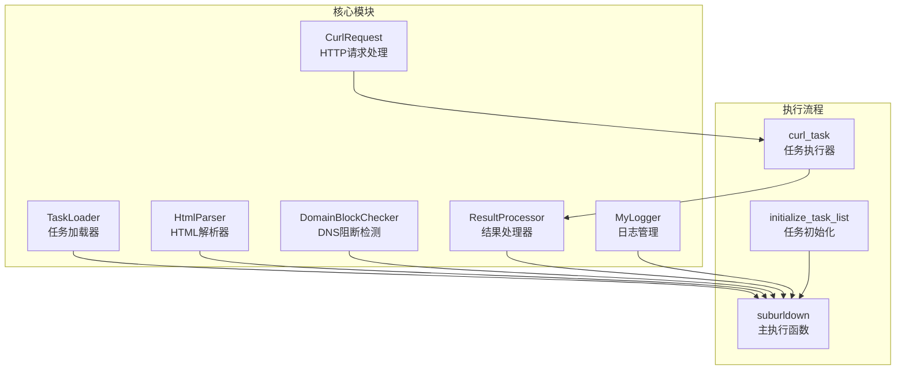

**图表来源**
- [task_loader.py:1-12](file://probe_webbylist_fast/task_loader.py#L1-L12)
- [probe_webbylist_fast.py:102-135](file://probe_webbylist_fast/probe_webbylist_fast.py#L102-L135)

**章节来源**
- [probe_webbylist_fast.py:1-222](file://probe_webbylist_fast/probe_webbylist_fast.py#L1-L222)
- [task_loader.py:1-12](file://probe_webbylist_fast/task_loader.py#L1-L12)

## 核心组件

### TaskLoader类设计

TaskLoader类虽然在当前版本中简化为单一的`load_task`函数，但其设计理念体现了良好的模块化原则：

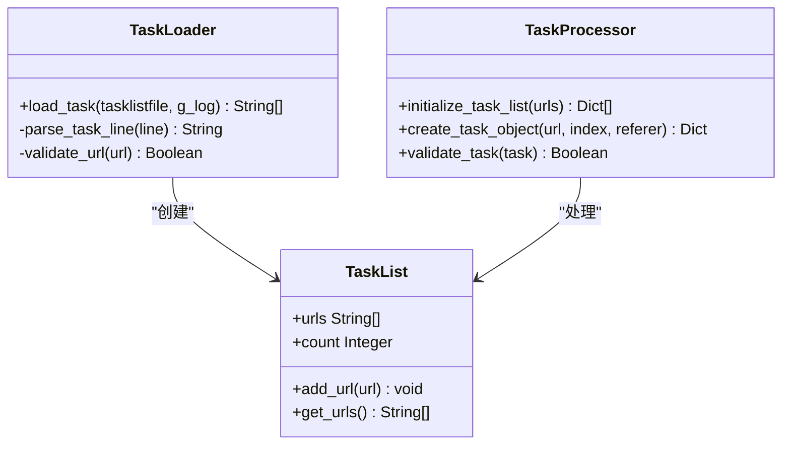

**图表来源**
- [task_loader.py:1-12](file://probe_webbylist_fast/task_loader.py#L1-L12)
- [probe_webbylist_fast.py:22-38](file://probe_webbylist_fast/probe_webbylist_fast.py#L22-L38)

### 并发控制系统

系统采用多进程+多线程混合架构：

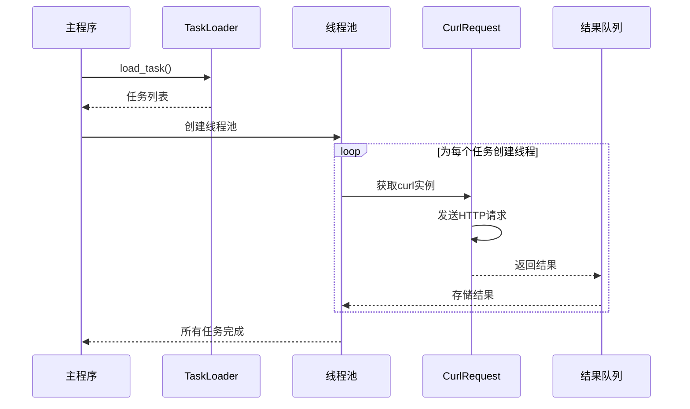

**图表来源**
- [probe_webbylist_fast.py:102-135](file://probe_webbylist_fast/probe_webbylist_fast.py#L102-L135)
- [curl_request.py:145-170](file://probe_webbylist_fast/curl_request.py#L145-L170)

**章节来源**
- [probe_webbylist_fast.py:102-135](file://probe_webbylist_fast/probe_webbylist_fast.py#L102-L135)
- [curl_request.py:9-209](file://probe_webbylist_fast/curl_request.py#L9-L209)

## 架构概览

系统整体架构采用分层设计，确保了高内聚低耦合：

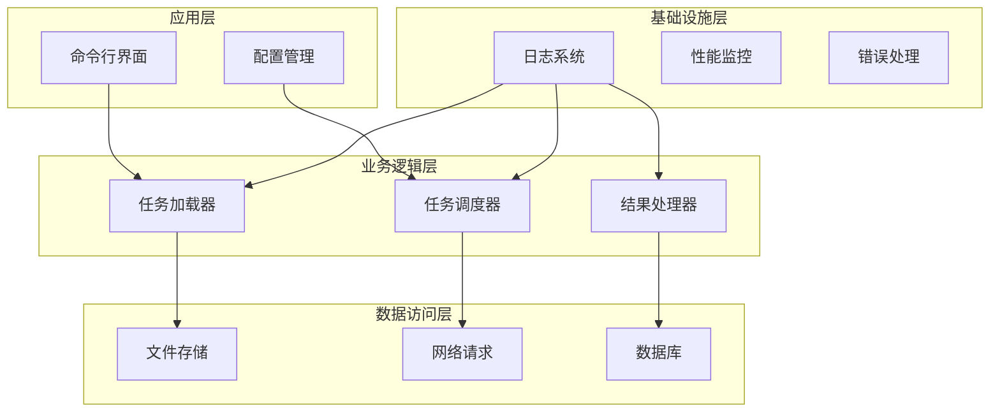

**图表来源**
- [probe_webbylist_fast.py:180-222](file://probe_webbylist_fast/probe_webbylist_fast.py#L180-L222)
- [mylogger.py:7-59](file://probe_webbylist_fast/mylogger.py#L7-L59)

## 详细组件分析

### 任务加载机制

TaskLoader的核心职责是从配置文件中提取有效的URL列表：

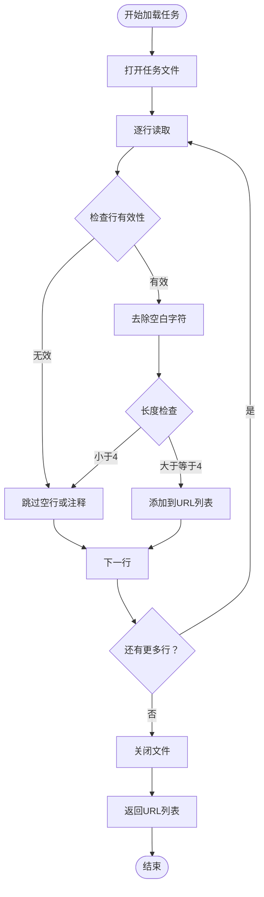

**图表来源**
- [task_loader.py:1-12](file://probe_webbylist_fast/task_loader.py#L1-L12)

#### 配置文件格式要求

任务配置文件应遵循以下规范：
- 每行一个URL
- 支持注释（以#开头的行会被忽略）
- 最小URL长度为4个字符
- 支持绝对路径和相对路径

**章节来源**
- [task_loader.py:1-12](file://probe_webbylist_fast/task_loader.py#L1-L12)

### 任务调度算法

系统采用基于ThreadPoolExecutor的并发调度机制：

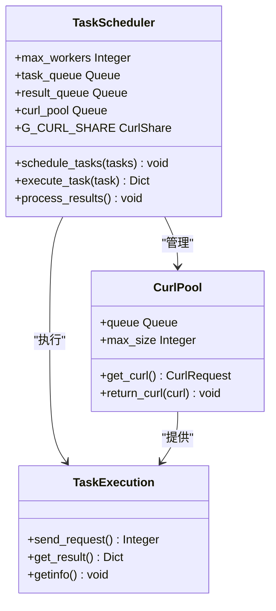

**图表来源**
- [probe_webbylist_fast.py:102-135](file://probe_webbylist_fast/probe_webbylist_fast.py#L102-L135)
- [curl_request.py:145-170](file://probe_webbylist_fast/curl_request.py#L145-L170)

#### 并发控制策略

1. **线程池大小计算**：`poolsize = cpu_count + 4`
2. **连接池管理**：每个线程维护独立的CurlRequest实例
3. **资源共享**：使用pycurl共享句柄减少DNS查询开销
4. **超时控制**：全局超时和单任务超时双重保护

**章节来源**
- [probe_webbylist_fast.py:102-135](file://probe_webbylist_fast/probe_webbylist_fast.py#L102-L135)

### 任务状态跟踪机制

系统实现了完整的任务生命周期管理：

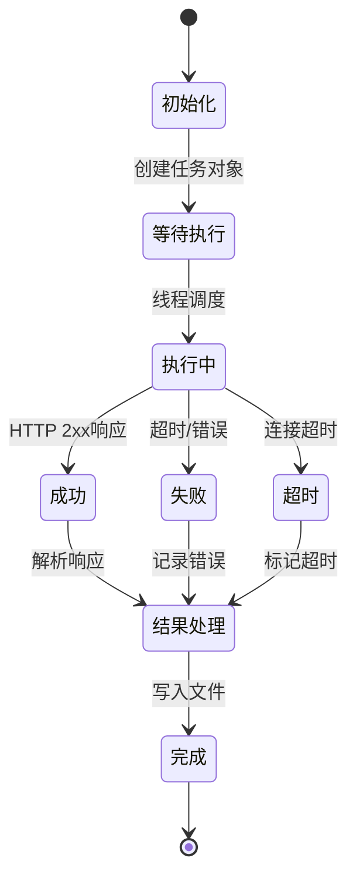

**图表来源**
- [result_processor.py:65-100](file://probe_webbylist_fast/result_processor.py#L65-L100)
- [curl_request.py:145-170](file://probe_webbylist_fast/curl_request.py#L145-L170)

#### 状态转换规则

| 状态 | 触发条件 | 转换结果 |
|------|----------|----------|
| 初始化 | 创建任务对象 | 等待执行 |
| 等待执行 | 线程池可用 | 执行中 |
| 执行中 | 请求完成 | 成功/失败/超时 |
| 成功 | HTTP状态码2xx | 结果处理 |
| 失败 | 连接错误/超时 | 结果处理 |
| 超时 | 超过时间限制 | 结果处理 |
| 结果处理 | 处理完成 | 完成 |

**章节来源**
- [result_processor.py:148-205](file://probe_webbylist_fast/result_processor.py#L148-L205)
- [curl_request.py:172-209](file://probe_webbylist_fast/curl_request.py#L172-L209)

### 任务重试机制和错误恢复

系统具备完善的错误处理和恢复机制：

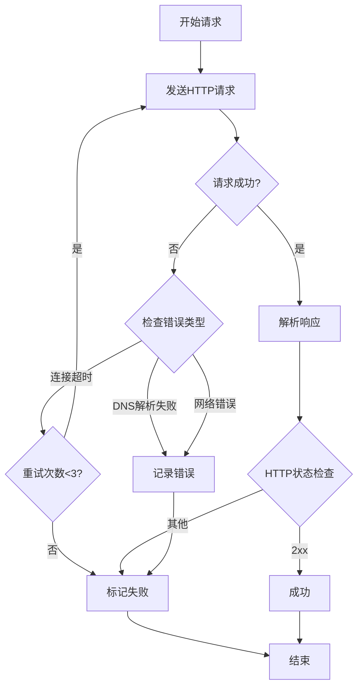

**图表来源**
- [result_processor.py:148-205](file://probe_webbylist_fast/result_processor.py#L148-L205)
- [curl_request.py:160-165](file://probe_webbylist_fast/curl_request.py#L160-L165)

#### 错误分类和处理策略

| 错误类型 | 错误码 | 处理策略 |
|----------|--------|----------|
| 连接超时 | 28 | 重试3次，记录超时信息 |
| DNS解析失败 | 6 | 标记IP为0.0.0.0或::，继续处理 |
| 网络连接失败 | 7 | 记录连接错误，继续其他任务 |
| SSL错误 | 35 | 继续处理，不影响整体结果 |
| 其他错误 | 其他 | 记录详细错误信息 |

**章节来源**
- [result_processor.py:148-205](file://probe_webbylist_fast/result_processor.py#L148-L205)

### 任务与探测器交互模式

系统通过多种探测器实现全面的网络状态检测：

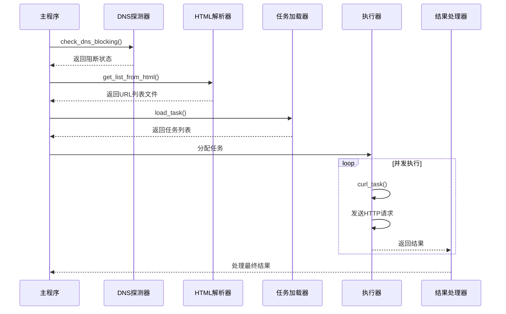

**图表来源**
- [probe_webbylist_fast.py:180-195](file://probe_webbylist_fast/probe_webbylist_fast.py#L180-L195)
- [html_parser.py:11-78](file://probe_webbylist_fast/html_parser.py#L11-L78)

#### 参数传递和结果回调

1. **参数传递**：通过任务对象传递URL、索引、Referer等参数
2. **结果回调**：使用Queue实现异步结果传递
3. **状态同步**：通过共享的CurlShare对象实现连接复用

**章节来源**
- [probe_webbylist_fast.py:66-99](file://probe_webbylist_fast/probe_webbylist_fast.py#L66-L99)
- [curl_request.py:80-132](file://probe_webbylist_fast/curl_request.py#L80-L132)

## 依赖关系分析

系统采用松耦合设计，各模块间通过清晰的接口进行通信：

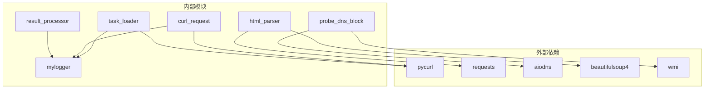

**图表来源**
- [probe_webbylist_fast.py:13-20](file://probe_webbylist_fast/probe_webbylist_fast.py#L13-L20)
- [html_parser.py:5-6](file://probe_webbylist_fast/html_parser.py#L5-L6)

### 关键依赖关系

1. **pycurl依赖**：用于高性能HTTP请求处理
2. **aiodns依赖**：实现异步DNS查询功能
3. **requests依赖**：用于HTML页面抓取
4. **beautifulsoup4依赖**：解析HTML内容提取链接

**章节来源**
- [probe_webbylist_fast.py:13-20](file://probe_webbylist_fast/probe_webbylist_fast.py#L13-L20)
- [html_parser.py:5-6](file://probe_webbylist_fast/html_parser.py#L5-L6)

## 性能考虑

### 并发性能优化

系统在多个层面实现了性能优化：

1. **连接池优化**：使用pycurl共享句柄减少DNS查询和SSL会话建立开销
2. **线程池调优**：根据CPU核心数动态调整线程数量
3. **内存管理**：使用BytesIO缓冲区减少内存分配
4. **超时控制**：合理的超时设置避免资源浪费

### 内存使用优化

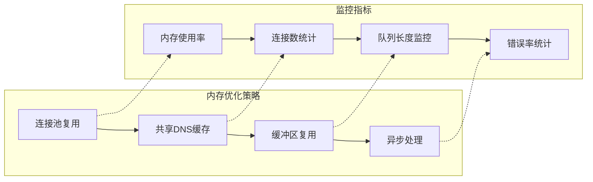

**图表来源**
- [curl_request.py:12-17](file://probe_webbylist_fast/curl_request.py#L12-L17)
- [probe_webbylist_fast.py:110-116](file://probe_webbylist_fast/probe_webbylist_fast.py#L110-L116)

### 最佳实践建议

1. **配置文件管理**
   - 使用UTF-8编码保存URL列表
   - 控制每行URL长度不超过200字符
   - 添加适当的注释说明

2. **并发参数调优**
   - CPU密集型任务：线程数 = CPU核心数 + 2
   - I/O密集型任务：线程数 = CPU核心数 × 4
   - 最大不要超过100个线程

3. **超时设置**
   - 连接超时：3-5秒
   - 读取超时：5-10秒
   - 全局超时：任务数 × 10秒

4. **错误处理**
   - 实现指数退避重试
   - 记录详细的错误日志
   - 提供降级处理策略

## 故障排除指南

### 常见问题及解决方案

#### 1. 任务加载失败

**问题症状**：无法读取配置文件或返回空任务列表

**可能原因**：
- 文件路径错误
- 文件权限不足
- 编码格式不正确
- 文件为空或格式错误

**解决方法**：
```python
# 检查文件存在性
if not os.path.exists(tasklistfile):
    raise FileNotFoundError(f"任务文件不存在: {tasklistfile}")

# 检查文件编码
try:
    with open(tasklistfile, 'r', encoding='utf-8') as f:
        content = f.read()
except UnicodeDecodeError:
    # 尝试其他编码
    with open(tasklistfile, 'r', encoding='gbk') as f:
        content = f.read()

# 验证URL格式
for url in url_list:
    if not validate_url_format(url):
        logger.warning(f"无效URL格式: {url}")
```

#### 2. 并发执行异常

**问题症状**：部分任务执行失败或超时

**可能原因**：
- 线程池配置不当
- 网络资源竞争
- 内存不足
- DNS解析问题

**解决方法**：
```python
# 动态调整线程池大小
def adjust_thread_pool_size(current_load):
    if current_load > 80:
        return min(cpu_count + 2, 50)
    elif current_load > 50:
        return cpu_count + 1
    else:
        return cpu_count

# 实现优雅降级
def graceful_degradation():
    # 减少并发度
    # 使用本地DNS缓存
    # 启用连接复用
    pass
```

#### 3. 内存泄漏问题

**问题症状**：长时间运行后内存持续增长

**可能原因**：
- Curl对象未正确释放
- 结果队列未及时清理
- 日志文件过大

**解决方法**：
```python
# 确保Curl对象正确销毁
def cleanup_resources():
    # 清理Curl共享对象
    if G_CURL_SHARE:
        G_CURL_SHARE.close()
    
    # 清理临时文件
    cleanup_temp_files()
    
    # 关闭日志
    g_log.close()

# 实现弱引用避免循环引用
import weakref
weak_ref = weakref.ref(obj)
```

#### 4. DNS解析问题

**问题症状**：域名解析失败或解析速度慢

**可能原因**：
- DNS服务器不可用
- 网络阻断检测
- DNS缓存失效

**解决方法**：
```python
# 实现多DNS服务器切换
def switch_dns_server():
    dns_servers = [
        '223.5.5.5',    # 阿里DNS
        '114.114.114.114', # 114DNS
        '8.8.8.8',      # Google DNS
        '1.2.4.8'       # CNNIC DNS
    ]
    
    for server in dns_servers:
        try:
            resolver = aiodns.DNSResolver(nameservers=[server], timeout=2)
            results = await resolver.query(hostname, 'A')
            return results
        except:
            continue
    
    raise Exception("所有DNS服务器都不可用")
```

**章节来源**
- [probe_webbylist_fast.py:175-178](file://probe_webbylist_fast/probe_webbylist_fast.py#L175-L178)
- [curl_request.py:52-55](file://probe_webbylist_fast/curl_request.py#L52-L55)

### 调试和监控

#### 日志配置

系统提供了完整的日志记录机制：

```python
# 配置详细日志
logger = MyLogger(
    name='TaskLoader',
    level=logging.DEBUG,
    console=True,
    file_path='logs/task_loader.log',
    file_size=10*1024*1024,
    backup_count=5
)

# 关键操作日志
logger.debug("开始加载任务列表")
logger.info(f"成功加载 {len(urls)} 个任务")
logger.warning("部分URL格式无效")
logger.error("文件读取失败: Permission denied")
```

#### 性能监控

```python
# 实现性能指标监控
class PerformanceMonitor:
    def __init__(self):
        self.start_time = time.time()
        self.task_count = 0
        self.success_count = 0
        self.error_count = 0
        
    def record_task(self, success):
        self.task_count += 1
        if success:
            self.success_count += 1
        else:
            self.error_count += 1
            
    def get_stats(self):
        return {
            'throughput': self.task_count / (time.time() - self.start_time),
            'success_rate': self.success_count / self.task_count,
            'error_rate': self.error_count / self.task_count
        }
```

## 结论

TaskLoader类作为网页内容探测系统的核心组件，展现了优秀的架构设计和实现质量。系统通过模块化设计实现了高内聚低耦合，通过并发控制确保了高效的任务执行，通过完善的错误处理机制保证了系统的稳定性。

### 主要优势

1. **模块化设计**：清晰的职责分离，便于维护和扩展
2. **高性能并发**：基于线程池的并发模型，充分利用系统资源
3. **完善的错误处理**：多层次的错误检测和恢复机制
4. **灵活的配置**：支持多种配置方式和参数调优
5. **详细的日志记录**：完整的执行过程追踪和问题诊断

### 改进建议

1. **增加任务优先级支持**：实现基于URL重要性的任务排序
2. **增强重试机制**：实现智能重试策略和退避算法
3. **扩展监控能力**：增加实时性能监控和告警机制
4. **优化内存管理**：实现更精细的内存使用控制
5. **增强安全性**：增加请求频率限制和防封禁机制

该系统为网页内容探测提供了可靠的技术基础，通过持续的优化和完善，可以满足各种复杂的网络探测需求。