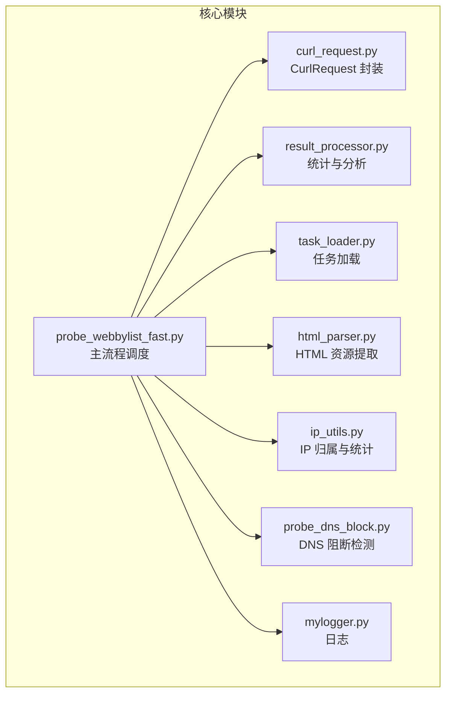
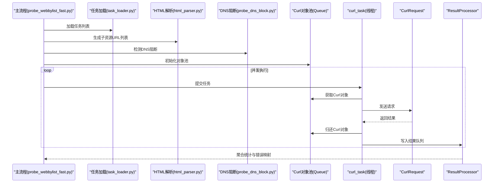
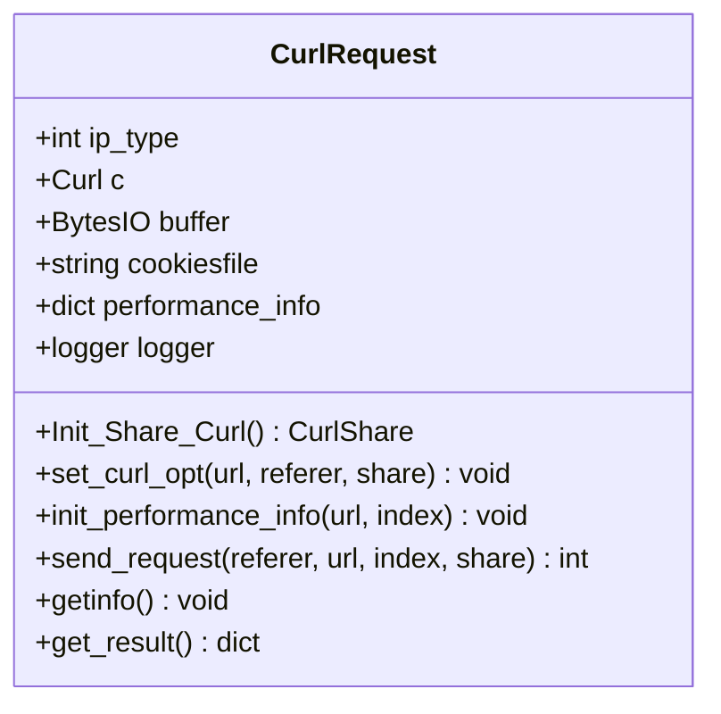
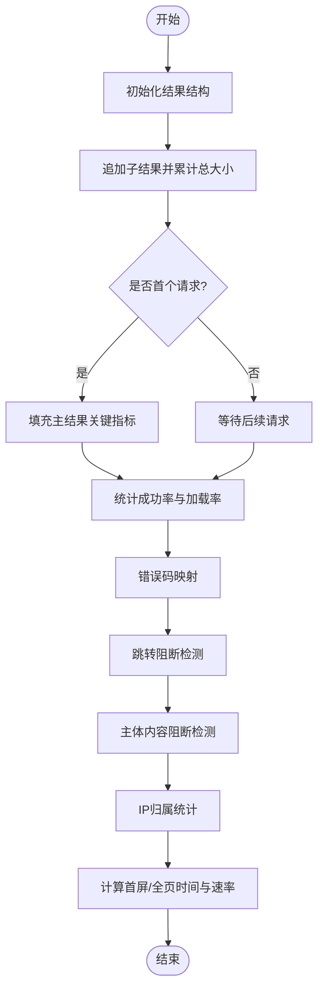
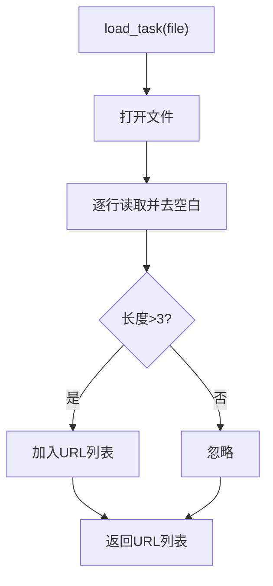
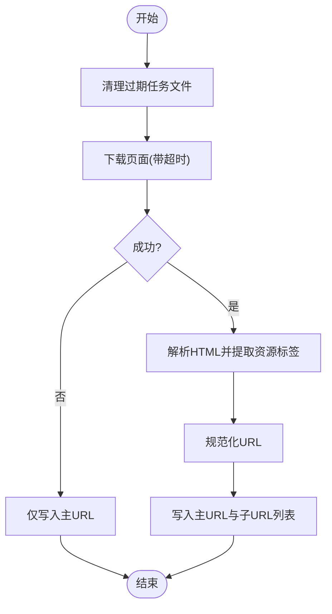
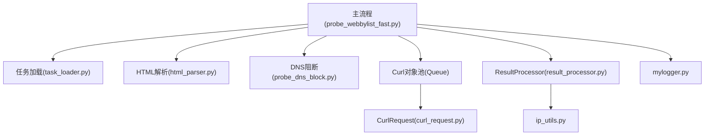

# 核心组件设计

<cite>
**本文引用的文件**
- [curl_request.py](file://probe_webbylist_fast/curl_request.py)
- [result_processor.py](file://probe_webbylist_fast/result_processor.py)
- [task_loader.py](file://probe_webbylist_fast/task_loader.py)
- [html_parser.py](file://probe_webbylist_fast/html_parser.py)
- [probe_webbylist_fast.py](file://probe_webbylist_fast/probe_webbylist_fast.py)
- [ip_utils.py](file://probe_webbylist_fast/ip_utils.py)
- [probe_dns_block.py](file://probe_webbylist_fast/probe_dns_block.py)
- [mylogger.py](file://probe_webbylist_fast/mylogger.py)
</cite>

## 目录
1. [简介](#简介)
2. [项目结构](#项目结构)
3. [核心组件](#核心组件)
4. [架构总览](#架构总览)
5. [详细组件分析](#详细组件分析)
6. [依赖关系分析](#依赖关系分析)
7. [性能考量](#性能考量)
8. [故障排查指南](#故障排查指南)
9. [结论](#结论)
10. [附录](#附录)

## 简介
本设计文档聚焦于网络探测工具集中的核心组件，围绕以下目标展开：
- 深入解析 CurlRequest 类的共享实例管理机制与对象池化策略，解释其如何通过 Curl 共享句柄（CurlShare）提升并发 HTTP 请求性能。
- 详述 ResultProcessor 类的统计分析算法，包括性能指标计算、错误码映射与结果聚合逻辑。
- 解释 TaskLoader 的任务调度机制与 HTML 解析器的页面资源提取算法。
- 分析各组件中设计模式的应用（如工厂模式、策略模式、观察者模式），并给出接口规范、参数说明与返回值定义。
- 提供具体使用模式与代码示例路径，帮助开发者快速理解内部实现与外部接口。

## 项目结构
该工具集采用模块化组织，核心文件位于 probe_webbylist_fast 目录下，主要模块职责如下：
- 探测主流程：probe_webbylist_fast.py
- HTTP 请求封装：curl_request.py
- 结果统计与分析：result_processor.py
- 任务加载：task_loader.py
- 页面资源提取：html_parser.py
- IP 归属与统计：ip_utils.py
- DNS 阻断检测：probe_dns_block.py
- 日志：mylogger.py

图表来源
- [probe_webbylist_fast.py:102-178](file://probe_webbylist_fast/probe_webbylist_fast.py#L102-L178)
- [curl_request.py:9-194](file://probe_webbylist_fast/curl_request.py#L9-L194)
- [result_processor.py:25-269](file://probe_webbylist_fast/result_processor.py#L25-L269)
- [task_loader.py:1-12](file://probe_webbylist_fast/task_loader.py#L1-L12)
- [html_parser.py:11-78](file://probe_webbylist_fast/html_parser.py#L11-L78)
- [ip_utils.py:6-235](file://probe_webbylist_fast/ip_utils.py#L6-L235)
- [probe_dns_block.py:58-207](file://probe_webbylist_fast/probe_dns_block.py#L58-L207)
- [mylogger.py:7-59](file://probe_webbylist_fast/mylogger.py#L7-L59)

章节来源
- [probe_webbylist_fast.py:102-178](file://probe_webbylist_fast/probe_webbylist_fast.py#L102-L178)

## 核心组件
本节对四个关键组件进行深入分析：CurlRequest 对象池与共享句柄、ResultProcessor 统计分析、TaskLoader 任务加载、HTML 解析器资源提取。

章节来源
- [curl_request.py:9-194](file://probe_webbylist_fast/curl_request.py#L9-L194)
- [result_processor.py:25-269](file://probe_webbylist_fast/result_processor.py#L25-L269)
- [task_loader.py:1-12](file://probe_webbylist_fast/task_loader.py#L1-L12)
- [html_parser.py:11-78](file://probe_webbylist_fast/html_parser.py#L11-L78)

## 架构总览
整体架构采用“主流程调度 + 并发请求 + 结果聚合”的模式。主流程负责任务加载、对象池初始化、并发执行与结果收集；CurlRequest 通过共享句柄减少 DNS 与 SSL 会话开销；ResultProcessor 负责统计与错误映射；HTML 解析器用于页面资源发现；DNS 阻断检测在主流程前执行以决定是否阻断。

图表来源
- [probe_webbylist_fast.py:102-178](file://probe_webbylist_fast/probe_webbylist_fast.py#L102-L178)
- [task_loader.py:1-12](file://probe_webbylist_fast/task_loader.py#L1-L12)
- [html_parser.py:11-78](file://probe_webbylist_fast/html_parser.py#L11-L78)
- [probe_dns_block.py:132-207](file://probe_webbylist_fast/probe_dns_block.py#L132-L207)
- [result_processor.py:25-269](file://probe_webbylist_fast/result_processor.py#L25-L269)

## 详细组件分析

### CurlRequest 类与对象池化
CurlRequest 封装了单次 HTTP 请求的配置与执行，支持 IPv4/IPv6 切换、自定义 DNS、共享句柄复用与调试输出。其核心要点包括：
- 共享句柄初始化：通过静态方法创建 CurlShare，共享 Cookie、DNS 与 SSL 会话，降低重复解析与握手成本。
- 请求配置：统一设置 URL、写缓冲、头部写入、重定向、SSL 验证、超时、用户代理等选项。
- 性能信息采集：通过 getinfo 获取各阶段时间、HTTP 状态码、内容类型、重定向次数、首包时间等。
- 结果封装：将性能指标、错误信息、成功标记等汇总到 performance_info 字典，便于后续统计。

图表来源
- [curl_request.py:9-194](file://probe_webbylist_fast/curl_request.py#L9-L194)

设计模式应用
- 工厂模式：静态方法 Init_Share_Curl 提供共享句柄的创建入口，便于集中管理。
- 观察者模式：通过 DEBUGFUNCTION 回调监听底层 libcurl 的调试信息，实现运行时观测与 IP 提取。

性能优化点
- 共享句柄复用：避免每请求重新解析 DNS 与建立 SSL 握手。
- 缓冲写入：使用 BytesIO 减少磁盘 IO。
- 超时与低速限制：防止慢连接拖垮整体吞吐。

接口规范
- Init_Share_Curl(): 创建并返回共享句柄对象。
- set_curl_opt(request_url, referer_url, G_CURL_SHARE): 配置请求参数并绑定共享句柄。
- send_request(referer_url, request_url, index, G_CURL_SHARE): 执行请求并返回执行码。
- getinfo(): 填充性能指标与元数据。
- get_result(): 返回当前请求的完整结果字典。

返回值定义
- send_request 返回执行码（非负表示成功，负值表示失败）。
- get_result 返回 performance_info 字典，包含时间、大小、速度、HTTP 码、错误信息等。

章节来源
- [curl_request.py:11-194](file://probe_webbylist_fast/curl_request.py#L11-L194)

### ResultProcessor 统计分析算法
ResultProcessor 提供完整的统计与分析能力，涵盖：
- 初始化：根据任务列表构建主结果与子结果结构，设定初始字段。
- 单条结果处理：将子请求结果写入子结果列表，并更新主结果的关键指标（总大小、首屏时间、TTFB 等）。
- 统计更新：计算成功率、加载数、加载率与总测试时长。
- 错误映射：将底层执行码映射为业务错误码，并处理特定场景（超时、解析超时、连接失败等）。
- 跳转阻断检测：若存在跳转且目标为内网或特定阻断 IP，则标记阻断。
- 主体内容阻断检测：若响应体包含特定关键词，标记阻断。
- IP 归属统计：基于 IP 库与运营商信息，统计不同归属组的数量与占比。

图表来源
- [result_processor.py:25-269](file://probe_webbylist_fast/result_processor.py#L25-L269)

设计模式应用
- 策略模式：错误映射函数根据执行码选择不同的映射策略，便于扩展新错误类型。
- 观察者模式：在统计过程中对子结果进行遍历与观察，动态调整指标。

接口规范
- init_result_info(result_info, task_list): 初始化主/子结果结构。
- process_one_result(result, result_dict): 追加子结果并更新主结果。
- update_result_statistics(result_dict): 计算成功率与加载率。
- check_success(result_info, ip_type): 将执行码映射为业务错误码。
- check_jump_block(result_dict, ip_type): 检测跳转阻断。
- check_body_block(result_dict): 检测主体内容阻断。
- calc_suburl_metrics(result_dict): 计算首屏/全页时间与速率。
- fill_ip_info_fast(result_info)/fill_ip_info(result_info): 填充 IP 归属与统计。

返回值定义
- 多数函数为过程型，不直接返回值；部分函数返回布尔值或字典片段，用于后续处理。

章节来源
- [result_processor.py:25-269](file://probe_webbylist_fast/result_processor.py#L25-L269)

### TaskLoader 任务调度机制
TaskLoader 负责从文件加载待探测 URL 列表，过滤无效行并返回可用列表。其设计简洁，适合在主流程中作为任务输入源。

图表来源
- [task_loader.py:1-12](file://probe_webbylist_fast/task_loader.py#L1-L12)

接口规范
- load_task(tasklistfile="urllist.txt", g_log=None): 读取任务文件并返回 URL 列表。

返回值定义
- 返回 list[str]，包含有效 URL。

章节来源
- [task_loader.py:1-12](file://probe_webbylist_fast/task_loader.py#L1-L12)

### HTML 解析器的页面资源提取算法
HTML 解析器负责从主页面提取子资源（图片、样式表、脚本），并生成子 URL 列表文件。其流程包括：
- 清理过期任务文件（保留最近 600 秒内的文件）。
- 下载页面并记录历史重定向。
- 解析 HTML，筛选 img/link(rel=stylesheet)/script 标签。
- 规范化 URL（相对路径拼接、协议补齐、data URI 忽略）。
- 写入主 URL 与子 URL 列表到文件。

图表来源
- [html_parser.py:11-78](file://probe_webbylist_fast/html_parser.py#L11-L78)

接口规范
- get_list_from_html(url_main, dnsserver=""): 生成子 URL 列表文件并返回文件路径。

返回值定义
- 返回 str，为生成的文件路径。

章节来源
- [html_parser.py:11-78](file://probe_webbylist_fast/html_parser.py#L11-L78)

## 依赖关系分析
组件间的依赖关系如下：
- 主流程依赖任务加载、HTML 解析、DNS 阻断检测、Curl 对象池、结果处理器与日志模块。
- CurlRequest 依赖 pycurl 与共享句柄。
- ResultProcessor 依赖 ip_utils 与 urllib.parse。
- HTML 解析器依赖 requests、BeautifulSoup 与 urllib.parse。
- DNS 阻断检测依赖 aiodns、wmi 与 ipaddress。
- 日志模块提供统一的日志接口。

图表来源
- [probe_webbylist_fast.py:102-178](file://probe_webbylist_fast/probe_webbylist_fast.py#L102-L178)
- [task_loader.py:1-12](file://probe_webbylist_fast/task_loader.py#L1-L12)
- [html_parser.py:11-78](file://probe_webbylist_fast/html_parser.py#L11-L78)
- [probe_dns_block.py:58-207](file://probe_webbylist_fast/probe_dns_block.py#L58-L207)
- [result_processor.py:25-269](file://probe_webbylist_fast/result_processor.py#L25-L269)
- [ip_utils.py:6-235](file://probe_webbylist_fast/ip_utils.py#L6-L235)
- [mylogger.py:7-59](file://probe_webbylist_fast/mylogger.py#L7-L59)

章节来源
- [probe_webbylist_fast.py:102-178](file://probe_webbylist_fast/probe_webbylist_fast.py#L102-L178)

## 性能考量
- 对象池化：通过固定大小的 Queue 维护 CurlRequest 实例，避免频繁构造/销毁带来的开销。
- 共享句柄：CurlShare 共享 Cookie、DNS 与 SSL 会话，显著降低重复解析与握手成本。
- 并发模型：使用 ThreadPoolExecutor 与 as_completed 控制总超时，避免长时间阻塞。
- 超时与低速限制：设置 CONNECTTIMEOUT/TIMEOUT/Low-Speed-Time，防止慢连接影响整体吞吐。
- 缓冲与序列化：使用 BytesIO 与 JSON 序列化，减少磁盘 IO 与内存拷贝。

## 故障排查指南
- Curl 执行失败：检查执行码与错误消息，定位网络、超时或解析问题。
- DNS 阻断：若本地 DNS 返回阻断 IP 且公共 DNS 不同，标记阻断并记录错误码。
- 跳转阻断：若最终 URL 指向内网或特定阻断 IP，标记阻断。
- 主体内容阻断：若响应体包含关键词，标记阻断。
- IP 归属异常：确认 IP 库文件与运营商配置正确，避免空归属导致统计偏差。

章节来源
- [result_processor.py:148-269](file://probe_webbylist_fast/result_processor.py#L148-L269)
- [probe_dns_block.py:132-207](file://probe_webbylist_fast/probe_dns_block.py#L132-L207)

## 结论
该工具集通过对象池化与共享句柄实现了高效的并发 HTTP 请求，结合完善的统计与错误映射机制，能够准确评估页面性能与阻断情况。HTML 解析器与 DNS 阻断检测进一步增强了自动化与可扩展性。建议在生产环境中结合日志与监控，持续优化超时参数与并发度。

## 附录
- 使用模式示例路径
  - 对象池初始化与并发执行：[probe_webbylist_fast.py:102-178](file://probe_webbylist_fast/probe_webbylist_fast.py#L102-L178)
  - CurlRequest 共享句柄创建：[curl_request.py:11-17](file://probe_webbylist_fast/curl_request.py#L11-L17)
  - 结果统计与错误映射：[result_processor.py:88-199](file://probe_webbylist_fast/result_processor.py#L88-L199)
  - 任务加载与资源提取：[task_loader.py:1-12](file://probe_webbylist_fast/task_loader.py#L1-L12)、[html_parser.py:11-78](file://probe_webbylist_fast/html_parser.py#L11-L78)
  - DNS 阻断检测：[probe_dns_block.py:132-207](file://probe_webbylist_fast/probe_dns_block.py#L132-L207)
  - 日志配置：[mylogger.py:7-59](file://probe_webbylist_fast/mylogger.py#L7-L59)