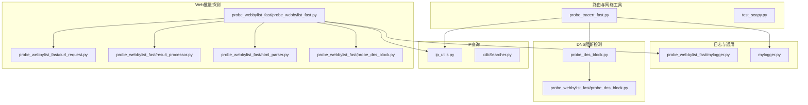
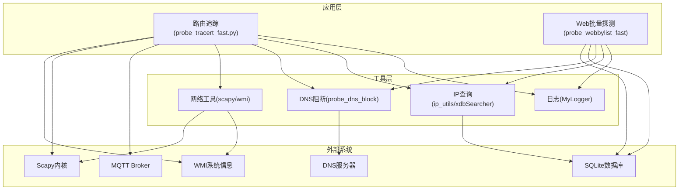
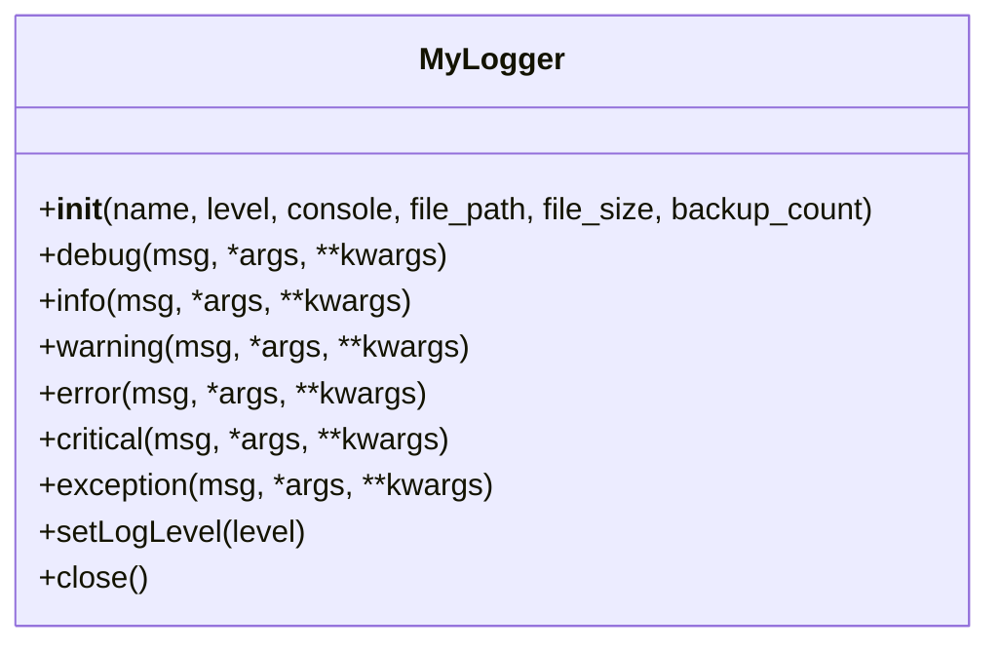
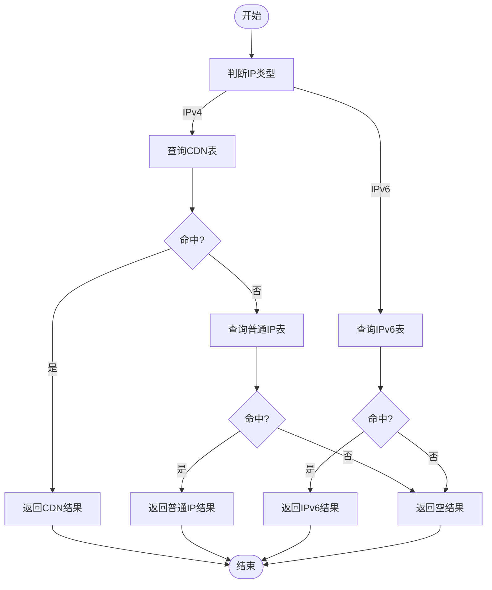
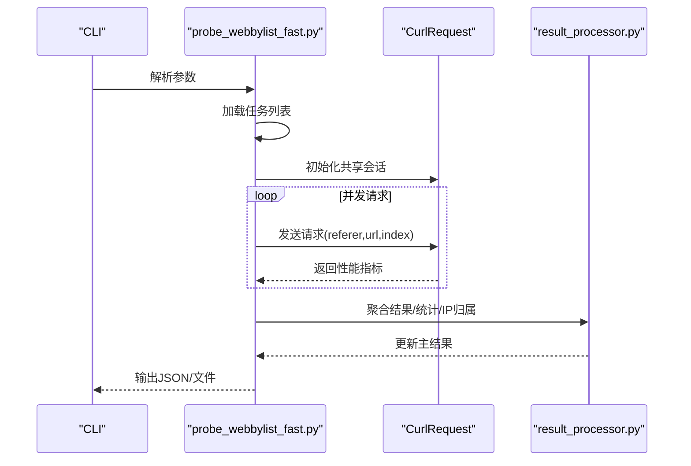
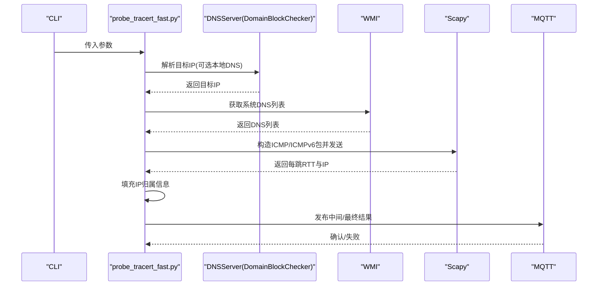
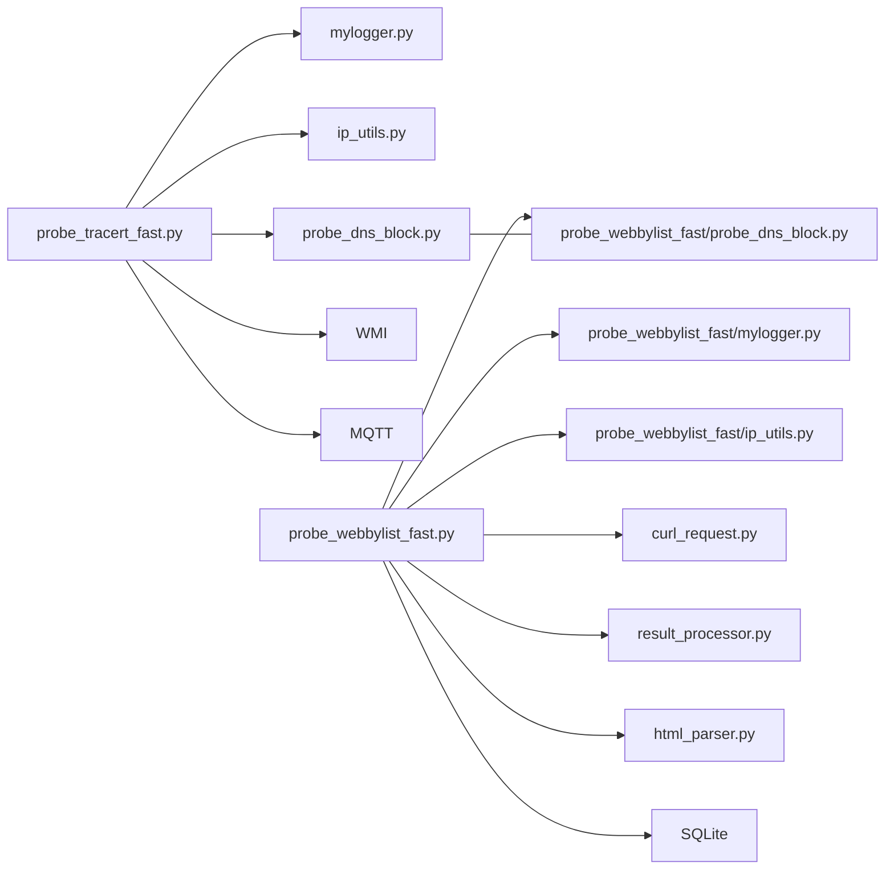

# 系统集成

<cite>
**本文引用的文件**
- [mylogger.py](file://mylogger.py)
- [ip_utils.py](file://ip_utils.py)
- [xdbSearcher.py](file://xdbSearcher.py)
- [probe_tracert_fast.py](file://probe_tracert_fast.py)
- [test_scapy.py](file://test_scapy.py)
- [probe_webbylist_fast\mylogger.py](file://probe_webbylist_fast/mylogger.py)
- [probe_webbylist_fast\ip_utils.py](file://probe_webbylist_fast/ip_utils.py)
- [probe_webbylist_fast\probe_webbylist_fast.py](file://probe_webbylist_fast/probe_webbylist_fast.py)
- [probe_webbylist_fast\curl_request.py](file://probe_webbylist_fast/curl_request.py)
- [probe_webbylist_fast\result_processor.py](file://probe_webbylist_fast/result_processor.py)
- [probe_webbylist_fast\html_parser.py](file://probe_webbylist_fast/html_parser.py)
- [probe_webbylist_fast\probe_dns_block.py](file://probe_webbylist_fast/probe_dns_block.py)
- [probe_dns_block.py](file://probe_dns_block.py)
</cite>

## 目录
1. [简介](#简介)
2. [项目结构](#项目结构)
3. [核心组件](#核心组件)
4. [架构总览](#架构总览)
5. [详细组件分析](#详细组件分析)
6. [依赖分析](#依赖分析)
7. [性能考虑](#性能考虑)
8. [故障排查指南](#故障排查指南)
9. [结论](#结论)
10. [附录](#附录)

## 简介
本系统集成文档面向网络探测工具集，聚焦于与外部系统的集成方式，涵盖日志系统、IP数据库查询服务以及网络工具调用机制。文档详细说明了MyLogger日志集成设计（日志级别、输出格式、文件轮转管理）、IP归属查询的SQLite数据库访问与缓存策略、以及与scapy路由追踪、WMI系统信息获取、MQTT消息发布等外部组件的集成接口规范、配置参数与错误处理机制，并提供可操作的集成示例与最佳实践。

## 项目结构
项目采用模块化组织，按功能域划分为：
- 日志与通用工具：mylogger.py
- IP归属查询：ip_utils.py、xdbSearcher.py
- 网络探测与路由追踪：probe_tracert_fast.py、test_scapy.py
- Web子链接批量探测与结果处理：probe_webbylist_fast\*系列文件
- DNS阻断检测与系统DNS信息获取：probe_dns_block.py、probe_webbylist_fast\probe_dns_block.py

**图表来源**
- [mylogger.py](file://mylogger.py)
- [ip_utils.py](file://ip_utils.py)
- [xdbSearcher.py](file://xdbSearcher.py)
- [probe_tracert_fast.py](file://probe_tracert_fast.py)
- [test_scapy.py](file://test_scapy.py)
- [probe_webbylist_fast\probe_webbylist_fast.py](file://probe_webbylist_fast/probe_webbylist_fast.py)
- [probe_webbylist_fast\curl_request.py](file://probe_webbylist_fast/curl_request.py)
- [probe_webbylist_fast\result_processor.py](file://probe_webbylist_fast/result_processor.py)
- [probe_webbylist_fast\html_parser.py](file://probe_webbylist_fast/html_parser.py)
- [probe_webbylist_fast\probe_dns_block.py](file://probe_webbylist_fast/probe_dns_block.py)
- [probe_dns_block.py](file://probe_dns_block.py)

**章节来源**
- [mylogger.py](file://mylogger.py)
- [ip_utils.py](file://ip_utils.py)
- [probe_tracert_fast.py](file://probe_tracert_fast.py)
- [probe_webbylist_fast\probe_webbylist_fast.py](file://probe_webbylist_fast/probe_webbylist_fast.py)

## 核心组件
- MyLogger日志系统：统一日志入口，支持控制台与文件输出、轮转、动态级别调整与资源清理。
- IP归属查询：基于SQLite的CDN与普通IP库查询，支持IPv4/IPv6；提供统计分组与过滤规则。
- Web批量探测：基于libcurl的并发请求、共享会话、DNS解析与结果聚合。
- 路由追踪：基于Scapy的ICMP/ICMPv6探测，结合WMI获取系统DNS信息，支持MQTT上报。
- DNS阻断检测：多DNS源对比与WMI系统DNS采集，辅助判断域名阻断。

**章节来源**
- [mylogger.py](file://mylogger.py)
- [ip_utils.py](file://ip_utils.py)
- [probe_webbylist_fast\curl_request.py](file://probe_webbylist_fast/curl_request.py)
- [probe_tracert_fast.py](file://probe_tracert_fast.py)
- [probe_dns_block.py](file://probe_dns_block.py)

## 架构总览
系统以“工具模块 + 接口适配 + 外部系统”三层结构组织：
- 工具模块：日志、IP查询、Web探测、路由追踪、DNS检测
- 接口适配：参数解析、配置注入、异常捕获、结果序列化
- 外部系统：SQLite数据库、WMI、MQTT、DNS服务器、Scapy内核

**图表来源**
- [probe_tracert_fast.py](file://probe_tracert_fast.py)
- [probe_webbylist_fast\probe_webbylist_fast.py](file://probe_webbylist_fast/probe_webbylist_fast.py)
- [mylogger.py](file://mylogger.py)
- [ip_utils.py](file://ip_utils.py)
- [xdbSearcher.py](file://xdbSearcher.py)
- [probe_dns_block.py](file://probe_dns_block.py)

## 详细组件分析

### 日志系统集成（MyLogger）
- 设计要点
  - 支持控制台与文件双通道输出，使用旋转文件处理器实现大小限制与备份数量管理。
  - 统一格式化器，包含时间、文件名、行号、线程ID、日志级别与消息体。
  - 提供动态设置日志级别的方法，便于运行时调整。
  - 资源清理：关闭句柄并移除处理器，避免资源泄漏。
- 配置参数
  - 名称、级别、是否启用控制台、文件路径、单文件最大字节、备份数量。
- 错误处理
  - 文件句柄创建失败时记录异常堆栈，保证进程稳定性。
- 最佳实践
  - 建议为不同模块创建独立Logger实例，便于分级管理。
  - 生产环境建议开启文件输出并设置合理轮转大小与备份数。

**图表来源**
- [mylogger.py](file://mylogger.py)
- [probe_webbylist_fast\mylogger.py](file://probe_webbylist_fast/mylogger.py)

**章节来源**
- [mylogger.py](file://mylogger.py)
- [probe_webbylist_fast\mylogger.py](file://probe_webbylist_fast/mylogger.py)

### IP归属查询集成（SQLite + 缓存策略）
- 数据库访问
  - 通过SQLite连接执行SQL查询，支持IPv4与IPv6范围匹配。
  - 采用只读URI连接，减少写锁开销。
- 查询流程
  - 先尝试CDN表，再回退至普通IP表；IPv6走专用查询路径。
  - 返回省、市、运营商等字段，用于后续统计与展示。
- 缓存策略
  - 当前实现为按需查询，未见显式缓存；可结合业务热点IP引入LRU或Redis缓存。
- 性能优化建议
  - 为IP区间字段建立索引，降低范围扫描成本。
  - 对热点IP建立进程内缓存，减少重复查询。
  - 批量查询时合并SQL或使用事务提升吞吐。

**图表来源**
- [ip_utils.py](file://ip_utils.py)
- [probe_webbylist_fast\ip_utils.py](file://probe_webbylist_fast/ip_utils.py)

**章节来源**
- [ip_utils.py](file://ip_utils.py)
- [probe_webbylist_fast\ip_utils.py](file://probe_webbylist_fast/ip_utils.py)

### Web批量探测与结果处理（libcurl + 并发）
- 并发模型
  - 进程池+线程池组合，libcurl共享会话减少DNS与SSL会话开销。
  - 请求队列与结果队列解耦，提高吞吐与稳定性。
- 关键流程
  - 任务加载、初始化结果结构、并发调度、结果聚合、统计计算、IP归属填充。
- 配置参数
  - 日志级别、输出文件、URL、IP类型、DNS服务器、超时阈值。
- 错误处理
  - 捕获libcurl异常码与错误消息，映射为统一错误码与HTTP码。
  - 超时控制与任务取消，避免长时间阻塞。
- 最佳实践
  - 合理设置连接/总超时，避免过短导致误判。
  - 使用共享会话提升DNS与SSL复用效率。
  - 对首屏/全页指标进行90分位统计，提升鲁棒性。

**图表来源**
- [probe_webbylist_fast\probe_webbylist_fast.py](file://probe_webbylist_fast/probe_webbylist_fast.py)
- [probe_webbylist_fast\curl_request.py](file://probe_webbylist_fast/curl_request.py)
- [probe_webbylist_fast\result_processor.py](file://probe_webbylist_fast/result_processor.py)

**章节来源**
- [probe_webbylist_fast\probe_webbylist_fast.py](file://probe_webbylist_fast/probe_webbylist_fast.py)
- [probe_webbylist_fast\curl_request.py](file://probe_webbylist_fast/curl_request.py)
- [probe_webbylist_fast\result_processor.py](file://probe_webbylist_fast/result_processor.py)

### 路由追踪与系统信息获取（Scapy + WMI + MQTT）
- 路由追踪
  - 基于Scapy构造ICMP/ICMPv6包，按TTL递增发送，批量接收应答，提取RTT与中间节点IP。
  - 支持IPv4/IPv6自适应，结果排序并截断至目标IP。
- 系统信息获取
  - 通过WMI枚举Win32_NetworkAdapterConfiguration获取DNS服务器列表，配合aiodns进行异步查询。
- MQTT集成
  - 将中间结果或最终结果封装为消息发布到指定Broker/Topic，便于上层监控与告警。
- 配置参数
  - 目标、地址族、MQTT Broker/Port/Topic、任务ID、输出文件、DNS服务器。
- 错误处理
  - DNS解析失败、WMI访问超时、Scapy发送失败均进行降级处理与日志记录。
- 最佳实践
  - Windows平台需管理员权限运行以确保WMI可用。
  - MQTT发布失败不阻塞主流程，但需记录错误以便重试或报警。

**图表来源**
- [probe_tracert_fast.py](file://probe_tracert_fast.py)
- [probe_dns_block.py](file://probe_dns_block.py)
- [probe_webbylist_fast\probe_dns_block.py](file://probe_webbylist_fast/probe_dns_block.py)

**章节来源**
- [probe_tracert_fast.py](file://probe_tracert_fast.py)
- [probe_dns_block.py](file://probe_dns_block.py)
- [probe_webbylist_fast\probe_dns_block.py](file://probe_webbylist_fast/probe_dns_block.py)

### DNS阻断检测与系统DNS采集
- 多源DNS对比
  - 本地DNS与公共DNS（如阿里DNS）结果差异作为阻断判定依据之一。
- 系统DNS采集
  - 通过WMI Win32_NetworkAdapterConfiguration枚举默认网关存在且配置了DNS的网络接口，提取搜索顺序。
- 异常处理
  - WMI访问超时则降级返回空列表；DNS查询异常记录并继续流程。
- 最佳实践
  - 在无本地DNS参数时优先使用WMI采集，提升准确性。
  - 对阻断IP白名单进行严格校验，避免误报。

**章节来源**
- [probe_dns_block.py](file://probe_dns_block.py)
- [probe_webbylist_fast\probe_dns_block.py](file://probe_webbylist_fast/probe_dns_block.py)

## 依赖分析
- 组件耦合
  - 路由追踪与Web探测均依赖日志与IP查询模块；Web探测还依赖DNS阻断与libcurl。
  - DNS阻断模块与系统WMI存在直接耦合，需注意跨平台兼容性。
- 外部依赖
  - SQLite：IP库查询
  - Scapy：ICMP/ICMPv6探测
  - WMI：系统DNS信息
  - MQTT：结果上报
  - aiodns：异步DNS解析
  - pycurl：HTTP请求与性能指标采集

**图表来源**
- [probe_tracert_fast.py](file://probe_tracert_fast.py)
- [mylogger.py](file://mylogger.py)
- [ip_utils.py](file://ip_utils.py)
- [probe_dns_block.py](file://probe_dns_block.py)
- [probe_webbylist_fast\probe_webbylist_fast.py](file://probe_webbylist_fast/probe_webbylist_fast.py)
- [probe_webbylist_fast\mylogger.py](file://probe_webbylist_fast/mylogger.py)
- [probe_webbylist_fast\ip_utils.py](file://probe_webbylist_fast/ip_utils.py)
- [probe_webbylist_fast\curl_request.py](file://probe_webbylist_fast/curl_request.py)
- [probe_webbylist_fast\result_processor.py](file://probe_webbylist_fast/result_processor.py)
- [probe_webbylist_fast\html_parser.py](file://probe_webbylist_fast/html_parser.py)
- [probe_webbylist_fast\probe_dns_block.py](file://probe_webbylist_fast/probe_dns_block.py)

**章节来源**
- [probe_tracert_fast.py](file://probe_tracert_fast.py)
- [probe_webbylist_fast\probe_webbylist_fast.py](file://probe_webbylist_fast/probe_webbylist_fast.py)

## 性能考虑
- 日志
  - 控制台输出可能成为瓶颈，建议生产环境关闭控制台或降低级别。
  - 轮转大小与备份数量需根据磁盘与保留策略权衡。
- IP查询
  - 建议对IP区间字段建立索引；对热点IP引入进程内缓存。
  - 批量查询时合并SQL或使用事务减少开销。
- Web探测
  - 共享会话显著降低DNS与SSL握手成本；合理设置超时避免长尾阻塞。
  - 90分位统计可减少极端值影响，提升指标稳定性。
- 路由追踪
  - Scapy批量发送与接收可减少系统调用次数；注意Windows管理员权限与防火墙策略。
- DNS阻断
  - 多源对比与WMI采集存在超时风险，需设置合理超时并降级处理。

[本节为通用指导，无需列出具体文件来源]

## 故障排查指南
- 日志问题
  - 若文件路径不存在或权限不足，文件句柄创建会失败；检查路径与权限。
  - 动态调整日志级别后需确认处理器已更新。
- IP查询失败
  - SQLite连接失败或数据库损坏；检查数据库文件与URI连接参数。
  - SQL执行异常时查看异常堆栈定位具体语句。
- Web探测异常
  - libcurl错误码映射到统一错误码，结合错误消息定位原因（超时、解析失败、连接失败等）。
  - 共享会话未正确释放会导致资源泄漏，检查关闭逻辑。
- 路由追踪
  - Windows下WMI访问超时或权限不足；确认COM初始化与权限。
  - Scapy发送失败多为权限或内核限制，检查管理员权限与系统策略。
- DNS阻断
  - WMI超时或返回空DNS列表；检查网络接口状态与DNS配置。
  - 多源DNS结果一致不代表未阻断，需结合阻断IP白名单综合判断。

**章节来源**
- [mylogger.py](file://mylogger.py)
- [ip_utils.py](file://ip_utils.py)
- [probe_webbylist_fast\curl_request.py](file://probe_webbylist_fast/curl_request.py)
- [probe_tracert_fast.py](file://probe_tracert_fast.py)
- [probe_dns_block.py](file://probe_dns_block.py)

## 结论
本系统通过模块化设计实现了日志、IP查询、Web探测、路由追踪与DNS阻断的完整集成。日志系统提供统一输出与轮转管理；IP查询以SQLite为核心，具备良好的扩展性；Web探测利用libcurl与共享会话实现高并发与可观测性；路由追踪结合Scapy与WMI，提供系统级网络诊断能力；DNS阻断检测通过多源对比与系统采集提升准确性。建议在生产环境中完善缓存策略、超时控制与错误恢复，持续优化数据库索引与并发参数。

[本节为总结性内容，无需列出具体文件来源]

## 附录
- 集成接口规范（参数与行为）
  - 日志：名称、级别、控制台开关、文件路径、单文件大小、备份数量。
  - IP查询：数据库文件路径、本地运营商配置文件路径。
  - Web探测：URL、IP类型、DNS服务器、输出文件、超时阈值、日志级别。
  - 路由追踪：目标、地址族、MQTT Broker/Port/Topic、任务ID、输出文件、DNS服务器。
  - DNS阻断：本地DNS列表、目标域名、IP类型。
- 配置示例（路径与用途）
  - 日志文件：logs/probe_suburldown.log（Web批量探测）
  - IP数据库：nettest_ipaddress.db（SQLite）
  - HTML解析临时目录：task_tmp（Web批量探测）
- 最佳实践清单
  - 为不同模块创建独立Logger实例，启用文件轮转。
  - 对热点IP引入缓存，减少数据库压力。
  - 合理设置libcurl超时与共享会话，避免长尾阻塞。
  - Windows平台运行路由追踪需管理员权限。
  - DNS阻断判定需结合多源结果与阻断IP白名单。

[本节为参考性内容，无需列出具体文件来源]