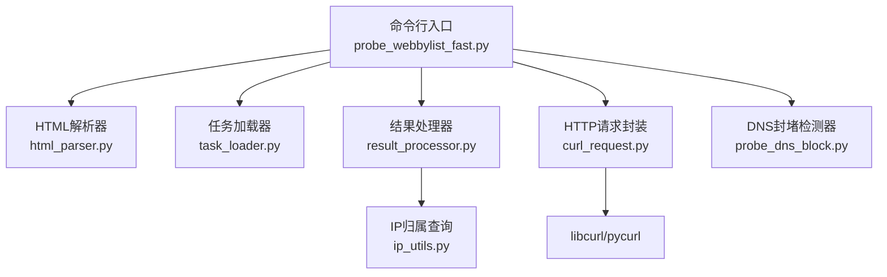
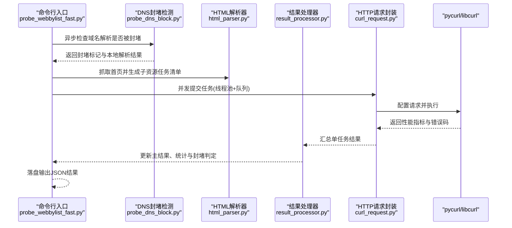
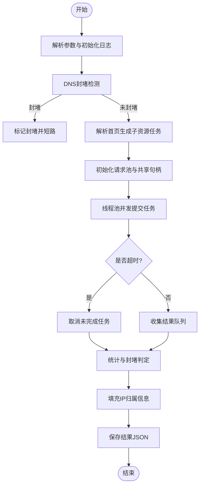
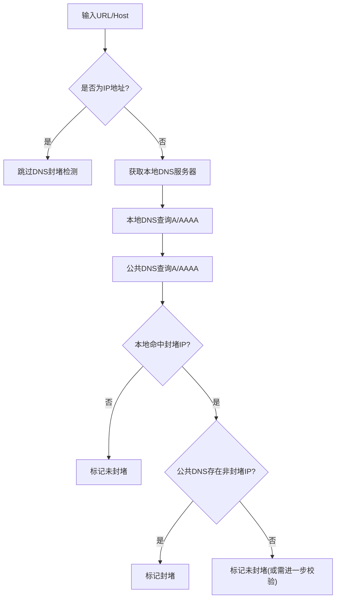
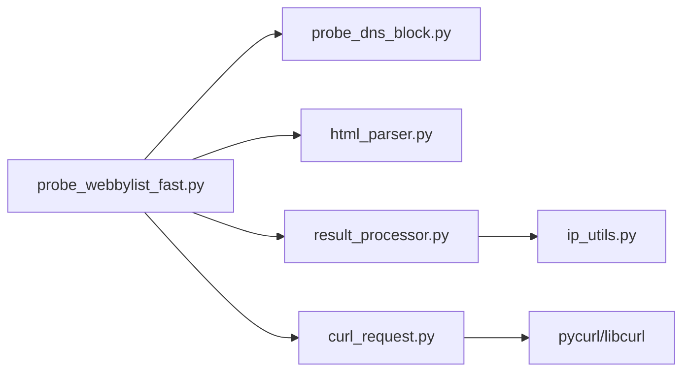

# 故障排除与常见问题

<cite>
**本文引用的文件**   
- [probe_webbylist_fast.py](file://probe_webbylist_fast/probe_webbylist_fast.py)
- [result_processor.py](file://probe_webbylist_fast/result_processor.py)
- [curl_request.py](file://probe_webbylist_fast/curl_request.py)
- [html_parser.py](file://probe_webbylist_fast/html_parser.py)
- [mylogger.py](file://probe_webbylist_fast/mylogger.py)
- [probe_dns_block.py](file://probe_dns_block.py)
- [ip_utils.py](file://ip_utils.py)
- [probe_httpdown_fast.py](file://probe_httpdown_fast.py)
- [probe_webbylist_fast.spec](file://probe_webbylist_fast/probe_webbylist_fast.spec)
</cite>

## 目录
1. [简介](#简介)
2. [项目结构](#项目结构)
3. [核心组件](#核心组件)
4. [架构总览](#架构总览)
5. [详细组件分析](#详细组件分析)
6. [依赖分析](#依赖分析)
7. [性能考虑](#性能考虑)
8. [故障排除指南](#故障排除指南)
9. [结论](#结论)
10. [附录](#附录)

## 简介
本文件面向网络探测工具集的使用者与维护者，提供系统化的故障排除与常见问题解答。内容覆盖安装与环境准备、配置错误、运行时异常、DNS封堵误判识别与处理、网络连接诊断流程、系统兼容性与替代方案、调试技巧与工具使用、错误代码对照表与诊断方法，并给出分层的问题解决指南与问题反馈机制建议。

## 项目结构
该工具集由多个探测器模块组成，其中与网页子资源探测相关的模块位于 probe_webbylist_fast 子目录，另有独立的 HTTP 探测器模块。整体采用多进程+线程池并发模型，结合 pycurl/libcurl 执行网络请求，通过 HTML 解析生成任务清单，再对子资源逐一探测并汇总统计。

图表来源
- [probe_webbylist_fast.py:102-195](file://probe_webbylist_fast/probe_webbylist_fast.py#L102-L195)
- [html_parser.py:11-78](file://probe_webbylist_fast/html_parser.py#L11-L78)
- [result_processor.py:25-146](file://probe_webbylist_fast/result_processor.py#L25-L146)
- [curl_request.py:9-194](file://probe_webbylist_fast/curl_request.py#L9-L194)
- [probe_dns_block.py:59-211](file://probe_dns_block.py#L59-L211)
- [ip_utils.py:6-235](file://ip_utils.py#L6-L235)

章节来源
- [probe_webbylist_fast.py:198-222](file://probe_webbylist_fast/probe_webbylist_fast.py#L198-L222)
- [probe_webbylist_fast.spec:19-44](file://probe_webbylist_fast/probe_webbylist_fast.spec#L19-L44)

## 核心组件
- 命令行入口与调度器：负责参数解析、DNS封堵预检、任务生成、并发执行与结果落盘。
- HTML 解析器：抓取首页并提取子资源链接，生成任务清单文件。
- 结果处理器：初始化结果结构、聚合子任务指标、计算成功率与首屏/满页时间、判定封堵与错误类型。
- HTTP 请求封装：基于 pycurl 的请求配置、性能指标采集、错误码映射。
- DNS 封堵检测器：对比本地与公共 DNS 的解析结果，识别封堵场景。
- IP 归属查询：根据远端 IP 查询归属地与运营商，支持 IPv4/IPv6。
- 日志系统：统一输出到控制台与轮转文件，便于定位问题。

章节来源
- [probe_webbylist_fast.py:102-195](file://probe_webbylist_fast/probe_webbylist_fast.py#L102-L195)
- [html_parser.py:11-78](file://probe_webbylist_fast/html_parser.py#L11-L78)
- [result_processor.py:25-269](file://probe_webbylist_fast/result_processor.py#L25-L269)
- [curl_request.py:9-194](file://probe_webbylist_fast/curl_request.py#L9-L194)
- [probe_dns_block.py:59-211](file://probe_dns_block.py#L59-L211)
- [ip_utils.py:6-235](file://ip_utils.py#L6-L235)
- [mylogger.py:7-59](file://probe_webbylist_fast/mylogger.py#L7-L59)

## 架构总览
下图展示从命令行到网络探测再到结果汇总的关键交互流程：

图表来源
- [probe_webbylist_fast.py:102-195](file://probe_webbylist_fast/probe_webbylist_fast.py#L102-L195)
- [probe_dns_block.py:135-211](file://probe_dns_block.py#L135-L211)
- [html_parser.py:11-78](file://probe_webbylist_fast/html_parser.py#L11-L78)
- [result_processor.py:65-146](file://probe_webbylist_fast/result_processor.py#L65-L146)
- [curl_request.py:130-155](file://probe_webbylist_fast/curl_request.py#L130-L155)

## 详细组件分析

### 组件A：网页子资源探测流程（并发调度与结果聚合）
- 关键流程
  - 参数解析与日志初始化
  - DNS 封堵预检（若命中则直接标记封堵）
  - 从首页提取子资源并写入任务清单
  - 初始化共享 pycurl 实例与请求池
  - 线程池并发执行任务，超时控制与取消未完成任务
  - 结果队列消费、统计更新、封堵判定、IP 归属填充
  - 输出 JSON 结果并关闭共享句柄

图表来源
- [probe_webbylist_fast.py:102-195](file://probe_webbylist_fast/probe_webbylist_fast.py#L102-L195)
- [result_processor.py:65-146](file://probe_webbylist_fast/result_processor.py#L65-L146)
- [curl_request.py:66-99](file://probe_webbylist_fast/curl_request.py#L66-L99)

章节来源
- [probe_webbylist_fast.py:102-195](file://probe_webbylist_fast/probe_webbylist_fast.py#L102-L195)
- [result_processor.py:65-146](file://probe_webbylist_fast/result_processor.py#L65-L146)

### 组件B：DNS封堵检测与误报识别
- 检测策略
  - 若输入为 IP 地址则跳过检测
  - 优先使用本地 DNS 查询，再用公共 DNS 对比
  - 判定规则：本地解析命中封堵 IP 且公共 DNS 不命中封堵 IP 视为封堵
  - 支持 IPv4/IPv6 与混合场景
- 误报识别要点
  - 若本地解析为空或全部非封堵 IP，即使公共 DNS 有正常 IP，也不应标记封堵
  - 若仅本地解析命中封堵 IP，但公共 DNS 同样命中封堵 IP，则不构成封堵
  - 建议增加“公共 DNS 正常 IP 数量”阈值，避免单个封堵 IP 导致误判

图表来源
- [probe_dns_block.py:135-211](file://probe_dns_block.py#L135-L211)

章节来源
- [probe_dns_block.py:59-211](file://probe_dns_block.py#L59-L211)

### 组件C：HTTP 请求与错误码映射
- 错误码映射（示例）
  - 1001：DNS解析失败
  - 1002：TCP连接失败
  - 1003：SSL协商失败
  - 1004：连接被重置
  - 1005：服务端传输超时/速度过慢
  - 1006：访问总时长超7秒
  - 1007：重定向次数过多
  - 1008：URL格式错误
  - 1009：跳转至反诈网站或命中反诈特征
  - 1010：重定向后指向异常IP
  - 1011：运营商DNS封堵
  - 1012：测试总时间超时
  - 1099：未知失败原因
- 典型触发场景
  - DNS 超时/解析失败：映射为 1001
  - 连接超时/慢速：映射为 1002/1005
  - 证书/握手失败：映射为 1003
  - 重定向链过长或最终异常：映射为 1007/1010
  - 响应体命中反诈关键字：映射为 1009
  - 总时长超限：映射为 1012

章节来源
- [result_processor.py:148-269](file://probe_webbylist_fast/result_processor.py#L148-L269)
- [probe_httpdown_fast.py:121-191](file://probe_httpdown_fast.py#L121-L191)

### 组件D：IP 归属查询与统计
- 功能
  - 支持 IPv4/IPv6 归属查询
  - 统计“本网本省/本网外省/异网/其他/空”等维度
  - 提供主 IP 归属信息与子资源 IP 分布
- 注意事项
  - 数据库连接只读模式，避免写入
  - 对空/4xx/5xx/空归属进行过滤统计

章节来源
- [ip_utils.py:6-235](file://ip_utils.py#L6-L235)
- [result_processor.py:100-146](file://probe_webbylist_fast/result_processor.py#L100-L146)

## 依赖分析
- 组件耦合
  - 命令行入口依赖 DNS 检测、HTML 解析、结果处理与 HTTP 请求封装
  - 结果处理依赖 IP 归属查询
  - HTTP 请求封装依赖 pycurl/libcurl
- 外部依赖
  - pycurl、aiodns、requests、BeautifulSoup、wmi、sqlite3
- 潜在风险
  - DNS 查询超时/阻断导致误判
  - libcurl 版本差异引发行为不一致
  - SQLite 数据库文件缺失或损坏影响归属统计

图表来源
- [probe_webbylist_fast.py:102-195](file://probe_webbylist_fast/probe_webbylist_fast.py#L102-L195)
- [result_processor.py:25-146](file://probe_webbylist_fast/result_processor.py#L25-L146)
- [curl_request.py:9-194](file://probe_webbylist_fast/curl_request.py#L9-L194)
- [ip_utils.py:6-235](file://ip_utils.py#L6-L235)

## 性能考虑
- 并发策略
  - CPU 核心数 + 4 的线程池大小，平衡吞吐与资源占用
  - 请求池队列上限与超时控制，避免资源枯竭
- 超时与取消
  - 总超时控制与任务级超时，及时取消未完成任务
- I/O 与解析
  - HTML 解析与任务写盘在主线程，注意大页面带来的 I/O 压力
- 日志级别
  - 生产建议使用 info/warning，避免 debug 造成磁盘与 CPU 压力

章节来源
- [probe_webbylist_fast.py:110-136](file://probe_webbylist_fast/probe_webbylist_fast.py#L110-L136)

## 故障排除指南

### 安装与环境准备
- Python 与依赖
  - 确认已安装 requests、beautifulsoup4、pycurl、aiodns、wmi 等依赖
  - 若 pycurl 编译失败，参考 pycurl 安装文档或使用预编译 wheel
- 数据库文件
  - 确保 nettest_ipaddress.db 存在且可读
- Windows 事件循环
  - 在 Windows 上使用 asyncio 时启用 WindowsSelectorEventLoopPolicy

章节来源
- [probe_webbylist_fast.py:218-221](file://probe_webbylist_fast/probe_webbylist_fast.py#L218-L221)
- [ip_utils.py:23-31](file://ip_utils.py#L23-L31)

### 配置错误
- URL 协议头
  - 未带 http:// 或 https:// 时会自动补全，建议显式提供
- DNS 服务器
  - --dnsserver 参数用于强制指定 DNS；若留空则尝试自动获取
- IPv4/IPv6
  - --iptype 选择 4 或 6；确保网络栈支持对应协议
- 输出文件
  - --output 指定输出 JSON 文件路径

章节来源
- [probe_webbylist_fast.py:184-206](file://probe_webbylist_fast/probe_webbylist_fast.py#L184-L206)
- [curl_request.py:84-86](file://probe_webbylist_fast/curl_request.py#L84-L86)

### 运行时异常与错误码对照
- 常见错误码与处理建议
  - 1001：DNS解析失败
    - 检查 --dnsserver 与网络连通性；必要时切换公共 DNS
  - 1002：TCP连接失败
    - 检查防火墙/代理/端口可达性；缩短连接超时
  - 1003：SSL协商失败
    - 检查证书链与系统时间；临时禁用校验仅用于诊断
  - 1005：传输超时/速度过慢
    - 检查链路质量与服务器负载；放宽速度阈值
  - 1006：访问总时长超7秒
    - 调整总超时或减少重定向
  - 1007：重定向次数过多
    - 检查中间节点重定向策略
  - 1009：命中反诈特征
    - 根据响应体关键字定位；记录有效 URL 以便复现
  - 1010：重定向后指向异常IP
    - 检查最终域名解析与跳转链
  - 1011：运营商DNS封堵
    - 与公共 DNS 结果对比确认；避免误报
  - 1012：测试总时间超时
    - 降低并发或延长超时
  - 1099：未知失败原因
    - 开启 debug 日志并抓包分析

章节来源
- [result_processor.py:148-269](file://probe_webbylist_fast/result_processor.py#L148-L269)
- [probe_httpdown_fast.py:121-191](file://probe_httpdown_fast.py#L121-L191)

### DNS封堵误报识别与处理
- 误报特征
  - 本地解析为空或全部非封堵 IP
  - 本地与公共 DNS 均命中封堵 IP
- 处理建议
  - 增加“公共 DNS 正常 IP 数量”阈值
  - 对特定封堵 IP 白名单放行或二次验证
  - 记录解析结果与对比日志，便于人工复核

章节来源
- [probe_dns_block.py:135-211](file://probe_dns_block.py#L135-L211)

### 网络连接问题诊断流程
- 基础检查
  - 本机网络连通性与路由
  - 防火墙/安全软件拦截
  - 代理/VPN 干扰
- 工具与步骤
  - 使用 curl 命令行验证直连
  - 抓包分析（Wireshark/Tcpdump）观察 DNS/TLS/HTTP 层
  - 分阶段缩小范围：DNS → TCP → TLS → 应用
- 结果验证
  - 对比不同 DNS（本地/公共）解析结果
  - 更换 --dnsserver 与 --iptype 再试

章节来源
- [probe_httpdown_fast.py:329-420](file://probe_httpdown_fast.py#L329-L420)

### 系统兼容性与替代方案
- Windows
  - 使用 WindowsSelectorEventLoopPolicy
  - 确保 pycurl 与 libcurl 版本匹配
- Linux/macOS
  - 确保系统 libcurl 与证书库可用
- 替代方案
  - 使用 requests + aiohttp 作为 HTTP 客户端（需自行适配指标采集）
  - 使用第三方抓包工具（如 Wireshark）辅助定位

章节来源
- [probe_webbylist_fast.py:218-221](file://probe_webbylist_fast/probe_webbylist_fast.py#L218-L221)

### 调试技巧与工具使用
- 日志分析
  - 使用 --log debug 输出详细日志
  - 关注 curl debug 输出中的 “Trying ...” 行，定位解析到的 IP
- 网络抓包
  - 使用 tcpdump/Wireshark 抓取 DNS/TLS/HTTP 流量
  - 关注重定向链与异常 IP
- 性能分析
  - 使用系统自带性能监视器或火焰图工具
  - 关注 CPU/IO 瓶颈与线程池饱和度

章节来源
- [mylogger.py:7-59](file://probe_webbylist_fast/mylogger.py#L7-L59)
- [curl_request.py:69-79](file://probe_webbylist_fast/curl_request.py#L69-L79)

### 分层问题解决指南
- 初学者
  - 固定参数：--url/--output/--iptype，先跑通单任务
  - 逐步引入 --dnsserver 与并发，观察日志
- 进阶用户
  - 开启 debug 日志，抓包分析，定位具体环节（DNS/连接/证书/应用）
  - 调整超时与重定向上限，优化并发度
- 高级用户
  - 自定义 DNS 对比策略，扩展误报识别规则
  - 将 pycurl 替换为其他客户端，评估性能差异

### 问题反馈与报告机制
- 建议收集的信息
  - 完整命令行参数与日志文件
  - 目标站点 URL 与 --dnsserver
  - 操作系统版本与 Python/pip 环境
  - 抓包文件（可选）
- 提交渠道
  - 通过仓库 Issue 提交，附带上述信息与最小复现步骤

## 结论
本指南提供了从安装、配置、运行到排错与优化的完整路径。针对 DNS 封堵误报、网络连接异常与系统兼容性问题，建议结合日志、抓包与分阶段验证，配合合理的超时与并发策略，持续提升工具的稳定性与准确性。

## 附录

### 错误代码对照表（节选）
- 1001：DNS解析失败
- 1002：TCP连接失败
- 1003：SSL协商失败
- 1004：连接被重置
- 1005：服务端传输超时/速度过慢
- 1006：访问总时长超7秒
- 1007：重定向次数过多
- 1008：URL格式错误
- 1009：跳转至反诈网站或命中反诈特征
- 1010：重定向后指向异常IP
- 1011：运营商DNS封堵
- 1012：测试总时间超时
- 1099：未知失败原因

章节来源
- [result_processor.py:148-269](file://probe_webbylist_fast/result_processor.py#L148-L269)
- [probe_httpdown_fast.py:121-191](file://probe_httpdown_fast.py#L121-L191)