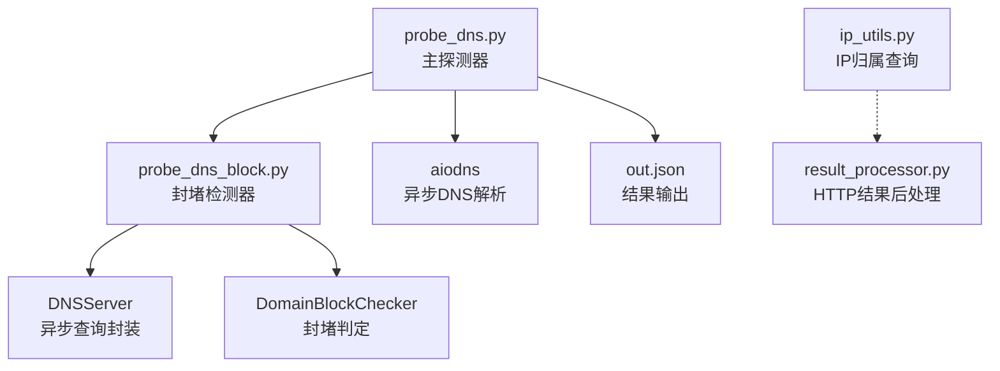
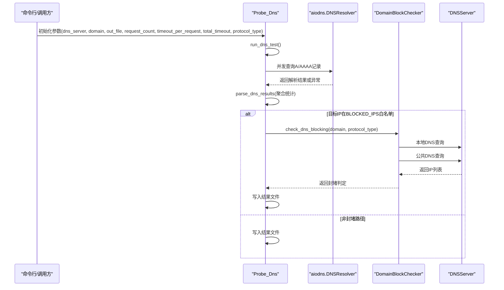
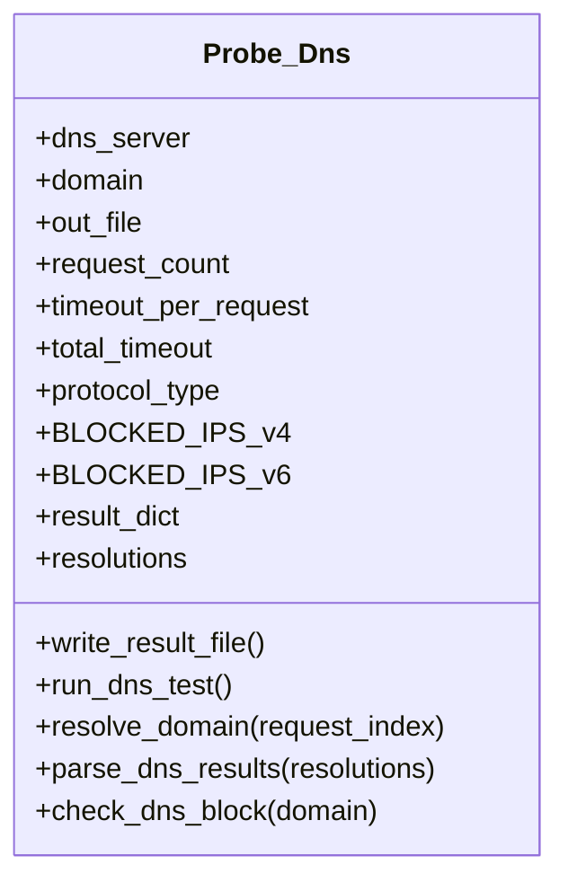
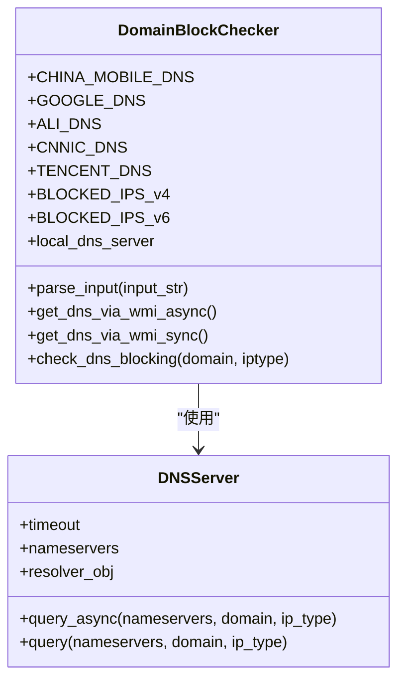
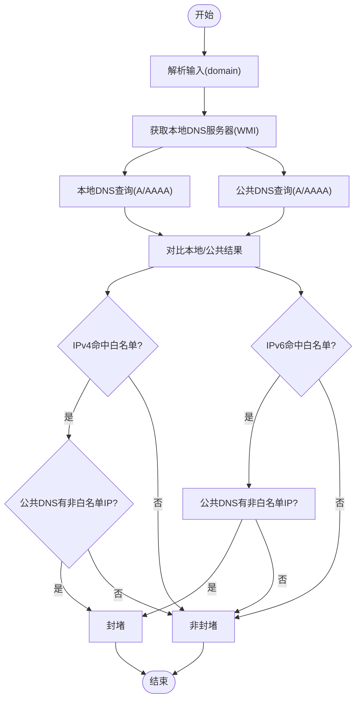
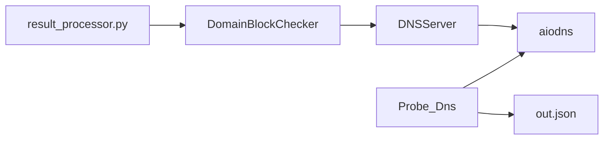

# DNS解析探测模块

<cite>
**本文引用的文件**
- [probe_dns.py](file://probe_dns.py)
- [probe_dns_block.py](file://probe_dns_block.py)
- [ip_utils.py](file://ip_utils.py)
- [mylogger.py](file://mylogger.py)
- [probe_dns.spec](file://probe_dns.spec)
- [probe_dns_block.spec](file://probe_dns_block.spec)
- [out.json](file://out.json)
- [result_processor.py](file://probe_webbylist_fast/result_processor.py)
</cite>

## 目录
1. [简介](#简介)
2. [项目结构](#项目结构)
3. [核心组件](#核心组件)
4. [架构总览](#架构总览)
5. [详细组件分析](#详细组件分析)
6. [依赖关系分析](#依赖关系分析)
7. [性能考量](#性能考量)
8. [故障排查指南](#故障排查指南)
9. [结论](#结论)
10. [附录](#附录)

## 简介
本文件面向DNS解析探测模块，系统性阐述Probe_Dns类的设计与实现，涵盖：
- 异步DNS查询机制与并发控制策略
- 双栈支持（IPv4/IPv6）
- DNS封堵检测：BLOCKED_IPS白名单机制与DomainBlockChecker的异步检测流程
- 参数配置说明与最佳实践
- JSON结果数据结构与指标含义
- 错误处理、超时管理与性能优化建议
- 初学者DNS协议基础与开发者扩展指南

## 项目结构
该模块位于仓库根目录下，主要文件如下：
- 探测主程序：probe_dns.py
- 封堵检测：probe_dns_block.py
- IP归属与统计工具：ip_utils.py
- 日志工具：mylogger.py
- 打包配置：probe_dns.spec、probe_dns_block.spec
- 结果样例：out.json
- 结果后处理（与HTTP探测联动）：probe_webbylist_fast/result_processor.py

图表来源
- [probe_dns.py:15-203](file://probe_dns.py#L15-L203)
- [probe_dns_block.py:59-230](file://probe_dns_block.py#L59-L230)
- [ip_utils.py:6-235](file://ip_utils.py#L6-L235)
- [result_processor.py:1-269](file://probe_webbylist_fast/result_processor.py#L1-L269)

章节来源
- [probe_dns.py:15-203](file://probe_dns.py#L15-L203)
- [probe_dns_block.py:59-230](file://probe_dns_block.py#L59-L230)
- [ip_utils.py:6-235](file://ip_utils.py#L6-L235)
- [result_processor.py:1-269](file://probe_webbylist_fast/result_processor.py#L1-L269)

## 核心组件
- Probe_Dns：主探测器，负责异步DNS查询、并发控制、结果聚合与封堵检测触发。
- DomainBlockChecker：基于本地DNS与公共DNS对比的封堵检测器，支持IPv4/IPv6。
- DNSServer：对aiodns.DNSResolver进行轻量封装，统一查询入口。
- ip_utils：IP归属查询与统计辅助工具。
- result_processor：HTTP探测结果后处理，包含DNS封堵识别逻辑。

章节来源
- [probe_dns.py:15-203](file://probe_dns.py#L15-L203)
- [probe_dns_block.py:59-230](file://probe_dns_block.py#L59-L230)
- [ip_utils.py:6-235](file://ip_utils.py#L6-L235)
- [result_processor.py:148-269](file://probe_webbylist_fast/result_processor.py#L148-L269)

## 架构总览
整体采用“主探测器+异步DNS解析+封堵检测器”的分层设计。主探测器在指定次数内并发发起DNS查询，收集解析结果并计算统计指标；当目标IP命中封堵白名单时，触发DomainBlockChecker进行跨DNS服务器比对，判断是否被DNS封堵。

图表来源
- [probe_dns.py:55-93](file://probe_dns.py#L55-L93)
- [probe_dns.py:94-148](file://probe_dns.py#L94-L148)
- [probe_dns_block.py:135-210](file://probe_dns_block.py#L135-L210)
- [probe_dns_block.py:25-56](file://probe_dns_block.py#L25-L56)

## 详细组件分析

### Probe_Dns 类
- 职责
  - 异步并发DNS查询（A/AAAA）
  - 统计指标计算（最小/最大/平均解析时延、成功率、目标IP等）
  - 结果写盘与封堵检测触发
- 关键字段
  - dns_server、domain、out_file、request_count、timeout_per_request、total_timeout、protocol_type
  - BLOCKED_IPS_v4/BLOCKED_IPS_v6 白名单
  - result_dict：JSON输出模板
  - resolutions：单次请求的解析结果缓存
- 并发控制
  - 使用信号量限制并发度（当前注释为1，实际并发受gather与wait_for影响）
  - 总体超时通过wait_for控制
- 协议类型
  - protocol_type=0：同时查询A/AAAA
  - protocol_type=4：仅查询A
  - protocol_type=6：仅查询AAAA
- 封堵检测触发
  - 当protocol_type匹配且target_ip在对应白名单时，调用check_dns_block

图表来源
- [probe_dns.py:15-41](file://probe_dns.py#L15-L41)
- [probe_dns.py:55-93](file://probe_dns.py#L55-L93)
- [probe_dns.py:94-148](file://probe_dns.py#L94-L148)
- [probe_dns.py:150-170](file://probe_dns.py#L150-L170)

章节来源
- [probe_dns.py:15-41](file://probe_dns.py#L15-L41)
- [probe_dns.py:55-93](file://probe_dns.py#L55-L93)
- [probe_dns.py:94-148](file://probe_dns.py#L94-L148)
- [probe_dns.py:150-170](file://probe_dns.py#L150-L170)

### DomainBlockChecker 与 DNSServer
- DNSServer
  - 对aiodns.DNSResolver进行封装，支持自定义nameservers与timeout
  - 提供同步/异步查询接口
- DomainBlockChecker
  - 解析输入域名，支持URL与IP输入
  - 通过WMI获取本地DNS服务器（Windows）
  - 同时向本地DNS与公共DNS（如阿里DNS）查询，比较结果差异
  - 基于BLOCKED_IPS_v4/v6白名单判定是否封堵
  - 支持IPv4/IPv6/双栈判定

图表来源
- [probe_dns_block.py:11-56](file://probe_dns_block.py#L11-L56)
- [probe_dns_block.py:59-210](file://probe_dns_block.py#L59-L210)

章节来源
- [probe_dns_block.py:11-56](file://probe_dns_block.py#L11-L56)
- [probe_dns_block.py:59-210](file://probe_dns_block.py#L59-L210)

### DNS封堵检测流程（DomainBlockChecker）
- 输入解析：支持URL与IP，自动补全scheme与端口
- 本地DNS发现：通过WMI获取本机活动DNS服务器
- 查询对比：本地DNS与公共DNS（如阿里DNS）分别查询A/AAAA
- 判定规则：
  - 若本地解析结果全部命中BLOCKED_IPS且公共DNS结果不全命中，则判定为DNS封堵
  - 支持IPv4/IPv6/双栈场景
- 输出：返回布尔值（是否封堵）与本地解析结果

图表来源
- [probe_dns_block.py:135-210](file://probe_dns_block.py#L135-L210)
- [probe_dns_block.py:65-66](file://probe_dns_block.py#L65-L66)

章节来源
- [probe_dns_block.py:135-210](file://probe_dns_block.py#L135-L210)
- [probe_dns_block.py:65-66](file://probe_dns_block.py#L65-L66)

### 参数配置说明与最佳实践
- dns_server：DNS服务器地址（字符串），用于aiodns.DNSResolver初始化
- domain：待解析域名或URL（字符串）
- out_file：结果输出文件路径（字符串）
- request_count：并发查询次数（整型，默认值见构造函数）
- timeout_per_request：单次请求超时（秒，浮点），用于aiodns.wait_for
- total_timeout：总体超时（秒，浮点），用于run_dns_test的gather超时
- protocol_type：协议类型（整型）
  - 0：双栈（A+AAAA）
  - 4：仅IPv4（A）
  - 6：仅IPv6（AAAA）

最佳实践
- 并发度：当前并发受信号量与gather组合影响，建议根据网络环境调整request_count与timeout_per_request
- 超时设置：timeout_per_request应小于total_timeout，避免整体超时提前触发
- 白名单：BLOCKED_IPS_v4/v6可按地区/运营商策略维护，确保准确性

章节来源
- [probe_dns.py:16-25](file://probe_dns.py#L16-L25)
- [probe_dns.py:55-93](file://probe_dns.py#L55-L93)
- [probe_dns.py:94-148](file://probe_dns.py#L94-L148)

### JSON结果数据结构与指标含义
输出文件（out.json）包含以下关键字段（示例来自仓库）：
- time_namelookup：DNS解析阶段耗时（毫秒）
- time_connect：TCP连接耗时（毫秒）
- time_total：总耗时（毫秒）
- remote_ip：解析到的目标IP
- response_code：响应码（HTTP或内部码）
- size_download/speed_download：下载大小与速度
- ip_info：IP归属信息（运营商、省份、城市）
- urle_host：主机名
- dns_block：DNS封堵标记（0/1）
- code：执行状态码
- is_success：是否成功
- num_redirects：重定向次数

章节来源
- [out.json:1-1](file://out.json#L1-L1)

### DNS协议基础知识（面向初学者）
- DNS（Domain Name System）：将域名映射为IP地址的服务
- 记录类型
  - A记录：IPv4地址
  - AAAA记录：IPv6地址
- 查询方式
  - 递归查询：客户端向DNS服务器发起，由其代为查询
  - 迭代查询：DNS服务器逐级查询根/顶级域/权威服务器
- 常见问题
  - 解析失败：网络不通、服务器故障、域名不存在
  - 解析缓慢：DNS服务器性能差、缓存缺失
  - 被封堵：运营商或防火墙返回特定IP（如本地回环、特定运营商IP）

## 依赖关系分析
- Probe_Dns 依赖 aiodns 实现异步查询
- DomainBlockChecker 依赖 DNSServer 与 aiordns
- Windows平台通过WMI获取本地DNS服务器
- 结果后处理模块（HTTP探测）会复用DNS封堵判定逻辑

图表来源
- [probe_dns.py:7](file://probe_dns.py#L7)
- [probe_dns_block.py:4](file://probe_dns_block.py#L4)
- [result_processor.py:148-269](file://probe_webbylist_fast/result_processor.py#L148-L269)

章节来源
- [probe_dns.py:7](file://probe_dns.py#L7)
- [probe_dns_block.py:4](file://probe_dns_block.py#L4)
- [result_processor.py:148-269](file://probe_webbylist_fast/result_processor.py#L148-L269)

## 性能考量
- 异步并发：利用aiodns与asyncio.gather提升吞吐，但需注意网络与DNS服务器承载能力
- 超时控制：合理设置timeout_per_request与total_timeout，避免长时间阻塞
- 并发度：当前并发受信号量与gather组合影响，建议结合实际环境调优
- 白名单命中率：命中白名单时触发封堵检测，减少无效查询
- I/O与序列化：结果写盘为同步操作，建议批量写入或合并输出

[本节为通用性能建议，无需特定文件来源]

## 故障排查指南
- 常见错误码与含义（来自HTTP探测后处理，可映射到DNS阶段）
  - 1001：解析超时（Resolving timed out）
  - 1002：连接超时/解析异常
  - 1005：操作超时
  - 1006：总耗时过长
  - 1008：特定错误（如3）
  - 1009：疑似封堵（命中BLOCKED_IPS）
- DNS封堵识别
  - HTTP后处理中对HOST/IP命中白名单的封堵判定逻辑可参考
  - DNS阶段若命中白名单，将触发DomainBlockChecker进行跨DNS比对

章节来源
- [result_processor.py:158-198](file://probe_webbylist_fast/result_processor.py#L158-L198)
- [result_processor.py:245-269](file://probe_webbylist_fast/result_processor.py#L245-L269)

## 结论
本模块通过异步DNS查询与并发控制，实现了高吞吐的域名解析探测，并在命中封堵白名单时联动DomainBlockChecker进行跨DNS比对，有效识别DNS封堵行为。结合合理的参数配置与超时管理，可在不同网络环境下稳定运行。建议在生产环境中持续优化并发度与超时阈值，并定期更新BLOCKED_IPS白名单以提升准确性。

[本节为总结性内容，无需特定文件来源]

## 附录

### 开发者扩展与定制指南
- 自定义DNS服务器：通过dns_server参数传入自定义DNS地址
- 调整并发与超时：修改request_count与timeout_per_request，平衡吞吐与稳定性
- 扩展白名单：在DomainBlockChecker中维护BLOCKED_IPS_v4/v6，适配不同地区/运营商策略
- 结果后处理：结合result_processor的封堵识别逻辑，统一HTTP与DNS阶段的判定标准
- 日志与监控：使用mylogger记录关键路径日志，便于定位问题

章节来源
- [probe_dns.py:16-25](file://probe_dns.py#L16-L25)
- [probe_dns_block.py:65-66](file://probe_dns_block.py#L65-L66)
- [result_processor.py:148-269](file://probe_webbylist_fast/result_processor.py#L148-L269)
- [mylogger.py:7-59](file://mylogger.py#L7-L59)