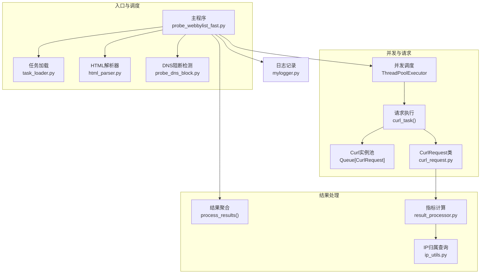
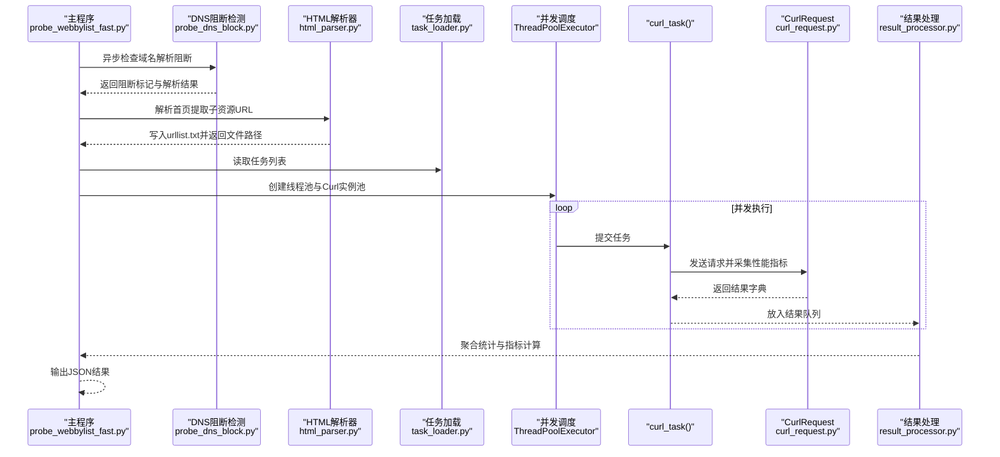
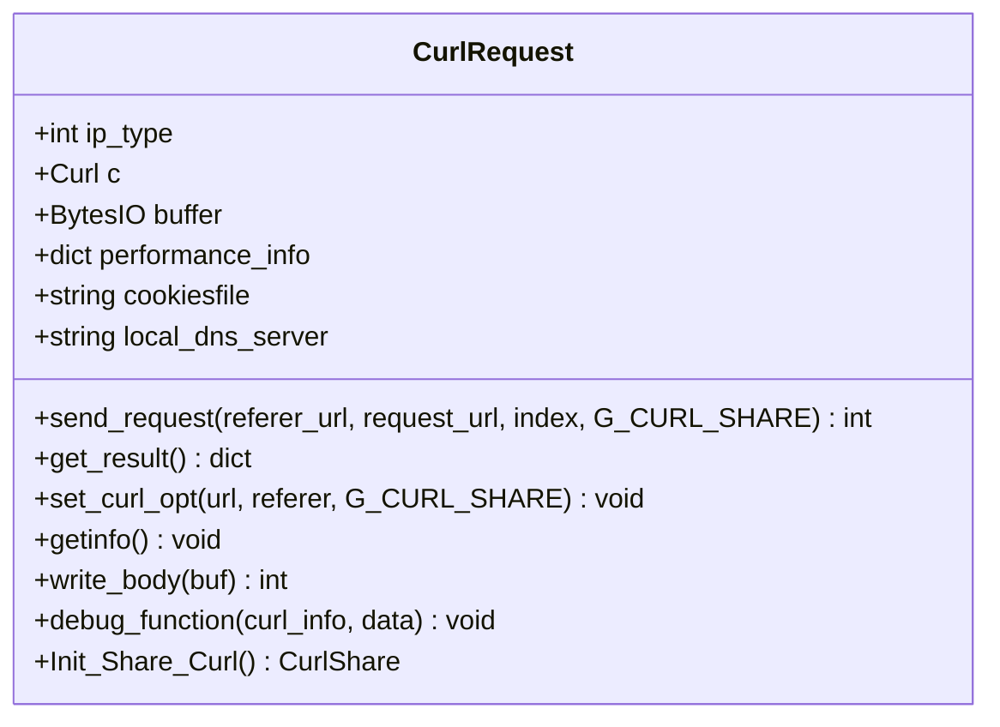
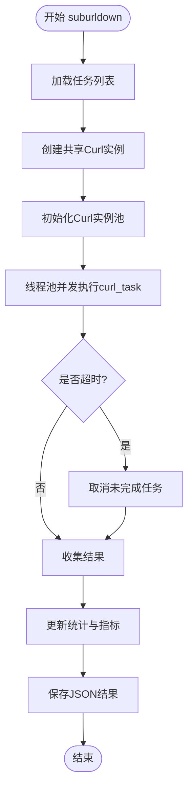
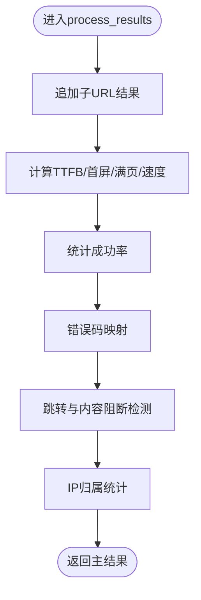
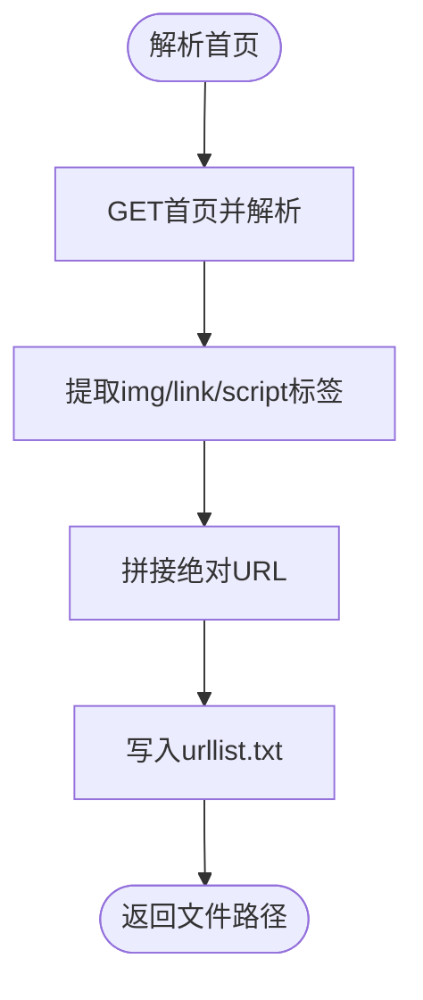
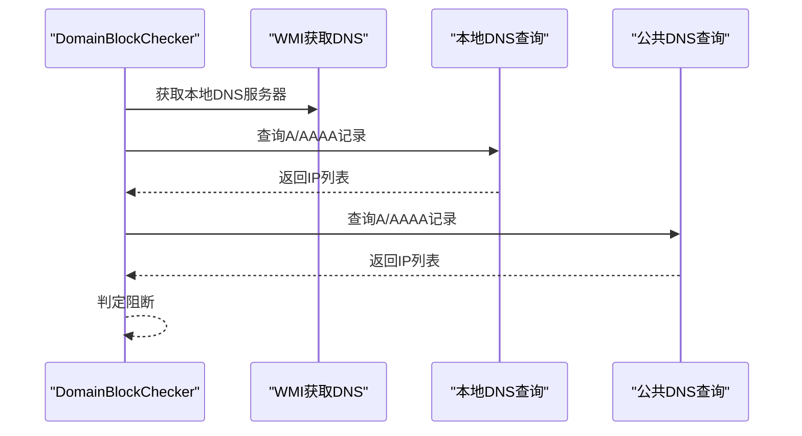
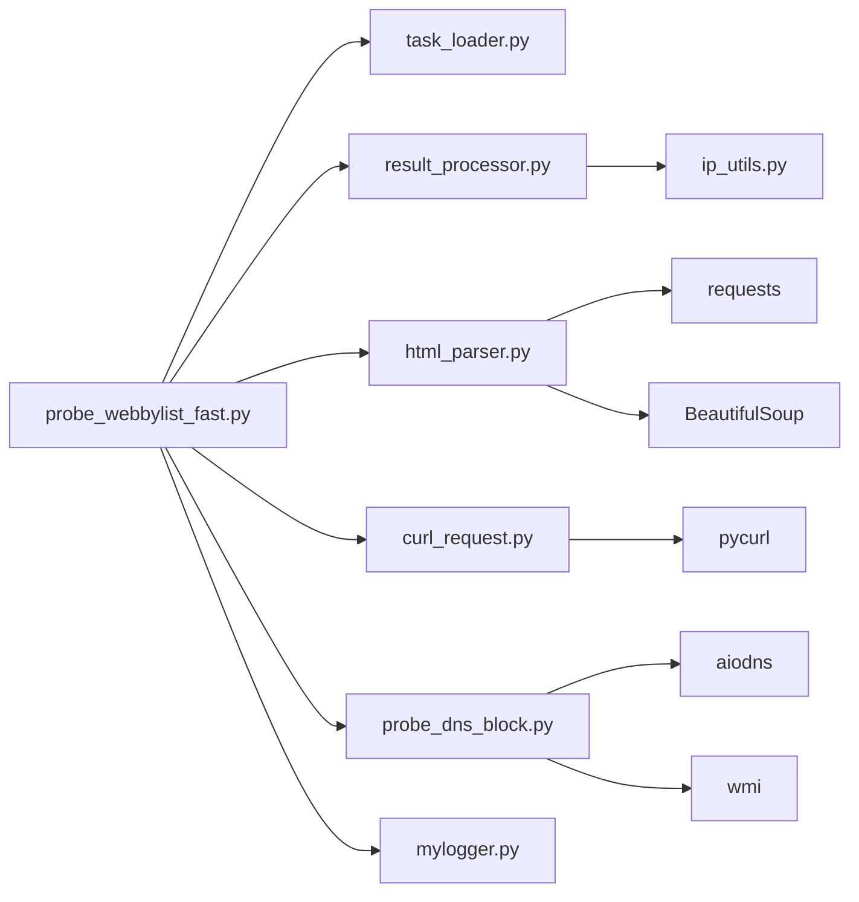

# HTTP下载测试模块

<cite>
**本文引用的文件**
- [curl_request.py](file://probe_webbylist_fast/curl_request.py)
- [probe_webbylist_fast.py](file://probe_webbylist_fast/probe_webbylist_fast.py)
- [html_parser.py](file://probe_webbylist_fast/html_parser.py)
- [result_processor.py](file://probe_webbylist_fast/result_processor.py)
- [task_loader.py](file://probe_webbylist_fast/task_loader.py)
- [probe_dns_block.py](file://probe_webbylist_fast/probe_dns_block.py)
- [mylogger.py](file://mylogger.py)
- [ip_utils.py](file://ip_utils.py)
- [probe_webbylist_fast.spec](file://probe_webbylist_fast/probe_webbylist_fast.spec)
- [out.json](file://out.json)
</cite>

## 目录
1. [简介](#简介)
2. [项目结构](#项目结构)
3. [核心组件](#核心组件)
4. [架构总览](#架构总览)
5. [详细组件分析](#详细组件分析)
6. [依赖关系分析](#依赖关系分析)
7. [性能考量](#性能考量)
8. [故障排除指南](#故障排除指南)
9. [结论](#结论)
10. [附录](#附录)

## 简介
本技术文档面向HTTP下载测试模块，系统性阐述其设计原理与实现细节，涵盖并发请求处理、性能指标采集、错误码映射机制、CurlRequest类设计与pycurl库集成、共享Curl实例的性能优势、参数配置要点（并发数、超时、重试等）、测试流程与结果分析（TTFB、连接时间、下载速度等）、与HTML解析器的集成关系及数据流转、故障排除与性能优化建议。文档同时提供可视化图示与“章节来源”标注，便于读者快速定位到具体实现位置。

## 项目结构
该模块位于probe_webbylist_fast目录下，围绕“主程序-并发调度-请求执行-结果处理-HTML解析-错误判定-IP归属”的链路组织：
- 主程序负责任务加载、并发调度、结果聚合与持久化
- 并发层使用进程+线程混合模型，通过队列复用Curl实例
- 请求层封装CurlRequest，统一设置选项、采集性能信息、解析错误码
- 结果处理层负责指标计算、错误映射、跳转与内容阻断检测、IP归属统计
- HTML解析器负责从首页提取子资源URL列表
- DNS阻断检测器用于前置判断域名解析是否被阻断
- 日志与工具模块提供日志记录与IP归属查询能力

**图表来源**
- [probe_webbylist_fast.py:102-178](file://probe_webbylist_fast/probe_webbylist_fast.py#L102-L178)
- [curl_request.py:9-194](file://probe_webbylist_fast/curl_request.py#L9-L194)
- [result_processor.py:65-269](file://probe_webbylist_fast/result_processor.py#L65-L269)
- [html_parser.py:11-78](file://probe_webbylist_fast/html_parser.py#L11-L78)
- [task_loader.py:1-12](file://probe_webbylist_fast/task_loader.py#L1-L12)
- [probe_dns_block.py:132-207](file://probe_webbylist_fast/probe_dns_block.py#L132-L207)

**章节来源**
- [probe_webbylist_fast.py:102-178](file://probe_webbylist_fast/probe_webbylist_fast.py#L102-L178)
- [curl_request.py:9-194](file://probe_webbylist_fast/curl_request.py#L9-L194)
- [result_processor.py:65-269](file://probe_webbylist_fast/result_processor.py#L65-L269)
- [html_parser.py:11-78](file://probe_webbylist_fast/html_parser.py#L11-L78)
- [task_loader.py:1-12](file://probe_webbylist_fast/task_loader.py#L1-L12)
- [probe_dns_block.py:132-207](file://probe_webbylist_fast/probe_dns_block.py#L132-L207)

## 核心组件
- CurlRequest类：封装单次HTTP请求的生命周期，统一设置pycurl选项、采集性能指标、解析错误码、支持共享Curl实例
- 并发调度器：基于ThreadPoolExecutor与Queue实现Curl实例池复用，控制并发度与总超时
- 结果处理器：汇总子URL结果、计算成功率、TTFB、首屏/满页时间、下载速度、跳转与内容阻断判定、IP归属统计
- HTML解析器：从首页提取图片、样式表、脚本等子资源URL，并生成任务文件
- DNS阻断检测器：通过本地DNS与公共DNS对比，判断域名解析是否被阻断
- 日志与工具：MyLogger提供统一日志；ip_utils提供IP归属查询与统计

**章节来源**
- [curl_request.py:9-194](file://probe_webbylist_fast/curl_request.py#L9-L194)
- [probe_webbylist_fast.py:66-178](file://probe_webbylist_fast/probe_webbylist_fast.py#L66-L178)
- [result_processor.py:65-269](file://probe_webbylist_fast/result_processor.py#L65-L269)
- [html_parser.py:11-78](file://probe_webbylist_fast/html_parser.py#L11-L78)
- [probe_dns_block.py:132-207](file://probe_webbylist_fast/probe_dns_block.py#L132-L207)
- [mylogger.py:7-59](file://mylogger.py#L7-L59)
- [ip_utils.py:6-235](file://ip_utils.py#L6-L235)

## 架构总览
模块采用“主程序驱动-并发池复用-CurlRequest执行-结果聚合”的流水线式架构。主程序负责：
- 域名解析阻断检测
- 首页HTML解析生成子URL任务
- 初始化共享Curl实例与Curl实例池
- 启动线程池并发执行任务
- 聚合结果并进行指标计算与错误映射
- 输出JSON结果

**图表来源**
- [probe_webbylist_fast.py:102-178](file://probe_webbylist_fast/probe_webbylist_fast.py#L102-L178)
- [probe_dns_block.py:132-207](file://probe_webbylist_fast/probe_dns_block.py#L132-L207)
- [html_parser.py:11-78](file://probe_webbylist_fast/html_parser.py#L11-L78)
- [task_loader.py:1-12](file://probe_webbylist_fast/task_loader.py#L1-L12)
- [curl_request.py:130-155](file://probe_webbylist_fast/curl_request.py#L130-L155)
- [result_processor.py:65-269](file://probe_webbylist_fast/result_processor.py#L65-L269)

## 详细组件分析

### CurlRequest类设计与pycurl集成
CurlRequest封装了单次HTTP请求的完整生命周期，职责包括：
- 初始化与清理：创建Curl实例、缓冲区、日志器，析构时关闭Curl句柄
- 共享Curl实例：提供静态方法创建CurlShare对象，共享Cookie/DNS/SSL会话，降低重复开销
- 请求配置：根据URL类型设置IP解析策略、DNS服务器、超时、重定向、用户代理、调试回调等
- 数据写入与调试：自定义写函数截取响应体前若干字节作为最小正文样本；调试回调解析“Trying”行提取primary_ip
- 执行与采集：调用perform后读取各类时间指标、HTTP状态码、重定向次数、有效URL、内容类型等
- 错误码映射：在getinfo阶段根据execute_code与错误消息进行分类映射

**图表来源**
- [curl_request.py:9-194](file://probe_webbylist_fast/curl_request.py#L9-L194)

**章节来源**
- [curl_request.py:11-194](file://probe_webbylist_fast/curl_request.py#L11-L194)

### 并发调度与共享Curl实例
- 进程+线程混合：主程序使用多核CPU核心数+4作为并发池大小，避免过度竞争
- Curl实例池：通过Queue维护固定大小的CurlRequest实例，避免频繁创建销毁
- 共享Curl实例：Init_Share_Curl创建CurlShare，所有Curl实例共享Cookie/DNS/SSL会话，显著降低DNS查询与TLS握手成本
- 总超时控制：对每个Future设置超时，超过阈值取消未完成任务，保证整体测试可控

**图表来源**
- [probe_webbylist_fast.py:102-178](file://probe_webbylist_fast/probe_webbylist_fast.py#L102-L178)

**章节来源**
- [probe_webbylist_fast.py:102-178](file://probe_webbylist_fast/probe_webbylist_fast.py#L102-L178)

### 结果处理与指标计算
- 子URL结果聚合：按索引顺序追加，累计总下载量、首屏/满页时间、速度等
- 成功率统计：统计成功请求数与成功率
- TTFB计算：TTFB = STARTTRANSFER_TIME - PRETRANSFER_TIME（非负）
- 首屏/满页时间：按完成时间排序，取90分位与最大值
- 下载速度：满页速度 = 总字节 / 测试总时长
- 错误映射：根据execute_code与错误消息映射到统一错误码，如DNS解析超时、连接超时、慢速、连接失败等
- 跳转与内容阻断：检测重定向目标、内容中关键字，判定阻断类型
- IP归属：查询数据库，统计本网本省、本网外省、异网、其他、空等分布

**图表来源**
- [result_processor.py:65-269](file://probe_webbylist_fast/result_processor.py#L65-L269)

**章节来源**
- [result_processor.py:65-269](file://probe_webbylist_fast/result_processor.py#L65-L269)

### HTML解析器与任务生成
- 从首页抓取HTML，解析img/link[rel=stylesheet]/script标签，拼接绝对URL
- 对相对路径使用urljoin补齐，支持//协议相对与data:内联
- 将主URL与子URL写入临时文件，供后续并发下载

**图表来源**
- [html_parser.py:11-78](file://probe_webbylist_fast/html_parser.py#L11-L78)

**章节来源**
- [html_parser.py:11-78](file://probe_webbylist_fast/html_parser.py#L11-L78)

### DNS阻断检测
- 通过WMI获取本地DNS服务器列表
- 使用aiodns异步查询A/AAAA记录，对比本地DNS与公共DNS结果
- 若本地返回阻断IP且公共DNS返回正常IP，则判定为DNS阻断

**图表来源**
- [probe_dns_block.py:132-207](file://probe_webbylist_fast/probe_dns_block.py#L132-L207)

**章节来源**
- [probe_dns_block.py:132-207](file://probe_webbylist_fast/probe_dns_block.py#L132-L207)

## 依赖关系分析
- 主程序依赖：task_loader、result_processor、html_parser、mylogger、curl_request、probe_dns_block
- CurlRequest依赖：pycurl、re、ipaddress、logging、io.BytesIO
- 结果处理依赖：ip_utils、urllib.parse、math
- HTML解析依赖：requests、BeautifulSoup、uuid、os、time
- DNS检测依赖：aiodns、wmi、pythoncom、ipaddress、time
- 日志依赖：logging、RotatingFileHandler、os
- IP归属依赖：sqlite3、ipaddress、json

**图表来源**
- [probe_webbylist_fast.py:14-21](file://probe_webbylist_fast/probe_webbylist_fast.py#L14-L21)
- [curl_request.py:3-7](file://probe_webbylist_fast/curl_request.py#L3-L7)
- [result_processor.py:4](file://probe_webbylist_fast/result_processor.py#L4)
- [html_parser.py:5-6](file://probe_webbylist_fast/html_parser.py#L5-L6)
- [probe_dns_block.py:4-9](file://probe_webbylist_fast/probe_dns_block.py#L4-L9)
- [mylogger.py:1-4](file://mylogger.py#L1-L4)
- [ip_utils.py:2-6](file://ip_utils.py#L2-L6)

**章节来源**
- [probe_webbylist_fast.py:14-21](file://probe_webbylist_fast/probe_webbylist_fast.py#L14-L21)
- [curl_request.py:3-7](file://probe_webbylist_fast/curl_request.py#L3-L7)
- [result_processor.py:4](file://probe_webbylist_fast/result_processor.py#L4)
- [html_parser.py:5-6](file://probe_webbylist_fast/html_parser.py#L5-L6)
- [probe_dns_block.py:4-9](file://probe_webbylist_fast/probe_dns_block.py#L4-L9)
- [mylogger.py:1-4](file://mylogger.py#L1-L4)
- [ip_utils.py:2-6](file://ip_utils.py#L2-L6)

## 性能考量
- 共享Curl实例的优势
  - Cookie/DNS/SSL会话共享可减少重复握手与DNS解析，显著降低总耗时
  - 在高并发场景下，减少系统调用与网络开销
- 并发度设置
  - 默认并发池大小为CPU核心数+4，兼顾吞吐与资源占用
  - 可根据网络环境与目标服务器限流策略调整
- 超时与重试
  - 单请求连接超时与总超时已设定，可根据网络质量调整
  - 当前未实现自动重试逻辑，建议结合业务需求在上层增加重试策略
- 指标计算
  - TTFB基于libcurl时间差计算，确保非负
  - 首屏/满页时间采用90分位与最大值，避免异常值影响
- I/O与内存
  - 使用BytesIO缓存响应，仅截取前若干字节作为最小正文样本，降低内存压力

[本节为通用性能讨论，不直接分析具体文件，故无“章节来源”]

## 故障排除指南
- 常见错误码映射
  - DNS解析失败/超时：映射为1001
  - 连接超时/失败：映射为1002
  - SSL/TLS握手问题：映射为1003
  - 远端无响应：映射为1004
  - 操作过慢：映射为1005
  - HTTP重定向：映射为1006
  - 未知错误：映射为1099
- 跳转与内容阻断
  - 若存在重定向且目标为本地回环或特定阻断IP，标记为DNS阻断
  - 若响应体包含特定关键字，标记为内容阻断
- DNS阻断检测
  - 若本地DNS返回阻断IP而公共DNS返回正常IP，判定为DNS阻断
- 日志定位
  - 使用MyLogger输出详细日志，定位请求开始/结束、错误发生点与性能指标采集位置

**章节来源**
- [result_processor.py:148-199](file://probe_webbylist_fast/result_processor.py#L148-L199)
- [result_processor.py:245-269](file://probe_webbylist_fast/result_processor.py#L245-L269)
- [probe_dns_block.py:132-207](file://probe_webbylist_fast/probe_dns_block.py#L132-L207)
- [mylogger.py:7-59](file://mylogger.py#L7-L59)

## 结论
该HTTP下载测试模块通过共享Curl实例、并发池复用与完善的性能指标采集，实现了高效、可观测的HTTP下载测试。其错误码映射与阻断检测机制有助于快速定位问题根因。建议在生产环境中结合业务需求增加重试策略、动态并发调节与更细粒度的监控告警。

[本节为总结性内容，不直接分析具体文件，故无“章节来源”]

## 附录

### 参数配置指南
- 命令行参数
  - -l/--log：日志级别（debug/info/warning）
  - -o/--output：输出文件名，默认performance_result.json
  - -u/--url：待测URL
  - -p/--iptype：IP版本（4/6）
  - --dnsserver：指定DNS服务器
- 关键运行参数
  - 并发池大小：CPU核心数+4
  - 单请求连接超时：5秒
  - 单请求总超时：7秒
  - 低速限制：1字节/5秒
  - 最大重定向次数：20
  - 用户代理：浏览器UA字符串
  - 是否启用调试：开启
- 可调优项（建议）
  - 并发池大小：根据目标服务器QPS与带宽动态调整
  - 超时阈值：根据网络质量与目标站点响应特性调整
  - 重试策略：针对瞬时失败增加指数退避重试
  - 缓冲区大小：根据页面大小调整最小正文样本截取长度

**章节来源**
- [probe_webbylist_fast.py:198-222](file://probe_webbylist_fast/probe_webbylist_fast.py#L198-L222)
- [curl_request.py:80-117](file://probe_webbylist_fast/curl_request.py#L80-L117)

### 性能指标计算方法
- TTFB（首字节时间）：STARTTRANSFER_TIME - PRETRANSFER_TIME（毫秒）
- 连接时间：CONNECT_TIME - NAMELOOKUP_TIME（毫秒）
- 应用层握手时间：APPCONNECT_TIME - CONNECT_TIME（毫秒）
- 预传输时间：PRETRANSFER_TIME（毫秒）
- 首屏时间：90分位完成时间（毫秒）
- 满页时间：最大完成时间（毫秒）
- 满页下载速度：总字节 / 测试总时长（KB/s）

**章节来源**
- [curl_request.py:157-194](file://probe_webbylist_fast/curl_request.py#L157-L194)
- [result_processor.py:206-236](file://probe_webbylist_fast/result_processor.py#L206-L236)

### JSON输出格式说明
- 字段概览（示例字段）
  - time_namelookup：DNS解析时间（毫秒）
  - time_connect：TCP连接时间（毫秒）
  - time_appconnect：应用层握手时间（毫秒）
  - time_redirect：重定向时间（毫秒）
  - time_pretransfer：预传输时间（毫秒）
  - time_starttransfer：首字节时间（毫秒）
  - time_total：总时间（毫秒）
  - remote_ip：主IP
  - response_code：统一错误码
  - size_download：下载字节数
  - speed_download：下载速度（B/s）
  - ip_info：IP归属信息（运营商、省份、城市）
  - urle_host：主机名
  - dns_block：DNS阻断标记
  - code：错误码
  - is_success：是否成功
  - num_redirects：重定向次数
- 输出文件：默认performance_result.json，编码为UTF-8

**章节来源**
- [out.json:1-1](file://out.json#L1-L1)
- [result_processor.py:25-63](file://probe_webbylist_fast/result_processor.py#L25-L63)

### 与HTML解析器的集成关系与数据流转
- 主程序先进行DNS阻断检测，再调用HTML解析器从首页提取子资源URL，写入urllist.txt
- 任务加载器读取urllist.txt生成任务列表
- 并发调度器提交任务给curl_task，curl_task通过CurlRequest发送请求
- 结果处理模块聚合子URL结果，计算主指标并输出JSON

**章节来源**
- [probe_webbylist_fast.py:180-195](file://probe_webbylist_fast/probe_webbylist_fast.py#L180-L195)
- [html_parser.py:11-78](file://probe_webbylist_fast/html_parser.py#L11-L78)
- [task_loader.py:1-12](file://probe_webbylist_fast/task_loader.py#L1-L12)
- [result_processor.py:65-100](file://probe_webbylist_fast/result_processor.py#L65-L100)

### 构建与打包
- 使用PyInstaller规格文件进行打包，EXE名称为probe_webbylist_fast，控制台模式，包含二进制与数据文件

**章节来源**
- [probe_webbylist_fast.spec:1-45](file://probe_webbylist_fast/probe_webbylist_fast.spec#L1-L45)