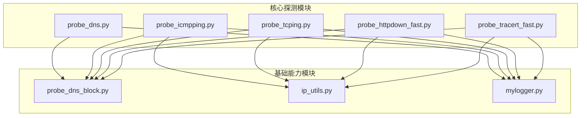
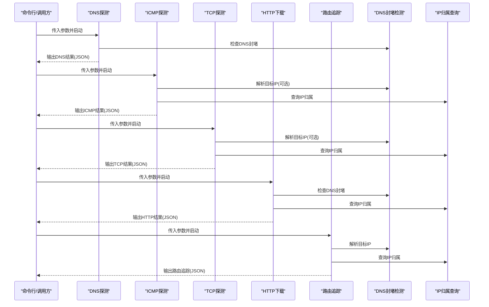
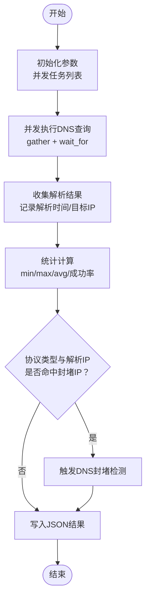
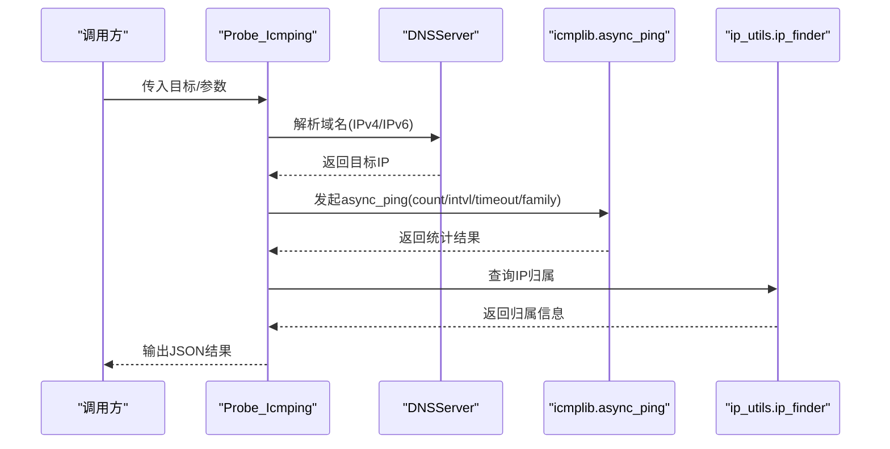
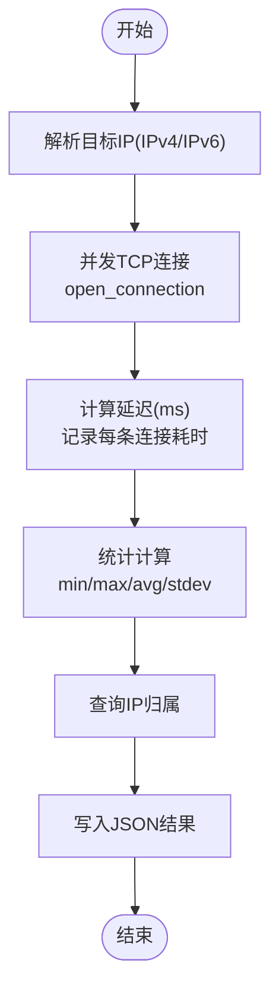
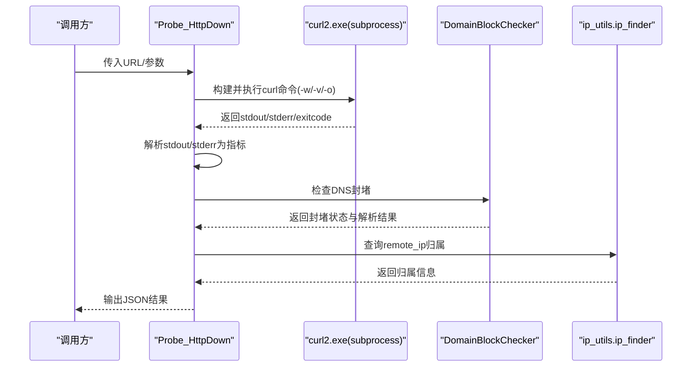
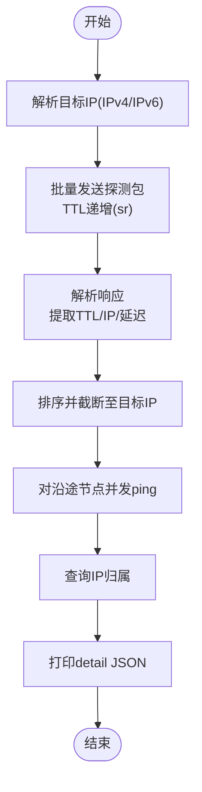
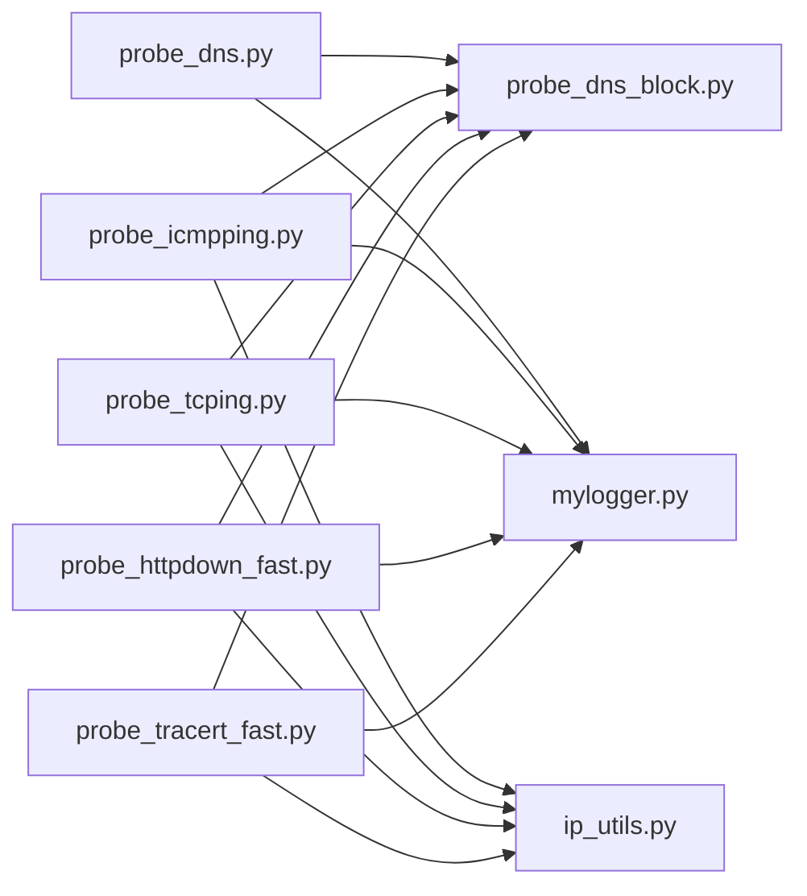

# 核心功能模块

<cite>
**本文引用的文件**
- [probe_dns.py](file://probe_dns.py)
- [probe_icmpping.py](file://probe_icmpping.py)
- [probe_tcping.py](file://probe_tcping.py)
- [probe_httpdown_fast.py](file://probe_httpdown_fast.py)
- [probe_tracert_fast.py](file://probe_tracert_fast.py)
- [probe_dns_block.py](file://probe_dns_block.py)
- [ip_utils.py](file://ip_utils.py)
- [mylogger.py](file://mylogger.py)
- [README.md](file://README.md)
- [docs/QUICKSTART.md](file://docs/QUICKSTART.md)
- [docs/architecture/README.md](file://docs/architecture/README.md)
</cite>

## 目录
1. [引言](#引言)
2. [项目结构](#项目结构)
3. [核心组件](#核心组件)
4. [架构总览](#架构总览)
5. [详细组件分析](#详细组件分析)
6. [依赖分析](#依赖分析)
7. [性能考虑](#性能考虑)
8. [故障排查指南](#故障排查指南)
9. [结论](#结论)
10. [附录](#附录)

## 引言
本文件面向网络探测工具集的核心功能模块，系统梳理 DNS 解析测试、ICMP Ping 连通性检测、TCP 端口测试、HTTP 下载测试与路由追踪的实现原理、数据流与协作关系，并提供标准使用方法、参数配置、输出格式说明及扩展建议。文档兼顾初学者的概念理解与开发者的技术要点。

## 项目结构
- 核心探测模块：DNS、ICMP Ping、TCP 端口、HTTP 下载、路由追踪
- 基础能力模块：DNS 封堵检测、IP 归属查询、日志
- 工具链：aiodns、icmplib、Scapy、curl（通过 subprocess 调用）

图表来源
- [probe_dns.py](file://probe_dns.py)
- [probe_icmpping.py](file://probe_icmpping.py)
- [probe_tcping.py](file://probe_tcping.py)
- [probe_httpdown_fast.py](file://probe_httpdown_fast.py)
- [probe_tracert_fast.py](file://probe_tracert_fast.py)
- [probe_dns_block.py](file://probe_dns_block.py)
- [ip_utils.py](file://ip_utils.py)
- [mylogger.py](file://mylogger.py)

章节来源
- [README.md](file://README.md)
- [docs/architecture/README.md](file://docs/architecture/README.md)

## 核心组件
- DNS 解析测试：支持 A/AAAA 记录并发查询、超时控制、DNS 封堵检测、解析时间统计
- ICMP Ping：支持 IPv4/IPv6，统计丢包率、RTT、抖动，结合 IP 归属查询
- TCP 端口测试：并发 TCP 连接，统计延迟、抖动、丢包率
- HTTP 下载测试：基于 curl 的完整 HTTP/HTTPS 访问，时间指标分解、重定向跟踪、DNS 封堵与反诈识别
- 路由追踪：Scapy 构造探测包，批量发送与解析，沿途节点并发 ping，IP 归属与结果输出

章节来源
- [README.md](file://README.md)
- [docs/QUICKSTART.md](file://docs/QUICKSTART.md)

## 架构总览
- 异步并发：所有 IO 密集型探测均采用 asyncio，提升吞吐与响应性
- 统一输出：所有模块输出标准化 JSON，便于后续处理与可视化
- 模块化设计：各探测模块独立，职责清晰，便于扩展与替换
- 基础能力复用：DNS 封堵检测、IP 归属查询、日志模块在多模块间共享

图表来源
- [probe_dns.py](file://probe_dns.py)
- [probe_icmpping.py](file://probe_icmpping.py)
- [probe_tcping.py](file://probe_tcping.py)
- [probe_httpdown_fast.py](file://probe_httpdown_fast.py)
- [probe_tracert_fast.py](file://probe_tracert_fast.py)
- [probe_dns_block.py](file://probe_dns_block.py)
- [ip_utils.py](file://ip_utils.py)

## 详细组件分析

### DNS 解析测试（probe_dns.py）
- 异步并发查询：使用 asyncio.gather 并发执行 A/AAAA 查询，通过 Semaphore 限制并发度，避免 DNS 服务器过载
- 超时控制：单次查询与总体超时分别控制，防止长时间阻塞
- 结果聚合：收集每次请求的解析时间与目标 IP，计算最小/最大/平均解析时间与成功率
- DNS 封堵检测：当协议类型为 IPv4/IPv6 且解析到特定封堵 IP 时，触发封堵检测逻辑
- 输出格式：JSON 字段包含 code、domain、target_ip、request_count、success_count、min/max/avg_resolution_time、resolution_success_rate、dnsblock、all_target_ips 等

图表来源
- [probe_dns.py](file://probe_dns.py)

章节来源
- [probe_dns.py](file://probe_dns.py)
- [docs/architecture/README.md](file://docs/architecture/README.md)

### ICMP Ping（probe_icmpping.py）
- 目标解析：若输入为域名，使用 DNSServer 解析为 IP；支持 IPv4/IPv6
- 探测执行：使用 icmplib.async_ping 发起 ping，支持 count、interval、timeout、family 等参数
- 结果解析：提取最小/最大/平均 RTT、丢包率、抖动、成功包数等
- IP 归属：通过 ip_utils.ip_finder 查询 IP 归属信息
- 输出格式：JSON 字段包含 code、host_ip、ip_info、drop_rate、avg_jitter、avg_rtt、max_rtt、min_rtt、pack_size、send_num、success_count 等

图表来源
- [probe_icmpping.py](file://probe_icmpping.py)
- [probe_dns_block.py](file://probe_dns_block.py)
- [ip_utils.py](file://ip_utils.py)

章节来源
- [probe_icmpping.py](file://probe_icmpping.py)
- [docs/architecture/README.md](file://docs/architecture/README.md)

### TCP 端口测试（probe_tcping.py）
- 目标解析：域名解析为 IP，支持 IPv4/IPv6
- 并发连接：使用 asyncio.open_connection 建立 TCP 连接，记录连接建立耗时，关闭连接
- 统计计算：使用 statistics 计算最小/最大/平均延迟与抖动，计算丢包率
- IP 归属：查询 IP 归属信息
- 输出格式：JSON 字段包含 code、host_ip、ip_info、tcping_port、tcping_detail、min_latency、max_latency、avg_latency、packet_loss_rate、jitter、request_count、success_count 等

图表来源
- [probe_tcping.py](file://probe_tcping.py)
- [ip_utils.py](file://ip_utils.py)

章节来源
- [probe_tcping.py](file://probe_tcping.py)
- [docs/architecture/README.md](file://docs/architecture/README.md)

### HTTP 下载测试（probe_httpdown_fast.py）
- 命令构建：通过 subprocess 调用 curl2.exe，使用 -w 输出格式化指标，-v 输出详细信息，-o 下载到临时文件
- 结果解析：解析 stdout/stderr，提取 DNS 解析、TCP 连接、SSL 握手、首字节、总时间等指标，解析响应码、重定向次数、远程 IP
- DNS 封堵检测：对比本地 DNS 与公共 DNS 结果，判定是否被封堵
- 反诈识别：检查重定向目标与响应内容特征，识别反诈网站
- 成功判定：根据返回码与错误信息映射 10+ 种失败类型，最终确定 is_success
- 输出格式：JSON 字段包含 time_namelookup、time_connect、time_appconnect、time_redirect、time_pretransfer、time_starttransfer、time_total、remote_ip、response_code、size_download、speed_download、ip_info、urle_host、dns_block、code、is_success、num_redirects 等

图表来源
- [probe_httpdown_fast.py](file://probe_httpdown_fast.py)
- [probe_dns_block.py](file://probe_dns_block.py)
- [ip_utils.py](file://ip_utils.py)

章节来源
- [probe_httpdown_fast.py](file://probe_httpdown_fast.py)
- [docs/architecture/README.md](file://docs/architecture/README.md)

### 路由追踪（probe_tracert_fast.py）
- 目标解析：域名解析为 IP，支持 IPv4/IPv6
- 批量探测：使用 Scapy 构造 ICMP/ICMPv6 探测包，按 TTL 递增批量发送 sr，解析响应提取 TTL、IP、延迟
- 并发节点测试：对沿途有效 IP 执行并发 ping，统计丢包率与 RTT
- IP 归属：查询沿途节点归属信息
- 结果输出：打印 detail JSON，支持 MQTT 上报中间结果
- 输出格式：数组 JSON，每项包含 hop、ip、ip_info、send、recv、loss、min、max、avg 等

图表来源
- [probe_tracert_fast.py](file://probe_tracert_fast.py)
- [ip_utils.py](file://ip_utils.py)

章节来源
- [probe_tracert_fast.py](file://probe_tracert_fast.py)
- [docs/architecture/README.md](file://docs/architecture/README.md)

## 依赖分析
- 探测模块依赖关系
  - DNS/ICMP/TCP/HTTP/TRACER 均依赖 probe_dns_block.py 进行 DNS 封堵检测
  - ICMP/TCP/HTTP/TRACER 依赖 ip_utils.py 进行 IP 归属查询
  - 所有模块依赖 mylogger.py 进行日志输出
- 外部依赖
  - DNS：aiodns
  - ICMP：icmplib
  - 路由追踪：Scapy
  - HTTP：curl（通过 subprocess）
  - 系统信息：WMI（Windows）

图表来源
- [probe_dns.py](file://probe_dns.py)
- [probe_icmpping.py](file://probe_icmpping.py)
- [probe_tcping.py](file://probe_tcping.py)
- [probe_httpdown_fast.py](file://probe_httpdown_fast.py)
- [probe_tracert_fast.py](file://probe_tracert_fast.py)
- [probe_dns_block.py](file://probe_dns_block.py)
- [ip_utils.py](file://ip_utils.py)
- [mylogger.py](file://mylogger.py)

章节来源
- [docs/architecture/README.md](file://docs/architecture/README.md)

## 性能考虑
- 异步并发：DNS、TCP、HTTP、TRACER 均采用 asyncio.gather/并发连接/批量 sr，显著提升吞吐
- 并发控制：DNS 使用 Semaphore 限制并发，避免 DNS 服务器过载
- 批量处理：TRACER 使用批量 sr，减少系统调用开销
- 超时策略：各模块设置单次与总超时，防止长时间阻塞
- I/O 优化：HTTP 使用 curl 的 -w 输出格式，避免额外解析成本

## 故障排查指南
- 常见错误码与含义（HTTP 模块）
  - 1001：DNS 解析失败
  - 1002：TCP 连接失败
  - 1003：SSL 协商失败
  - 1004：连接被重置
  - 1005：服务端传输超时
  - 1006：访问时间超时
  - 1007：重定向次数过多
  - 1008：URL 格式错误
  - 1009：跳转到反诈网站
  - 1010：重定向后指向异常 IP
  - 1011：运营商 DNS 解析域名为封堵 IP
  - 1012：测试总时间超时
  - 1099：未知失败原因
- DNS 封堵检测
  - 若本地 DNS 返回封堵 IP，而公共 DNS 返回正常 IP，则标记为封堵
- 反诈识别
  - 检查重定向目标与响应内容特征，识别反诈网站
- 日志与调试
  - 使用 mylogger.py 输出详细日志，定位解析、连接、超时等问题

章节来源
- [probe_httpdown_fast.py](file://probe_httpdown_fast.py)
- [probe_dns_block.py](file://probe_dns_block.py)
- [mylogger.py](file://mylogger.py)

## 结论
本工具集通过模块化设计与异步并发，实现了高吞吐、可扩展的网络探测能力。DNS 封堵检测、IP 归属查询与统一 JSON 输出，使得结果具备良好的可分析性与可集成性。建议在生产环境中合理设置超时与并发度，结合日志与监控，持续优化探测策略与阈值。

## 附录

### 标准使用方法与参数
- DNS 解析测试
  - 命令：python probe_dns.py <输出文件> <域名> <DNS服务器> <请求次数> <单次超时> <总超时> <协议类型>
  - 示例：python probe_dns.py output.json www.baidu.com 8.8.8.8 10 1 60 4
- ICMP Ping
  - 命令：python probe_icmpping.py <输出文件> <目标> <发送次数> <包大小> <IP类型> <单次超时> <总超时> [DNS服务器]
  - 示例：python probe_icmpping.py ping_result.json www.baidu.com 10 56 4 0.5 10
- TCP 端口测试
  - 命令：python probe_tcping.py <输出文件> <目标> <端口> <IP类型> [DNS服务器]
  - 示例：python probe_tcping.py tcp_result.json www.baidu.com 443 4
- HTTP 下载测试
  - 命令：python probe_httpdown_fast.py <输出文件> <IP类型> <URL> [DNS服务器]
  - 示例：python probe_httpdown_fast.py http_result.json 4 https://www.baidu.com
- 路由追踪
  - 命令：python probe_tracert_fast.py <目标> [--address-family ipv4|ipv6] [--output-file <文件>] [--dnsserver <DNS>]
  - 示例：python probe_tracert_fast.py www.baidu.com --address-family ipv4 --output-file trace.json

章节来源
- [docs/QUICKSTART.md](file://docs/QUICKSTART.md)

### 输出格式说明
- DNS：包含 code、domain、target_ip、request_count、success_count、min/max/avg_resolution_time、resolution_success_rate、dnsblock、all_target_ips 等
- ICMP：包含 code、host_ip、ip_info、drop_rate、avg_jitter、avg_rtt、max_rtt、min_rtt、pack_size、send_num、success_count 等
- TCP：包含 code、host_ip、ip_info、tcping_port、tcping_detail、min_latency、max_latency、avg_latency、packet_loss_rate、jitter、request_count、success_count 等
- HTTP：包含 time_namelookup、time_connect、time_appconnect、time_redirect、time_pretransfer、time_starttransfer、time_total、remote_ip、response_code、size_download、speed_download、ip_info、urle_host、dns_block、code、is_success、num_redirects 等
- 路由追踪：数组 JSON，每项包含 hop、ip、ip_info、send、recv、loss、min、max、avg 等

章节来源
- [docs/QUICKSTART.md](file://docs/QUICKSTART.md)

### 模块化设计优势与扩展性
- 优势
  - 职责单一：每个模块专注一种探测类型
  - 可插拔：新增探测类型只需实现统一接口
  - 可复用：DNS 封堵检测、IP 归属查询在多模块共享
- 扩展方向
  - 新增探测类型：UDP 端口、HTTP/2、WebSocket、DoH
  - 输出扩展：XML、CSV、数据库、API 上报
  - 平台扩展：跨平台网络接口、容器化部署

章节来源
- [docs/architecture/README.md](file://docs/architecture/README.md)