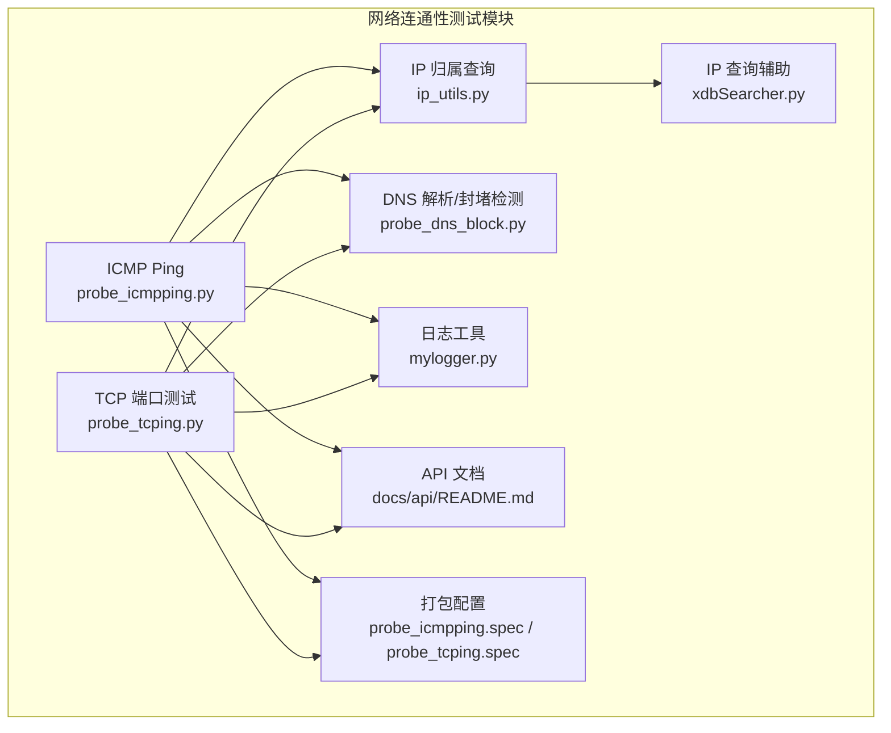
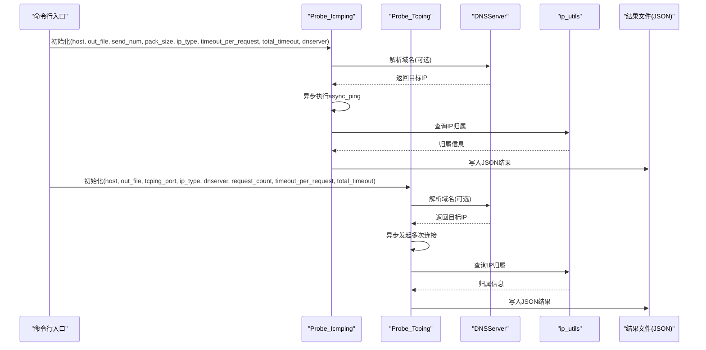
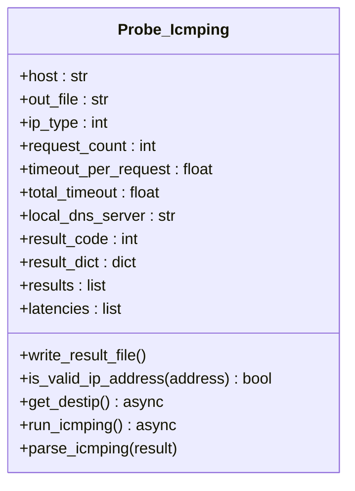
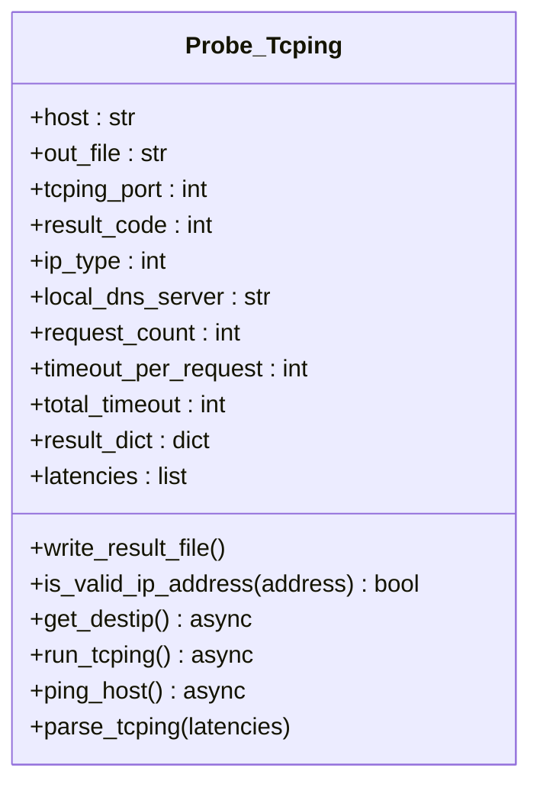
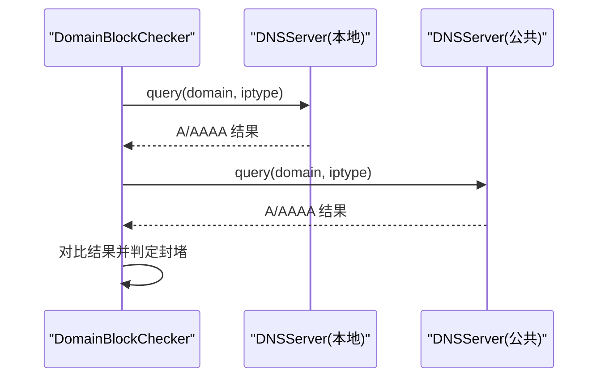
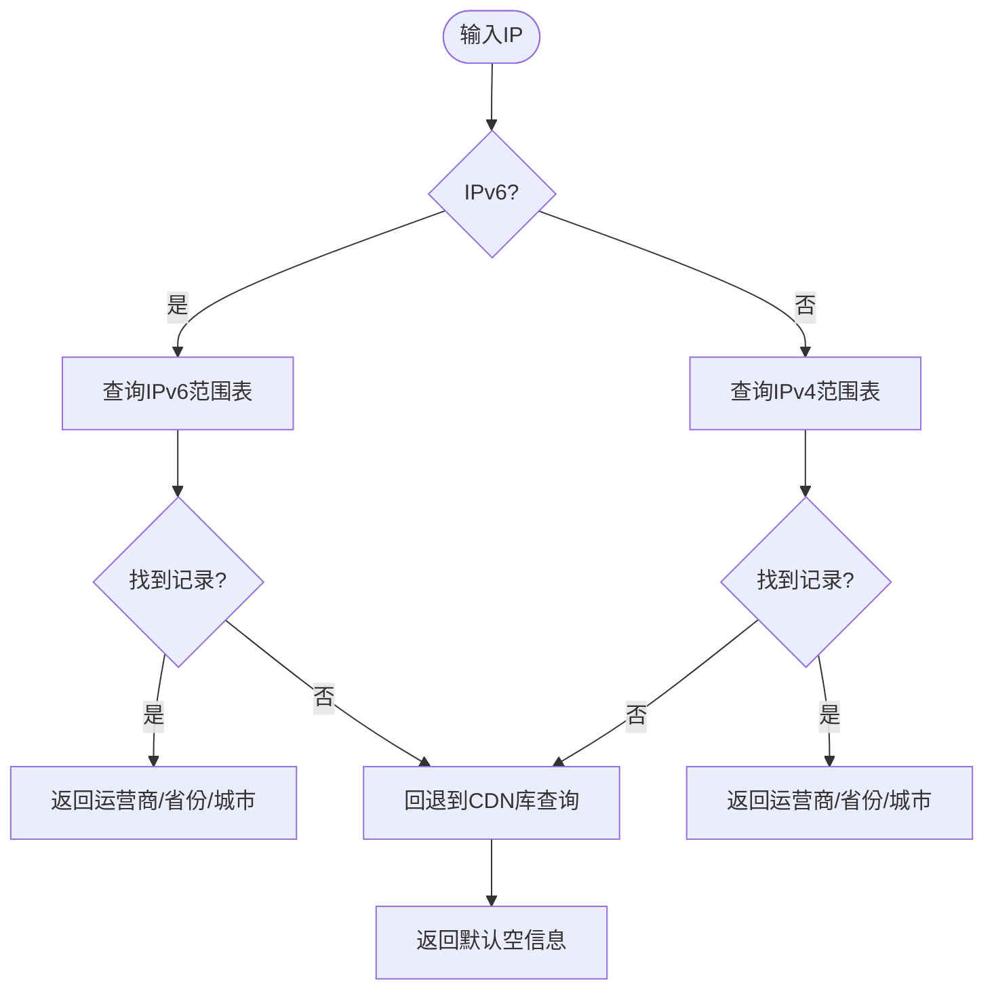
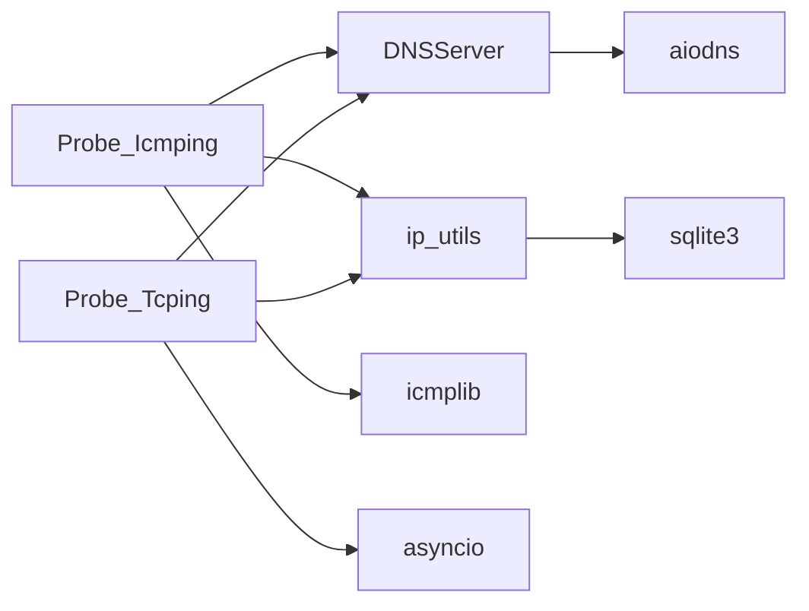

# 网络连通性测试模块

<cite>
**本文引用的文件**
- [probe_icmpping.py](file://probe_icmpping.py)
- [probe_tcping.py](file://probe_tcping.py)
- [ip_utils.py](file://ip_utils.py)
- [probe_dns_block.py](file://probe_dns_block.py)
- [mylogger.py](file://mylogger.py)
- [docs/api/README.md](file://docs/api/README.md)
- [probe_icmpping.spec](file://probe_icmpping.spec)
- [probe_tcping.spec](file://probe_tcping.spec)
- [xdbSearcher.py](file://xdbSearcher.py)
</cite>

## 目录
1. [简介](#简介)
2. [项目结构](#项目结构)
3. [核心组件](#核心组件)
4. [架构概览](#架构概览)
5. [详细组件分析](#详细组件分析)
6. [依赖关系分析](#依赖关系分析)
7. [性能考量](#性能考量)
8. [故障诊断指南](#故障诊断指南)
9. [结论](#结论)
10. [附录](#附录)

## 简介
本技术文档面向网络连通性测试模块，重点介绍两种连通性检测方法：
- ICMP Ping（基于 icmplib 库的异步实现）
- TCP 端口测试（基于 asyncio 的异步连接验证）

文档涵盖以下内容：
- 实现原理与应用场景
- icmplib 集成方式与 ping 命令替代方案
- 异步 ping 的性能优势
- TCP 端口测试的连接验证机制（三次握手与超时策略）
- 完整参数配置说明（目标主机、端口、超时、并发等）
- 测试结果数据格式与统计分析（延迟、丢包率、成功率）
- 跨平台兼容性与系统权限要求
- 使用示例与故障诊断

## 项目结构
网络连通性测试模块位于仓库根目录，主要文件如下：
- ICMP Ping：probe_icmpping.py
- TCP 端口测试：probe_tcping.py
- IP 归属查询：ip_utils.py
- DNS 解析与封堵检测：probe_dns_block.py
- 日志工具：mylogger.py
- API 文档：docs/api/README.md
- 打包配置：probe_icmpping.spec、probe_tcping.spec
- 其他 IP 查询辅助：xdbSearcher.py

图表来源
- [probe_icmpping.py:1-155](file://probe_icmpping.py#L1-L155)
- [probe_tcping.py:1-164](file://probe_tcping.py#L1-L164)
- [ip_utils.py:1-235](file://ip_utils.py#L1-L235)
- [probe_dns_block.py:1-230](file://probe_dns_block.py#L1-L230)
- [mylogger.py:1-59](file://mylogger.py#L1-L59)
- [docs/api/README.md:106-288](file://docs/api/README.md#L106-L288)
- [probe_icmpping.spec:1-45](file://probe_icmpping.spec#L1-L45)
- [probe_tcping.spec:1-45](file://probe_tcping.spec#L1-L45)
- [xdbSearcher.py:1-192](file://xdbSearcher.py#L1-L192)

章节来源
- [probe_icmpping.py:1-155](file://probe_icmpping.py#L1-L155)
- [probe_tcping.py:1-164](file://probe_tcping.py#L1-L164)
- [ip_utils.py:1-235](file://ip_utils.py#L1-L235)
- [probe_dns_block.py:1-230](file://probe_dns_block.py#L1-L230)
- [mylogger.py:1-59](file://mylogger.py#L1-L59)
- [docs/api/README.md:106-288](file://docs/api/README.md#L106-L288)
- [probe_icmpping.spec:1-45](file://probe_icmpping.spec#L1-L45)
- [probe_tcping.spec:1-45](file://probe_tcping.spec#L1-L45)
- [xdbSearcher.py:1-192](file://xdbSearcher.py#L1-L192)

## 核心组件
- Probe_Icmping：ICMP Ping 测试类，基于 icmplib 的异步 ping，支持 IPv4/IPv6，支持自定义包大小与发送次数，并输出 JSON 结果。
- Probe_Tcping：TCP 端口测试类，基于 asyncio 的异步连接，支持 IPv4/IPv6，记录延迟、抖动、丢包率等指标。
- ip_utils：IP 归属查询工具，支持 IPv4/IPv6，提供运营商、省份、城市信息。
- DNSServer：异步 DNS 解析器，支持 A/AAAA 查询，可指定本地 DNS 服务器。
- DomainBlockChecker：域名封堵检测工具，对比本地与公共 DNS 结果判断封堵。
- MyLogger：统一日志工具，支持控制台与文件输出。
- API 文档：提供参数说明、使用示例与输出格式规范。
- 打包配置：pyinstaller 规则，便于生成独立可执行文件。

章节来源
- [probe_icmpping.py:19-124](file://probe_icmpping.py#L19-L124)
- [probe_tcping.py:11-134](file://probe_tcping.py#L11-L134)
- [ip_utils.py:6-186](file://ip_utils.py#L6-L186)
- [probe_dns_block.py:11-56](file://probe_dns_block.py#L11-L56)
- [probe_dns_block.py:59-210](file://probe_dns_block.py#L59-L210)
- [mylogger.py:7-59](file://mylogger.py#L7-L59)
- [docs/api/README.md:106-288](file://docs/api/README.md#L106-L288)
- [probe_icmpping.spec:1-45](file://probe_icmpping.spec#L1-L45)
- [probe_tcping.spec:1-45](file://probe_tcping.spec#L1-L45)

## 架构概览
模块采用“异步 + 统一结果输出”的设计，核心流程如下：
- 输入参数校验与 DNS 解析（可选）
- 异步发起连通性测试（ICMP/TCP）
- 统计延迟、丢包率、抖动等指标
- 写入 JSON 结果文件
- 可选：IP 归属查询

图表来源
- [probe_icmpping.py:79-103](file://probe_icmpping.py#L79-L103)
- [probe_tcping.py:73-95](file://probe_tcping.py#L73-L95)
- [probe_dns_block.py:25-53](file://probe_dns_block.py#L25-L53)
- [ip_utils.py:170-186](file://ip_utils.py#L170-L186)

## 详细组件分析

### ICMP Ping 组件分析
- 类名：Probe_Icmping
- 关键职责：
  - 参数初始化与默认值设置
  - 异步 DNS 解析（可选）
  - 异步执行 icmplib 的 async_ping
  - 统计并输出 RTT、抖动、丢包率等指标
  - IP 归属查询与结果写入

图表来源
- [probe_icmpping.py:19-124](file://probe_icmpping.py#L19-L124)

实现要点
- 异步 DNS 解析：通过 DNSServer.query_async 支持 A/AAAA 查询，可指定本地 DNS 服务器。
- 异步 ping：使用 icmplib.async_ping，支持 IPv4/IPv6 与自定义包大小。
- 超时控制：单次请求超时与总超时分别控制；异常捕获返回特定错误码。
- 结果统计：基于返回对象的 min/max/avg/jitter/packet_loss 等字段计算。
- IP 归属：调用 ip_utils.ip_finder.find_main_ip 获取运营商、省份、城市。

章节来源
- [probe_icmpping.py:19-124](file://probe_icmpping.py#L19-L124)
- [probe_dns_block.py:25-53](file://probe_dns_block.py#L25-L53)
- [ip_utils.py:170-186](file://ip_utils.py#L170-L186)

### TCP 端口测试组件分析
- 类名：Probe_Tcping
- 关键职责：
  - 参数初始化与默认值设置
  - 异步 DNS 解析（可选）
  - 异步发起多次 TCP 连接
  - 统计延迟、抖动、丢包率、成功率
  - IP 归属查询与结果写入

图表来源
- [probe_tcping.py:11-134](file://probe_tcping.py#L11-L134)

实现要点
- 异步连接：使用 asyncio.open_connection，支持 IPv4/IPv6 地址族。
- 超时策略：单次连接超时由 wait_for 控制；总超时用于整体任务聚合。
- 延迟统计：每次连接耗时转换为毫秒并四舍五入；丢包率按 0.0 计数。
- 抖动计算：使用 statistics.stdev（样本方差）。
- 结果输出：包含最小/最大/平均延迟、抖动、丢包率、请求次数、成功次数。

章节来源
- [probe_tcping.py:11-134](file://probe_tcping.py#L11-L134)
- [probe_dns_block.py:25-53](file://probe_dns_block.py#L25-L53)
- [ip_utils.py:170-186](file://ip_utils.py#L170-L186)

### DNS 解析与封堵检测
- DNSServer：异步 DNS 解析器，支持 A/AAAA 查询，可指定 nameservers。
- DomainBlockChecker：对比本地 DNS 与公共 DNS 结果，判断封堵。

图表来源
- [probe_dns_block.py:135-210](file://probe_dns_block.py#L135-L210)
- [probe_dns_block.py:25-53](file://probe_dns_block.py#L25-L53)

章节来源
- [probe_dns_block.py:11-210](file://probe_dns_block.py#L11-L210)

### IP 归属查询
- ip_finder：支持 IPv4/IPv6，优先从 SQLite 数据库查询，回退至 CDN 库。
- xdbSearcher：提供基于 xdb 的 IP 地址查询能力（作为辅助）。

图表来源
- [ip_utils.py:90-186](file://ip_utils.py#L90-L186)
- [xdbSearcher.py:56-113](file://xdbSearcher.py#L56-L113)

章节来源
- [ip_utils.py:6-235](file://ip_utils.py#L6-L235)
- [xdbSearcher.py:1-192](file://xdbSearcher.py#L1-L192)

## 依赖关系分析
- 外部库依赖
  - icmplib：用于 ICMP 异步 ping
  - aiodns：用于异步 DNS 解析
  - asyncio：用于异步 I/O
  - socket：用于 TCP 连接
  - sqlite3：用于 IP 归属查询
- 内部模块依赖
  - probe_dns_block：提供 DNS 解析与封堵检测
  - ip_utils：提供 IP 归属查询
  - mylogger：提供日志输出

图表来源
- [probe_icmpping.py:13-17](file://probe_icmpping.py#L13-L17)
- [probe_tcping.py:10](file://probe_tcping.py#L10)
- [probe_dns_block.py:4](file://probe_dns_block.py#L4)
- [ip_utils.py:2](file://ip_utils.py#L2)

章节来源
- [probe_icmpping.py:13-17](file://probe_icmpping.py#L13-L17)
- [probe_tcping.py:10](file://probe_tcping.py#L10)
- [probe_dns_block.py:4](file://probe_dns_block.py#L4)
- [ip_utils.py:2](file://ip_utils.py#L2)

## 性能考量
- 异步实现的优势
  - 高并发：ICMP/TCP 测试通过 asyncio.gather 并发执行，显著提升吞吐量。
  - 资源占用低：事件驱动模型避免大量线程开销。
  - 超时控制：单次请求与总超时双重保障，防止长时间阻塞。
- 统计指标
  - ICMP：min/max/avg RTT、抖动、丢包率、成功包数。
  - TCP：最小/最大/平均延迟、抖动、丢包率、请求次数、成功次数。
- 参数调优建议
  - 发送次数：5-10 次即可，过多会增加测试时间。
  - 超时设置：根据网络环境调整，外网建议 3-5 秒。
  - 并发控制：模块内部已进行并发控制，无需额外设置。

章节来源
- [docs/api/README.md:918-927](file://docs/api/README.md#L918-L927)
- [probe_icmpping.py:88-89](file://probe_icmpping.py#L88-L89)
- [probe_tcping.py:79](file://probe_tcping.py#L79)

## 故障诊断指南
常见问题与解决思路
- DNS 解析失败（code: -2）
  - 现象：解析失败或返回空 IP
  - 解决：更换 DNS 服务器、检查网络连接、确认防火墙放行
- 超时（code: -3）
  - 现象：总超时或单次请求超时
  - 解决：增大 timeout_per_request/total_timeout，检查网络质量
- TCP 连接失败（packet_loss_rate: 100）
  - 现象：端口不可达或被拒绝
  - 解决：确认端口开放、检查防火墙、使用 IPv4/IPv6 正确类型
- HTTP 返回 code 1001（DNS 解析失败）
  - 现象：域名解析超时或失败
  - 解决：更换 DNS、使用 IP 直连、检查网络
- 路由追踪无响应
  - 现象：所有跳数显示 *
  - 解决：以管理员身份运行、安装 Npcap、增加超时
- IP 归属查询为空
  - 现象：ip_info 字段为空
  - 解决：确认数据库文件存在且有效、确认 IP 在数据库范围内、IPv6 可能查询不到

章节来源
- [docs/api/README.md:863-927](file://docs/api/README.md#L863-L927)

## 结论
本模块通过异步 I/O 与统一结果输出，提供了高效、可扩展的网络连通性测试能力。ICMP Ping 与 TCP 端口测试覆盖了“可达性”和“可用性”两大维度，结合 DNS 解析与 IP 归属查询，能够满足多场景下的网络质量评估需求。建议在生产环境中合理设置超时与并发参数，并结合日志工具进行问题定位。

## 附录

### 参数配置说明
- ICMP Ping（Probe_Icmping）
  - host：目标主机（IP 或域名）
  - out_file：结果输出文件路径
  - send_num：发送包数量（默认 10）
  - pack_size：包大小（字节，默认 56）
  - ip_type：IP 类型（4=IPv4, 6=IPv6，默认 4）
  - timeout_per_request：单次请求超时（秒，默认 0.5）
  - total_timeout：总超时时间（秒，默认 10）
  - dnserver：本地 DNS 服务器（可选）

- TCP 端口测试（Probe_Tcping）
  - host：目标主机（IP 或域名）
  - out_file：结果输出文件路径
  - tcping_port：TCP 端口号
  - ip_type：IP 类型（4=IPv4, 6=IPv6）
  - dnserver：本地 DNS 服务器（可选）
  - request_count：请求次数（默认 10）
  - timeout_per_request：单次请求超时（秒，默认 1）
  - total_timeout：总超时时间（秒，默认 60）

章节来源
- [docs/api/README.md:118-223](file://docs/api/README.md#L118-L223)
- [probe_icmpping.py:20](file://probe_icmpping.py#L20)
- [probe_tcping.py:12](file://probe_tcping.py#L12)

### 测试结果数据格式与统计分析
- ICMP Ping 输出字段
  - code：是否存活（true/false）
  - host_ip：目标 IP
  - ip_info：IP 归属信息（运营商、省份、城市）
  - drop_rate：丢包率（%）
  - avg_jitter：平均抖动（ms）
  - avg_rtt/min_rtt/max_rtt：平均/最小/最大往返时间（ms）
  - pack_size/send_num：包大小与发送次数
  - success_count：成功接收包数量

- TCP 端口测试输出字段
  - code：返回码（0=成功, -1=失败）
  - host_ip：目标 IP
  - ip_info：IP 归属信息
  - tcping_port：测试端口
  - min_latency/max_latency/avg_latency：最小/最大/平均延迟（ms）
  - packet_loss_rate：丢包率（%）
  - jitter：抖动（ms）
  - request_count/success_count：请求次数与成功次数

章节来源
- [docs/api/README.md:159-288](file://docs/api/README.md#L159-L288)
- [probe_icmpping.py:107-123](file://probe_icmpping.py#L107-L123)
- [probe_tcping.py:116-134](file://probe_tcping.py#L116-L134)

### 跨平台兼容性与系统权限
- 平台支持：所有模块支持 IPv4/IPv6
- Windows 平台：部分测试需管理员权限运行
- 事件循环：Windows 上设置事件循环策略以适配 asyncio

章节来源
- [docs/api/README.md:661-666](file://docs/api/README.md#L661-L666)
- [probe_icmpping.py:152-153](file://probe_icmpping.py#L152-L153)
- [probe_tcping.py:161-162](file://probe_tcping.py#L161-L162)

### 使用示例
- ICMP Ping 示例
  - 参考：docs/api/README.md 中的 ICMP Ping 使用示例
- TCP 端口测试示例
  - 参考：docs/api/README.md 中的 TCP 探测使用示例

章节来源
- [docs/api/README.md:131-242](file://docs/api/README.md#L131-L242)