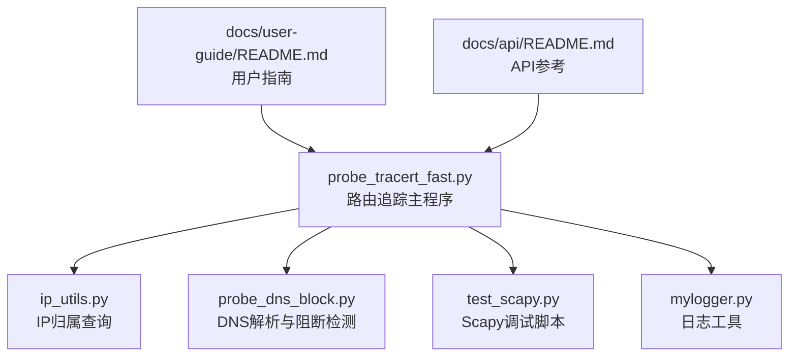
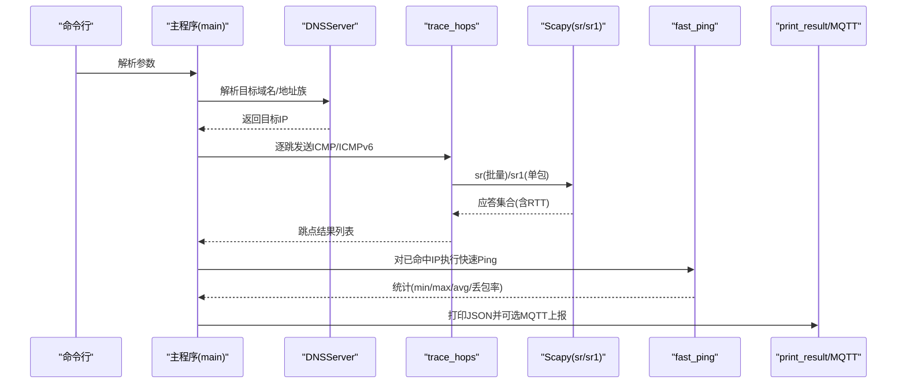
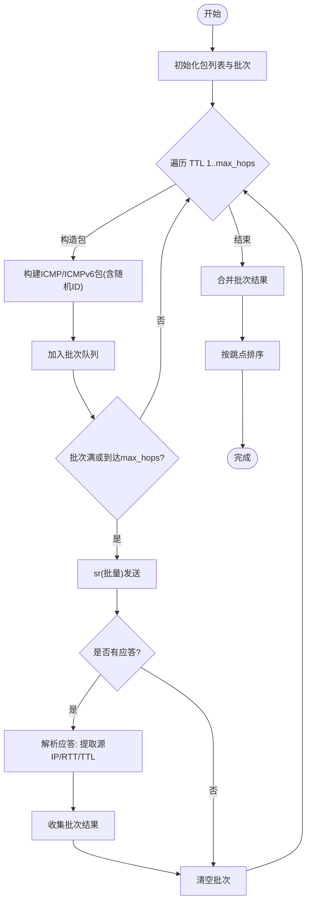
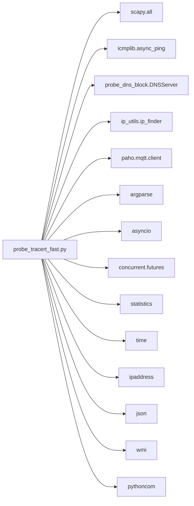

# 路由追踪模块

<cite>
**本文引用的文件**
- [probe_tracert_fast.py](file://probe_tracert_fast.py)
- [test_scapy.py](file://test_scapy.py)
- [ip_utils.py](file://ip_utils.py)
- [probe_dns_block.py](file://probe_dns_block.py)
- [mylogger.py](file://mylogger.py)
- [docs/user-guide/README.md](file://docs/user-guide/README.md)
- [docs/api/README.md](file://docs/api/README.md)
</cite>

## 目录
1. [简介](#简介)
2. [项目结构](#项目结构)
3. [核心组件](#核心组件)
4. [架构总览](#架构总览)
5. [详细组件分析](#详细组件分析)
6. [依赖关系分析](#依赖关系分析)
7. [性能考量](#性能考量)
8. [故障排除指南](#故障排除指南)
9. [结论](#结论)
10. [附录](#附录)

## 简介
本技术文档围绕“路由追踪模块”展开，系统阐述基于 Scapy 的 traceroute 实现原理与工程化集成，包括：
- TTL 递增机制与网络路径发现算法
- ICMP/ICMPv6 回显应答捕获与解析
- Scapy 在网络包构造、发送与监听中的应用
- 原始套接字使用与权限要求
- 参数配置指南（目标主机、最大跳数、超时、并发、地址族等）
- 结果数据格式与输出解析
- 不同操作系统下的实现差异与兼容性处理
- 实际使用示例与最佳实践、故障排除

## 项目结构
该模块位于根目录，主要文件如下：
- 探针入口与核心逻辑：probe_tracert_fast.py
- Scapy 调试与验证：test_scapy.py
- IP 归属信息查询：ip_utils.py
- DNS 解析与阻断检测：probe_dns_block.py
- 日志工具：mylogger.py
- 用户指南与 API 文档：docs/user-guide/README.md、docs/api/README.md

图表来源
- [probe_tracert_fast.py:1-417](file://probe_tracert_fast.py#L1-L417)
- [ip_utils.py:1-235](file://ip_utils.py#L1-L235)
- [probe_dns_block.py:1-230](file://probe_dns_block.py#L1-L230)
- [test_scapy.py:1-90](file://test_scapy.py#L1-L90)
- [mylogger.py:1-59](file://mylogger.py#L1-L59)
- [docs/user-guide/README.md:274-778](file://docs/user-guide/README.md#L274-L778)
- [docs/api/README.md:627-666](file://docs/api/README.md#L627-L666)

章节来源
- [probe_tracert_fast.py:1-417](file://probe_tracert_fast.py#L1-L417)
- [docs/user-guide/README.md:274-778](file://docs/user-guide/README.md#L274-L778)
- [docs/api/README.md:627-666](file://docs/api/README.md#L627-L666)

## 核心组件
- 路由追踪主流程：trace_hops、trace_single_hop、trace_route_concurrent
- DNS 解析与阻断检测：DNSServer、DomainBlockChecker
- IP 归属信息：ip_finder
- 结果打印与 MQTT 发布：print_result、publish_mqtt_message
- 参数解析与入口：argparse、asyncio 主循环

章节来源
- [probe_tracert_fast.py:30-246](file://probe_tracert_fast.py#L30-L246)
- [probe_dns_block.py:11-56](file://probe_dns_block.py#L11-L56)
- [ip_utils.py:6-186](file://ip_utils.py#L6-L186)

## 架构总览
路由追踪模块采用“异步+Scapy”的组合架构：
- 异步调度：使用 asyncio 控制 DNS 解析、路由追踪、快速 Ping、结果输出与 MQTT 上报
- 包构造与发送：使用 Scapy 的 sr/sr1、srloop（在测试脚本中演示）进行批量/单包发送与监听
- 结果聚合：按跳点收集 IP 与 RTT，合并为统一 JSON 输出，并可选发布至 MQTT

图表来源
- [probe_tracert_fast.py:183-246](file://probe_tracert_fast.py#L183-L246)
- [probe_tracert_fast.py:30-72](file://probe_tracert_fast.py#L30-L72)
- [probe_tracert_fast.py:88-114](file://probe_tracert_fast.py#L88-L114)
- [test_scapy.py:10-26](file://test_scapy.py#L10-L26)

## 详细组件分析

### TTL 递增与路径发现算法
- 逐跳递增 TTL：从 1 到 max_hops，每跳构造一个目标包
- IPv4/IPv6 分支：根据目标地址是否包含冒号选择 IP 或 IPv6 层
- 批量发送：达到 batch_size 或最后一跳时，使用 sr 批量发送并接收应答
- 应答解析：计算 RTT = 应答时间 - 查询时间；提取源 IP 作为跳点；记录 TTL
- 结果排序与截断：按跳点序号排序，遇到目标 IP 即停止

图表来源
- [probe_tracert_fast.py:30-55](file://probe_tracert_fast.py#L30-L55)

章节来源
- [probe_tracert_fast.py:30-55](file://probe_tracert_fast.py#L30-L55)

### ICMP/ICMPv6 回显应答捕获与解析
- IPv4：使用 IP/ICMP 层，随机 id 用于匹配请求/应答
- IPv6：使用 IPv6/ICMPv6EchoRequest，TTL 映射为 hlim
- 应答时间戳：利用 Scapy 的 answer.time 与 query.time 计算 RTT（毫秒）
- 匹配策略：通过包层属性（如 id）与时间戳进行对应

章节来源
- [probe_tracert_fast.py:37-51](file://probe_tracert_fast.py#L37-L51)
- [test_scapy.py:17-26](file://test_scapy.py#L17-L26)

### Scapy 在网络包构造与发送中的应用
- 包构造：IP/IPv6 + ICMP/ICMPv6EchoRequest
- 发送方式：
  - 批量：sr(packets, timeout, verbose=0, multi=True)
  - 单包：sr1(packet, timeout, verbose=0)
  - 测试脚本演示：srloop(packets)（注释掉的示例）
- 监听与统计：遍历 answered 列表，提取 src、time 差值作为 RTT

章节来源
- [probe_tracert_fast.py:44-66](file://probe_tracert_fast.py#L44-L66)
- [test_scapy.py:10-26](file://test_scapy.py#L10-L26)

### 原始套接字使用与权限要求
- Scapy 依赖底层原始套接字进行数据包的发送与接收
- 权限要求：通常需要管理员/超级用户权限（Windows 管理员、Linux/macOS root）
- 文档提示：Windows 平台需要管理员权限运行部分测试

章节来源
- [docs/api/README.md:661-666](file://docs/api/README.md#L661-L666)

### 参数配置指南
- 目标主机：必填，支持域名或 IP
- 地址族：--address-family 可强制 ipv4 或 ipv6
- MQTT 上报：--mqtt-broker/--mqtt-port/--mqtt-topic/--task-id
- 输出文件：--output-file
- DNS 服务器：--dnsserver（优先使用指定 DNS）

章节来源
- [probe_tracert_fast.py:345-358](file://probe_tracert_fast.py#L345-L358)
- [docs/user-guide/README.md:282-324](file://docs/user-guide/README.md#L282-L324)
- [docs/api/README.md:627-638](file://docs/api/README.md#L627-L638)

### 路由追踪结果数据格式
- 每个跳点包含：
  - hop：跳点序号
  - ip：跳点 IP，未命中则为 *
  - ip_info：IP 归属信息（省/市/运营商），内部 IP 标记为“其它”
  - send/recv/loss/min/max/avg：来自快速 Ping 的统计（可选）
- 输出为 JSON 字符串，可通过 detail 字段在控制台打印

章节来源
- [probe_tracert_fast.py:298-342](file://probe_tracert_fast.py#L298-L342)
- [ip_utils.py:265-283](file://ip_utils.py#L265-L283)

### 不同操作系统下的实现差异与兼容性处理
- 事件循环策略：Windows 平台设置 WindowsSelectorEventLoopPolicy
- DNS 解析：支持本地 DNS 与公共 DNS，自动检测阻断
- 地址族：支持 IPv4/IPv6 自动识别与强制切换
- 权限：Scapy 原始套接字需管理员权限

章节来源
- [probe_tracert_fast.py:414-417](file://probe_tracert_fast.py#L414-L417)
- [probe_dns_block.py:144-210](file://probe_dns_block.py#L144-L210)

### 实际使用示例与输出解析方法
- 基本路由追踪、强制 IPv4/IPv6、指定 DNS、MQTT 上报、输出文件等示例见用户指南
- 输出解析：JSON 中的 detail 字段即为最终结果字符串，可直接写入文件或进一步解析

章节来源
- [docs/user-guide/README.md:294-324](file://docs/user-guide/README.md#L294-L324)

## 依赖关系分析

图表来源
- [probe_tracert_fast.py:10-20](file://probe_tracert_fast.py#L10-L20)

章节来源
- [probe_tracert_fast.py:10-20](file://probe_tracert_fast.py#L10-L20)

## 性能考量
- 批量发送：通过 batch_size 减少系统调用次数，提升吞吐
- 异步 DNS：使用 aiodns 并发解析，缩短整体时延
- 快速 Ping：对命中跳点执行快速统计，避免重复探测
- 超时与并发：合理设置 timeout 与 concurrency，避免资源争用
- 日志与输出：建议在高并发场景下降低日志级别，减少 I/O 开销

章节来源
- [probe_tracert_fast.py:43-52](file://probe_tracert_fast.py#L43-L52)
- [probe_tracert_fast.py:88-114](file://probe_tracert_fast.py#L88-L114)
- [mylogger.py:7-28](file://mylogger.py#L7-L28)

## 故障排除指南
- 权限不足：Scapy 报错或无法接收应答，确认以管理员身份运行
- DNS 解析失败：检查 --dnsserver 参数或本地 DNS 配置；模块内置阻断检测
- 超时过短：适当增大 timeout，避免误判跳点丢失
- 并发过高：降低 concurrency，避免系统资源瓶颈
- 输出为空：确认目标可达性与防火墙策略；检查 MQTT Broker 地址与端口

章节来源
- [docs/api/README.md:661-666](file://docs/api/README.md#L661-L666)
- [probe_dns_block.py:144-210](file://probe_dns_block.py#L144-L210)
- [probe_tracert_fast.py:345-358](file://probe_tracert_fast.py#L345-L358)

## 结论
本模块以 Scapy 为核心，结合异步 DNS、快速 Ping 与结果聚合，实现了高效、可扩展的路由追踪能力。通过参数化配置与输出标准化，便于在自动化平台中集成与二次开发。建议在生产环境中配合严格的权限管理与监控告警，确保稳定性与安全性。

## 附录
- 用户指南与 API 参考：见 docs/user-guide/README.md 与 docs/api/README.md
- Scapy 调试脚本：test_scapy.py 展示了批量发送与 srloop 的使用思路

章节来源
- [docs/user-guide/README.md:274-778](file://docs/user-guide/README.md#L274-L778)
- [docs/api/README.md:627-666](file://docs/api/README.md#L627-L666)
- [test_scapy.py:1-90](file://test_scapy.py#L1-L90)