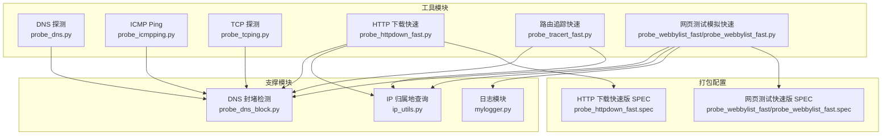
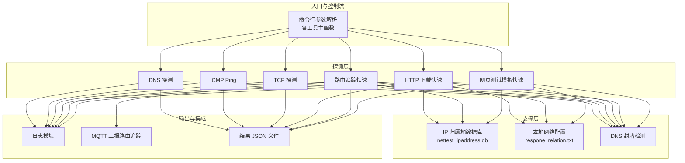
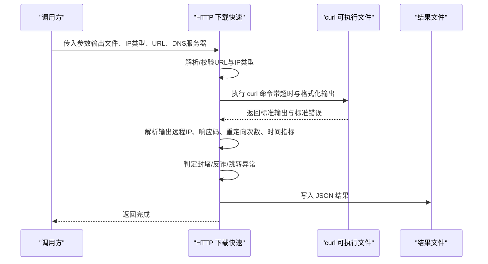
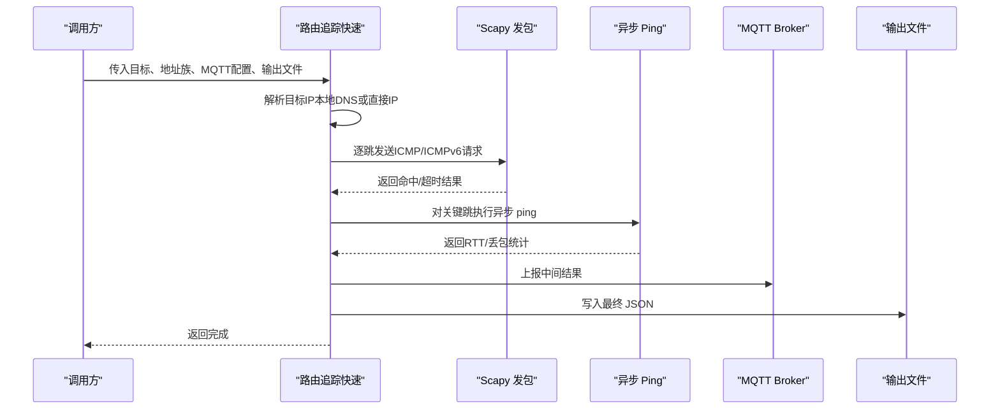
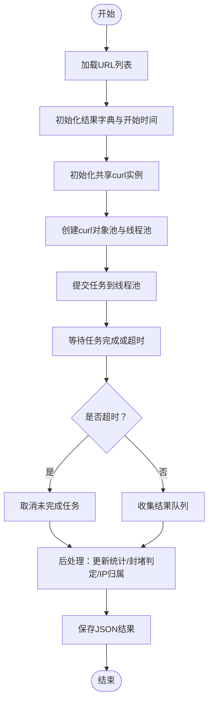
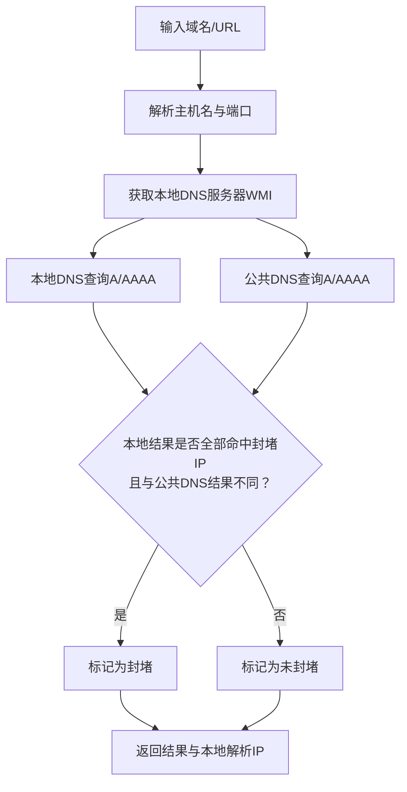
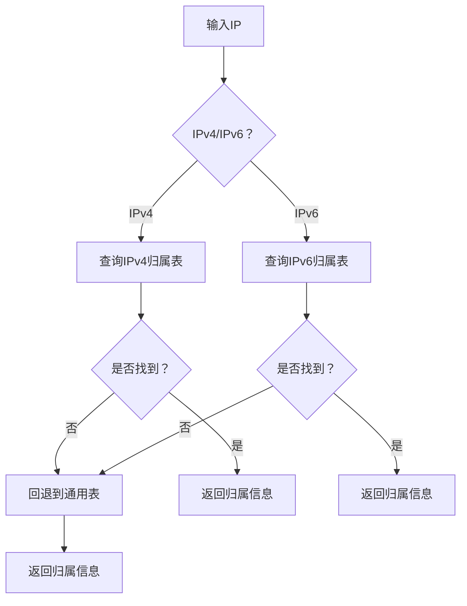

# 部署与运维

<cite>
**本文引用的文件**
- [部署指南](file://docs/deployment/README.md)
- [快速开始指南](file://docs/QUICKSTART.md)
- [HTTP 下载探测（快速版）](file://probe_httpdown_fast.py)
- [路由追踪（快速版）](file://probe_tracert_fast.py)
- [DNS 封堵检测](file://probe_dns_block.py)
- [IP 工具](file://ip_utils.py)
- [日志模块](file://mylogger.py)
- [HTTP 下载探测（快速版）SPEC](file://probe_httpdown_fast.spec)
- [网页测试模拟（快速版）SPEC](file://probe_webbylist_fast/probe_webbylist_fast.spec)
- [网页测试模拟（快速版）实现](file://probe_webbylist_fast/probe_webbylist_fast.py)
</cite>

## 目录
1. [简介](#简介)
2. [项目结构](#项目结构)
3. [核心组件](#核心组件)
4. [架构总览](#架构总览)
5. [详细组件分析](#详细组件分析)
6. [依赖分析](#依赖分析)
7. [性能考虑](#性能考虑)
8. [故障排除指南](#故障排除指南)
9. [结论](#结论)
10. [附录](#附录)

## 简介
本文件面向运维工程师与平台管理员，提供网络探测工具集的完整部署与运维指南。内容涵盖生产环境部署流程、PyInstaller 打包与可执行文件生成、跨平台部署要点、性能优化策略、监控与告警配置、故障排除、备份与恢复策略以及系统维护最佳实践。

## 项目结构
项目采用按功能模块组织的多工具结构，核心探测工具包括 DNS、ICMP、TCP、HTTP 下载与路由追踪；另有网页子链接测试与快速版 HTTP 下载工具；配套日志模块、IP 归属地查询与 DNS 封堵检测模块；同时提供 PyInstaller 规格文件用于打包。

图表来源
- [HTTP 下载探测（快速版）:1-479](file://probe_httpdown_fast.py#L1-L479)
- [路由追踪（快速版）:1-417](file://probe_tracert_fast.py#L1-L417)
- [DNS 封堵检测:1-230](file://probe_dns_block.py#L1-L230)
- [IP 工具:1-235](file://ip_utils.py#L1-L235)
- [网页测试模拟（快速版）实现:1-222](file://probe_webbylist_fast/probe_webbylist_fast.py#L1-L222)
- [HTTP 下载探测（快速版）SPEC:1-45](file://probe_httpdown_fast.spec#L1-L45)
- [网页测试模拟（快速版）SPEC:1-45](file://probe_webbylist_fast/probe_webbylist_fast.spec#L1-L45)

章节来源
- [部署指南:236-266](file://docs/deployment/README.md#L236-L266)
- [快速开始指南:1-266](file://docs/QUICKSTART.md#L1-L266)

## 核心组件
- DNS 探测：基于异步 DNS 解析，支持 A/AAAA 同时查询，统计解析时延与成功率，并联动 DNS 封堵检测。
- ICMP Ping：基于异步 ping，支持 IPv4/IPv6，统计丢包率、抖动与 RTT。
- TCP 探测：通过 DNS 解析后对指定端口发起连接测试。
- HTTP 下载（快速）：基于 curl 命令行工具，采集多阶段时间指标，解析重定向与封堵情况。
- 路由追踪（快速）：结合 Scapy 发包与 ICMP/ICMPv6 回显，统计每跳延迟与丢包，支持 MQTT 上报。
- 网页测试模拟（快速）：批量抓取页面子链接并并发 HTTP 下载，汇总首屏/满屏时间与速度。
- DNS 封堵检测：对比本地 DNS 与公共 DNS 结果，判定是否被运营商封堵。
- IP 归属地查询：基于 SQLite 数据库查询 IP 归属地，支持 IPv4/IPv6。
- 日志模块：统一日志格式与轮转，支持控制台与文件输出。

章节来源
- [DNS 封堵检测:1-230](file://probe_dns_block.py#L1-L230)
- [IP 工具:1-235](file://ip_utils.py#L1-L235)
- [日志模块:1-59](file://mylogger.py#L1-L59)
- [HTTP 下载探测（快速版）:1-479](file://probe_httpdown_fast.py#L1-L479)
- [路由追踪（快速版）:1-417](file://probe_tracert_fast.py#L1-L417)
- [网页测试模拟（快速版）实现:1-222](file://probe_webbylist_fast/probe_webbylist_fast.py#L1-L222)

## 架构总览
整体架构围绕“探测工具 + 支撑模块 + 打包配置”展开，工具间通过 DNS 封堵检测与 IP 归属地查询耦合，日志模块贯穿各工具以统一可观测性。

图表来源
- [HTTP 下载探测（快速版）:1-479](file://probe_httpdown_fast.py#L1-L479)
- [路由追踪（快速版）:1-417](file://probe_tracert_fast.py#L1-L417)
- [DNS 封堵检测:1-230](file://probe_dns_block.py#L1-L230)
- [IP 工具:1-235](file://ip_utils.py#L1-L235)
- [日志模块:1-59](file://mylogger.py#L1-L59)

## 详细组件分析

### 组件一：HTTP 下载（快速）探测
- 功能要点
  - 通过 curl 命令行工具执行 GET 请求，采集多阶段时间指标（DNS、连接、首包等）。
  - 解析 stderr 与 stdout，提取远程 IP、响应码、重定向次数与错误信息。
  - 基于封堵规则与反诈名单判定访问状态，写入 JSON 结果文件。
- 并发与超时
  - 该工具以单进程/线程方式执行 curl，不内置多任务并发；可通过外部调度器并发调用多个实例。
  - 总体超时与各阶段超时在 curl 参数中配置，便于适配不同网络环境。
- 关键流程

图表来源
- [HTTP 下载探测（快速版）:329-420](file://probe_httpdown_fast.py#L329-L420)

章节来源
- [HTTP 下载探测（快速版）:1-479](file://probe_httpdown_fast.py#L1-L479)

### 组件二：路由追踪（快速）探测
- 功能要点
  - 使用 Scapy 构造 IPv4/IPv6 ICMP 报文，逐跳发送并统计每跳 RTT。
  - 通过异步 ping 对关键跳进行 RTT/丢包统计，增强可观测性。
  - 支持 MQTT 上报中间结果，最终输出 JSON。
- 并发与超时
  - 路由追踪本身以串行逐跳为主，关键跳使用异步 ping 并设置批次与超时，避免阻塞。
- 关键流程

图表来源
- [路由追踪（快速版）:205-246](file://probe_tracert_fast.py#L205-L246)
- [路由追踪（快速版）:345-413](file://probe_tracert_fast.py#L345-L413)

章节来源
- [路由追踪（快速版）:1-417](file://probe_tracert_fast.py#L1-L417)

### 组件三：网页测试模拟（快速）
- 功能要点
  - 从首页 HTML 中解析子链接，构建任务队列。
  - 使用共享 curl 实例池与线程池并发下载，统一结果聚合与统计。
  - 支持总超时控制，超时后取消未完成任务。
- 并发与超时
  - CPU 核心数 + 4 作为并发上限，队列长度限制在 100。
  - 总超时阈值可配置，超时后主动取消未完成任务。
- 关键流程

图表来源
- [网页测试模拟（快速版）实现:102-178](file://probe_webbylist_fast/probe_webbylist_fast.py#L102-L178)

章节来源
- [网页测试模拟（快速版）实现:1-222](file://probe_webbylist_fast/probe_webbylist_fast.py#L1-L222)

### 组件四：DNS 封堵检测
- 功能要点
  - 优先使用本地 DNS（WMI 获取），若未指定则自动发现。
  - 同时向本地 DNS 与公共 DNS（如阿里 DNS）查询，比较结果差异与封堵列表，判定是否被运营商封堵。
- 关键流程

图表来源
- [DNS 封堵检测:135-210](file://probe_dns_block.py#L135-L210)

章节来源
- [DNS 封堵检测:1-230](file://probe_dns_block.py#L1-L230)

### 组件五：IP 归属地查询
- 功能要点
  - 通过 SQLite 查询 IPv4/IPv6 归属地，支持从 CDN 表与通用表回退。
  - 读取本地网络配置文件映射运营商代码为名称。
- 关键流程

图表来源
- [IP 工具:124-186](file://ip_utils.py#L124-L186)

章节来源
- [IP 工具:1-235](file://ip_utils.py#L1-L235)

## 依赖分析
- 运行时依赖
  - Python 3.7+（推荐 3.9+），Windows 10/11 与 Windows Server 2016/2019/2022。
  - Npcap/WinPcap：Scapy 依赖进行网络包捕获与发送（路由追踪）。
  - Visual C++ Redistributable：部分 Python 库运行时依赖。
- Python 包依赖
  - aiodns、icmplib、scapy、paho-mqtt、WMI 等。
- 打包与可执行文件
  - 使用 PyInstaller 与 .spec 规格文件生成独立可执行文件，支持 UPX 压缩与控制台/窗口模式。

章节来源
- [部署指南:15-117](file://docs/deployment/README.md#L15-L117)
- [HTTP 下载探测（快速版）SPEC:1-45](file://probe_httpdown_fast.spec#L1-L45)
- [网页测试模拟（快速版）SPEC:1-45](file://probe_webbylist_fast/probe_webbylist_fast.spec#L1-L45)

## 性能考虑
- 并发参数调优
  - HTTP 下载（快速）：单进程 curl，建议通过外部调度器并发调用多个实例；单实例超时与重定向限制已在 curl 参数中配置。
  - 网页测试模拟（快速）：并发数为 CPU 核心数 + 4，队列最大 100；可根据吞吐需求调整。
  - 路由追踪（快速）：逐跳串行为主，关键跳使用异步 ping 并设置批次与超时，避免阻塞。
- 超时与重定向
  - curl 参数包含总超时、连接超时、最低速率与检测时间、最大重定向次数等，需根据网络环境调整。
- 内存与磁盘
  - 日志采用轮转，建议定期清理；结果文件为 JSON，注意磁盘空间占用。
- 网络配置优化
  - 指定本地 DNS 服务器可提升解析稳定性；必要时切换公共 DNS。
- 并发控制建议
  - 普通 PC：并发数 5-10；服务器：并发数 20-50；具体以压测为准。

章节来源
- [部署指南:365-398](file://docs/deployment/README.md#L365-L398)
- [HTTP 下载探测（快速版）:364-381](file://probe_httpdown_fast.py#L364-L381)
- [网页测试模拟（快速版）实现:110-116](file://probe_webbylist_fast/probe_webbylist_fast.py#L110-L116)
- [路由追踪（快速版）:98-114](file://probe_tracert_fast.py#L98-L114)

## 故障排除指南
- 安装与依赖
  - 安装 Scapy 失败：确认已安装 Npcap；升级 pip 与编译工具；参考部署指南中的解决步骤。
  - 权限不足：ICMP 与路由追踪需要管理员权限；以管理员身份运行命令提示符。
- DNS 解析
  - 解析超时：检查网络连接，更换 DNS 服务器，适当增加超时。
  - 封堵判定：若本地 DNS 返回封堵 IP 而公共 DNS 正常，工具会标记封堵。
- HTTP 下载
  - code 1001：DNS 解析失败；检查域名与 DNS 服务器。
  - 超时与慢速：调整 curl 超时与速度限制参数。
  - 重定向过多：curl 最大重定向次数限制为 20。
- 路由追踪
  - 无结果：确认 Npcap 安装与防火墙设置；尝试增加超时。
- 日志与结果
  - 日志轮转：使用日志模块的轮转配置；定期清理旧日志。
  - 结果文件：JSON 输出包含关键指标，便于二次分析。

章节来源
- [部署指南:305-398](file://docs/deployment/README.md#L305-L398)
- [HTTP 下载探测（快速版）:121-191](file://probe_httpdown_fast.py#L121-L191)
- [路由追踪（快速版）:286-295](file://probe_tracert_fast.py#L286-L295)

## 结论
本指南提供了从环境准备、依赖安装、配置优化到打包部署与运维监控的全流程说明。通过合理设置并发与超时、规范日志与结果文件管理、结合 DNS 封堵检测与 IP 归属地查询，可有效提升网络探测的准确性与可运维性。建议在生产环境中配合外部调度器与监控系统，持续优化参数并建立完善的备份与恢复机制。

## 附录

### A. 生产环境部署流程（Windows）
- 环境准备
  - 安装 Python 3.9+，勾选“Add Python to PATH”。
  - 安装 Npcap（WinPcap API 兼容模式），重启计算机。
  - 准备 curl2.exe 与 IP 归属地数据库、本地网络配置文件。
- 创建虚拟环境并安装依赖
  - 创建并激活虚拟环境；安装 aiodns、icmplib、scapy、paho-mqtt、WMI。
- 配置文件
  - 确保 nettest_ipaddress.db、respone_relation.txt、curl2.exe 存在。
- 验证安装
  - 运行各工具的测试命令，查看输出 JSON 是否正常。

章节来源
- [部署指南:39-154](file://docs/deployment/README.md#L39-L154)
- [快速开始指南:5-32](file://docs/QUICKSTART.md#L5-L32)

### B. PyInstaller 打包与可执行文件生成
- 规格文件
  - 使用 .spec 文件定义脚本、隐藏导入、数据文件、UPX 压缩与控制台模式。
  - HTTP 下载快速版与网页测试快速版分别提供独立规格文件。
- 打包步骤
  - 在项目根目录执行 PyInstaller 命令，生成 dist 目录下的可执行文件。
  - 注意：部分规格文件启用 UPX 压缩，需确保环境可用。

章节来源
- [HTTP 下载探测（快速版）SPEC:1-45](file://probe_httpdown_fast.spec#L1-L45)
- [网页测试模拟（快速版）SPEC:1-45](file://probe_webbylist_fast/probe_webbylist_fast.spec#L1-L45)

### C. 监控与告警配置
- 日志监控
  - 使用日志模块的轮转配置，集中收集日志；对异常级别（ERROR/EXCEPTION）建立告警。
- 性能指标
  - HTTP 下载：time_namelookup、time_connect、time_starttransfer、speed_download。
  - ICMP/Ping：avg_rtt、drop_rate、avg_jitter。
  - 路由追踪：每跳 RTT、丢包率。
- 异常告警
  - 封堵/反诈/超时/重定向异常均在结果中体现，可据此触发告警。

章节来源
- [日志模块:1-59](file://mylogger.py#L1-L59)
- [HTTP 下载探测（快速版）:121-191](file://probe_httpdown_fast.py#L121-L191)
- [路由追踪（快速版）:298-342](file://probe_tracert_fast.py#L298-L342)

### D. 备份与恢复策略
- 备份
  - 定期备份 IP 归属地数据库、本地网络配置文件与历史结果 JSON。
  - 备份日志轮转文件，保留一定周期。
- 恢复
  - 恢复数据库与配置文件后，重新运行工具即可继续分析历史结果。
  - 若依赖缺失，重新安装 Python 与依赖包。

章节来源
- [部署指南:387-389](file://docs/deployment/README.md#L387-L389)