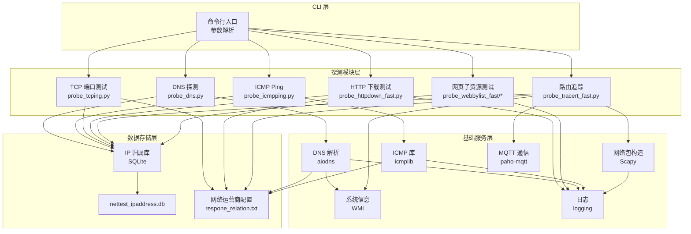
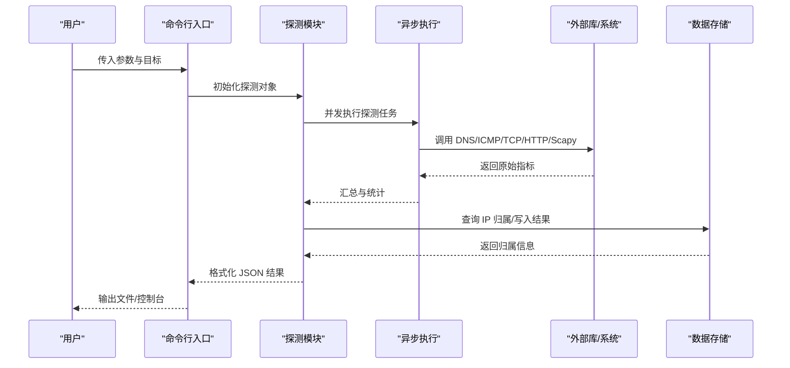
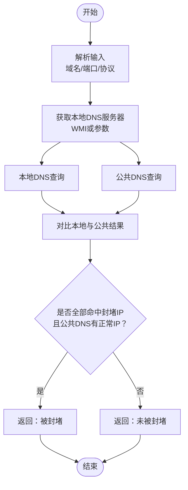
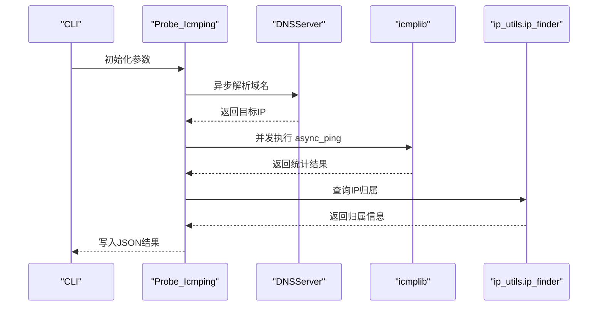
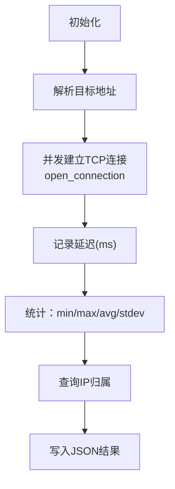
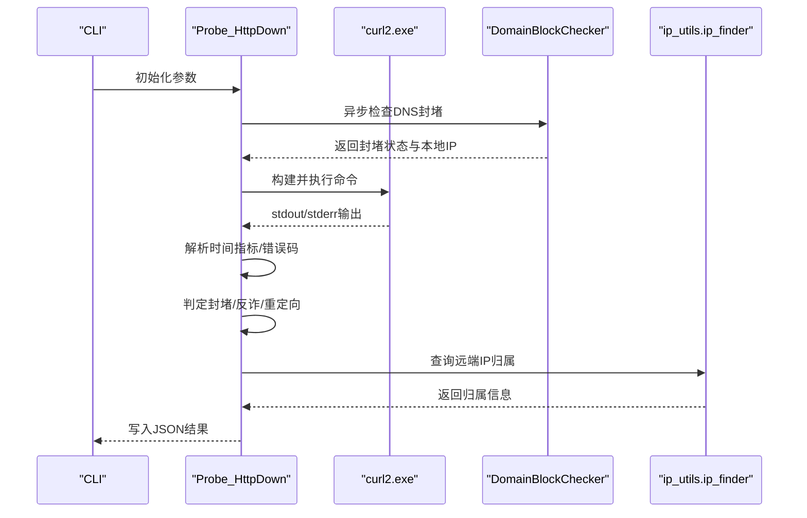
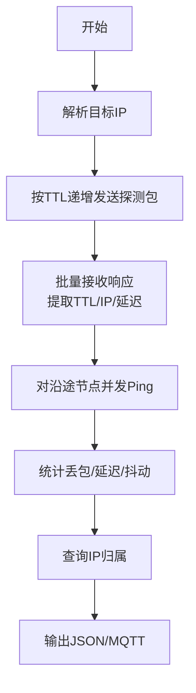
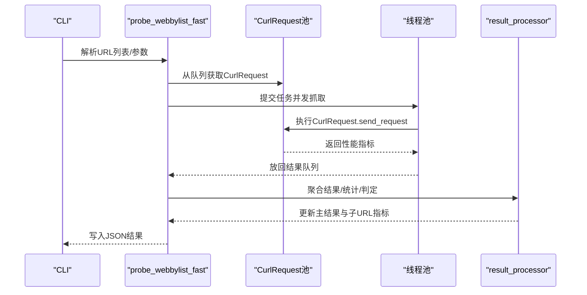
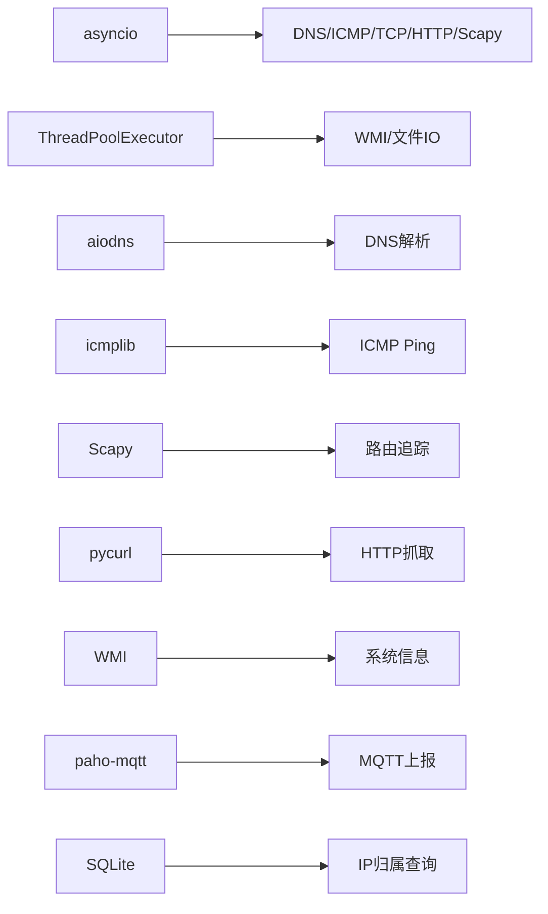

# 项目概述

<cite>
**本文档引用的文件**
- [README.md](file://README.md)
- [probe_dns_block.py](file://probe_dns_block.py)
- [probe_httpdown_fast.py](file://probe_httpdown_fast.py)
- [probe_icmpping.py](file://probe_icmpping.py)
- [probe_tcping.py](file://probe_tcping.py)
- [probe_tracert_fast.py](file://probe_tracert_fast.py)
- [ip_utils.py](file://ip_utils.py)
- [mylogger.py](file://mylogger.py)
- [probe_webbylist_fast\curl_request.py](file://probe_webbylist_fast/curl_request.py)
- [probe_webbylist_fast\result_processor.py](file://probe_webbylist_fast/result_processor.py)
- [docs\QUICKSTART.md](file://docs/QUICKSTART.md)
- [docs\architecture\README.md](file://docs/architecture/README.md)
</cite>

## 目录
1. [引言](#引言)
2. [项目结构](#项目结构)
3. [核心组件](#核心组件)
4. [架构总览](#架构总览)
5. [详细组件分析](#详细组件分析)
6. [依赖分析](#依赖分析)
7. [性能考虑](#性能考虑)
8. [故障排查指南](#故障排查指南)
9. [结论](#结论)
10. [附录](#附录)

## 引言
网络探测工具集(Probe Tool v2)是一个面向网络质量检测与诊断的 Python 工具集合，旨在帮助用户快速评估网络连通性、解析稳定性、传输性能与路由路径。项目提供 DNS 解析测试、ICMP Ping 测试、TCP 端口测试、HTTP 下载测试与路由追踪五大核心功能，并具备双栈支持、DNS 封堵检测、IP 归属查询、异步并发与标准化输出等特色能力。

在实际应用场景中，该工具集可用于：
- 网络运维人员进行跨地域、跨运营商的连通性与性能评估
- 业务侧监控站点可用性与首屏加载质量
- 安全与合规团队识别 DNS 重定向封堵与反诈网站
- 开发者定位网络瓶颈（DNS、TCP、TLS、首包时间）

## 项目结构
项目采用模块化与分层架构设计，主要分为 CLI 层、探测模块层、基础服务层与数据存储层。各探测模块独立运行，统一输出 JSON 结果，便于自动化集成与二次分析。

图表来源
- [README.md:67-83](file://README.md#L67-L83)
- [docs\architecture\README.md:19-59](file://docs/architecture/README.md#L19-L59)

章节来源
- [README.md:67-83](file://README.md#L67-L83)
- [docs\architecture\README.md:19-59](file://docs/architecture/README.md#L19-L59)

## 核心组件
- DNS 解析测试：支持 A/AAAA 记录查询、自定义 DNS 服务器、解析时间统计与 DNS 封堵检测。
- ICMP Ping 测试：支持 IPv4/IPv6，统计丢包率、RTT 与抖动，并查询 IP 归属。
- TCP 端口测试：支持自定义端口与 IPv4/IPv6，统计连接延迟、丢包率与抖动。
- HTTP 下载测试：基于 curl 的 HTTP/HTTPS 访问测试，分解响应时间（DNS/TCP/SSL/首字节/总时长），支持重定向跟踪、DNS 封堵检测与反诈识别。
- 路由追踪：使用 Scapy 构造探测包，支持并发 ping 沿途节点，查询 IP 归属并可 MQTT 上报。
- 网页子资源测试：并发抓取页面子资源，统计首屏与满页时间、成功率与带宽分布。

章节来源
- [README.md:9-52](file://README.md#L9-L52)
- [docs\QUICKSTART.md:33-266](file://docs/QUICKSTART.md#L33-L266)

## 架构总览
项目采用异步架构（asyncio）实现高并发探测，结合多线程/进程池与连接共享（如 pycurl 共享句柄）提升吞吐。模块间通过统一的 JSON 输出格式对接，便于后续聚合与可视化。

图表来源
- [docs\architecture\README.md:488-526](file://docs/architecture/README.md#L488-L526)
- [probe_httpdown_fast.py:329-420](file://probe_httpdown_fast.py#L329-L420)
- [probe_webbylist_fast\curl_request.py:130-155](file://probe_webbylist_fast/curl_request.py#L130-L155)

章节来源
- [docs\architecture\README.md:528-552](file://docs/architecture/README.md#L528-L552)
- [docs\architecture\README.md:577-664](file://docs/architecture/README.md#L577-L664)

## 详细组件分析

### DNS 封堵检测与解析
- 设计要点
  - 通过 WMI 自动获取本地 DNS 服务器，或使用自定义 DNS。
  - 同时向本地 DNS 与公共 DNS（如阿里 DNS）发起查询，对比结果判定是否被封堵。
  - 支持 IPv4/IPv6，内置常见封堵 IP 列表。
- 关键类与方法
  - DNSServer：封装异步 DNS 查询，支持自定义 nameservers 与超时。
  - DomainBlockChecker：负责解析输入、调用 DNSServer、对比结果并判定封堵。
- 算法流程

图表来源
- [probe_dns_block.py:135-210](file://probe_dns_block.py#L135-L210)

章节来源
- [probe_dns_block.py:11-230](file://probe_dns_block.py#L11-L230)

### ICMP Ping 测试
- 设计要点
  - 支持 IPv4/IPv6，自动解析域名到 IP。
  - 使用 icmplib 的异步 ping，统计最小/最大/平均 RTT、丢包率与抖动。
  - 查询 IP 归属并写入 JSON。
- 关键类与方法
  - Probe_Icmping：封装参数、执行 ping、解析结果、写入文件。
  - get_destip：异步解析目标地址。
  - parse_icmping：汇总统计并填充 IP 信息。

图表来源
- [probe_icmpping.py:19-124](file://probe_icmpping.py#L19-L124)
- [ip_utils.py:6-186](file://ip_utils.py#L6-L186)

章节来源
- [probe_icmpping.py:19-155](file://probe_icmpping.py#L19-L155)

### TCP 端口测试
- 设计要点
  - 使用 asyncio.open_connection 建立真实 TCP 连接，测量单次连接耗时。
  - 统计最小/最大/平均延迟、丢包率与抖动。
  - 支持 IPv4/IPv6，自动解析目标地址。
- 关键类与方法
  - Probe_Tcping：封装参数、并发连接、延迟收集与统计。
  - ping_host：单次连接并记录耗时。
  - parse_tcping：计算统计值并填充 IP 信息。

图表来源
- [probe_tcping.py:11-134](file://probe_tcping.py#L11-L134)

章节来源
- [probe_tcping.py:11-164](file://probe_tcping.py#L11-L164)

### HTTP 下载测试
- 设计要点
  - 通过 subprocess 调用 curl2.exe，解析其 -w 输出与 -v stderr，提取详细时间指标。
  - 支持 IPv4/IPv6、自定义 DNS 服务器、重定向跟踪与错误码映射。
  - 集成 DNS 封堵检测、重定向封堵检测与反诈网站识别。
- 关键类与方法
  - Probe_HttpDown：封装参数、构建命令、执行 curl、解析输出、判定成功/失败。
  - check_dns_block：调用 DomainBlockChecker 判定封堵。
  - check_jump_block：根据最终目标与响应码判定封堵/反诈。
  - check_outfile：检查下载内容是否包含反诈特征。
- 时间指标分解
  - time_namelookup：DNS 解析时间
  - time_connect：TCP 连接时间
  - time_appconnect：SSL/TLS 握手时间
  - time_starttransfer：首字节时间（TTFB）
  - time_total：总请求时间

图表来源
- [probe_httpdown_fast.py:13-420](file://probe_httpdown_fast.py#L13-L420)
- [probe_dns_block.py:59-210](file://probe_dns_block.py#L59-L210)
- [ip_utils.py:170-186](file://ip_utils.py#L170-L186)

章节来源
- [probe_httpdown_fast.py:13-479](file://probe_httpdown_fast.py#L13-L479)

### 路由追踪
- 设计要点
  - 使用 Scapy 构造 ICMP/ICMPv6 探测包，按 TTL 递增发送，批量接收响应。
  - 对沿途节点并发执行 ping，统计丢包与延迟。
  - 查询 IP 归属并支持 MQTT 中间结果上报。
- 关键函数
  - trace_hops：批量发送与接收，提取 TTL/IP/延迟。
  - fast_ping：分批并发 ping 沿途节点。
  - print_result：格式化输出 JSON。
  - fill_ip_info：查询 IP 归属信息。

图表来源
- [probe_tracert_fast.py:30-114](file://probe_tracert_fast.py#L30-L114)
- [probe_tracert_fast.py:205-246](file://probe_tracert_fast.py#L205-L246)
- [probe_tracert_fast.py:298-342](file://probe_tracert_fast.py#L298-L342)

章节来源
- [probe_tracert_fast.py:1-417](file://probe_tracert_fast.py#L1-L417)

### 网页子资源测试（并发抓取）
- 设计要点
  - 使用 pycurl 共享句柄与连接池，提高并发效率。
  - 通过线程池管理 CurlRequest 对象，异步发送请求并收集结果。
  - 统计首屏与满页时间、成功率、带宽与 IP 归属分布。
- 关键模块
  - curl_request：封装 pycurl 选项、性能指标采集与错误码记录。
  - result_processor：初始化结果模板、聚合子资源指标、计算统计值、判定封堵/反诈。

图表来源
- [probe_webbylist_fast\curl_request.py:130-155](file://probe_webbylist_fast/curl_request.py#L130-L155)
- [probe_webbylist_fast\result_processor.py:25-146](file://probe_webbylist_fast/result_processor.py#L25-L146)

章节来源
- [probe_webbylist_fast\curl_request.py:1-194](file://probe_webbylist_fast/curl_request.py#L1-L194)
- [probe_webbylist_fast\result_processor.py:1-269](file://probe_webbylist_fast/result_processor.py#L1-L269)

## 依赖分析
- 异步与并发
  - asyncio：统一的事件循环与并发调度。
  - ThreadPoolExecutor：用于执行阻塞或系统调用（如 WMI、文件读取）。
- 网络与系统
  - aiodns：异步 DNS 解析。
  - icmplib：ICMP Ping。
  - Scapy：网络包构造与批量发送。
  - pycurl：HTTP 抓取与性能指标采集。
  - WMI：Windows 系统信息（DNS、网卡等）。
  - paho-mqtt：MQTT 上报（路由追踪）。
- 数据与存储
  - SQLite：IP 归属查询。
  - JSON：配置与结果输出。

图表来源
- [docs\architecture\README.md:577-664](file://docs/architecture/README.md#L577-L664)
- [README.md:56-66](file://README.md#L56-L66)

章节来源
- [README.md:56-66](file://README.md#L56-L66)
- [docs\architecture\README.md:577-664](file://docs/architecture/README.md#L577-L664)

## 性能考虑
- 异步并发
  - 使用 asyncio.gather 与 Semaphore 控制并发，避免过度竞争。
  - 对 DNS 查询使用信号量限制，防止 DNS 服务器过载。
- 连接与资源复用
  - pycurl 共享句柄（Cookie/DNS/SSL Session）减少重复开销。
  - 连接池队列管理 CurlRequest 对象，降低创建销毁成本。
- 批量处理
  - 路由追踪使用批量 sr() 发送与接收，提升吞吐。
- I/O 优化
  - 日志采用轮转文件处理器，避免磁盘 I/O 抖动。
  - 结果写入采用二进制写入与 UTF-8 编码，减少编码开销。

章节来源
- [docs\architecture\README.md:758-790](file://docs/architecture/README.md#L758-L790)
- [probe_webbylist_fast\curl_request.py:11-17](file://probe_webbylist_fast/curl_request.py#L11-L17)
- [mylogger.py:7-59](file://mylogger.py#L7-L59)

## 故障排查指南
- 常见错误码与含义（HTTP/下载测试）
  - 1001：DNS 解析失败
  - 1002：TCP 连接失败
  - 1003：SSL/TLS 握手失败
  - 1005：服务端无响应/超时
  - 1006：总耗时超阈值
  - 1007：重定向次数过多
  - 1008：URL 格式错误
  - 1009：命中反诈网站或响应包含反诈特征
  - 1010：重定向至异常 IP（如 0.0.0.0/::1）
  - 1011：DNS 封堵（本地封堵、公共 DNS 正常）
  - 1012：测试总时间超时
  - 1099：未知失败原因
- DNS 封堵检测
  - 若本地 DNS 返回封堵 IP，而公共 DNS 返回正常 IP，则标记为封堵。
  - 可通过 --dnsserver 指定自定义 DNS 进行交叉验证。
- 反诈识别
  - 若响应体包含特定关键词或命中反诈 IP，将判定失败并返回相应错误码。
- 路由追踪
  - 需要管理员权限（Windows）；若受限，可尝试禁用防火墙或以管理员身份运行。
  - 可通过 --address-family 指定 IPv4/IPv6。

章节来源
- [probe_httpdown_fast.py:121-191](file://probe_httpdown_fast.py#L121-L191)
- [probe_webbylist_fast\result_processor.py:148-269](file://probe_webbylist_fast/result_processor.py#L148-L269)
- [docs\QUICKSTART.md:240-266](file://docs/QUICKSTART.md#L240-L266)

## 结论
Probe Tool v2 通过异步并发与模块化设计，实现了高精度、高效率的网络质量检测与诊断能力。其双栈支持、DNS 封堵检测、IP 归属查询与标准化输出，使其既能满足初学者快速上手，也能为专业用户提供深入的网络分析能力。建议在生产环境中结合日志轮转、错误码监控与结果聚合，形成完整的网络可观测体系。

## 附录
- 快速开始示例
  - DNS 解析测试：[docs\QUICKSTART.md:37-59](file://docs/QUICKSTART.md#L37-L59)
  - ICMP Ping 测试：[docs\QUICKSTART.md:69-96](file://docs/QUICKSTART.md#L69-L96)
  - TCP 端口测试：[docs\QUICKSTART.md:98-126](file://docs/QUICKSTART.md#L98-L126)
  - HTTP 下载测试：[docs\QUICKSTART.md:128-161](file://docs/QUICKSTART.md#L128-L161)
  - 路由追踪：[docs\QUICKSTART.md:171-205](file://docs/QUICKSTART.md#L171-L205)
- 架构设计详解
  - [docs\architecture\README.md:15-402](file://docs/architecture/README.md#L15-L402)