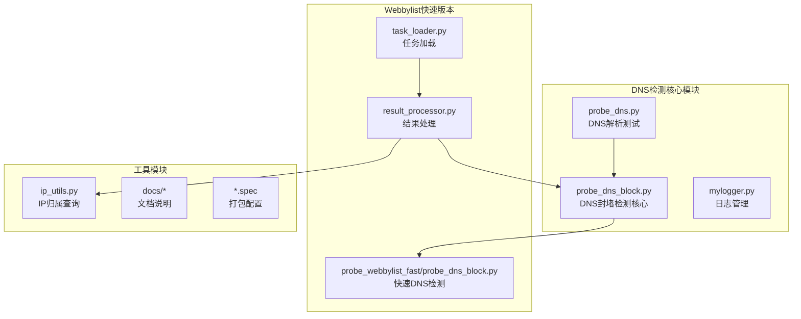
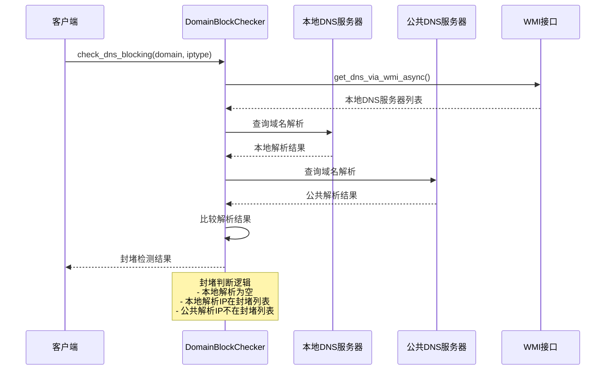
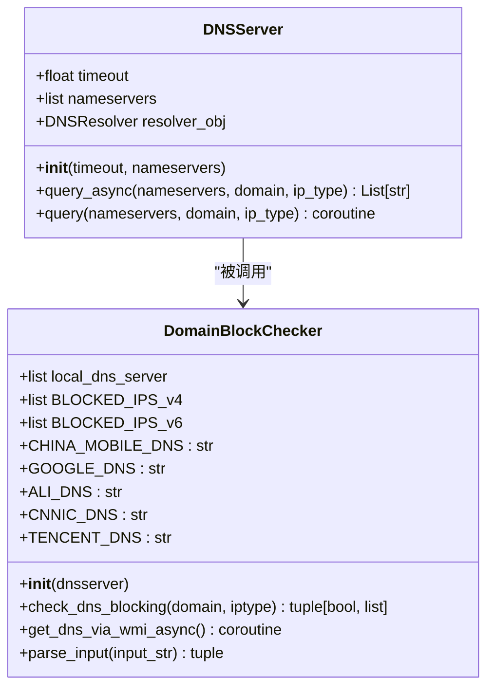
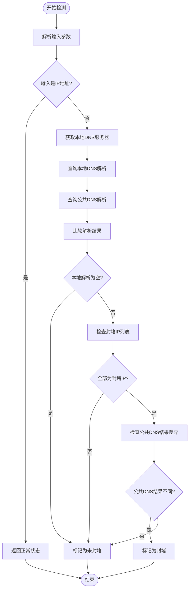
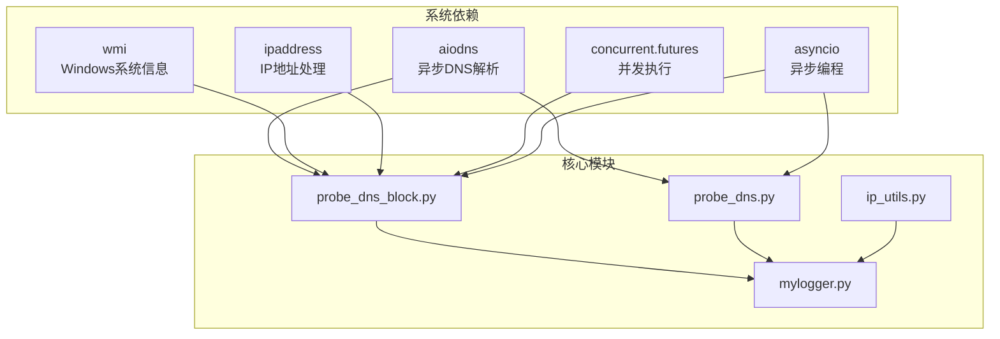
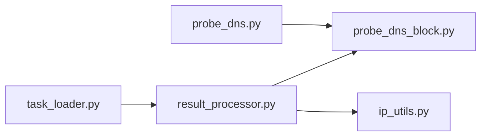
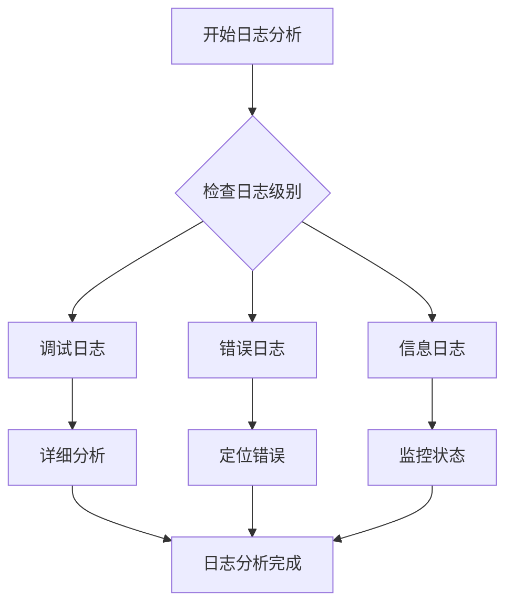

# DNS封堵检测系统

<cite>
**本文档引用的文件**
- [probe_dns_block.py](file://probe_dns_block.py)
- [probe_dns.py](file://probe_dns.py)
- [probe_webbylist_fast/probe_dns_block.py](file://probe_webbylist_fast/probe_dns_block.py)
- [mylogger.py](file://mylogger.py)
- [ip_utils.py](file://ip_utils.py)
- [probe_webbylist_fast/result_processor.py](file://probe_webbylist_fast/result_processor.py)
- [probe_webbylist_fast/task_loader.py](file://probe_webbylist_fast/task_loader.py)
- [docs/QUICKSTART.md](file://docs/QUICKSTART.md)
- [docs/user-guide/README.md](file://docs/user-guide/README.md)
- [docs/deployment/README.md](file://docs/deployment/README.md)
- [probe_dns.spec](file://probe_dns.spec)
</cite>

## 目录
1. [简介](#简介)
2. [项目结构](#项目结构)
3. [核心组件](#核心组件)
4. [架构概览](#架构概览)
5. [详细组件分析](#详细组件分析)
6. [依赖分析](#依赖分析)
7. [性能考虑](#性能考虑)
8. [故障排除指南](#故障排除指南)
9. [结论](#结论)
10. [附录](#附录)

## 简介

DNS封堵检测系统是一个基于Python的网络探测工具，专门用于检测域名解析是否被DNS服务器封堵。该系统通过对比本地DNS服务器与公共DNS服务器（如Google DNS、Cloudflare DNS）的解析结果，结合预定义的封堵IP列表来判断域名是否被封堵。

系统采用异步编程模型，使用aiodns库实现高效的并发DNS查询，支持IPv4和IPv6双重栈检测。通过WMI接口自动获取系统当前活动的DNS服务器配置，确保检测结果的准确性。

## 项目结构

该项目采用模块化设计，主要包含以下核心模块：



**图表来源**
- [probe_dns_block.py:1-230](file://probe_dns_block.py#L1-L230)
- [probe_dns.py:1-203](file://probe_dns.py#L1-L203)
- [probe_webbylist_fast/probe_dns_block.py:1-207](file://probe_webbylist_fast/probe_dns_block.py#L1-L207)

**章节来源**
- [probe_dns_block.py:1-230](file://probe_dns_block.py#L1-L230)
- [probe_dns.py:1-203](file://probe_dns.py#L1-L203)
- [probe_webbylist_fast/probe_dns_block.py:1-207](file://probe_webbylist_fast/probe_dns_block.py#L1-L207)

## 核心组件

### DNSServer类
负责管理DNS解析器实例，支持自定义超时时间和命名服务器配置。

### DomainBlockChecker类
实现DNS封堵检测的核心逻辑，包含：
- 本地DNS服务器自动发现
- 公共DNS服务器对比检测
- 封堵IP地址识别
- 异常处理和错误恢复

### Probe_Dns类
提供完整的DNS解析测试功能，包括：
- 并发DNS查询
- 解析时间统计
- 成功率计算
- 结果格式化输出

**章节来源**
- [probe_dns_block.py:11-230](file://probe_dns_block.py#L11-L230)
- [probe_dns.py:15-203](file://probe_dns.py#L15-L203)

## 架构概览

系统采用分层架构设计，从底层的DNS解析到底层的HTTP检测，形成完整的网络质量评估体系：



**图表来源**
- [probe_dns_block.py:135-210](file://probe_dns_block.py#L135-L210)
- [probe_dns_block.py:104-133](file://probe_dns_block.py#L104-L133)

## 详细组件分析

### DNSServer类分析

DNSServer类提供了统一的DNS查询接口，支持异步查询和同步查询两种模式：



**图表来源**
- [probe_dns_block.py:11-56](file://probe_dns_block.py#L11-L56)
- [probe_dns_block.py:59-210](file://probe_dns_block.py#L59-L210)

#### 异步DNS查询实现

系统使用aiodns库实现高效的异步DNS查询，支持以下特性：

1. **并发查询**：使用`asyncio.gather()`同时查询A记录和AAAA记录
2. **超时控制**：每个查询都有独立的超时时间控制
3. **错误处理**：捕获并处理DNS查询异常
4. **结果收集**：统一收集和格式化查询结果

**章节来源**
- [probe_dns_block.py:25-53](file://probe_dns_block.py#L25-L53)
- [probe_dns.py:94-148](file://probe_dns.py#L94-L148)

### DomainBlockChecker类分析

DomainBlockChecker类实现了核心的封堵检测逻辑：

#### 封堵判断算法



**图表来源**
- [probe_dns_block.py:135-210](file://probe_dns_block.py#L135-L210)

#### 封堵IP列表配置

系统内置了针对IPv4和IPv6的封堵IP列表：

| 协议类型 | 封堵IP列表 | 用途说明 |
|---------|-----------|----------|
| IPv4 | 0.0.0.0, 127.0.0.1, 183.252.183.9, 183.252.183.98, 182.43.124.6 | 常见的DNS封堵返回IP |
| IPv6 | ::1, ::, ::0, FE80::1, 2409:8034:3830:42::4 | IPv6封堵返回地址 |

**章节来源**
- [probe_dns_block.py:65-66](file://probe_dns_block.py#L65-L66)
- [probe_dns_block.py:158-203](file://probe_dns_block.py#L158-L203)

### Probe_Dns类分析

Probe_Dns类提供了完整的DNS解析测试功能：

#### 并发查询策略

系统采用多种并发策略来优化DNS查询性能：

1. **信号量控制**：使用`asyncio.Semaphore(1)`限制并发请求数量
2. **超时管理**：设置总超时时间（默认2秒）和单次超时时间
3. **结果聚合**：收集所有查询结果并进行统计分析

#### 统计指标计算

系统计算以下关键统计指标：

| 指标名称 | 计算公式 | 说明 |
|---------|---------|------|
| 解析成功率 | 成功解析次数/总查询次数×100% | 衡量DNS解析质量 |
| 最小解析时间 | 所有解析时间的最小值 | 最快解析速度 |
| 最大解析时间 | 所有解析时间的最大值 | 最慢解析速度 |
| 平均解析时间 | 所有解析时间的平均值 | 平均解析性能 |
| 目标IP | 首个成功解析的IP地址 | 主要解析结果 |

**章节来源**
- [probe_dns.py:47-93](file://probe_dns.py#L47-L93)
- [probe_dns.py:150-170](file://probe_dns.py#L150-L170)

## 依赖分析

### 外部依赖关系



**图表来源**
- [probe_dns_block.py:1-10](file://probe_dns_block.py#L1-L10)
- [probe_dns.py:1-8](file://probe_dns.py#L1-L8)

### 内部模块依赖

系统内部模块之间的依赖关系相对简单，主要通过导入关系实现：



**图表来源**
- [probe_dns.py:8](file://probe_dns.py#L8)
- [probe_webbylist_fast/result_processor.py:4](file://probe_webbylist_fast/result_processor.py#L4)

**章节来源**
- [probe_dns.py:1-8](file://probe_dns.py#L1-L8)
- [probe_webbylist_fast/result_processor.py:1-6](file://probe_webbylist_fast/result_processor.py#L1-L6)

## 性能考虑

### 异步查询优化

系统通过异步编程实现高性能的DNS查询：

1. **事件循环优化**：在Windows平台上使用`WindowsSelectorEventLoopPolicy`
2. **并发控制**：通过信号量限制同时进行的查询数量
3. **超时管理**：合理设置超时时间避免长时间阻塞

### 内存管理

系统采用了有效的内存管理策略：

1. **结果缓存**：使用列表存储查询结果，便于后续统计分析
2. **资源清理**：及时释放DNS解析器资源
3. **日志管理**：使用旋转文件处理器避免日志文件过大

### 网络性能

系统在网络性能方面做了以下优化：

1. **多DNS服务器支持**：可以同时查询多个DNS服务器
2. **协议选择**：支持IPv4和IPv6双栈查询
3. **错误恢复**：遇到异常时能够快速恢复并继续其他查询

## 故障排除指南

### 常见问题及解决方案

#### 1. DNS查询超时

**问题描述**：DNS查询长时间无响应

**解决方案**：
- 调整超时参数（`timeout_per_request`）
- 更换DNS服务器
- 检查网络连接状态

#### 2. 权限不足

**问题描述**：在Windows系统上无法获取DNS服务器信息

**解决方案**：
- 以管理员权限运行程序
- 检查WMI服务状态
- 确认pythoncom库可用

#### 3. 结果不准确

**问题描述**：封堵检测结果与实际情况不符

**解决方案**：
- 验证封堵IP列表配置
- 检查网络环境变化
- 增加测试次数提高准确性

### 日志分析

系统提供了详细的日志记录功能，可以通过日志分析问题：



**图表来源**
- [mylogger.py:7-59](file://mylogger.py#L7-L59)

**章节来源**
- [mylogger.py:1-59](file://mylogger.py#L1-L59)

## 结论

DNS封堵检测系统是一个功能完整、性能优良的网络探测工具。系统通过异步编程和并发查询技术，实现了高效的DNS封堵检测能力。其核心优势包括：

1. **准确的封堵检测**：通过对比本地和公共DNS服务器的解析结果，准确识别封堵行为
2. **高性能实现**：使用异步DNS查询和并发控制，显著提升检测效率
3. **灵活的配置**：支持多种DNS服务器和检测参数配置
4. **完善的日志**：提供详细的日志记录和错误分析功能

该系统适用于网络质量监控、内容封堵检测、DNS性能评估等多种应用场景。通过合理的参数配置和扩展开发，可以满足不同用户的需求。

## 附录

### 配置参数说明

#### DNS检测参数

| 参数名称 | 类型 | 默认值 | 说明 |
|---------|------|--------|------|
| dns_server | str | 8.8.8.8 | DNS服务器IP地址 |
| domain | str | - | 要检测的域名 |
| out_file | str | - | 结果输出文件路径 |
| request_count | int | 10 | 并发查询次数 |
| timeout_per_request | float | 1.0 | 单次查询超时时间（秒） |
| total_timeout | float | 60.0 | 总查询超时时间（秒） |
| protocol_type | int | 0 | 协议类型：0=双栈, 4=IPv4, 6=IPv6 |

#### 封堵检测配置

| 配置项 | 默认值 | 说明 |
|-------|--------|------|
| BLOCKED_IPS_v4 | ['0.0.0.0', '127.0.0.1', ...] | IPv4封堵IP列表 |
| BLOCKED_IPS_v6 | ['::1', '::', ...] | IPv6封堵IP列表 |
| LOCAL_DNS_SERVER | [] | 本地DNS服务器列表 |
| PUBLIC_DNS_SERVERS | ['223.5.5.5'] | 公共DNS服务器列表 |

### 扩展开发指南

#### 自定义封堵判断标准

要扩展新的封堵判断标准，可以修改以下部分：

1. **封堵IP列表扩展**：在`BLOCKED_IPS_v4`和`BLOCKED_IPS_v6`中添加新的封堵IP
2. **检测逻辑增强**：在`check_dns_blocking`方法中添加新的判断条件
3. **结果处理优化**：在`parse_dns_results`方法中添加新的统计指标

#### 新的检测规则实现

```python
# 示例：添加新的封堵规则
def check_custom_block(self, local_results, public_results):
    """
    自定义封堵检测逻辑
    """
    # 实现自定义检测规则
    pass
```

#### 自定义DNS服务器

要添加新的DNS服务器支持：

1. 在类中添加新的DNS服务器常量
2. 更新检测逻辑以包含新服务器
3. 添加相应的配置参数

**章节来源**
- [docs/QUICKSTART.md:207-232](file://docs/QUICKSTART.md#L207-L232)
- [docs/user-guide/README.md:678-736](file://docs/user-guide/README.md#L678-L736)