# IP归属查询系统

<cite>
**本文档引用的文件**
- [ip_utils.py](file://ip_utils.py)
- [probe_webbylist_fast/ip_utils.py](file://probe_webbylist_fast/ip_utils.py)
- [xdbSearcher.py](file://xdbSearcher.py)
- [ip_region_search.py](file://ip_region_search.py)
- [nettest_ipaddress.db](file://nettest_ipaddress.db)
- [probe_webbylist_fast/result_processor.py](file://probe_webbylist_fast/result_processor.py)
- [probe_webbylist_fast/out.json](file://probe_webbylist_fast/out.json)
- [dist/respone_relation.txt](file://dist/respone_relation.txt)
</cite>

## 目录
1. [项目概述](#项目概述)
2. [项目结构](#项目结构)
3. [核心组件](#核心组件)
4. [架构概览](#架构概览)
5. [详细组件分析](#详细组件分析)
6. [数据库设计与索引策略](#数据库设计与索引策略)
7. [IP地址转换算法](#ip地址转换算法)
8. [CDN与普通IP库双重查询机制](#cdn与普通ip库双重查询机制)
9. [IP归属信息分类统计](#ip归属信息分类统计)
10. [SQLite连接池与只读模式](#sqlite连接池与只读模式)
11. [数据库维护与更新指南](#数据库维护与更新指南)
12. [查询示例与统计分析](#查询示例与统计分析)
13. [故障排除指南](#故障排除指南)
14. [结论](#结论)

## 项目概述

IP归属查询系统是一个基于Python开发的高性能IP地址定位服务，支持IPv4和IPv6地址的精确归属查询。该系统采用多层查询架构，结合CDN IP库和普通IP库，提供准确的地理位置和运营商信息。

系统主要特点：
- 支持IPv4和IPv6双协议栈
- 双重查询机制（CDN库 + 普通库）
- 实时统计分析功能
- 高性能SQLite数据库访问
- 完整的错误处理和回退机制

## 项目结构

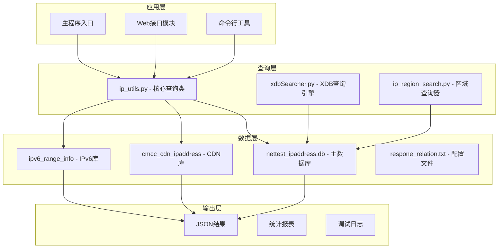

**图表来源**
- [ip_utils.py:1-235](file://ip_utils.py#L1-L235)
- [xdbSearcher.py:1-192](file://xdbSearcher.py#L1-L192)
- [ip_region_search.py:1-32](file://ip_region_search.py#L1-L32)

**章节来源**
- [ip_utils.py:1-235](file://ip_utils.py#L1-L235)
- [probe_webbylist_fast/ip_utils.py:1-235](file://probe_webbylist_fast/ip_utils.py#L1-L235)

## 核心组件

### IP查询核心类（ip_finder）

ip_finder类是整个系统的核心，负责处理所有IP地址查询请求：

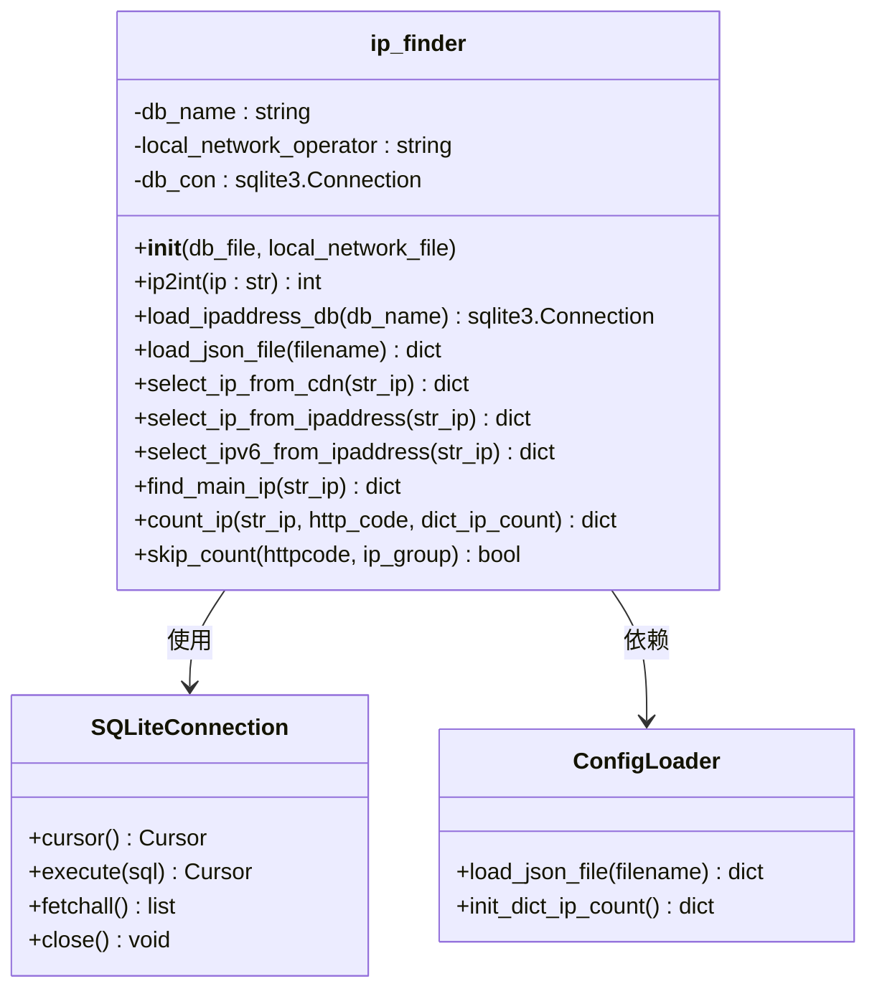

**图表来源**
- [ip_utils.py:6-235](file://ip_utils.py#L6-L235)

### XDB查询引擎

xdbSearcher类提供了高效的XDB格式数据库查询能力：

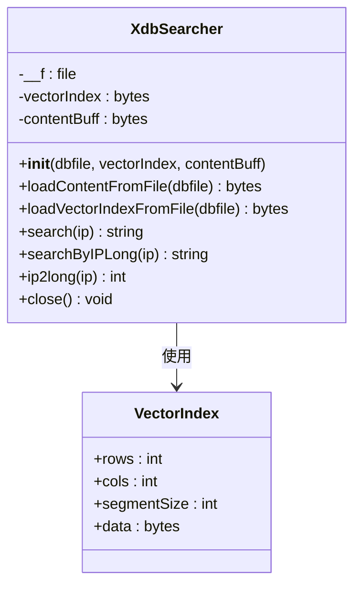

**图表来源**
- [xdbSearcher.py:23-172](file://xdbSearcher.py#L23-L172)

**章节来源**
- [ip_utils.py:6-235](file://ip_utils.py#L6-L235)
- [xdbSearcher.py:23-172](file://xdbSearcher.py#L23-L172)

## 架构概览

系统采用分层架构设计，确保了良好的可扩展性和维护性：

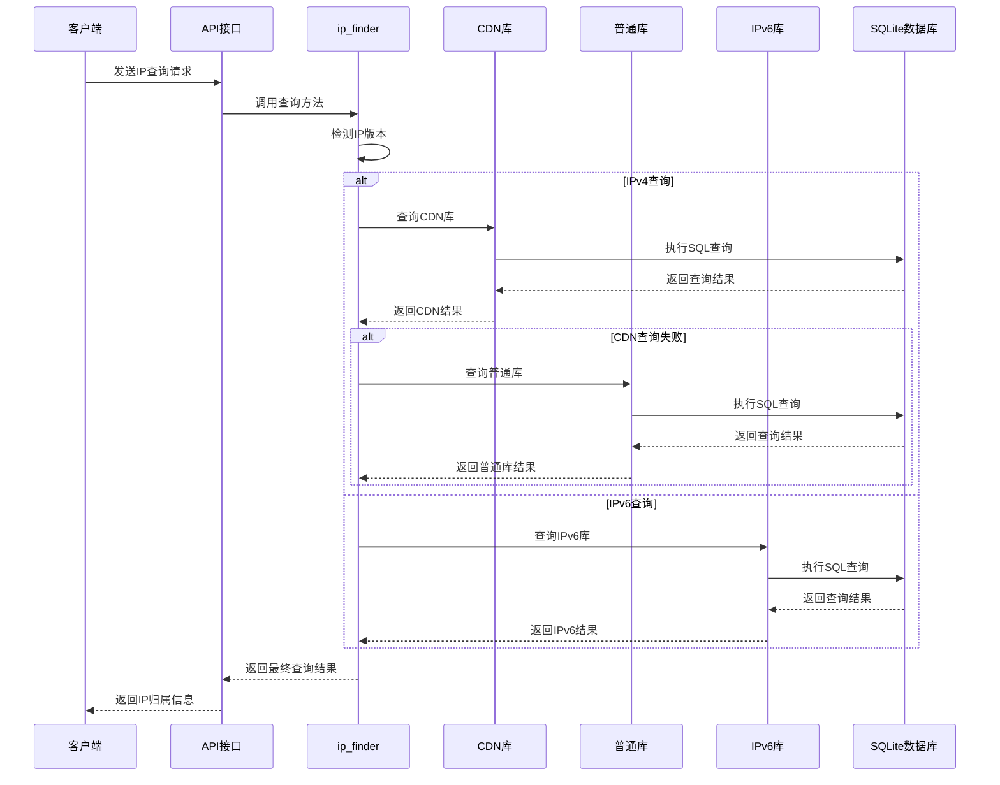

**图表来源**
- [ip_utils.py:170-186](file://ip_utils.py#L170-L186)
- [probe_webbylist_fast/result_processor.py:123-146](file://probe_webbylist_fast/result_processor.py#L123-L146)

## 详细组件分析

### 数据库连接管理

系统实现了高效的数据库连接管理机制：

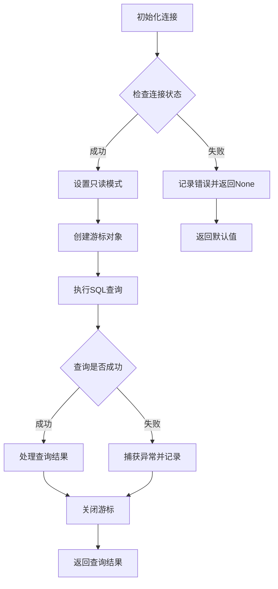

**图表来源**
- [ip_utils.py:23-31](file://ip_utils.py#L23-L31)
- [ip_utils.py:69-87](file://ip_utils.py#L69-L87)

### IP地址转换算法

系统提供了多种IP地址转换方法：

#### IPv4地址转换
```python
def ip2int(self, ip: str) -> int:
    if ip[0]=='[' and ip[-1]==']':
        ip=ip[1:-1]
    return int(ipaddress.ip_address(ip))
```

#### IPv6地址转换
```python
def select_ipv6_from_ipaddress(self, str_ip):
    int_ip = int(ipaddress.ip_address(str_ip))
    sql = '''
    select province,city,isp from ipv6_range_info 
    where X'{ip_int:032X}' BETWEEN ip_start_num AND ip_end_num 
    ORDER BY ip_num ASC;
    '''.format(ip_int=int_ip)
```

**章节来源**
- [ip_utils.py:16-20](file://ip_utils.py#L16-L20)
- [ip_utils.py:90-121](file://ip_utils.py#L90-L121)

### 查询优先级与回退策略

系统实现了智能的查询优先级和回退机制：

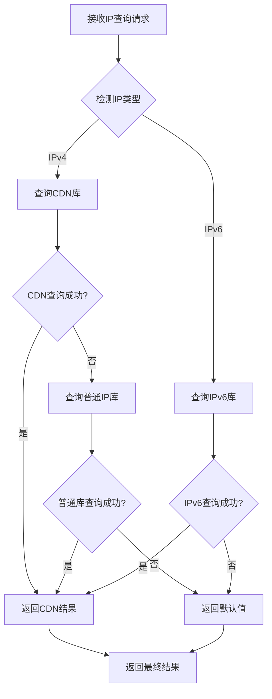

**图表来源**
- [ip_utils.py:170-186](file://ip_utils.py#L170-L186)
- [ip_utils.py:189-196](file://ip_utils.py#L189-L196)

**章节来源**
- [ip_utils.py:170-186](file://ip_utils.py#L170-L186)
- [ip_utils.py:189-196](file://ip_utils.py#L189-L196)

## 数据库设计与索引策略

### 主要数据库表结构

#### nettest_ipaddress表
这是系统的核心IP库表，存储IPv4地址范围信息：

| 字段名 | 类型 | 描述 | 索引 |
|--------|------|------|------|
| IP_INT_BEGIN | INTEGER | IP地址起始范围 | 是 |
| IP_INT_END | INTEGER | IP地址结束范围 | 是 |
| IP_PROVINCE | TEXT | 省份信息 | 否 |
| IP_CITY | TEXT | 城市信息 | 否 |
| IP_OPERATOR | TEXT | 运营商信息 | 否 |
| IP_DEPARTMENT | TEXT | 部门信息 | 否 |
| IP_INT_SUB | INTEGER | 子排序字段 | 是 |

#### cmcc_cdn_ipaddress表
CDN专用IP库表：

| 字段名 | 类型 | 描述 | 索引 |
|--------|------|------|------|
| IP_INT_BEGIN | INTEGER | CDN IP起始范围 | 是 |
| IP_INT_END | INTEGER | CDN IP结束范围 | 是 |
| IP_PROVINCE | TEXT | 省份信息 | 否 |
| IP_CITY | TEXT | 城市信息 | 否 |
| IP_OPERATOR | TEXT | 运营商信息 | 否 |
| IP_DEPARTMENT | TEXT | 部门信息 | 否 |
| IP_INT_SUB | INTEGER | 排序字段 | 是 |

#### ipv6_range_info表
IPv6专用IP库表：

| 字段名 | 类型 | 描述 | 索引 |
|--------|------|------|------|
| ip_start_num | INTEGER | IPv6起始数值 | 是 |
| ip_end_num | INTEGER | IPv6结束数值 | 是 |
| province | TEXT | 省份信息 | 否 |
| city | TEXT | 城市信息 | 否 |
| isp | TEXT | 运营商信息 | 否 |
| ip_num | INTEGER | 排序字段 | 是 |

### 索引策略分析

系统采用了多层次的索引策略来优化查询性能：

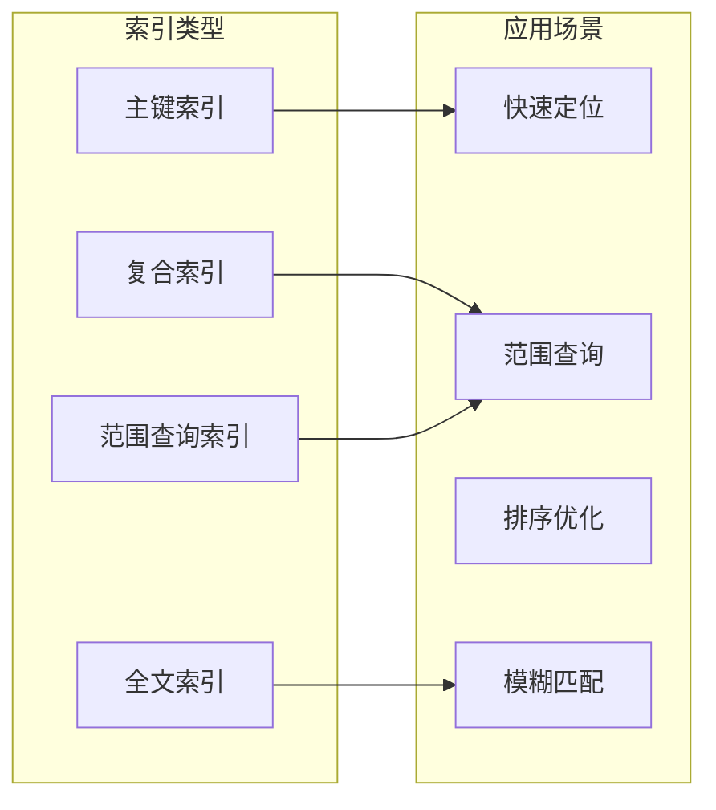

**章节来源**
- [ip_utils.py:67-68](file://ip_utils.py#L67-L68)
- [ip_utils.py:100-101](file://ip_utils.py#L100-L101)
- [ip_utils.py:134-135](file://ip_utils.py#L134-L135)

## IP地址转换算法

### IPv4转换算法

系统使用标准的IP地址转换算法：

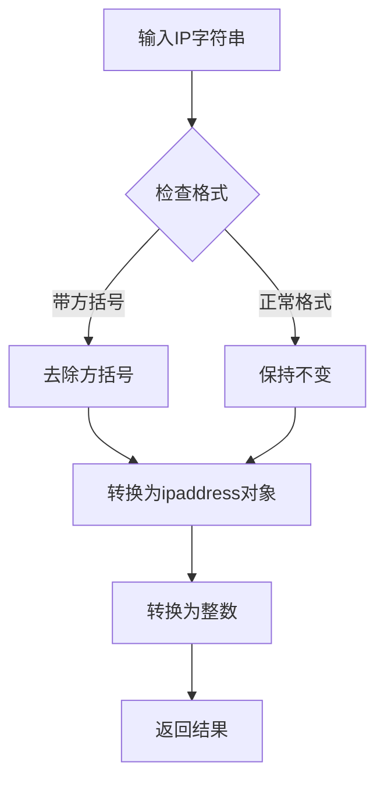

**图表来源**
- [ip_utils.py:16-19](file://ip_utils.py#L16-L19)

### IPv6转换算法

IPv6地址转换采用了十六进制格式处理：

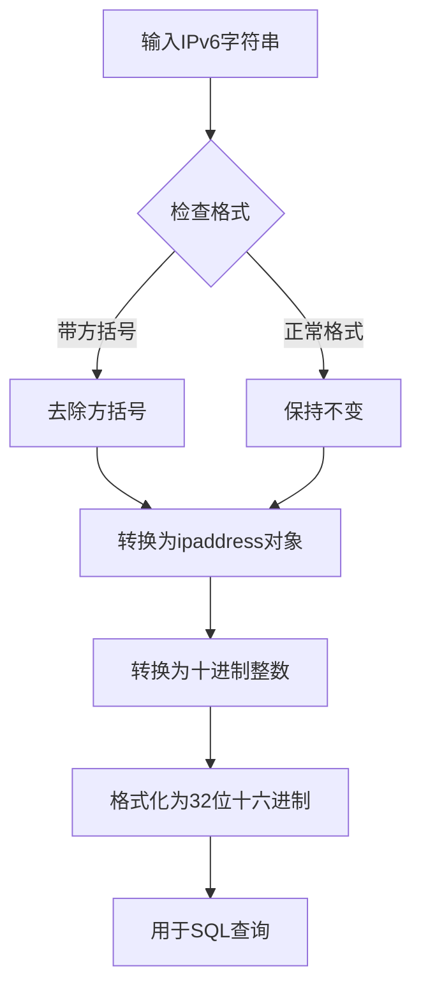

**图表来源**
- [ip_utils.py:96-101](file://ip_utils.py#L96-L101)

**章节来源**
- [ip_utils.py:16-19](file://ip_utils.py#L16-L19)
- [ip_utils.py:96-101](file://ip_utils.py#L96-L101)

## CDN与普通IP库双重查询机制

### 查询流程设计

系统实现了智能的双重查询机制：

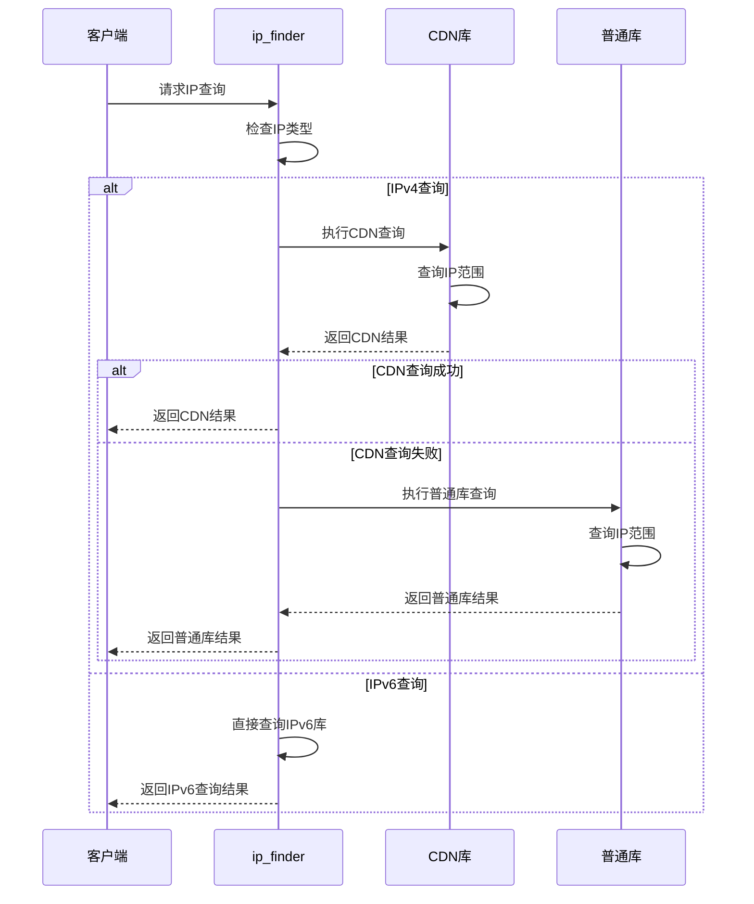

**图表来源**
- [ip_utils.py:170-186](file://ip_utils.py#L170-L186)

### 查询优化策略

系统采用了多种查询优化策略：

1. **预排序优化**：CDN查询使用`ORDER BY IP_INT_SUB ASC`进行预排序
2. **范围查询优化**：使用`BETWEEN`操作符进行高效范围匹配
3. **索引利用**：充分利用IP范围字段的索引优势
4. **回退机制**：CDN查询失败时自动回退到普通库

**章节来源**
- [ip_utils.py:56-88](file://ip_utils.py#L56-L88)
- [ip_utils.py:124-153](file://ip_utils.py#L124-L153)

## IP归属信息分类统计

### 统计分类规则

系统实现了详细的IP归属信息分类统计功能：

```mermaid
flowchart TD
A[获取IP查询结果] --> B{检查省份信息}
B --> |为空| C[标记为"空"]
B --> |不为空| D{检查运营商信息}
D --> |与本地运营商相同| E{检查省份}
E --> |本省| F[标记为"本网本省"]
E --> |外省| G[标记为"本网外省"]
D --> |不同运营商| H[标记为"异网"]
D --> |其他运营商| I[标记为"其他"]
C --> J[更新统计]
F --> J
G --> J
H --> J
I --> J
J --> K[更新总量]
K --> L[返回分类结果]
```

**图表来源**
- [ip_utils.py:189-225](file://ip_utils.py#L189-L225)

### 统计过滤规则

系统实现了严格的统计过滤机制：

| 过滤条件 | 条件描述 | 处理方式 |
|----------|----------|----------|
| HTTP状态码为0 | 网络请求失败 | 跳过统计 |
| HTTP状态码以4开头 | 客户端错误 | 跳过统计 |
| HTTP状态码以5开头 | 服务器错误 | 跳过统计 |
| IP组为"空" | 归属信息缺失 | 跳过统计 |

**章节来源**
- [ip_utils.py:156-168](file://ip_utils.py#L156-L168)
- [ip_utils.py:189-225](file://ip_utils.py#L189-L225)

## SQLite连接池与只读模式

### 连接管理机制

系统实现了高效的SQLite连接管理：

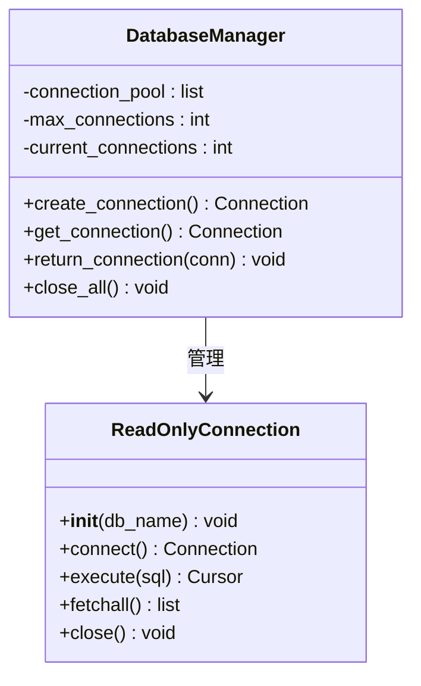

**图表来源**
- [ip_utils.py:23-31](file://ip_utils.py#L23-L31)

### 只读模式实现

系统通过URI参数启用只读模式：

```python
# 只读连接URI
db_conn_uri = "file:{}?mode=ro".format(db_name)
conn = sqlite3.connect(db_name, uri=True)
```

这种设计确保了：
1. **数据安全**：防止意外修改数据库
2. **性能优化**：减少写锁竞争
3. **并发安全**：允许多个连接同时读取

**章节来源**
- [ip_utils.py:23-31](file://ip_utils.py#L23-L31)

## 数据库维护与更新指南

### 数据导入流程

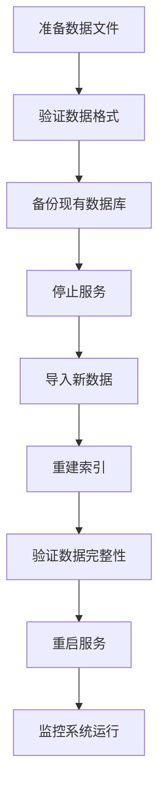

### 索引重建策略

系统提供了完整的索引管理功能：

```sql
-- 重建IPv4范围索引
CREATE INDEX IF NOT EXISTS idx_nettest_range ON nettest_ipaddress(IP_INT_BEGIN, IP_INT_END);

-- 重建CDN范围索引  
CREATE INDEX IF NOT EXISTS idx_cdn_range ON cmcc_cdn_ipaddress(IP_INT_BEGIN, IP_INT_END);

-- 重建IPv6范围索引
CREATE INDEX IF NOT EXISTS idx_ipv6_range ON ipv6_range_info(ip_start_num, ip_end_num);
```

### 性能优化建议

1. **定期分析数据库统计信息**
2. **监控查询执行计划**
3. **优化慢查询语句**
4. **定期清理无用数据**
5. **调整SQLite配置参数**

**章节来源**
- [ip_utils.py:67-68](file://ip_utils.py#L67-L68)
- [ip_utils.py:100-101](file://ip_utils.py#L100-L101)

## 查询示例与统计分析

### 基本查询示例

#### IPv4地址查询
```python
# 创建查询实例
finder = ip_utils.ip_finder("nettest_ipaddress.db", "respone_relation.txt")

# 查询IPv4地址
result = finder.find_main_ip("183.250.188.58")
print(f"IP归属: {result}")
```

#### IPv6地址查询
```python
# 查询IPv6地址
result = finder.find_main_ip("2001:db8::1")
print(f"IPv6归属: {result}")
```

### 统计分析示例

#### 单个URL统计
```python
# 初始化统计字典
dict_ip_count = finder.init_dict_ip_count()

# 统计单个IP
ip_group = finder.count_ip("183.250.188.58", 200, dict_ip_count)
print(f"IP分类: {ip_group}")
print(f"统计结果: {dict_ip_count}")
```

#### 批量统计分析
```python
# 在Web应用中批量统计
def batch_statistic(result_info):
    ip_finder_obj = ip_utils.ip_finder("./nettest_ipaddress.db", "respone_relation.txt")
    dict_ip_count = ip_finder_obj.init_dict_ip_count()
    
    for item in result_info["result_suburl"]:
        if len(item["primary_ip"]) > 0:
            ip_group = ip_finder_obj.count_ip(item["primary_ip"], item["http_code"], dict_ip_count)
    
    return dict_ip_count
```

**章节来源**
- [probe_webbylist_fast/result_processor.py:123-146](file://probe_webbylist_fast/result_processor.py#L123-L146)
- [probe_webbylist_fast/out.json:1-74](file://probe_webbylist_fast/out.json#L1-L74)

## 故障排除指南

### 常见问题诊断

#### 数据库连接问题
```python
# 检查数据库连接状态
def check_db_connection():
    try:
        conn = sqlite3.connect("nettest_ipaddress.db", uri=True)
        conn.close()
        return True
    except Exception as e:
        print(f"数据库连接失败: {e}")
        return False
```

#### 查询超时处理
```python
# 设置查询超时时间
def safe_query(sql, timeout=30):
    try:
        conn = sqlite3.connect("nettest_ipaddress.db", uri=True)
        conn.execute("PRAGMA timeout = {}".format(timeout))
        cursor = conn.cursor()
        cursor.execute(sql)
        result = cursor.fetchall()
        cursor.close()
        conn.close()
        return result
    except sqlite3.OperationalError as e:
        print(f"查询超时: {e}")
        return []
```

### 错误处理机制

系统实现了完善的错误处理机制：

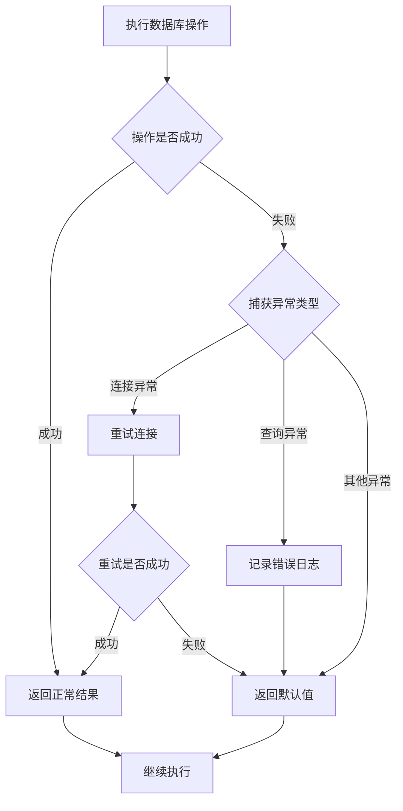

**图表来源**
- [ip_utils.py:69-87](file://ip_utils.py#L69-L87)
- [ip_utils.py:137-153](file://ip_utils.py#L137-L153)

**章节来源**
- [ip_utils.py:69-87](file://ip_utils.py#L69-L87)
- [ip_utils.py:137-153](file://ip_utils.py#L137-L153)

## 结论

IP归属查询系统是一个功能完整、性能优异的IP地址定位解决方案。系统的主要优势包括：

1. **多协议支持**：全面支持IPv4和IPv6地址查询
2. **智能查询机制**：CDN库与普通库的双重查询和回退机制
3. **高效性能**：基于SQLite的高性能数据库设计和索引优化
4. **完善统计**：详细的IP归属信息分类统计功能
5. **稳定可靠**：完善的错误处理和故障恢复机制

系统适用于各种网络监控、性能分析和地理信息服务场景，为用户提供准确可靠的IP地址归属查询能力。