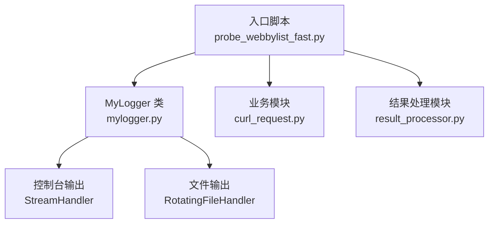
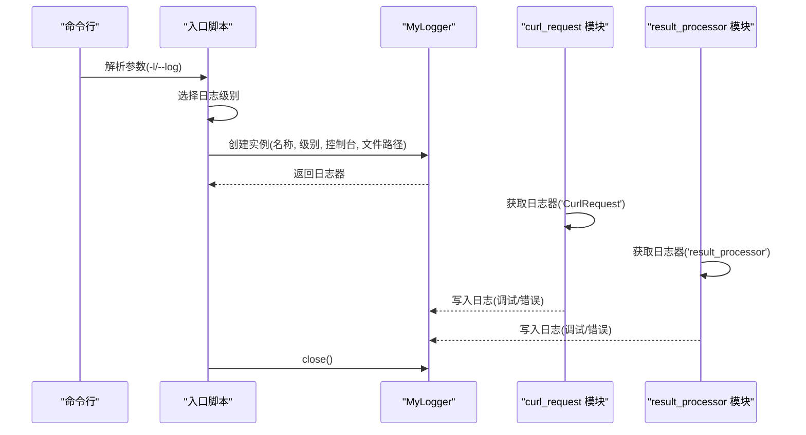
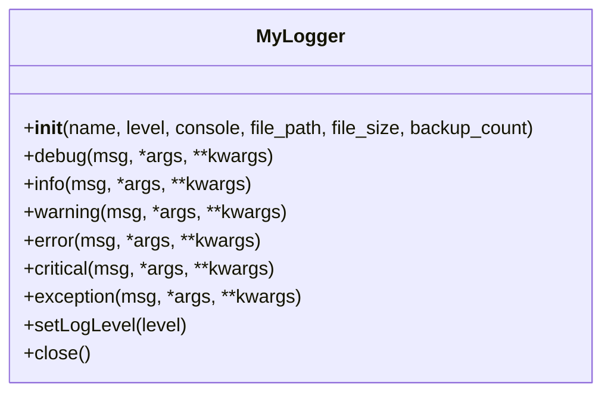
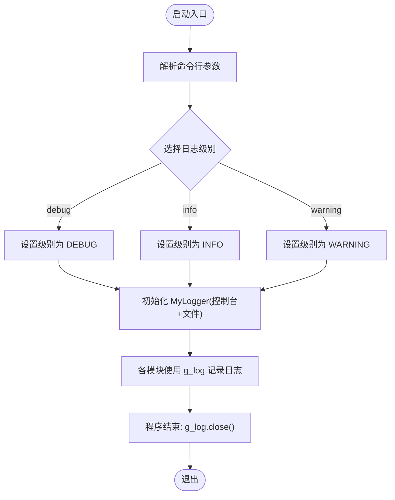
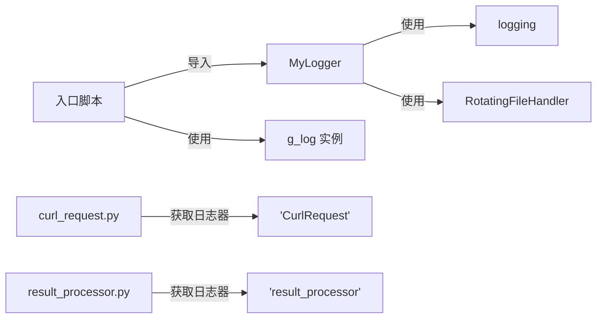

# 日志管理系统

<cite>
**本文引用的文件**
- [mylogger.py](file://mylogger.py)
- [mylogger.py](file://probe_webbylist_fast/mylogger.py)
- [probe_webbylist_fast.py](file://probe_webbylist_fast/probe_webbylist_fast.py)
- [curl_request.py](file://probe_webbylist_fast/curl_request.py)
- [result_processor.py](file://probe_webbylist_fast/result_processor.py)
</cite>

## 目录
1. [简介](#简介)
2. [项目结构](#项目结构)
3. [核心组件](#核心组件)
4. [架构总览](#架构总览)
5. [详细组件分析](#详细组件分析)
6. [依赖分析](#依赖分析)
7. [性能考虑](#性能考虑)
8. [故障排查指南](#故障排查指南)
9. [结论](#结论)
10. [附录](#附录)

## 简介
本文件为日志管理系统的配置与使用文档，覆盖以下主题：
- 日志系统整体架构与日志级别（DEBUG、INFO、WARNING、ERROR、CRITICAL）
- 输出目标配置（控制台与文件）
- 日志格式规范（时间戳、模块标识、线程号、级别与消息）
- 日志轮转机制（文件大小限制、备份数量）
- 配置文件结构与参数说明（控制台/文件差异化）
- 日志分析与过滤（关键词、时间范围、错误统计）
- 调试模式启用与性能影响
- 常见配置场景与最佳实践

## 项目结构
本仓库中日志系统由统一的 MyLogger 类实现，位于根目录与子模块中各一份，二者功能一致。主程序通过命令行参数选择日志级别，并在入口处初始化 MyLogger 实例，随后在多个模块中使用该实例进行日志记录。

图表来源
- [probe_webbylist_fast.py:217-218](file://probe_webbylist_fast/probe_webbylist_fast.py#L217-L218)
- [mylogger.py:7-28](file://mylogger.py#L7-L28)
- [curl_request.py:50](file://probe_webbylist_fast/curl_request.py#L50)
- [result_processor.py:5](file://probe_webbylist_fast/result_processor.py#L5)

章节来源
- [probe_webbylist_fast.py:1-222](file://probe_webbylist_fast/probe_webbylist_fast.py#L1-L222)
- [mylogger.py:1-59](file://mylogger.py#L1-L59)
- [probe_webbylist_fast/mylogger.py:1-59](file://probe_webbylist_fast/mylogger.py#L1-L59)

## 核心组件
- MyLogger 类：封装标准 logging，提供统一的日志接口；支持控制台与文件双通道输出；默认使用旋转文件处理器；支持动态设置日志级别（调试模式）。
- 入口脚本初始化：从命令行读取日志级别，构造 MyLogger 实例，并在程序结束时关闭句柄。
- 业务模块使用：curl_request.py 与 result_processor.py 等模块通过 logging 或 MyLogger 记录运行状态、错误信息与调试细节。

章节来源
- [mylogger.py:7-59](file://mylogger.py#L7-L59)
- [probe_webbylist_fast/probe_webbylist_fast.py:217-218](file://probe_webbylist_fast/probe_webbylist_fast.py#L217-L218)
- [curl_request.py:50-194](file://probe_webbylist_fast/curl_request.py#L50-L194)
- [result_processor.py:1-269](file://probe_webbylist_fast/result_processor.py#L1-L269)

## 架构总览
日志系统采用“集中式初始化 + 多模块共享”的架构：
- 初始化阶段：解析命令行参数，构造 MyLogger 实例，设置日志级别与输出目标。
- 运行阶段：各模块通过命名空间（logger name）获取日志器，按需输出到控制台或文件。
- 关闭阶段：显式关闭所有处理器，释放资源。

图表来源
- [probe_webbylist_fast.py:200-222](file://probe_webbylist_fast/probe_webbylist_fast.py#L200-L222)
- [probe_webbylist_fast.py:217-218](file://probe_webbylist_fast/probe_webbylist_fast.py#L217-L218)
- [curl_request.py:50](file://probe_webbylist_fast/curl_request.py#L50)
- [result_processor.py:5](file://probe_webbylist_fast/result_processor.py#L5)

## 详细组件分析

### MyLogger 类设计与行为
- 统一日志接口：提供 debug/info/warning/error/critical/exception/close 方法。
- 输出目标：
  - 控制台：当 console=True 时添加 StreamHandler。
  - 文件：当 file_path 非空时创建目录并添加 RotatingFileHandler。
- 格式化：统一使用格式串包含时间戳、文件名与行号、线程号、日志级别与消息。
- 轮转参数：默认单文件最大字节与备份数量可配置。
- 动态级别：setLogLevel 可调整处理器级别（调试模式）。

图表来源
- [mylogger.py:7-59](file://mylogger.py#L7-L59)

章节来源
- [mylogger.py:7-59](file://mylogger.py#L7-L59)
- [probe_webbylist_fast/mylogger.py:7-59](file://probe_webbylist_fast/mylogger.py#L7-L59)

### 入口脚本中的日志初始化与使用
- 命令行参数：-l/--log 支持 debug、info、warning；默认 debug。
- 日志级别映射：根据参数选择对应 logging 常量。
- 初始化调用：构造 MyLogger('probe_suburldown', level, console=True, file_path=... )。
- 使用方式：g_log.debug/info/warning/error(...)；程序结束时调用 g_log.close()。

图表来源
- [probe_webbylist_fast.py:200-222](file://probe_webbylist_fast/probe_webbylist_fast.py#L200-L222)
- [probe_webbylist_fast.py:217-218](file://probe_webbylist_fast/probe_webbylist_fast.py#L217-L218)

章节来源
- [probe_webbylist_fast.py:200-222](file://probe_webbylist_fast/probe_webbylist_fast.py#L200-L222)

### 业务模块中的日志使用
- curl_request.py：以 'CurlRequest' 为日志器名称，记录请求设置、性能采集、异常等信息。
- result_processor.py：以模块级日志器记录 URL 解析错误等信息。

章节来源
- [curl_request.py:50-194](file://probe_webbylist_fast/curl_request.py#L50-L194)
- [result_processor.py:1-269](file://probe_webbylist_fast/result_processor.py#L1-L269)

## 依赖分析
- MyLogger 依赖 Python 标准库 logging 与 logging.handlers.RotatingFileHandler。
- 入口脚本依赖 argparse 与 logging 常量映射。
- 业务模块依赖 logging 并通过命名空间获取日志器。

图表来源
- [mylogger.py:1-5](file://mylogger.py#L1-L5)
- [probe_webbylist_fast/probe_webbylist_fast.py:1-222](file://probe_webbylist_fast/probe_webbylist_fast.py#L1-L222)
- [curl_request.py:50](file://probe_webbylist_fast/curl_request.py#L50)
- [result_processor.py:5](file://probe_webbylist_fast/result_processor.py#L5)

章节来源
- [mylogger.py:1-5](file://mylogger.py#L1-L5)
- [probe_webbylist_fast/probe_webbylist_fast.py:1-222](file://probe_webbylist_fast/probe_webbylist_fast.py#L1-L222)

## 性能考虑
- 日志级别：DEBUG 最详细但开销最大；生产环境建议 INFO 或 WARNING。
- 控制台输出：频繁写控制台会阻塞 I/O，建议仅在开发调试时开启。
- 文件轮转：默认单文件大小与备份数量可调；过大备份会占用磁盘空间。
- 异常栈：异常记录包含堆栈信息，频繁异常会显著增加日志体积。
- 建议：生产环境关闭控制台输出，开启文件轮转；仅在定位问题时临时提升级别。

## 故障排查指南
- 无法写入日志文件
  - 检查文件路径是否存在且有写权限；初始化时会尝试创建目录。
  - 若抛出异常，构造函数内会打印异常堆栈。
- 日志不显示在控制台
  - 确认初始化时 console=True；检查日志级别是否高于设定级别。
- 日志文件未轮转
  - 检查 file_size 与 backup_count 参数；确认文件大小达到阈值后触发轮转。
- 调试模式启用
  - 当前实现提供 setLogLevel 方法用于调整级别；建议在入口处直接通过命令行参数设置。

章节来源
- [mylogger.py:18-27](file://mylogger.py#L18-L27)
- [mylogger.py:47-53](file://mylogger.py#L47-L53)

## 结论
本日志系统以 MyLogger 为核心，提供统一的控制台与文件输出能力，默认启用旋转文件处理器，满足多模块协同的日志记录需求。通过命令行参数灵活切换日志级别，结合业务模块中的日志点，能够有效支撑开发调试与生产监控。

## 附录

### 日志级别与含义
- DEBUG：详细运行信息，用于开发调试。
- INFO：一般性运行信息。
- WARNING：潜在问题提示。
- ERROR：错误事件。
- CRITICAL：严重错误。

章节来源
- [probe_webbylist_fast/probe_webbylist_fast.py:200-200](file://probe_webbylist_fast/probe_webbylist_fast.py#L200-L200)

### 输出目标配置
- 控制台输出：console=True 时添加 StreamHandler。
- 文件输出：file_path 非空时添加 RotatingFileHandler，自动创建目录。
- 默认轮转参数：单文件最大字节数与备份数量可配置。

章节来源
- [mylogger.py:12-27](file://mylogger.py#L12-L27)

### 日志格式规范
- 时间戳：使用标准库格式化时间戳。
- 模块标识：通过 logging.getLogger('模块名') 区分不同模块。
- 线程号：包含线程 ID，便于并发场景定位。
- 级别与消息：包含日志级别与消息正文。

章节来源
- [mylogger.py:11](file://mylogger.py#L11)
- [curl_request.py:50](file://probe_webbylist_fast/curl_request.py#L50)
- [result_processor.py:5](file://probe_webbylist_fast/result_processor.py#L5)

### 日志轮转机制
- 触发条件：当日志文件大小达到 maxBytes 时轮转。
- 备份策略：最多保留 backupCount 个历史文件。
- 自动清理：超出备份数量时删除最旧文件。

章节来源
- [mylogger.py:22](file://mylogger.py#L22)

### 配置文件结构与参数说明
- 命令行参数
  - -l/--log：选择日志级别（debug/info/warning），默认 debug。
  - -o/--output：输出文件名，默认 performance_result.json。
  - -u/--url：目标 URL，默认 http://www.baidu.com。
  - -p/--iptype：IP 版本（4/6），默认 4。
  - --dnsserver：DNS 服务器地址，默认空字符串。
- 初始化参数（MyLogger）
  - name：日志器名称。
  - level：日志级别（如 logging.DEBUG）。
  - console：是否输出到控制台。
  - file_path：日志文件路径（可相对路径）。
  - file_size：单文件最大字节数（默认约 10MB）。
  - backup_count：备份数量（默认 10）。

章节来源
- [probe_webbylist_fast/probe_webbylist_fast.py:200-206](file://probe_webbylist_fast/probe_webbylist_fast.py#L200-L206)
- [probe_webbylist_fast/probe_webbylist_fast.py:217-218](file://probe_webbylist_fast/probe_webbylist_fast.py#L217-L218)
- [mylogger.py:8](file://mylogger.py#L8)

### 日志分析与过滤
- 关键词搜索：在日志文件中按关键字检索（如错误码、异常描述）。
- 时间范围筛选：结合时间戳字段进行时间段过滤。
- 错误统计：基于业务模块中的错误码统计（如 result_processor 中的错误码映射）。

章节来源
- [result_processor.py:148-200](file://probe_webbylist_fast/result_processor.py#L148-L200)

### 调试模式启用与性能影响
- 启用方式：通过命令行参数 -l/--log 设置为 debug；或在代码中调用 setLogLevel 将处理器级别设为 DEBUG。
- 性能影响：DEBUG 级别会产生大量日志，显著增加 I/O 与存储压力；建议仅在定位问题时开启。

章节来源
- [probe_webbylist_fast/probe_webbylist_fast.py:200-200](file://probe_webbylist_fast/probe_webbylist_fast.py#L200-L200)
- [mylogger.py:47-53](file://mylogger.py#L47-L53)

### 常见配置场景与最佳实践
- 开发调试
  - 级别：debug
  - 输出：控制台 + 文件
  - 建议：开启控制台输出以便实时观察；文件轮转参数可适当放宽
- 生产监控
  - 级别：info 或 warning
  - 输出：仅文件
  - 建议：关闭控制台输出；合理设置 file_size 与 backup_count；定期归档
- 快速排障
  - 级别：debug
  - 输出：控制台 + 文件
  - 建议：临时开启，问题解决后恢复为 info/warning

章节来源
- [probe_webbylist_fast/probe_webbylist_fast.py:200-222](file://probe_webbylist_fast/probe_webbylist_fast.py#L200-L222)
- [mylogger.py:12-27](file://mylogger.py#L12-L27)