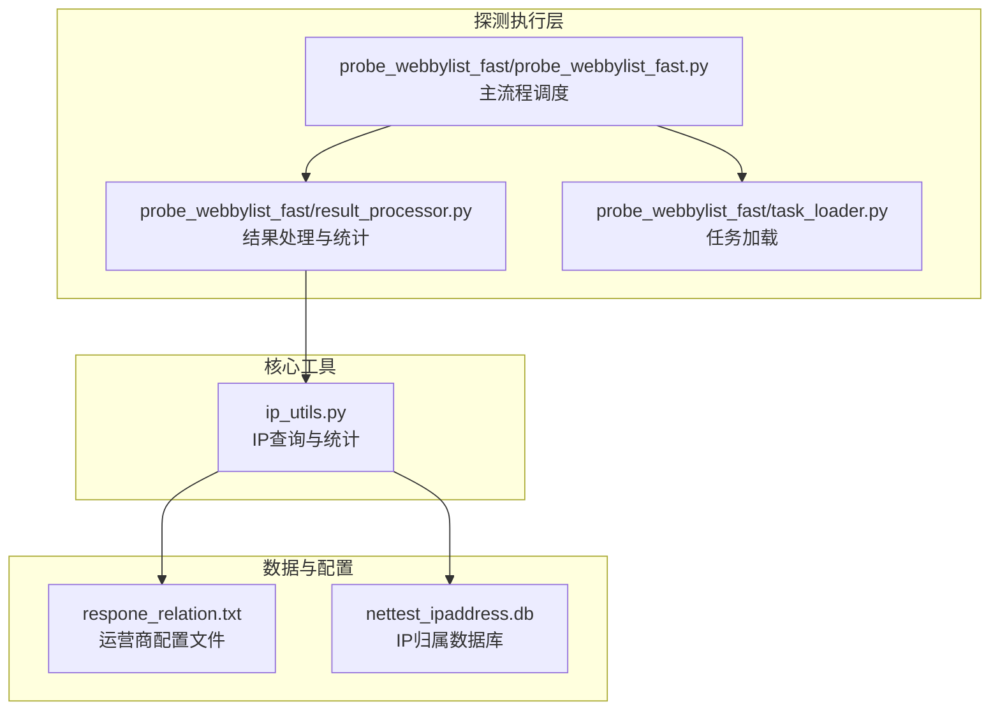
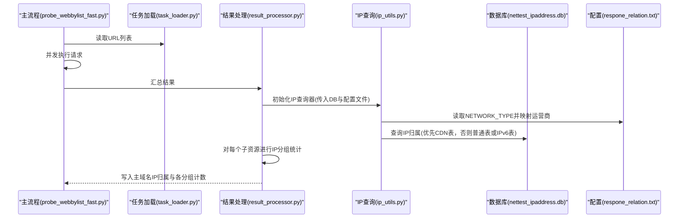
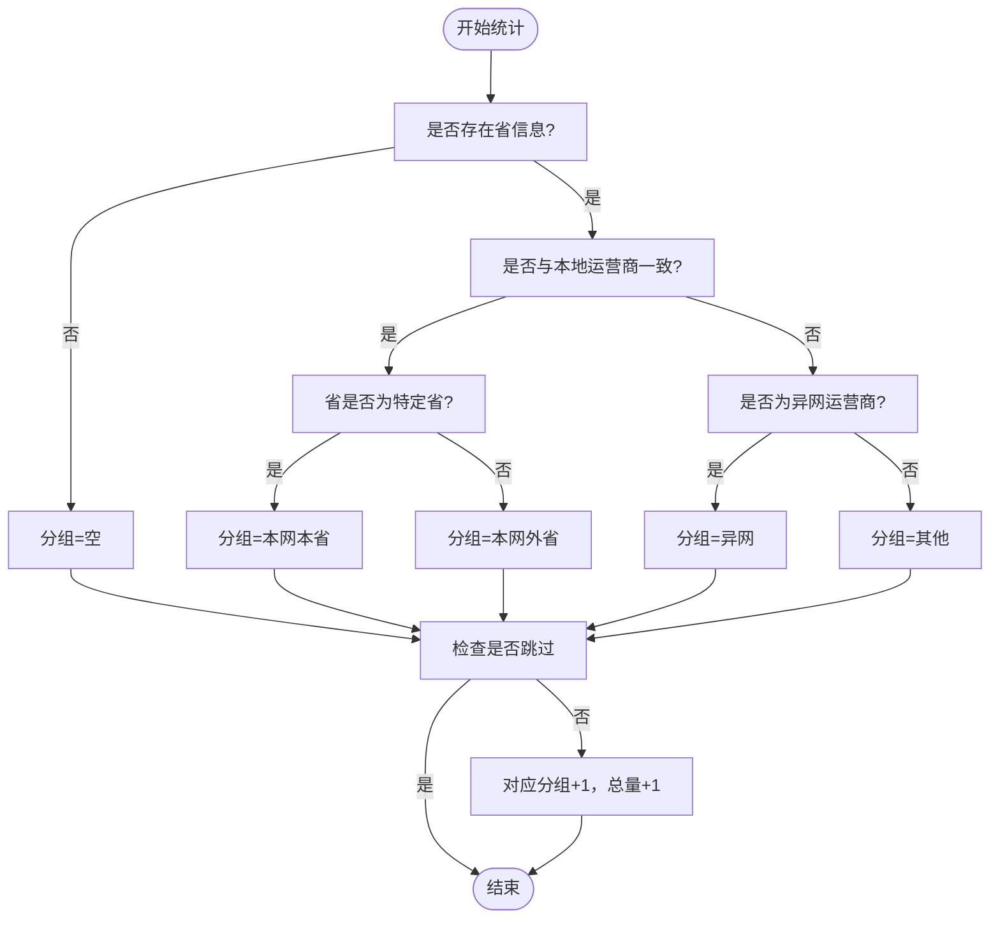
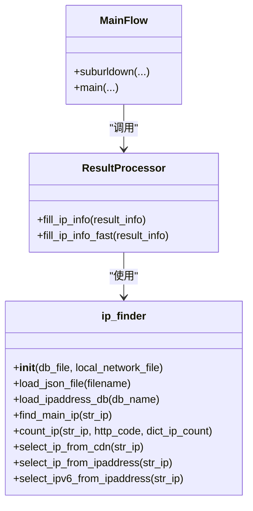
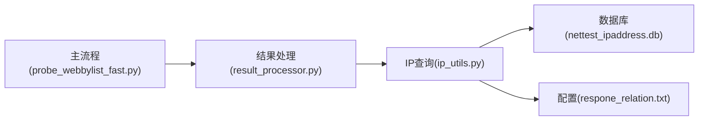

# 网络运营商集成

<cite>
**本文引用的文件列表**
- [respone_relation.txt](file://respone_relation.txt)
- [ip_utils.py](file://ip_utils.py)
- [probe_webbylist_fast/result_processor.py](file://probe_webbylist_fast/result_processor.py)
- [probe_webbylist_fast/probe_webbylist_fast.py](file://probe_webbylist_fast/probe_webbylist_fast.py)
- [probe_webbylist_fast/task_loader.py](file://probe_webbylist_fast/task_loader.py)
- [nettest_ipaddress.db](file://nettest_ipaddress.db)
- [docs/user-guide/README.md](file://docs/user-guide/README.md)
</cite>

## 目录
1. [简介](#简介)
2. [项目结构](#项目结构)
3. [核心组件](#核心组件)
4. [架构总览](#架构总览)
5. [详细组件分析](#详细组件分析)
6. [依赖关系分析](#依赖关系分析)
7. [性能考量](#性能考量)
8. [故障排查指南](#故障排查指南)
9. [结论](#结论)
10. [附录](#附录)

## 简介
本技术文档面向网络运营商集成场景，聚焦于本地网络运营商信息的获取与应用，涵盖以下要点：
- 通过响应配置文件读取 NETWORK_TYPE 参数，实现运营商代码到名称的映射。
- 运营商信息在 IP 归属统计中的应用，包括“本网本省”“本网外省”“异网”“其他”“空”的判定规则。
- 运营商信息的动态加载与缓存机制（基于文件读取与数据库连接的生命周期管理）。
- 运营商配置文件格式说明与修改指南。
- 不同运营商环境下的测试场景配置示例与注意事项。
- 运营商信息对网络质量分析的影响与应用场景。

## 项目结构
该系统围绕“网页子资源批量探测”流程展开，涉及任务加载、并发请求、结果处理与 IP 归属统计等模块。运营商信息主要由配置文件提供，IP 归属查询依赖 SQLite 数据库。

图表来源
- [probe_webbylist_fast/probe_webbylist_fast.py:102-178](file://probe_webbylist_fast/probe_webbylist_fast.py#L102-L178)
- [probe_webbylist_fast/result_processor.py:100-146](file://probe_webbylist_fast/result_processor.py#L100-L146)
- [probe_webbylist_fast/task_loader.py:1-12](file://probe_webbylist_fast/task_loader.py#L1-12)
- [ip_utils.py:11-14](file://ip_utils.py#L11-L14)
- [respone_relation.txt:15](file://respone_relation.txt#L15)
- [nettest_ipaddress.db](file://nettest_ipaddress.db)

章节来源
- [probe_webbylist_fast/probe_webbylist_fast.py:102-178](file://probe_webbylist_fast/probe_webbylist_fast.py#L102-L178)
- [probe_webbylist_fast/result_processor.py:100-146](file://probe_webbylist_fast/result_processor.py#L100-L146)
- [probe_webbylist_fast/task_loader.py:1-12](file://probe_webbylist_fast/task_loader.py#L1-12)
- [ip_utils.py:11-14](file://ip_utils.py#L11-L14)
- [respone_relation.txt:15](file://respone_relation.txt#L15)
- [nettest_ipaddress.db](file://nettest_ipaddress.db)

## 核心组件
- 运营商配置文件：用于声明本地网络运营商类型，关键字段为 NETWORK_TYPE。
- IP 查询与统计类：负责加载运营商配置、连接数据库、查询 IP 归属、进行分组统计。
- 结果处理器：在并发采集完成后，填充主域名 IP 的归属信息，并汇总各 IP 分组统计。
- 主流程调度器：组织任务、并发执行、收集结果并触发 IP 归属统计。

章节来源
- [respone_relation.txt:15](file://respone_relation.txt#L15)
- [ip_utils.py:11-14](file://ip_utils.py#L11-L14)
- [probe_webbylist_fast/result_processor.py:100-146](file://probe_webbylist_fast/result_processor.py#L100-L146)
- [probe_webbylist_fast/probe_webbylist_fast.py:102-178](file://probe_webbylist_fast/probe_webbylist_fast.py#L102-L178)

## 架构总览
下图展示从任务加载到结果统计的关键交互路径，以及运营商配置如何影响 IP 归属分组。

图表来源
- [probe_webbylist_fast/probe_webbylist_fast.py:102-178](file://probe_webbylist_fast/probe_webbylist_fast.py#L102-L178)
- [probe_webbylist_fast/result_processor.py:100-146](file://probe_webbylist_fast/result_processor.py#L100-L146)
- [ip_utils.py:11-14](file://ip_utils.py#L11-L14)
- [respone_relation.txt:15](file://respone_relation.txt#L15)
- [nettest_ipaddress.db](file://nettest_ipaddress.db)

## 详细组件分析

### 运营商配置文件与映射逻辑
- 配置文件位置与关键字段
  - 文件名：respone_relation.txt
  - 关键字段：NETWORK_TYPE
- 映射关系
  - 代码到名称映射：1→移动，2→联通，3→电信
  - 仅当 NETWORK_TYPE 存在于映射表中时，才会解析为本地运营商名称
- 动态加载与缓存
  - 在 IP 查询器初始化时读取一次配置文件，得到本地运营商名称
  - 该值作为后续统计的基准，贯穿整个统计周期

章节来源
- [respone_relation.txt:15](file://respone_relation.txt#L15)
- [ip_utils.py:33-48](file://ip_utils.py#L33-L48)

### IP 归属查询与统计
- 数据库连接
  - 以只读模式连接 SQLite 数据库，避免写入开销与并发冲突
- 查询策略
  - IPv4：优先查询 CDN 表；若未命中，则查询普通 IP 表；支持 IPv6 直接查询 IPv6 表
  - IPv6：直接查询 IPv6 表
- 归属字段
  - 返回省、市、运营商等信息，用于分组统计
- 统计模板
  - 初始模板包含本地运营商名称与分组计数项：“本网本省”“本网外省”“异网”“其他”“空”“总量”

章节来源
- [ip_utils.py:23-31](file://ip_utils.py#L23-L31)
- [ip_utils.py:55-88](file://ip_utils.py#L55-L88)
- [ip_utils.py:124-153](file://ip_utils.py#L124-L153)
- [ip_utils.py:189-225](file://ip_utils.py#L189-L225)

### IP 分组判定规则
- “空”：归属查询未返回省信息
- “本网本省”：运营商等于本地运营商且省为特定省（代码中固定为“福建省”）
- “本网外省”：运营商等于本地运营商但省不为特定省
- “异网”：运营商为“电信/移动/联通”
- “其他”：运营商为“其他”
- 统计更新规则
  - 跳过条件：HTTP 状态码为 0、以 4/5 开头、或分组为“空”
  - 总量计算会剔除“空”计数

图表来源
- [ip_utils.py:204-225](file://ip_utils.py#L204-L225)

章节来源
- [ip_utils.py:204-225](file://ip_utils.py#L204-L225)

### 结果处理与主域名 IP 归属
- 主流程在并发采集结束后，调用结果处理器填充主域名 IP 的归属信息
- 同时汇总各子资源的 IP 分组统计，写入主结果对象

章节来源
- [probe_webbylist_fast/result_processor.py:100-146](file://probe_webbylist_fast/result_processor.py#L100-L146)
- [probe_webbylist_fast/probe_webbylist_fast.py:167-173](file://probe_webbylist_fast/probe_webbylist_fast.py#L167-L173)

### 类关系与职责

图表来源
- [ip_utils.py:6-234](file://ip_utils.py#L6-L234)
- [probe_webbylist_fast/result_processor.py:100-146](file://probe_webbylist_fast/result_processor.py#L100-L146)
- [probe_webbylist_fast/probe_webbylist_fast.py:102-178](file://probe_webbylist_fast/probe_webbylist_fast.py#L102-L178)

## 依赖关系分析
- 外部依赖
  - SQLite 数据库：提供 IP 归属查询能力
  - JSON 配置文件：提供 NETWORK_TYPE 与本地运营商映射
- 内部耦合
  - 结果处理器依赖 IP 查询器；IP 查询器依赖数据库连接与配置文件
  - 主流程调度器负责协调并发与结果写入

图表来源
- [probe_webbylist_fast/probe_webbylist_fast.py:102-178](file://probe_webbylist_fast/probe_webbylist_fast.py#L102-L178)
- [probe_webbylist_fast/result_processor.py:100-146](file://probe_webbylist_fast/result_processor.py#L100-L146)
- [ip_utils.py:11-14](file://ip_utils.py#L11-L14)
- [nettest_ipaddress.db](file://nettest_ipaddress.db)
- [respone_relation.txt](file://respone_relation.txt)

章节来源
- [probe_webbylist_fast/probe_webbylist_fast.py:102-178](file://probe_webbylist_fast/probe_webbylist_fast.py#L102-L178)
- [probe_webbylist_fast/result_processor.py:100-146](file://probe_webbylist_fast/result_processor.py#L100-L146)
- [ip_utils.py:11-14](file://ip_utils.py#L11-L14)
- [nettest_ipaddress.db](file://nettest_ipaddress.db)
- [respone_relation.txt](file://respone_relation.txt)

## 性能考量
- 数据库连接
  - 采用只读连接，降低锁竞争与写入开销
- 查询路径
  - IPv4 优先查询 CDN 表，减少回退成本；IPv6 直接查询 IPv6 表
- 统计过滤
  - 对无效/异常状态进行跳过，避免干扰统计口径
- 并发模型
  - 主流程通过线程池并发执行请求，提升吞吐

章节来源
- [ip_utils.py:27-28](file://ip_utils.py#L27-L28)
- [ip_utils.py:55-88](file://ip_utils.py#L55-L88)
- [ip_utils.py:124-153](file://ip_utils.py#L124-L153)
- [probe_webbylist_fast/probe_webbylist_fast.py:117-133](file://probe_webbylist_fast/probe_webbylist_fast.py#L117-L133)

## 故障排查指南
- IP 归属查询为空
  - 确认数据库文件存在且可访问
  - 检查 IP 是否在数据库范围内
  - IPv6 地址可能无法查询到归属
- 运营商配置未生效
  - 确认 NETWORK_TYPE 字段存在且为映射表中的有效值
  - 确认配置文件编码为 UTF-8
- 统计异常
  - 检查 HTTP 状态码与分组跳过逻辑
  - 确认“空”分组是否被正确剔除

章节来源
- [docs/user-guide/README.md:903-911](file://docs/user-guide/README.md#L903-L911)
- [ip_utils.py:33-48](file://ip_utils.py#L33-L48)

## 结论
本系统通过配置文件提供本地运营商标识，结合数据库查询实现对 IP 归属的准确识别，并据此进行“本网本省/本网外省/异网/其他/空”的分组统计。其设计具备良好的可扩展性与可维护性，适合在多运营商环境下进行网络质量分析与报表统计。

## 附录

### 运营商配置文件格式说明与修改指南
- 文件名：respone_relation.txt
- 关键字段：NETWORK_TYPE
- 取值范围：1（移动）、2（联通）、3（电信）
- 修改步骤
  - 打开配置文件，定位 NETWORK_TYPE 字段
  - 将其值修改为对应的运营商代码（1/2/3）
  - 保存后重启相关进程以重新加载配置

章节来源
- [respone_relation.txt:15](file://respone_relation.txt#L15)
- [ip_utils.py:33-48](file://ip_utils.py#L33-L48)

### 不同运营商环境下的测试场景配置示例与注意事项
- 示例场景
  - 移动环境：将 NETWORK_TYPE 设为 1
  - 联通环境：将 NETWORK_TYPE 设为 2
  - 电信环境：将 NETWORK_TYPE 设为 3
- 注意事项
  - 确保数据库文件与配置文件在同一部署目录
  - 如需跨省对比，注意“本网本省”与“本网外省”的区分逻辑
  - IPv6 环境下，确保 IPv6 表可用且数据完整

章节来源
- [respone_relation.txt:15](file://respone_relation.txt#L15)
- [ip_utils.py:204-225](file://ip_utils.py#L204-L225)

### 运营商信息对网络质量分析的影响与应用场景
- 影响
  - 通过区分“本网本省/本网外省/异网”，可评估跨网流量占比与跨省访问行为
  - 辅助定位网络瓶颈与路由优化方向
- 应用场景
  - 运营商侧质量监控报表
  - 客户侧网络体验分析
  - 跨网路由质量对比与优化建议

章节来源
- [probe_webbylist_fast/result_processor.py:141-146](file://probe_webbylist_fast/result_processor.py#L141-L146)
- [docs/user-guide/README.md:915-927](file://docs/user-guide/README.md#L915-L927)