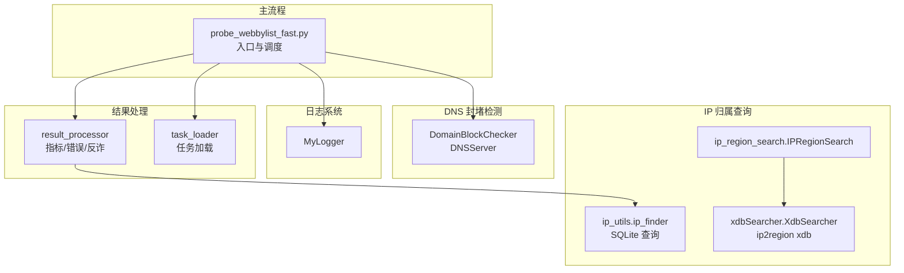
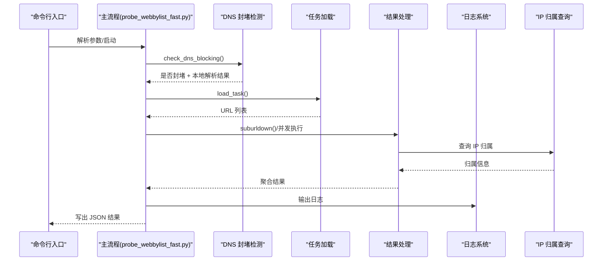
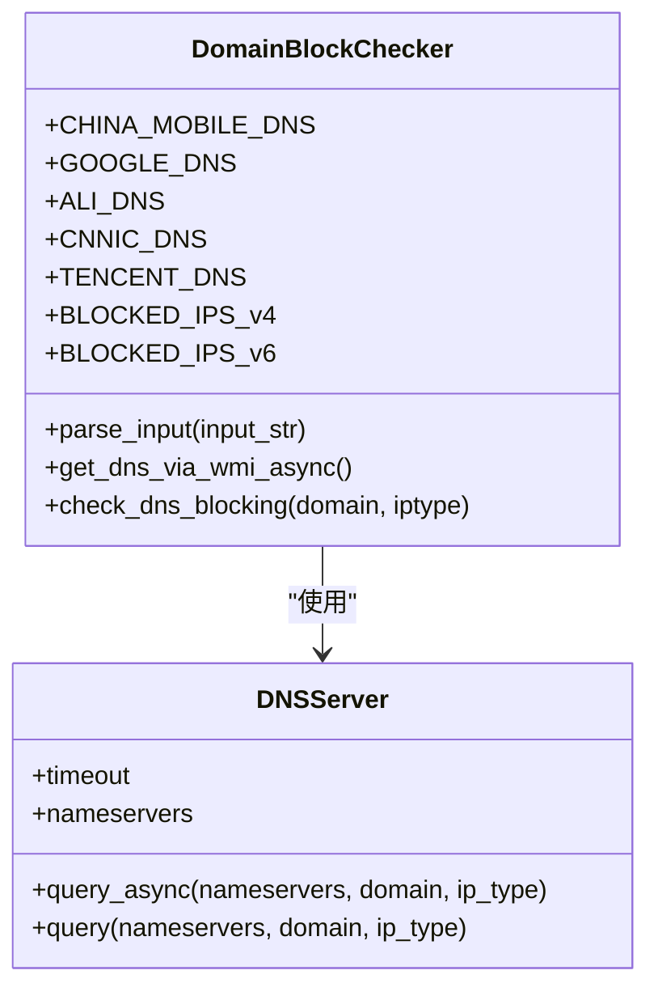
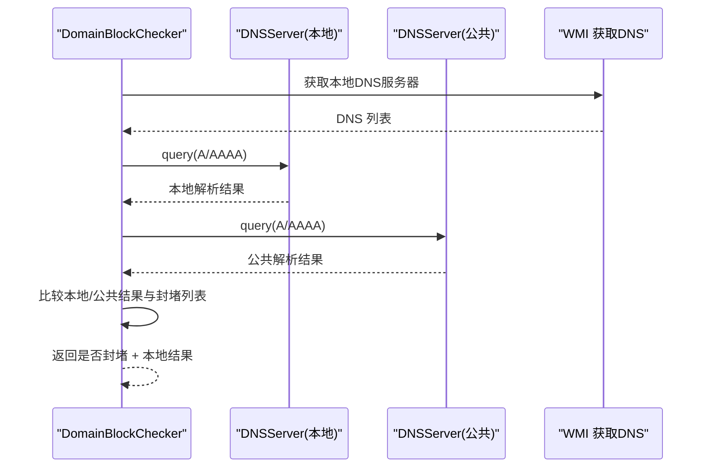
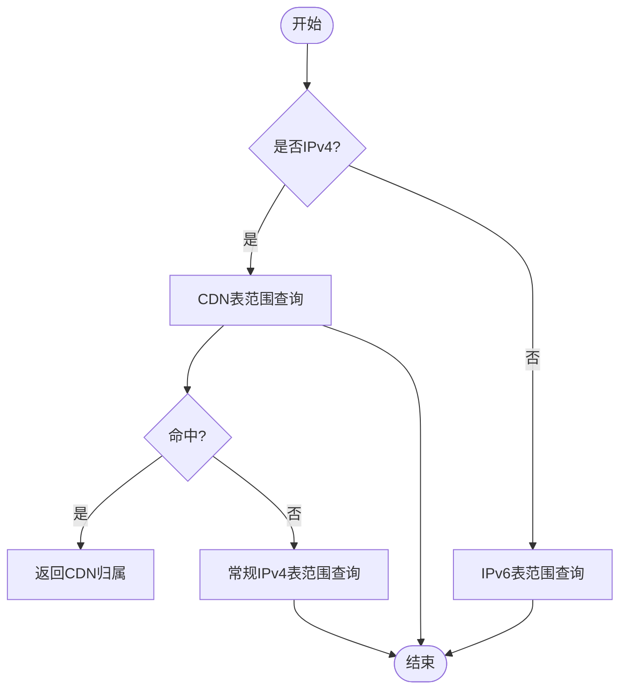
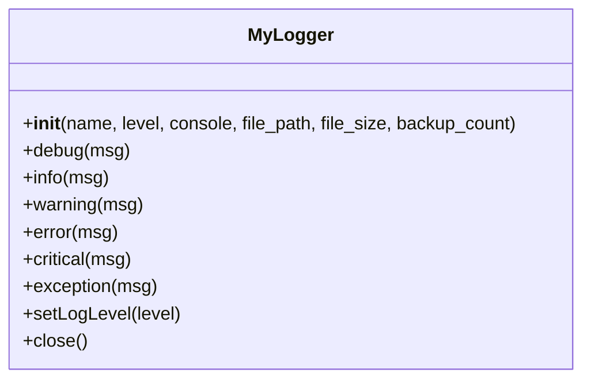
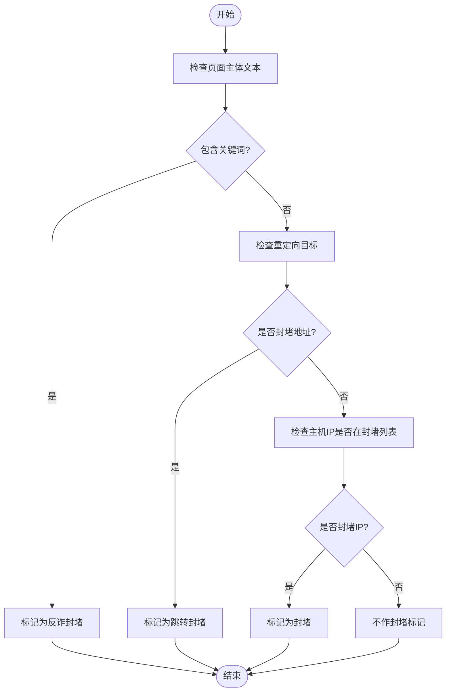
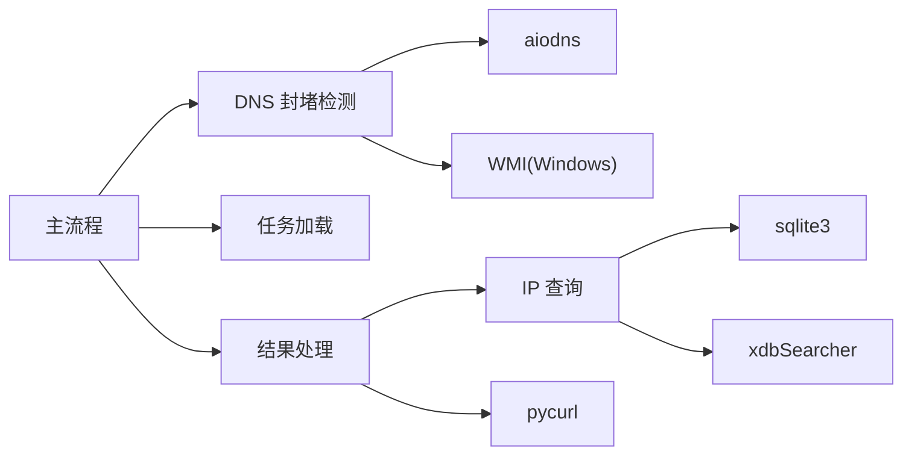

# 高级功能特性

<cite>
**本文引用的文件**
- [probe_dns_block.py](file://probe_dns_block.py)
- [probe_webbylist_fast/probe_dns_block.py](file://probe_webbylist_fast/probe_dns_block.py)
- [ip_utils.py](file://ip_utils.py)
- [probe_webbylist_fast/ip_utils.py](file://probe_webbylist_fast/ip_utils.py)
- [xdbSearcher.py](file://xdbSearcher.py)
- [ip_region_search.py](file://ip_region_search.py)
- [mylogger.py](file://mylogger.py)
- [probe_webbylist_fast/mylogger.py](file://probe_webbylist_fast/mylogger.py)
- [probe_webbylist_fast/result_processor.py](file://probe_webbylist_fast/result_processor.py)
- [probe_webbylist_fast/probe_webbylist_fast.py](file://probe_webbylist_fast/probe_webbylist_fast.py)
- [probe_webbylist_fast/task_loader.py](file://probe_webbylist_fast/task_loader.py)
- [respone_relation.txt](file://respone_relation.txt)
</cite>

## 目录
1. [简介](#简介)
2. [项目结构](#项目结构)
3. [核心组件](#核心组件)
4. [架构总览](#架构总览)
5. [详细组件分析](#详细组件分析)
6. [依赖分析](#依赖分析)
7. [性能考量](#性能考量)
8. [故障排查指南](#故障排查指南)
9. [结论](#结论)
10. [附录](#附录)

## 简介
本文件聚焦于网络探测工具集的高级功能特性，围绕以下主题展开：
- DNS 封堵检测的智能算法与实现原理（含本地 DNS 与公共 DNS 对比机制）
- IP 归属查询系统的架构（SQLite 数据库设计、查询优化策略、实时数据更新机制）
- 日志系统的配置与管理（日志级别、输出格式、调试功能）
- 反诈网站识别的工作原理与应用场景
- IP 数据库的管理与维护（数据导入、更新与备份策略）
- 高级配置选项与自定义参数设置，支持深度定制与扩展

## 项目结构
该工具集采用“功能模块化 + 工具链集成”的组织方式，主要模块包括：
- DNS 封堵检测：基于 aiodns 的异步解析与本地/公共 DNS 结果对比
- IP 归属查询：SQLite 查询与 ip2region xdb 搜索器结合
- 日志系统：统一 MyLogger，支持控制台与文件轮转
- 结果处理：任务加载、结果聚合、指标计算、错误分类与反诈识别
- 主流程：命令行入口、参数解析、并发调度与结果落盘

**图表来源**
- [probe_webbylist_fast/probe_webbylist_fast.py](file://probe_webbylist_fast/probe_webbylist_fast.py)
- [probe_dns_block.py](file://probe_dns_block.py)
- [probe_webbylist_fast/probe_dns_block.py](file://probe_webbylist_fast/probe_dns_block.py)
- [ip_utils.py](file://ip_utils.py)
- [probe_webbylist_fast/ip_utils.py](file://probe_webbylist_fast/ip_utils.py)
- [xdbSearcher.py](file://xdbSearcher.py)
- [ip_region_search.py](file://ip_region_search.py)
- [mylogger.py](file://mylogger.py)
- [probe_webbylist_fast/mylogger.py](file://probe_webbylist_fast/mylogger.py)
- [probe_webbylist_fast/result_processor.py](file://probe_webbylist_fast/result_processor.py)
- [probe_webbylist_fast/task_loader.py](file://probe_webbylist_fast/task_loader.py)

**章节来源**
- [probe_webbylist_fast/probe_webbylist_fast.py](file://probe_webbylist_fast/probe_webbylist_fast.py)
- [probe_dns_block.py](file://probe_dns_block.py)
- [probe_webbylist_fast/probe_dns_block.py](file://probe_webbylist_fast/probe_dns_block.py)
- [ip_utils.py](file://ip_utils.py)
- [probe_webbylist_fast/ip_utils.py](file://probe_webbylist_fast/ip_utils.py)
- [xdbSearcher.py](file://xdbSearcher.py)
- [ip_region_search.py](file://ip_region_search.py)
- [mylogger.py](file://mylogger.py)
- [probe_webbylist_fast/mylogger.py](file://probe_webbylist_fast/mylogger.py)
- [probe_webbylist_fast/result_processor.py](file://probe_webbylist_fast/result_processor.py)
- [probe_webbylist_fast/task_loader.py](file://probe_webbylist_fast/task_loader.py)

## 核心组件
- DNS 封堵检测：通过 WMI 获取本地 DNS，使用 aiodns 异步查询本地与公共 DNS，基于预置封堵 IP 列表判断是否被封堵
- IP 归属查询：优先使用 SQLite 表进行 IPv4/CDN 匹配，回退至 IPv6 表；同时提供 ip2region xdb 的快速搜索能力
- 日志系统：统一 MyLogger，支持控制台与文件轮转，可动态调整日志级别
- 结果处理：任务加载、结果聚合、成功率统计、首屏/满页时间计算、错误码映射、反诈与跳转封堵识别
- 主流程：命令行参数解析、并发调度、超时控制、结果落盘

**章节来源**
- [probe_dns_block.py](file://probe_dns_block.py)
- [probe_webbylist_fast/probe_dns_block.py](file://probe_webbylist_fast/probe_dns_block.py)
- [ip_utils.py](file://ip_utils.py)
- [probe_webbylist_fast/ip_utils.py](file://probe_webbylist_fast/ip_utils.py)
- [xdbSearcher.py](file://xdbSearcher.py)
- [ip_region_search.py](file://ip_region_search.py)
- [mylogger.py](file://mylogger.py)
- [probe_webbylist_fast/mylogger.py](file://probe_webbylist_fast/mylogger.py)
- [probe_webbylist_fast/result_processor.py](file://probe_webbylist_fast/result_processor.py)
- [probe_webbylist_fast/probe_webbylist_fast.py](file://probe_webbylist_fast/probe_webbylist_fast.py)

## 架构总览
下图展示从入口到结果输出的关键交互路径，以及 DNS 封堵检测与 IP 归属查询在整体流程中的位置。

**图表来源**
- [probe_webbylist_fast/probe_webbylist_fast.py](file://probe_webbylist_fast/probe_webbylist_fast.py)
- [probe_dns_block.py](file://probe_dns_block.py)
- [probe_webbylist_fast/probe_dns_block.py](file://probe_webbylist_fast/probe_dns_block.py)
- [probe_webbylist_fast/result_processor.py](file://probe_webbylist_fast/result_processor.py)
- [probe_webbylist_fast/task_loader.py](file://probe_webbylist_fast/task_loader.py)
- [mylogger.py](file://mylogger.py)
- [probe_webbylist_fast/mylogger.py](file://probe_webbylist_fast/mylogger.py)
- [ip_utils.py](file://ip_utils.py)
- [probe_webbylist_fast/ip_utils.py](file://probe_webbylist_fast/ip_utils.py)

## 详细组件分析

### DNS 封堵检测：智能算法与实现原理
- 本地 DNS 获取：通过 WMI 查询当前活动网卡的 DNS 服务器列表，避免硬编码导致误判
- 异步解析：使用 aiodns.DNSResolver 并发查询 A/AAAA 记录，分别记录耗时与结果
- 对比策略：以本地 DNS 结果为主，若本地返回封堵 IP（预置列表），而公共 DNS 返回非封堵 IP，则判定为封堵
- IPv4/IPv6 分支：针对不同 IP 类型分别检查封堵集合，避免误判
- 兼容性：支持手动指定 dnsserver 参数，或自动从系统获取

**图表来源**
- [probe_dns_block.py](file://probe_dns_block.py)
- [probe_webbylist_fast/probe_dns_block.py](file://probe_webbylist_fast/probe_dns_block.py)

**图表来源**
- [probe_dns_block.py](file://probe_dns_block.py)
- [probe_webbylist_fast/probe_dns_block.py](file://probe_webbylist_fast/probe_dns_block.py)

**章节来源**
- [probe_dns_block.py](file://probe_dns_block.py)
- [probe_webbylist_fast/probe_dns_block.py](file://probe_webbylist_fast/probe_dns_block.py)

### IP 归属查询系统：架构、优化与更新
- 数据库设计要点
  - IPv4/CDN：nettest_ipaddress 表，字段包含起止整型 IP、省/市/运营商等
  - IPv6：ipv6_range_info 表，存储起止数值与 ISP
  - SQLite 连接：以只读 URI 方式连接，提升并发安全性
- 查询优化策略
  - 使用整型 IP 范围查询，避免字符串匹配
  - IPv6 使用大整数比较，SQL 中通过十六进制格式转换
  - CDN 优先匹配逻辑：先尝试 CDN 表，失败再回退至常规表
- 实时数据更新机制
  - 通过替换数据库文件实现“热更新”
  - 建议配合备份策略与校验和，确保一致性
- 备选方案：ip2region xdb
  - 通过 XdbSearcher 加载全量内容到内存，减少 IO
  - 适合小规模部署或临时查询场景

**图表来源**
- [ip_utils.py](file://ip_utils.py)
- [probe_webbylist_fast/ip_utils.py](file://probe_webbylist_fast/ip_utils.py)
- [xdbSearcher.py](file://xdbSearcher.py)
- [ip_region_search.py](file://ip_region_search.py)

**章节来源**
- [ip_utils.py](file://ip_utils.py)
- [probe_webbylist_fast/ip_utils.py](file://probe_webbylist_fast/ip_utils.py)
- [xdbSearcher.py](file://xdbSearcher.py)
- [ip_region_search.py](file://ip_region_search.py)

### 日志系统：配置与管理
- 统一日志接口：MyLogger 支持控制台与文件输出，格式包含时间、文件名、行号、线程 ID、级别与消息
- 文件轮转：按大小轮转，支持备份数量上限
- 动态级别：提供 setLogLevel 接口，便于运行时调整
- 在主流程中贯穿使用，便于问题定位与审计

**图表来源**
- [mylogger.py](file://mylogger.py)
- [probe_webbylist_fast/mylogger.py](file://probe_webbylist_fast/mylogger.py)

**章节来源**
- [mylogger.py](file://mylogger.py)
- [probe_webbylist_fast/mylogger.py](file://probe_webbylist_fast/mylogger.py)
- [probe_webbylist_fast/probe_webbylist_fast.py](file://probe_webbylist_fast/probe_webbylist_fast.py)

### 反诈网站识别：工作原理与应用
- 识别依据
  - 页面主体内容包含特定关键词（如“警方提示疑似诈骗”）时，标记为反诈封堵
  - 跳转目标为常见封堵地址（如 0.0.0.0、::1、内网地址等）时，标记为跳转封堵
  - 特定封堵 IP 直接标记为封堵
- 应用场景
  - 网络质量评估中区分“业务封堵”与“技术异常”
  - 安全侧流量分析与溯源

**图表来源**
- [probe_webbylist_fast/result_processor.py](file://probe_webbylist_fast/result_processor.py)

**章节来源**
- [probe_webbylist_fast/result_processor.py](file://probe_webbylist_fast/result_processor.py)

### 高级配置与自定义参数
- 命令行参数
  - 日志级别：支持 debug/info/warning
  - DNS 服务器：可显式指定 dnsserver
  - URL：主 URL 自动补全协议头
- 结果处理与统计
  - 成功率、请求量、首屏/满页时间、吞吐速率等指标
  - 错误码映射：将底层执行错误映射为统一错误码
- IP 归属与运营商
  - 本地网络运营商来自 JSON 配置文件，用于区分“本网/异网”
  - 支持 IPv4/IPv6 双栈环境

**章节来源**
- [probe_webbylist_fast/probe_webbylist_fast.py](file://probe_webbylist_fast/probe_webbylist_fast.py)
- [probe_webbylist_fast/result_processor.py](file://probe_webbylist_fast/result_processor.py)
- [respone_relation.txt](file://respone_relation.txt)

## 依赖分析
- 组件耦合
  - 主流程依赖 DNS 检测、任务加载、结果处理与日志系统
  - 结果处理依赖 IP 查询模块
  - DNS 检测依赖 aiodns 与 WMI（Windows）
- 外部依赖
  - pycurl：HTTP 请求与并发调度
  - aiodns：异步 DNS 解析
  - sqlite3：本地数据库访问
  - ip2region xdb：快速 IP 地理定位
- 循环依赖
  - 未发现直接循环依赖，模块职责清晰

**图表来源**
- [probe_webbylist_fast/probe_webbylist_fast.py](file://probe_webbylist_fast/probe_webbylist_fast.py)
- [probe_dns_block.py](file://probe_dns_block.py)
- [probe_webbylist_fast/probe_dns_block.py](file://probe_webbylist_fast/probe_dns_block.py)
- [probe_webbylist_fast/result_processor.py](file://probe_webbylist_fast/result_processor.py)
- [ip_utils.py](file://ip_utils.py)
- [probe_webbylist_fast/ip_utils.py](file://probe_webbylist_fast/ip_utils.py)
- [xdbSearcher.py](file://xdbSearcher.py)

**章节来源**
- [probe_webbylist_fast/probe_webbylist_fast.py](file://probe_webbylist_fast/probe_webbylist_fast.py)
- [probe_dns_block.py](file://probe_dns_block.py)
- [probe_webbylist_fast/probe_dns_block.py](file://probe_webbylist_fast/probe_dns_block.py)
- [probe_webbylist_fast/result_processor.py](file://probe_webbylist_fast/result_processor.py)
- [ip_utils.py](file://ip_utils.py)
- [probe_webbylist_fast/ip_utils.py](file://probe_webbylist_fast/ip_utils.py)
- [xdbSearcher.py](file://xdbSearcher.py)

## 性能考量
- 异步 DNS：使用 aiodns 并发查询，显著降低解析延迟
- 连接复用：共享 pycurl 对象，减少握手开销
- 数据库只读连接：避免写锁竞争，提升并发查询稳定性
- IP 查询优化：整型范围查询与索引字段设计，减少扫描
- 日志轮转：避免单文件过大影响 I/O
- 超时控制：主流程设置总超时，及时取消未完成任务

[本节为通用性能建议，无需具体文件引用]

## 故障排查指南
- DNS 封堵检测
  - 若本地 DNS 获取失败，检查 WMI 权限与网络适配器状态
  - 若解析超时，适当提高超时阈值或更换公共 DNS
- IP 归属查询
  - 确认数据库文件存在且可读，字段命名与版本一致
  - IPv6 查询需确保十六进制转换逻辑正确
- 日志
  - 检查日志文件路径与权限，确认轮转策略生效
  - 使用 debug 级别定位复杂问题
- 反诈识别
  - 如误报，可在规则中增加白名单或调整关键词
  - 对跳转封堵，核对重定向目标域名与封堵地址集合

**章节来源**
- [probe_dns_block.py](file://probe_dns_block.py)
- [probe_webbylist_fast/probe_dns_block.py](file://probe_webbylist_fast/probe_dns_block.py)
- [ip_utils.py](file://ip_utils.py)
- [probe_webbylist_fast/ip_utils.py](file://probe_webbylist_fast/ip_utils.py)
- [mylogger.py](file://mylogger.py)
- [probe_webbylist_fast/mylogger.py](file://probe_webbylist_fast/mylogger.py)
- [probe_webbylist_fast/result_processor.py](file://probe_webbylist_fast/result_processor.py)

## 结论
本工具集通过“异步 DNS 封堵检测 + 多源 IP 归属查询 + 统一日志 + 结果处理与反诈识别”的组合，提供了面向网络质量与安全分析的高级能力。其模块化设计便于扩展与定制，适合在大规模并发探测场景中稳定运行。

[本节为总结性内容，无需具体文件引用]

## 附录

### IP 数据库管理与维护指南
- 数据导入
  - 准备 CSV/JSON 导入脚本，批量插入 nettest_ipaddress 与 ipv6_range_info
  - 导入前建立索引字段（如起止整型 IP），导入后重建索引
- 更新策略
  - 采用“双库轮换 + 校验和”方式，先写新库，校验通过后再切换
  - 对 xdb 文件，建议缓存全量内容，避免频繁磁盘 IO
- 备份策略
  - 定期备份 SQLite 与 xdb 文件，保留多个历史版本
  - 备份路径与权限需严格控制

**章节来源**
- [ip_utils.py](file://ip_utils.py)
- [probe_webbylist_fast/ip_utils.py](file://probe_webbylist_fast/ip_utils.py)
- [xdbSearcher.py](file://xdbSearcher.py)
- [ip_region_search.py](file://ip_region_search.py)

### 高级配置与扩展建议
- 自定义封堵 IP 列表：在 DNS 检测模块中扩展 BLOCKED_IPS_v4/v6
- 扩展日志输出：在 MyLogger 中增加自定义格式或输出通道
- 结果指标扩展：在结果处理模块中新增统计维度与阈值
- 反诈规则扩展：引入正则匹配、黑名单域名与特征词典

**章节来源**
- [probe_dns_block.py](file://probe_dns_block.py)
- [probe_webbylist_fast/probe_dns_block.py](file://probe_webbylist_fast/probe_dns_block.py)
- [mylogger.py](file://mylogger.py)
- [probe_webbylist_fast/mylogger.py](file://probe_webbylist_fast/mylogger.py)
- [probe_webbylist_fast/result_processor.py](file://probe_webbylist_fast/result_processor.py)